<h1> AWS Cloud IoT Core Application on SAM-IoT Wx v2 Development Board </h1>
<h2 align="center"> <a href="https://github.com/Microchip-MPLAB-Harmony/reference_apps/releases/latest/download/samiot2_aws_cloud_core.zip" > Download </a> </h2>

-----

<h2> Description: </h2>

> The SAM-IoT Wx v2 Development board based on the SAM D21 microcontroller (MCU) is a small and easily expandable demonstration and development platform for Wi-Fi-based IoT Node applications. This specific development board can be pre-provisioned for AWS IoT Core; The application demonstrates MQTT data transfer of onboard light and temperature sensor data to AWS IoT core.  

The board is referred to as SAM-IoT **WA** v2 Development Board when provisioned for AWS cloud IoT.

## Key Highlights of [SAM-IoT WA v2 Development Board](https://www.microchip.com/en-us/development-tool/EV62V87A):

* On-board Light and Temperature Sensors.
* Additional sensors can be interfaced using "click boards" through an on-board [mikroBUS connector](https://www.mikroe.com/click).
* On-board nEDBG debugger. Hence, no external debugger is needed.
* Virtual COM and USB Mass Storage for Drag & Drop programming.
* Dual power supply options. USB or Battery.
* On-board Li-Po battery charging circuitry.
* ATECC608B based secure cloud connectivity
* USB HID interface to provision the ECC608B through the SAMD21 MCU.

<h2> Features of SAM-IoT WA v2 Development Board: </h2>

* Drag & Drop of application hex files. Hence, no need for IDE to program the SAM D21 microcontroller.
* Microcontroller peripheral libraries and Middleware are based on the MPLAB Harmony v3 Software framework.
* MPLAB X IDE-based project.
* Command Line Interface (CLI) support for Wi-Fi credentials configuration.
* 4 LED indicators to indicate the operating status.

<h2> Components Used: </h2>  

- [ATSAMD21G18A microcontroller](https://www.microchip.com/wwwproducts/en/ATsamd21g18)
- [ATWINC1510 Wi-FI module](https://www.microchip.com/wwwproducts/en/ATwinc1500)
- [ATECC608B secure element](https://www.microchip.com/wwwproducts/en/ATECC608B)
- [MCP9808 digital temperature sensor](https://www.microchip.com/en-us/product/MCP9808)
- [MCP73871 Battery Charger](https://ww1.microchip.com/downloads/en/DeviceDoc/MCP73871-Data-Sheet-20002090E.pdf)
- [MIC33050 Voltage Regulator](https://www.microchip.com/wwwproducts/en/MIC33050)
- TEMT6000 ambient light sensor

<h2> Software/Tools Used: </h2>  

<span style="color:blue"> This project has been verified to work with the following versions of software tools:</span>  

Refer [Project Manifest](./firmware/src/config/samd21_wa_iot_v2/harmony-manifest-success.yml) present in harmony-manifest-success.yml under the project folder *firmware/src/config/samd21_wa_iot_v2*  
- Refer the [Release Notes](../../../release_notes.md#development-tools) to know the **MPLAB X IDE** and **MCC** Plugin version. Alternatively, [Click Here](https://github.com/Microchip-MPLAB-Harmony/reference_apps/blob/master/release_notes.md#development-tools)  

<span style="color:blue"> Because Microchip regularly update tools, occasionally issue(s) could be discovered while using the newer versions of the tools. If the project doesn’t seem to work and version incompatibility is suspected, It is recommended to double-check and use the same versions that the project was tested with. </span> To download original version of MPLAB Harmony v3 packages, refer to document [How to Use the MPLAB Harmony v3 Project Manifest Feature](https://ww1.microchip.com/downloads/en/DeviceDoc/How-to-Use-the-MPLAB-Harmony-v3-Project-Manifest-Feature-DS90003305.pdf)

<h2> <a id="aws_demo_account_setup"> </a> </h2>  

<h2> AWS Account Setup </h2>  

<details>
  <summary> Details
</summary>
To run the AWS Cloud IoT core solution, an AWS account is required. The following are the steps to configure an AWS account.

Amazon Web Services (AWS) provides computing services for a fee. Some are offered for free on a trial or small-scale basis. By signing up for your AWS account, you are establishing an account to access a wide range of computing services.

Think of your AWS account as your root account for AWS services. It is very powerful and gives you complete access. Be sure to protect your username and password. You control access to your AWS account by creating individual users and groups using the Identity and Access Management (IAM) Console. You also assign policies (permissions) to the group from the IAM Console.

<h3> Create your own AWS account </h3>  

1. Create AWS account. Go to [AWS](https://aws.amazon.com) website and follow instructions to create your own AWS account. Additional details can be found at [create and activate a new AWS account.](https://aws.amazon.com/premiumsupport/knowledge-center/create-and-activate-aws-account)  

2. Secure root account with MFA (multi-factor authentication)  
  This is an important step to better secure your root account against attackers. Anyone logging in not only needs to know the password, but also a constantly changing code generated by an MFA device.  
  AWS recommends a number of MFA device options at the following link: https://aws.amazon.com/iam/details/mfa/  
  The quickest solution is a virtual MFA device running on a phone. These apps provide the ability to scan the QR code AWS will generate to set up the MFA device.  
       a. Return to https://aws.amazon.com/ and click the Sign In to the Console.  
       b. If it asks for an IAM user name and password, select the Sign-in using root account credentials link.  
       c. Enter the email and password for your AWS account.
       d. Under Find Services search for IAM and select it to bring up the Identity and Access Management options.  
       e. Click on Activate MFA (Multi-factor Authentication) on your root account.  
       f. Create an admin IAM user AWS best practices recommend not using your root account for standard administrative tasks, but to create a special admin user for those tasks. See https://docs.aws.amazon.com/IAM/latest/UserGuide/best-practices.html#lock-away-credentials  
	   
3. Follow the instructions at https://docs.aws.amazon.com/IAM/latest/UserGuide/getting-started_create-admin-group.html for creating an admin user.  

4. Enable MFA (multi-factor authentication) for the admin user. See https://docs.aws.amazon.com/IAM/latest/UserGuide/best-practices.html#enable-mfa-for-privileged-users

<h3> Configuring the account using CloudFormation Templates  </h3>


The usage of a custom PKI with TrustFLEX devices uses the Just-In-Time Registration (JITR) feature of AWS IoT Core. This feature requires a number of resources setup with an AWS account to work. The creation of these resources is automated through the AWS CloudFormation service.  

1. Sign into the [AWS console](https://aws.amazon.com/) using the admin user created in the previous section.  

2. Change to region to ***US East (Ohio) (a.k.a. us-east-2)***. This is done from a dropdown in the top right of the console webpage after logging in.  

3. Under ***Find Services*** search for ***CloudFormation*** and select it to bring up that service.  

4. Click ***Create Stack*** button.  

5. Select Upload a template file from the page of the stack creation.   

6. Click Choose file and upload the **aws-zero-touch-full-setup.yaml** file.  
    **Note**: If running from a China region, you’ll need to select the aws-zero-touch-full- setup-cn.yaml instead. These files are available in **~/.trustplatform** folder.  
	
7. Click ***Next*** to move on to the stack details.  

8. Enter ***TrustFLEX*** as the stack name. Actual name isn’t important, just has to be unique.  

9. Enter a password for the user that will be created to run the demo under UserPassword.  

10. Click ***Next*** to move on to the stack options. Nothing needs to be changed here.  

11. Click ***Next*** to move on to the stack review.  

12. Check the acknowledgement box regarding IAM resources at the bottom of the page.  

13. Click ***Create Stack*** to start the resource creation.  

14. Wait until the stack creation completes. This can take a few minutes. Once done, the stack you created will show as CREATE_COMPLETE.  

15. Save demo credentials. Click the Outputs tab for the stack to see the credentials to be saved.  

16. Save the credentials to **aws_credentials.yaml** file in **"~/.trustplatform/aws_credentials.yaml"** folder.  
    **Note**: **~** Indicates windows home directory is /user/username 

</details>  

<h2> <a id="AWS_Cloud_IoT_Provisioning_Guide"> </a> </h2>  

<h2> AWS Cloud IoT Provisioning Guide </h2>  

<details>
  <summary> Details
</summary>

<span style="color:red"> **If this is the first time you are building/running this version of the demo, you must complete this step before proceeding further. Otherwise, you may skip this step.** </span>

1. Install Trust Platform Design Suite version 2 [TPDSv2](https://www.microchip.com/en-us/product/SW-TPDSV2#Software)

2. Launch Trust Platform Design Suite v2 from windows search bar, a window launches as shown below  
	
3. Select "Trust Platform Design Suite" in **webviews** and Click on **Usecases**  
	
4. In **Select Security Solution**, Under **Use Cases** select **AWS IoT Authentication**
	
5. Scroll Down and in **Available solution by provisioning flow** select **AWS IoT Authentication** under **TrustFLEX**  
	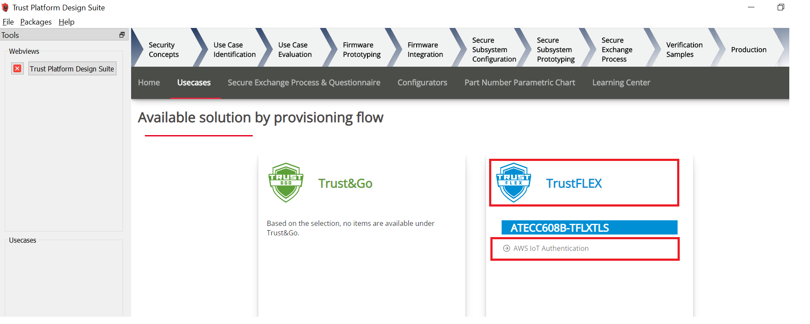
6. A Usecase gets launched. click on **AWS Connect-IoT Auth-TFLEX** from the **Usescases**  
	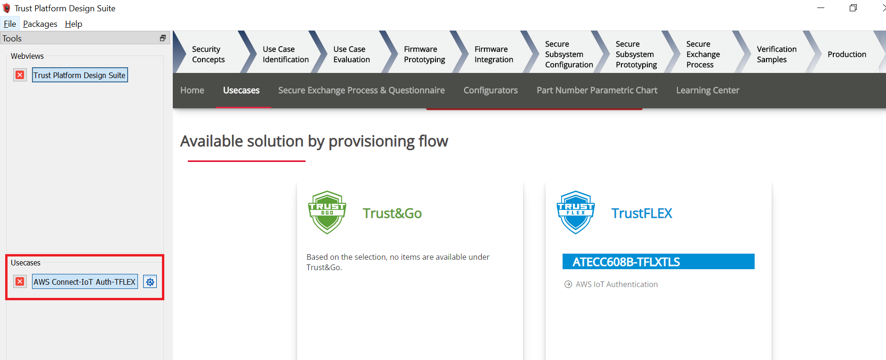  
7. AWS Cloud Connect – IoT Authentication page launches as shown below  
	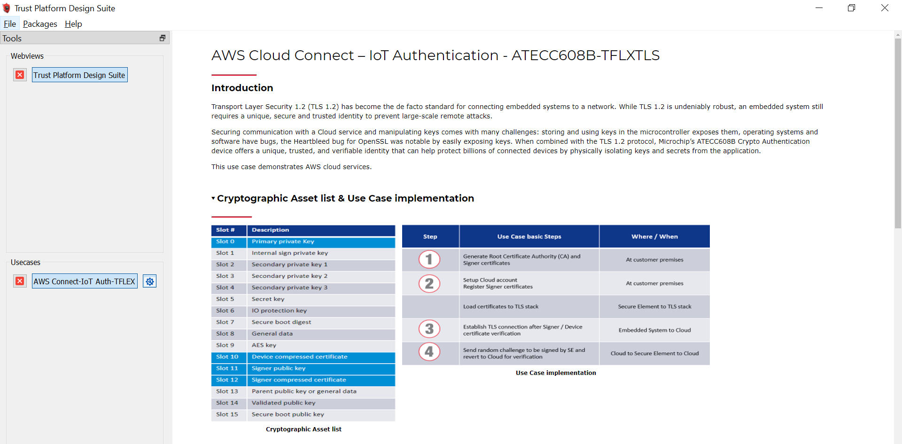
8. Scroll down and select SAM-IoT Wx v2 Development board if not selected  
	
9. Connect SAM-IoT Wx v2 Development Board to PC running Trust Platform Design Suite

10. Ensure MPLAB X Path is set in File -> Preference under System Settings in TPDS. This helps to program the provisioner kit firmware to the SAM-IoT Wx v2 Development Board

11. Scroll down to transaction diagram  
	
12. Click on Icon **1** and wait till a green right mark appears.  
	
13. Sequentially Click on Icon **2**, **3** and **4**  
	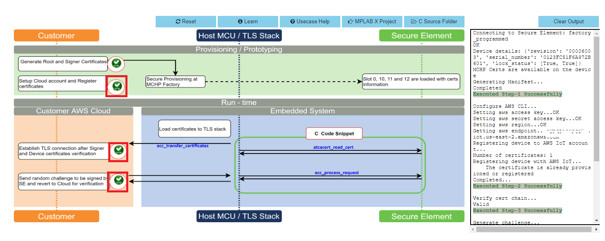  
13. Note the output in the output window on the right side

</details>  

<h2> <a id="WINC_Firmware_upgrade"> </a> </h2>  


<h2> ATWINC1510 Wi-Fi controller module firmware and AWS Root certificates upgrade Guide </h2>  

<details>
  <summary> Details
</summary>

<span style="color:red"> **If the SAM-IoT Wx v2 development board is glowing RED LED (Indicates ATWINC1510 Wi-Fi controller module firmware is not up to date), follow the below steps to upgrade the ATWINC1510 firmware. Otherwise(if it glows <font color="green"> GREEN </font>), you may skip this step.** </span>

1. Click on **C Source Folder** in TPDS transaction diagram  
   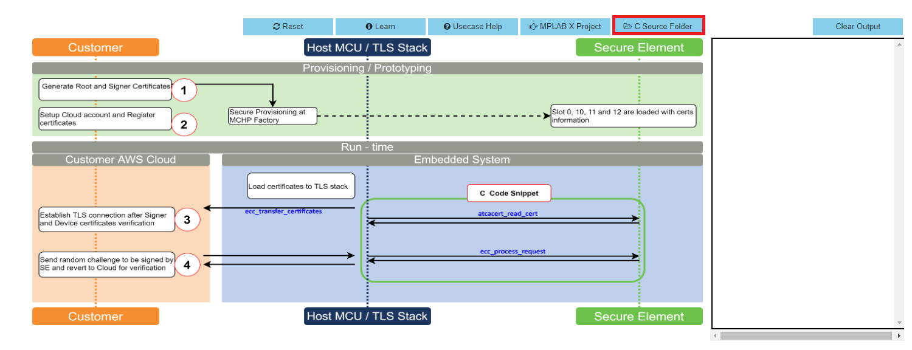
2. In windows explorer, Application folder gets open  
	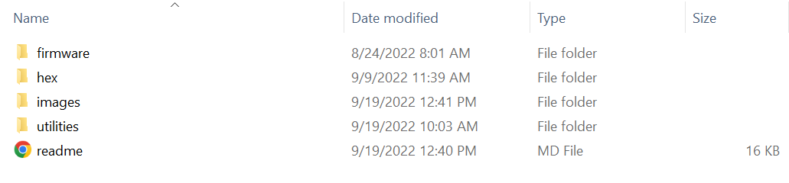
3. Click on **utilities** folder
4. Click on **winc_provisioner.bat**, It automatically downloads the ATWINC1510 firmware package and runs the necessary commands using the command prompt.
   
   
5. Select the communication (COM) port identified for "SAM-IoT Wx v2" development board from the drop down list and click OK

	
6. Wait till verify passed message comes up, as shown below, and then click on enter to close the command prompt; if it fails, reconnect the board and try again.
   

</details>   


<h2> Application Demonstration </h2>  

<details>
  <summary> Details
</summary> 
  
The following sections describes the steps to run the application.  

<h3> 1. How to setup the SAM-IoT WA v2 Development Board  </h3>

- Connect the SAM-IoT WA v2 Development board to the host PC's USB port to power-up the board.  

    

- Alternatively, the board can be powered using a Li-Po battery. The board must be connected through a USB port to perform a firmware upgrade or Wi-Fi configuration.  
- Once connected to a PC, a mass storage drive icon by the name **CURIOSITY** will appear.

  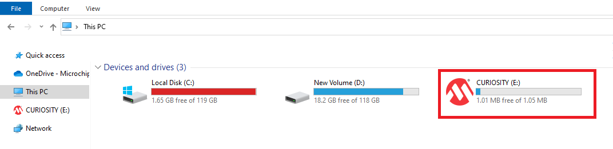  

- Drag and Drop the hex file present in the **samiot2_aws_cloud_core\hex** folder or use MPLAB X IDE to Program. Check section **Firmware upgrade and Wi-Fi configuration process** below for more detail

- Configure the Wi-Fi Credentials using **Wi-Fi configuration through CLI** method explained Below.  

<h3> 2. Firmware upgrade and Wi-Fi configuration process </h3>  

<h4> Firmware upgrade through TPDS and MPLAB X IDE </h4> 	

- Click on **MPLAB X Project**. A project opens in MPLAB X IDE. Build and program the firmware  
	
	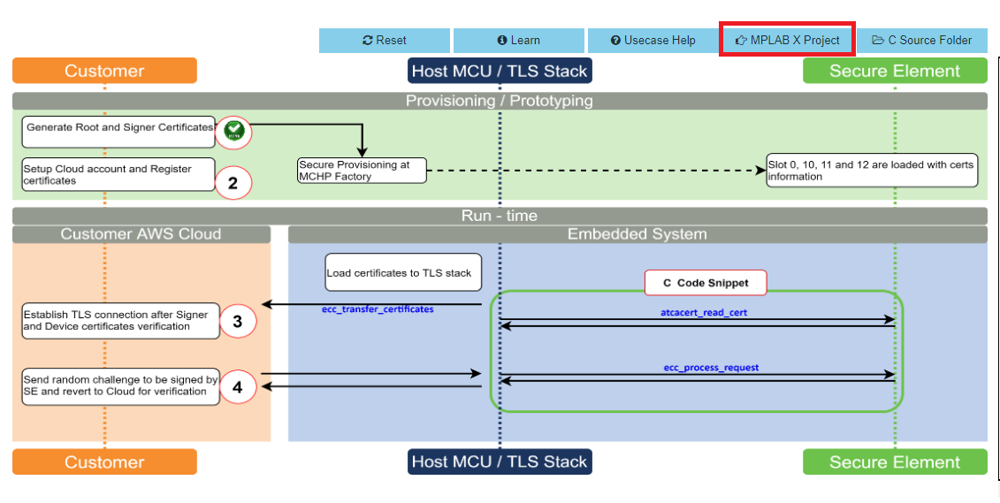  
		
<h4> Firmware upgrade through Drag & Drop </h4>  
	
- Download the latest version of the hex file from the [hex folder](./hex).
	
	  

- Drag & Drop the downloaded .hex file onto the CURIOSITY drive.  	

- This will automatically program the microcontroller with the provided .hex file. There is no need to open the MPLAB X IDE to program the .hex file.  
		
<h4> Firmware upgrade through MPLAB X IDE </h4>
- Most developers usually follow this method to program the .hex file from the MPLAB X IDE environment.
		
<h4> Wi-Fi configuration through CLI </h4>
	
- Open a terminal application on the host PC for the virtual COM port of the connected SAM-IoT WA v2 Development board, with 9600-8-None-1 settings.  
	
- Just enter the below command to set the Wi-Fi credentials.<br>
	
	***`wifi < SSID >,< PASSWORD >,< SECURITY TYPE >`***  
	example : ***`wifi microchip,microchip@123,2`***  

<h3> 3. Running the demo application </h3>

- If the Wi-Fi network is active, then the SAM-IoT WA v2 Development board establishes connectivity with the Wi-Fi network, sets the Blue LED, securely connects to the AWS IoT cloud, and sets the Green LED.
 
- After a successful connection, the SAM-IoT WA v2 Development board pushes the real-time light and temperature sensors data to the AWS IoT cloud page and toggles the Yellow LED. If not, Red LED glows, indicating ERROR.  

	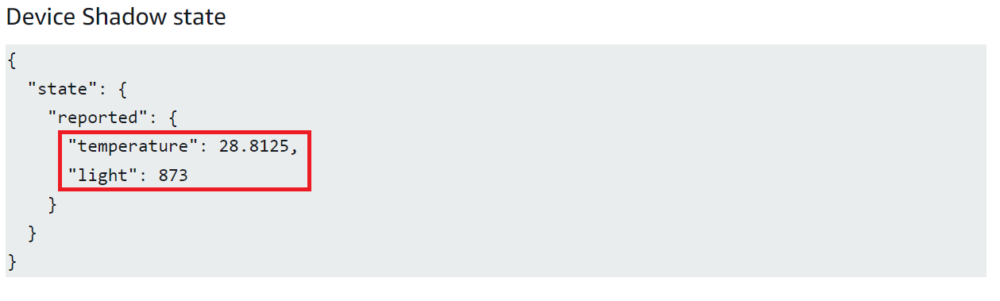  

	**Note :** AWS cloud path to visualize the data pushed from the device "AWS IOT > Manage > Things > ThingNAME (ThingNAME = device_serialnumber) > classic Shadow"  


		
</details>  

<h2> The AWS Lambda service </h2>  

<details>
  <summary> Details
</summary>   
AWS Lambda is a service that enables code to be run in the cloud without worrying about things like provisioning, server management, and scalability. It natively supports many different programming languages, and interfaces with a wide range of other AWS services to facilitate cloud development.

we will use AWS Lambda to transfer temperature and light sensor data from SAM-IoT Development Board to cloud watch. The main concept that we will focus on is how to route data between AWS Lambda and AWS IoT Core.

1. Sensor data is sent from connected devices to the AWS Cloud as MQTT messages.
2. The data is forwarded from AWS IoT Core to AWS Lambda, where it is routed to cloud watch for plotting the graph.

<h3> Creating a Role in AWS IAM </h3>

1. Sign in to the ***[AWS Management Console](https://aws.amazon.com/console/)*** and select the ***IAM*** service.

2. Select ***Roles*** under ***Access Management*** in the menu on the left-hand side

3. Click ***Create role***.

4. Select ***AWS service*** as the trusted entity.

5. Select ***Lambda*** as the use case.

6. Click ***Next: Permissions***.

7. Attach the ***AWSIoTDataAccess***, ***CloudWatchFullAccess*** and ***AWSLambdaBasicExecutionRole*** permission policies by using the search bar and ticking the relevant boxes. This will allow our Lambda function to send data to the AWS IoT Core and use Amazon CloudWatch logs. We will not cover Amazon CloudWatch in this tutorial, but it could be a useful tool for debugging your application later on.

8. Click ***Next: Tags***.

9. Click ***Next: Review***.

10. Enter ***Lambda_IoT_role*** as the Role name.

11. Click ***Create role***

<h3> Designing an AWS Lambda function </h3>

<h4> Creating an empty Lambda function </h4>

AWS Lambda is a service that enables us to run code in the cloud without worrying about server management. It can be set up to send and receive data from many different services, such as AWS IoT Core, which we will make use of in this tutorial. To create an AWS Lambda function:

1. Sign in to the ***AWS Management Console*** and select the ***Lambda*** service.

2. Select ***Functions*** in the menu on the left-hand side.

3. Click on ***Create function***.

4. Choose ***Author from scratch***.

5. Enter ***iot_Core_to_CwMetrics*** as the Function name.

6. Select ***Python 3.8*** as the Runtime.

7. Expand ***Choose or create an execution*** role under ***Permissions*** and select ***Use an existing role***.

8. Select the ***Lambda_IoT_role*** that we defined earlier

9. Click on ***Create function***.

When the AWS Lambda function has been successfully created, the user should be redirected to the Configuration page for the iot_Core_to_CwMetrics function. This page can also be found by selecting Functions in the menu on the left-hand side in AWS Lambda and then selecting the function from the list.

<h3> Triggering the Lambda function for relevant MQTT packages </h3>

The next step is to configure the Lambda function to trigger when messages containing sensor data are published over MQTT in AWS IoT Core:

1. On the Lambda function's configuration page, expand the ***Designer*** panel.

2. Click on ***Add trigger***.

3. Select ***AWS IoT*** as the trigger in the dropdown menu.

4. Select ***Custom IoT rule***.

5. In the ***Rule*** dropdown, select ***Create new rule***.

6. Enter ***RouteSensorData*** as the Rule name.

7. Enter ***SELECT * FROM "$aws/things/ThingName/shadow/#"*** as the Rule query statement.  
**NOTE :** ThingName is the unique serial number of the device

8. Click ***Add***.


<h3> Implementing the Lambda function  </h3>

1. Ensure that the ***iot_Core_to_CwMetrics*** function is selected in the Designer panel.

2. Paste the following Python code in the editor in the Function code panel
```
	import json # Python library for dealing with JSON objects
	import boto3 # boto3 is the AWS SDK for Python

	cloudwatch = boto3.client('cloudwatch')

	#Define payload attributes that may be changed based on device message schema
	ATTRIBUTES = ['temperature','light','state','reported']

	# Define CloudWatch namespace
	CLOUDWATCH_NAMESPACE = "thing2/MonitorMetrics"

	# Define function to publish the metric data to CloudWatch
	def cw(topic, metricValue, metricName):
		metric_data = {
			'MetricName': metricName,
			'Dimensions': [{'Name': 'topic', 'Value': topic}],
			'Unit': 'None',
			'Value': metricValue,
			'StorageResolution': 1
		}

		cloudwatch.put_metric_data(MetricData=[metric_data],Namespace=CLOUDWATCH_NAMESPACE)
		return

	# Define the handler to loop through all the messages and looks to see if the message    attributes
	# include light or temp and calls the cw() function if so to publish the custom metrics    to Amazon CloudWatch
	def lambda_handler(event, context):
		my = list(event.values())
		my_list = list(my[0].values())
		print(my_list[0])

		for e in my_list[0]:
			print("Received a message: {}".format(str(e)))
			print(e) # Potential test point

			# Iterate through each attribute we'd like to publish
			for attribute in ATTRIBUTES:
				# Validate the event payload contains the desired attribute
				if attribute  in e:
					print("publishing {} to CloudWatch".format(attribute))
					cw("SAM-IoT", my_list[0][attribute], attribute)
		return event
```

3. Click ***Save***

<h3> Visualizing sensor data in cloudwatch </h3>
1. Search **CloudWatch** in AWS search box and open it  
   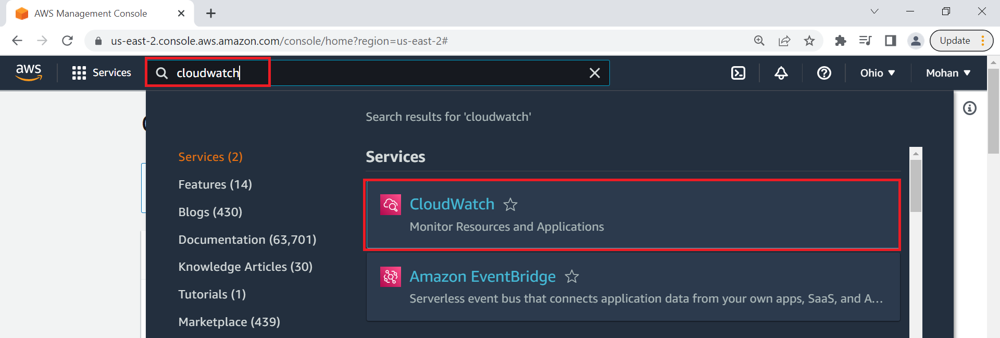
2. Click on **Dashboard** on the right side of the window under CloudWatch  
   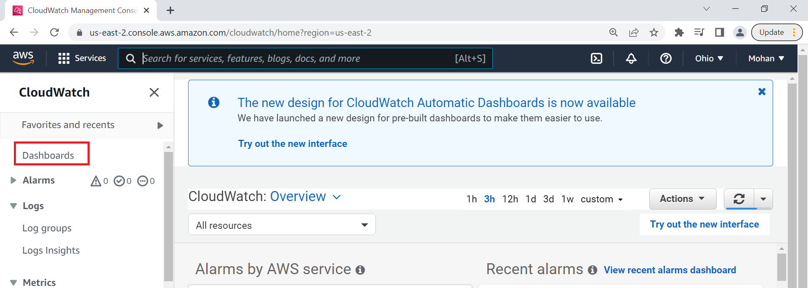
3. Click on **Create Dashboard**  
   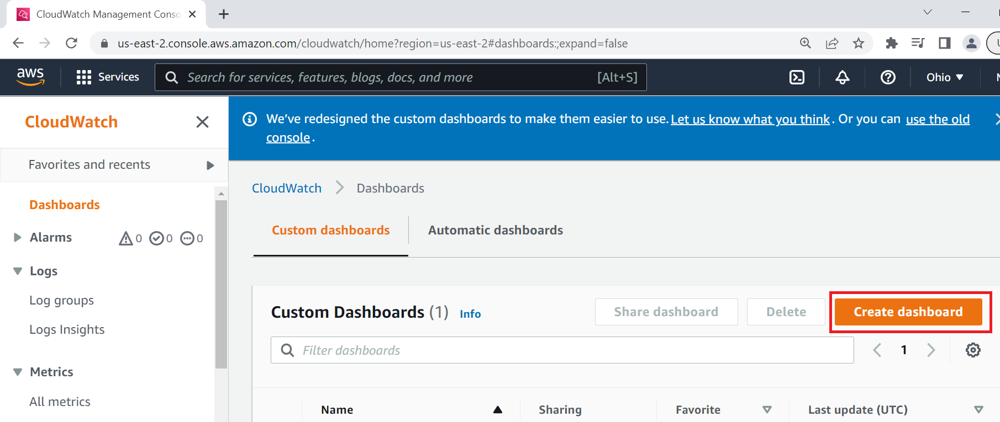
4. Enter Dashboard name as **samiotv2_dashboard** and click on Create Dashboard  
   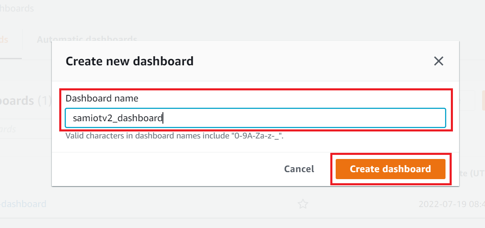
5. Under Add widget Select **Number**  
   
6. Under Add metric graph, select **thing2/MonitorMetrics** and then **topic**  
   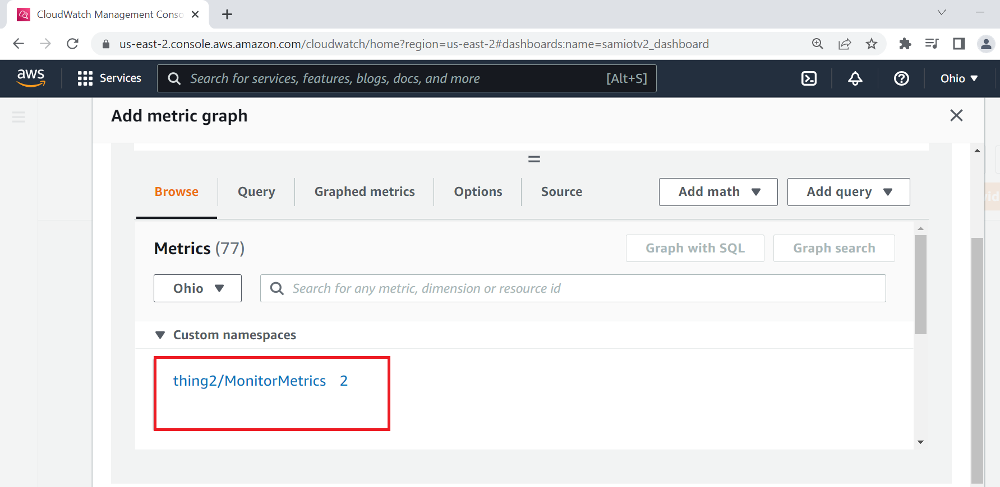  
   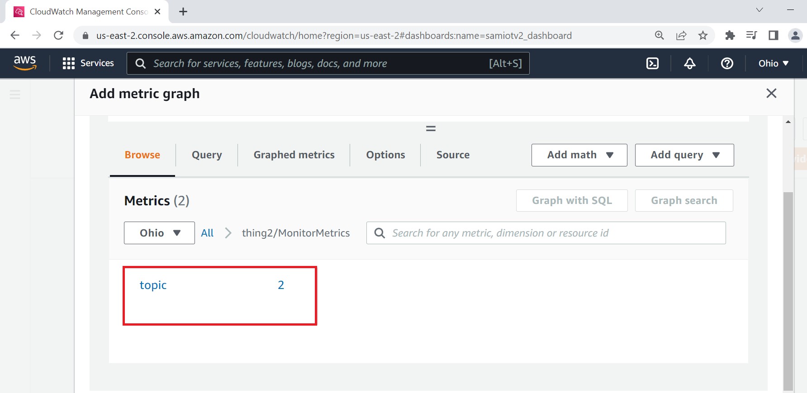
7. Under **Metrics**, select BOTH **SAM-IoT** temperature and light metrics  
   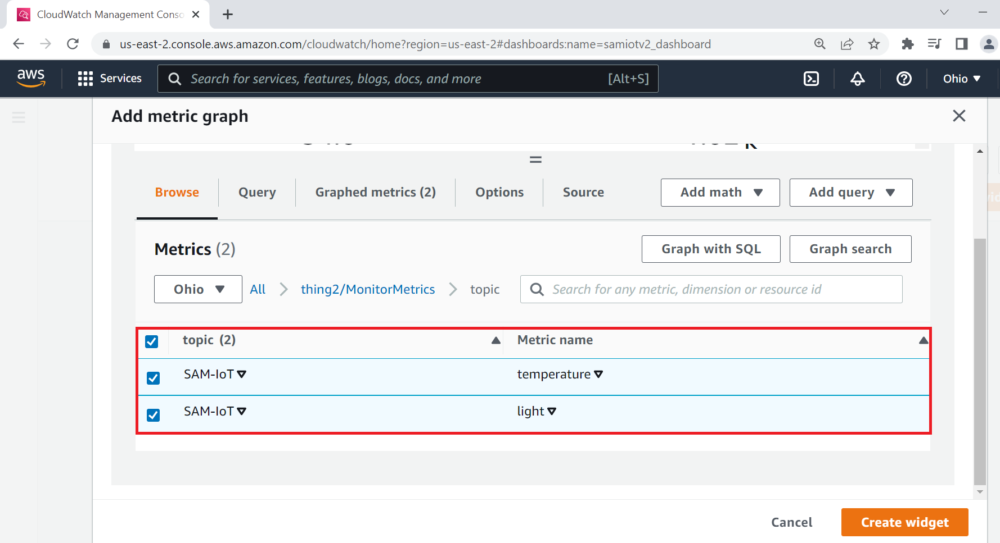
8. Navigate to **Graphed metrics** and change the period to 1 second in both temperature and light metrics. Then click on **Create widget**
   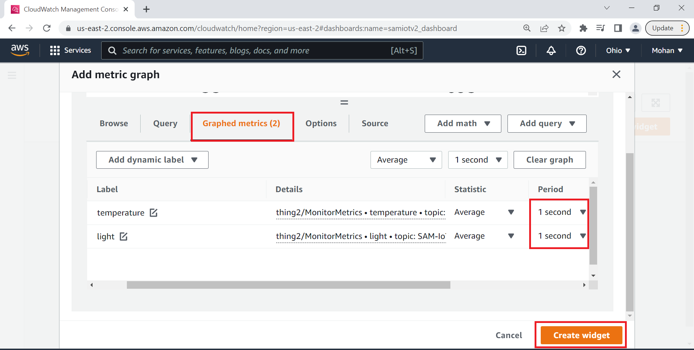
10. Click **Save dashboard**  
	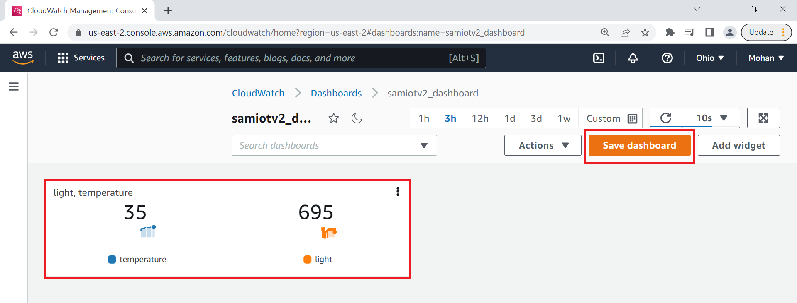
11. This Dashboard page refreshes every 10 seconds and update the sensor data.
**Note : ** Your custom dashboard can be found in **CloudWatch > Dashboards > your dash board name** (here it is samiotv2_dashboard)
</details>  


<h2> Reference: </h2>  

- For more details on the application usage, functionality and other details, refer to the [SAM-IoT Wx v2 Development Board User Guide](https://github.com/Microchip-MPLAB-Harmony/reference_apps/releases/latest/download/SAM_IoT_Wx_v2_Development_Board_User_Guide.pdf)

<h2> Comments:	</h2>  

- This application demo builds and works out of box by following the instructions above in "Running the Demo" section. If you need to enhance/customize this application demo, you need to use the MPLAB Harmony v3 Software framework. Refer links below to setup and build your applications using MPLAB Harmony.
	- [How to Setup MPLAB Harmony v3 Software Development Framework](https://ww1.microchip.com/downloads/en/DeviceDoc/How_to_Setup_MPLAB_%20Harmony_v3_Software_Development_Framework_DS90003232C.pdf)
	- [How to Build an Application by Adding a New PLIB, Driver, or Middleware to an Existing MPLAB Harmony v3 Project](http://ww1.microchip.com/downloads/en/DeviceDoc/How_to_Build_Application_Adding_PLIB_%20Driver_or_Middleware%20_to_MPLAB_Harmony_v3Project_DS90003253A.pdf)  
	- <span style="color:blue"> **MPLAB Harmony v3 is also configurable through MPLAB Code Configurator (MCC). Refer to the below links for specific instructions to use MPLAB Harmony v3 with MCC.**</span>
		- [Create a new MPLAB Harmony v3 project using MCC](https://microchipdeveloper.com/harmony3:getting-started-training-module-using-mcc)
		- [Update and Configure an Existing MHC-based MPLAB Harmony v3 Project to MCC-based Project](https://microchipdeveloper.com/harmony3:update-and-configure-existing-mhc-proj-to-mcc-proj)
		- [Getting Started with MPLAB Harmony v3 Using MPLAB Code Configurator](https://www.youtube.com/watch?v=KdhltTWaDp0)
		- [MPLAB Code Configurator Content Manager for MPLAB Harmony v3 Projects](https://www.youtube.com/watch?v=PRewTzrI3iE)

<h2> Revision: </h2>
- v1.6.0 - released demo application		


