## Description:

> The SAM-IoT Wx v2 Development board based on the SAM D21 microcontroller (MCU) is a small and easily expandable demonstration and development platform for Wi-Fi-based IoT Node applications. This specific development board can be provisioned for Azure IoT Core; The application demonstrates MQTT data transfer of onboard light and temperature sensor data to Microsoft Azure IoT core.  

The board is referred to as SAM-IoT **WZ** v2 Development Board when provisioned for Microsoft Azure cloud IoT.

## Key Highlights of [SAM-IoT WX v2 Development Board](https://www.microchip.com/en-us/development-tool/EV62V87A):

* On-board Light and Temperature Sensors.
* Additional sensors can be interfaced using "click boards" through an on-board [mikroBUS connector](https://www.mikroe.com/click).
* On-board nEDBG debugger. Hence, no external debugger is needed.
* Virtual COM and USB Mass Storage for Drag & Drop programming.
* Dual power supply options. USB or Battery.
* On-board Li-Po battery charging circuitry.
* ATECC608B based secure cloud connectivity
* USB HID interface to provision the ECC608B through the SAMD21 MCU.

## Features of SAM-IoT WA v2 Development Board:

* Drag & Drop of application hex files. Hence, no need for IDE to program the SAM D21 microcontroller.
* Microcontroller peripheral libraries and Middleware are based on the MPLAB Harmony v3 Software framework.
* MPLAB X IDE-based project.
* Command Line Interface (CLI) support for Wi-Fi credentials configuration.
* 4 LED indicators to indicate the operating status.

## Components Used:

- [ATSAMD21G18A microcontroller](https://www.microchip.com/wwwproducts/en/ATsamd21g18)
- [ATWINC1510 Wi-FI module](https://www.microchip.com/wwwproducts/en/ATwinc1500)
- [ATECC608B secure element](https://www.microchip.com/wwwproducts/en/ATECC608B)
- [MCP9808 digital temperature sensor](https://www.microchip.com/en-us/product/MCP9808)
- [MCP73871 Battery Charger](https://ww1.microchip.com/downloads/en/DeviceDoc/MCP73871-Data-Sheet-20002090E.pdf)
- [MIC33050 Voltage Regulator](https://www.microchip.com/wwwproducts/en/MIC33050)
- TEMT6000 ambient light sensor

## Software/Tools Used:

 This project has been verified to work with the following versions of software tools:  

Refer [Project Manifest](./firmware/src/config/samd21_wz_iot_v2/harmony-manifest-success.yml) present in harmony-manifest-success.yml under the project folder *firmware/src/config/samd21_wz_iot_v2*  

- Refer the [Release Notes](../../../release_notes.md#development-tools) to know the **MPLAB X IDE** and **MCC** Plugin version. Alternatively, [Click Here](https://github.com/Microchip-MPLAB-Harmony/reference_apps/blob/master/release_notes.md#development-tools)  

 Because Microchip regularly update tools, occasionally issue(s) could be discovered while using the newer versions of the tools. If the project doesn’t seem to work and version incompatibility is suspected, It is recommended to double-check and use the same versions that the project was tested with.  To download original version of MPLAB Harmony v3 packages, refer to document [How to Use the MPLAB Harmony v3 Project Manifest Feature](https://ww1.microchip.com/downloads/en/DeviceDoc/How-to-Use-the-MPLAB-Harmony-v3-Project-Manifest-Feature-DS90003305.pdf)

## 

## Microsoft Azure Account Setup

  
 Details

  In order to run the Azure demo an Azure account is required. This document describes the steps required to obtain and configure an Azure account for the demo.

  [Azure](https://azure.microsoft.com/en-in/solutions/iot/) provides computing services for a fee. Some are offered for free on a trial or small-scale basis. By signing up for your own Azure account, you are establishing an account to gain access to a wide range of computing services.

### Create your own Azure account

1. Create Azure account
    Go to [Azure Portal](https://portal.azure.com/) and follow instructions to create your own Azure account. If you already have an azure account, enter the credentials and log in.

2. Click **Create a resource** in the azure portal.
   If prompted for Create a Free account, Start Free account by clicking on Start Free. Once the account creation is complete, it starts over with above step. Select Create a resource again and continue with next steps.

3. Click **Internet of Things** and from that select **IoT Hub**

4. The new window prompts to select the subscription, Resource Group, Region and IoT Hub Name.
   
   - Select the Subscription as Free Trial.
   - In the resource group, click Create new and enter any name of your choice.
   - In the Region, Select any region of your choice.
   - In the IoT Hub Name, enter a unique name to identify the Hub.

5. Click **Review + create** after entering all the details.

6. It will take you to the **Review + create** Tab, click **Create** to create an IoT Hub

7. It will start the IoT hub deployment process and it will take a while to create the IoT hub.

8. Click Go to resource and it will take you to the IoT Hub **overview** page.

9. Note down only your IoT Hub Hostname(exclude .azure-devices.net) and Subscription ID as highlighted below. The Hostname should be same as one created in Step 4.4

## 

## Azure Cloud IoT Provisioning Guide

  
 Details

 **If this is the first time you are building/running this version of the demo, you must complete this step before proceeding further. Otherwise, you may skip this step.** 

1. Install [TPDSv2](https://www.microchip.com/en-us/product/SW-TPDSV2#Software)(Trust Platform Design Suite version 2)

2. Launch Trust Platform Design Suite v2 from windows search bar, a window launches as shown below  
      

3. Select "Trust Platform Design Suite" in **webviews** and Click on **Usecases**  
      

4. In **Select Security Solution**, Under **Use Cases** select **Azure IoT Authentication**  
    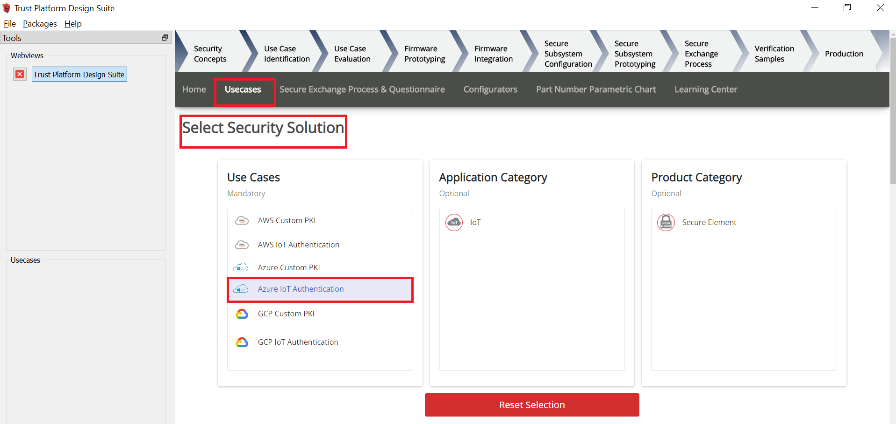  

5. Scroll Down and in **Available solution by provisioning flow** select **Azure IoT Authentication** under **TrustFLEX**  
    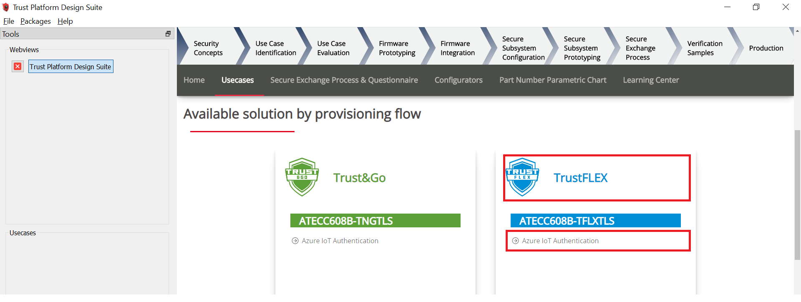  

6. A Usecase gets launched. click on **Azure Connect-IoT Auth-TFLEX** from the **Usescases**  
    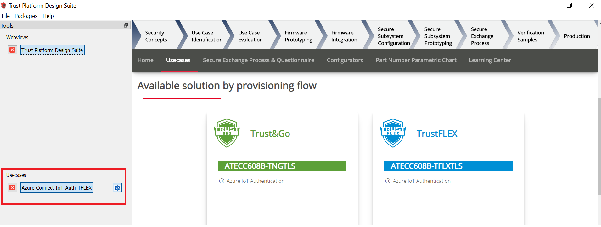  

7. Azure Cloud Connect – IoT Authentication page launches as shown below  
   
   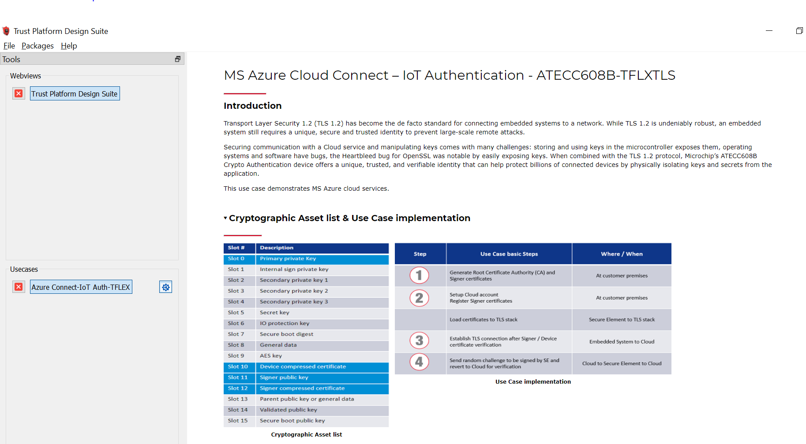

8. Scroll down and select EV62V87A Development board.  
   
   

9. Connect SAM-IoT Wx v2 Development Board to PC running Trust Platform Design Suite  

10. Ensure MPLAB X Path is set in File -> Preference under System Settings in TPDS. This helps to program the provisioner kit firmware to the SAM-IoT Wx v2 Development Board  

11. Scroll down to transaction diagram  
    
    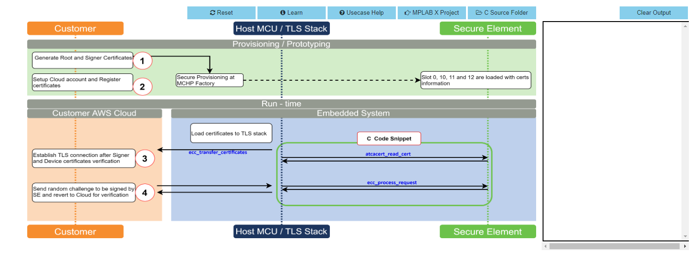

12. Click on Icon **1** and wait till a green right mark appears.  
    
    

13. Click on Icon **2**, This step takes you to Azure Login page.Choose you Azure account and Login. After this you can see the meesage **Authentication completed. You can close this window now**  in the browser.
    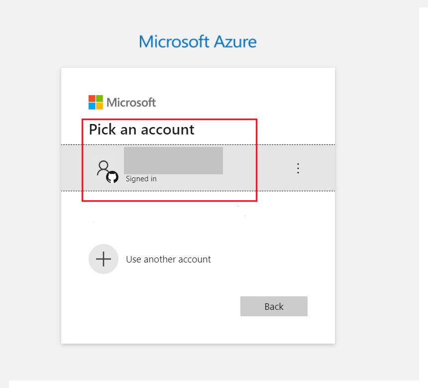  

14. Enter your subscription ID in the dialog box.
    
    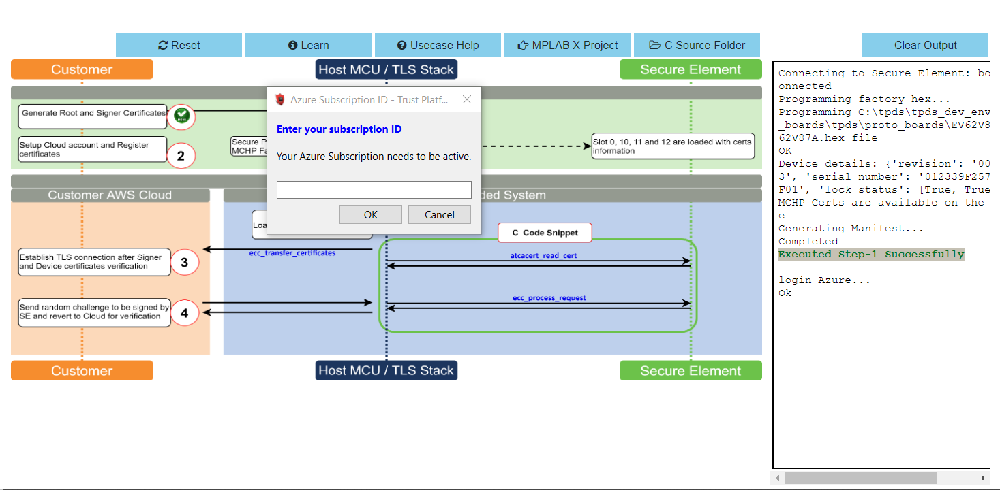

15. Enter the resource group in the dialog box(created in step 2 of create your own Azure account).If the entered resource group does not exists a new one is automatically created.
    
    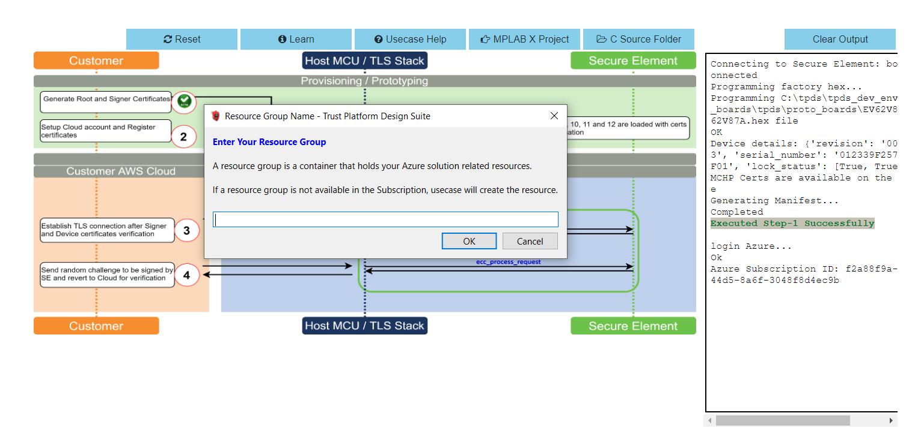

16. Enter your presviously created Azure IOT hub name .A new hub name is created when the entered hub name doesnt exists.This may take a few minutes.
    
    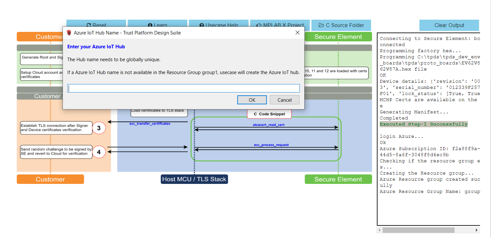

17. The device is successfully registered into azure account after step 2
    
    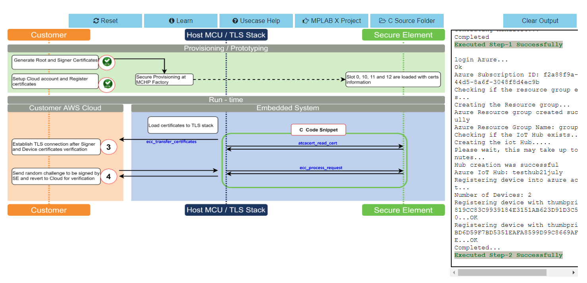

18. Proceed with step 3 and 4 to complete the usecase
    
    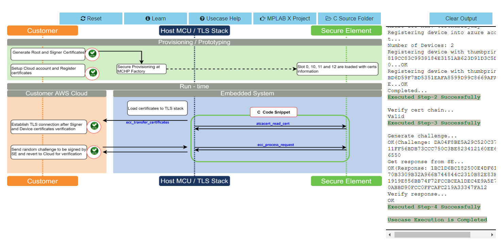

## 

## ATWINC1510 Wi-Fi controller module firmware and Azure Root certificates upgrade Guide

  
 Details

 **If the SAM-IoT Wx v2 development board is glowing RED LED (Indicates ATWINC1510 Wi-Fi controller module firmware is not up to date), follow the below steps to upgrade the ATWINC1510 firmware. Otherwise(if it glows  GREEN ), you may skip this step.** 

1. Click on **C Source Folder** in TPDS transcation diagram  
   
   

2. In windows explorer, Applcation folder gets open
   
   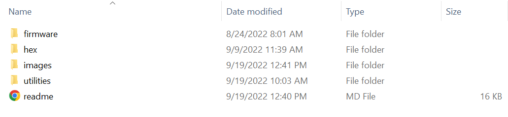

3. Click on **utilities** folder

4. Click on **winc_provisioner.bat**, It automatically downloads the ATWINC1510 firmware package and runs the necessary commands using the command prompt.
   
   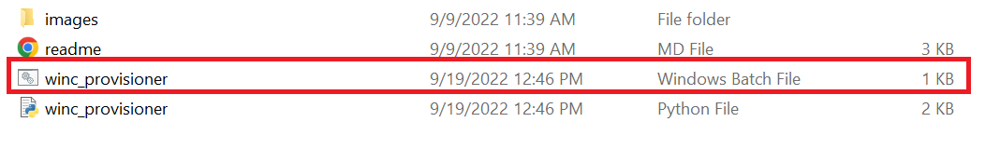
   

5. Select the communication (COM) port identified for "SAM-IoT Wx v2" development board from the drop down list and click OK
   
   

6. Wait till verify passed message comes up, as shown below, and then click on enter to close the command prompt; if it fails, reconnect the board and try again.
   
   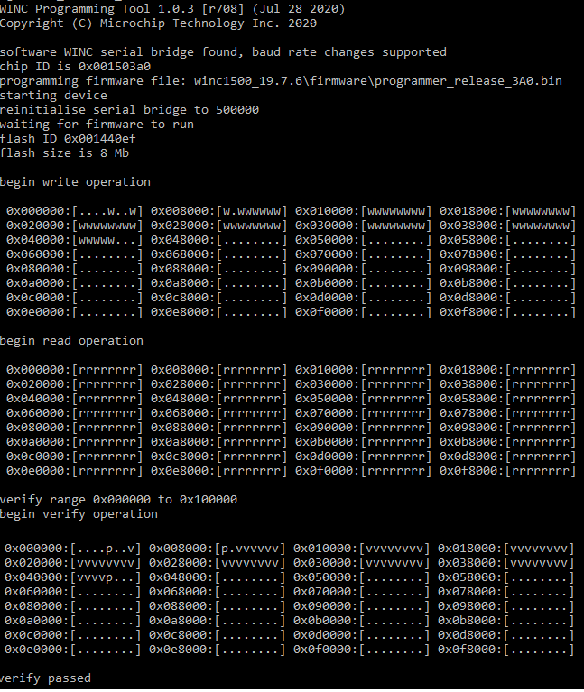

## Application Demonstration

  
 Details

 
The following sections describes the steps to run the application.

### 1. How to setup the SAM-IoT WZ v2 Development Board

- Connect the SAM-IoT WZ v2 Development board to the host PC's USB port to power-up the board.  
  
  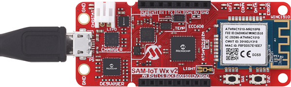  

- Alternatively, the board can be powered using a Li-Po battery. The board must be connected through a USB port to perform a firmware upgrade or Wi-Fi configuration.  

- Once connected to a PC, a mass storage drive icon by the name **CURIOSITY** will appear.
  
    

- Drag and Drop the hex file present in the **samiot2_azure_cloud_core\hex** folder or use MPLAB X IDE to Program. Check section **Firmware upgrade and Wi-Fi configuration process** below for more detail

- Configure the Wi-Fi Credentials using **Wi-Fi configuration through CLI** method explained Below

### 2. Firmware upgrade and Wi-Fi configuration process

#### Firmware upgrade through TPDS and MPLAB X IDE

- Click on **MPLAB X Project**. A project opens in MPLAB X IDE. Build and program the firmware  
  
      

#### Firmware upgrade through Drag & Drop

- Download the latest version of the hex file from the [hex folder](./hex).
  
    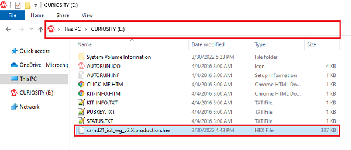  

- Drag & Drop the downloaded .hex file onto the CURIOSITY drive.      

- This will automatically program the microcontroller with the provided .hex file. There is no need to open the MPLAB X IDE to program the .hex file.  

#### Firmware upgrade through MPLAB X IDE

- Most developers usually follow this method to program the .hex file from the MPLAB X IDE environment.

#### Wi-Fi configuration through CLI

- Open a terminal application on the host PC for the virtual COM port of the connected SAM-IoT WA v2 Development board, with 9600-8-None-1 settings.  

- Just enter the below command to set the Wi-Fi credentials. 
  
    ***`wifi < SSID >,< PASSWORD >,< SECURITY TYPE >`***  
    example : ***`wifi microchip,microchip@123,2`***  
  
  **Note** : No need of repeating this step every time while running the demo, Device remembers last used WiFi credentials and tries to connect to it. If WiFi credentials changes, this step should be performed.

### 3. Running the demo application

- If the Wi-Fi network is active, then the SAM-IoT WZ v2 Development board establishes connectivity with the Wi-Fi network, sets the Blue LED, securely connects to the Azure IoT cloud, and sets the Green LED.

- After a successful connection, the SAM-IoT WZ v2 Development board pushes the real-time light and temperature sensors data to the Azure IoT cloud page and toggles the Yellow LED. If not, Red LED glows, indicating ERROR.  
  
  

## Fetching data from Azure Cloud and displaying on Device explorer

  
 Details

1. Download and install [Device Explorer](https://github.com/Azure/azure-iot-sdks/releases/tag/2016-11-17/SetupDeviceExplorer.msi) application

2. Run Device Explorer from windows search bar

3. From the [Azure Portal](https://portal.azure.com/): click on your IoT Hub > Shared access polices > iothubowner > connection string-primary key > Copy to clipboard

4. Paste copied connection string-primary key to IoT Hub Connection String tab on device explorer.

5. Then click on Update
   
   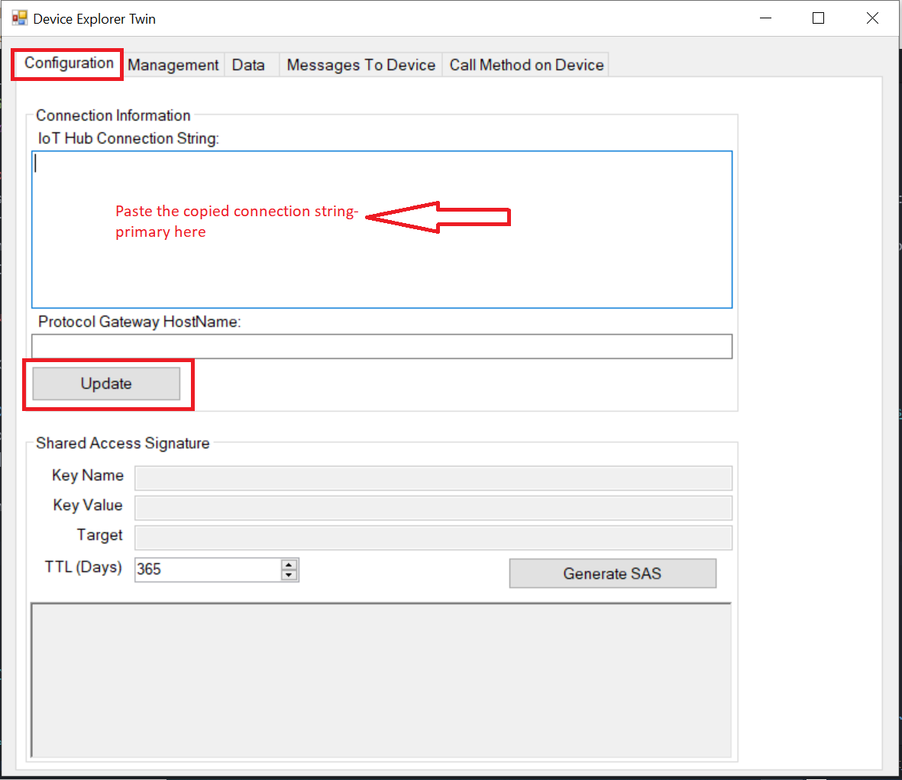

6. Click on **Data** Tab and press **Monitor** button  
   
   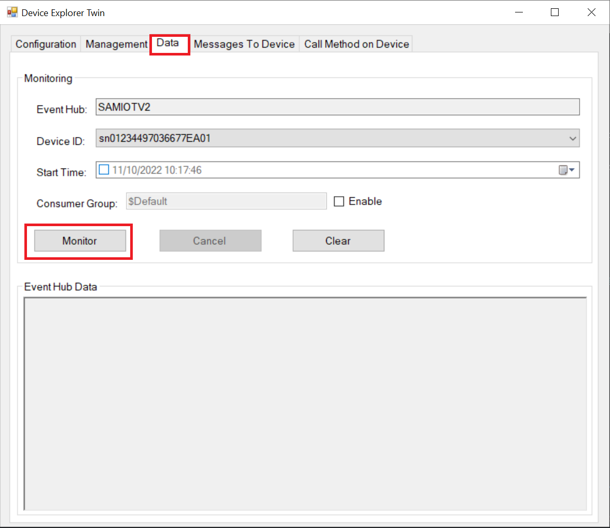

7. The real-time light and temperature sensors data from the Azure IoT cloud is fetched and displayed as shown below
   
   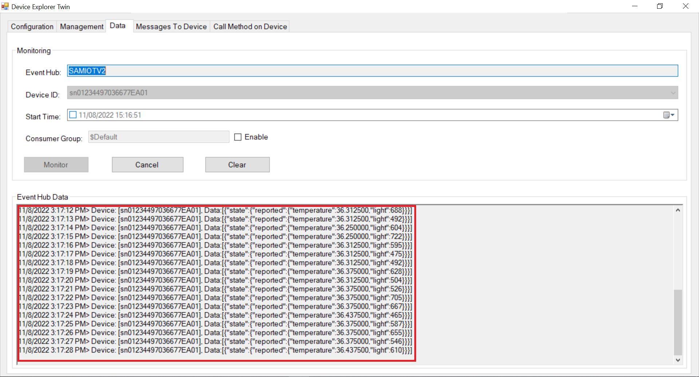

## Reference:

- For more details on the application usage, functionality and other details, refer to the [SAM-IoT Wx v2 Development Board User Guide](https://github.com/Microchip-MPLAB-Harmony/reference_apps/releases/latest/download/SAM_IoT_Wx_v2_Development_Board_User_Guide.pdf)

## Comments:

- This application demo builds and works out of box by following the instructions above in "Running the Demo" section. If you need to enhance/customize this application demo, you need to use the MPLAB Harmony v3 Software framework. Refer links below to setup and build your applications using MPLAB Harmony.
  - [How to Setup MPLAB Harmony v3 Software Development Framework](https://ww1.microchip.com/downloads/en/DeviceDoc/How_to_Setup_MPLAB_%20Harmony_v3_Software_Development_Framework_DS90003232C.pdf)
  - [How to Build an Application by Adding a New PLIB, Driver, or Middleware to an Existing MPLAB Harmony v3 Project](http://ww1.microchip.com/downloads/en/DeviceDoc/How_to_Build_Application_Adding_PLIB_%20Driver_or_Middleware%20_to_MPLAB_Harmony_v3Project_DS90003253A.pdf)  
  -  **MPLAB Harmony v3 is also configurable through MPLAB Code Configurator (MCC). Refer to the below links for specific instructions to use MPLAB Harmony v3 with MCC.**
    - [Create a new MPLAB Harmony v3 project using MCC](https://microchipdeveloper.com/harmony3:getting-started-training-module-using-mcc)
    - [Update and Configure an Existing MHC-based MPLAB Harmony v3 Project to MCC-based Project](https://microchipdeveloper.com/harmony3:update-and-configure-existing-mhc-proj-to-mcc-proj)
    - [Getting Started with MPLAB Harmony v3 Using MPLAB Code Configurator](https://www.youtube.com/watch?v=KdhltTWaDp0)
    - [MPLAB Code Configurator Content Manager for MPLAB Harmony v3 Projects](https://www.youtube.com/watch?v=PRewTzrI3iE)

## Revision:

- v1.6.0 - released demo application        
