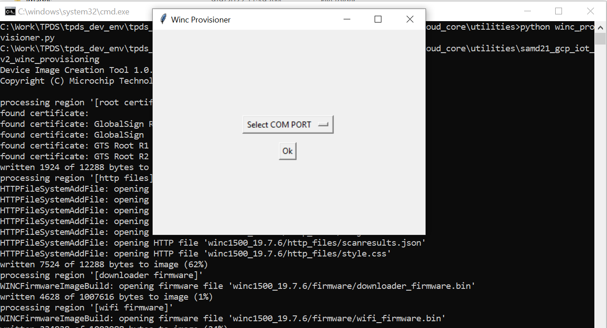
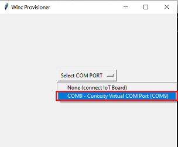

# ATWINC1510 Firmware upgrade and Root certificate upgrade Guide

## Description:

> The SAM-IoT WZ V2 Development Application uses ATWINC1510-MR210PB IEEE 802.11 b/g/n module to enable cloud connectivity. The application's functioning requires the ATWINC1510 module to have firmware compatible with the WiFi software stack running on the SAM-IoT microcontroller. To enable this compatibility, the  ATWINC1510 module is updated with the firmware compatible with WiFi software running in the latest released demo.  

> The root certificates to identify the IoT node to the Azure cloud platform are programmed in the non-volatile memory of the ATWINC1510 module.  

##  *If you are following readme other than TPDS, please complete below step before proceeding* 
[Serial Bridge Application to upgrade ATWINC1510 Firmware](./winc_provisioner/readme.md)

##  *Complete the above highlighted step before proceeding further* 

## Running the utility
1. Click on **winc_provisioner.bat**, It automatically downloads WINC firmware package and runs a command using a command prompt.
   
    
2. Select SAM IoT V2 COM PORT from the drop down and click OK 
 
	
3. Wait till verify passed message comes up as shown below and then click on enter to close he command prompt, if fails, reconnect the board and try
   

### Revision:
- v1.6.0 released utility
