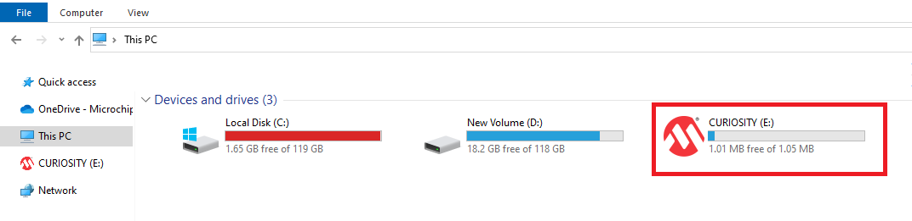
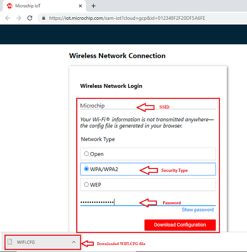
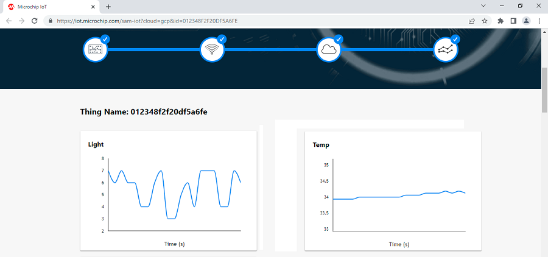

# Google Cloud IoT Core Application on SAM D21 IoT Wx v2 Development Board
<h2 align="center"> <a href="https://github.com/Microchip-MPLAB-Harmony/reference_apps/releases/latest/download/samiot2_google_cloud_core.zip" > Download </a> </h2>

-----

##  <b>Important:</b>
> There could be updates and bug fixes to the Google IoT sensor node application. Therefore, it is recommended to program SAM D21 IoT Wx v2 Development Board with the latest version of the hex file from the [hex folder](./hex).  

## Description:

> The SAM-IoT Wx v2 Development board based on the SAM D21 microcontroller is a small and easily expandable demonstration and development platform for Wi-Fi-based IoT Node applications. This specific development board comes pre-provisioned for Google IoT core, hence "WG." The application that comes pre-programmed with factory shipped boards demonstrates MQTT data transfer of on-board light and temperature sensor data to Google IoT core.

## Key Highlights of [SAM-IoT WG v2 Development Board](https://www.microchip.com/DevelopmentTools/ProductDetails/):

* On-board Light and Temperature Sensors.
* Additional sensors can be interfaced using "click boards" through an on-board [mikroBUS connector](https://www.mikroe.com/click).
* On-board nEDBG debugger. Hence, no external debugger is needed.
* Virtual COM and USB Mass Storage for Drag & Drop programming.
* Dual power supply options. USB or Battery.
* On-board Li-Po battery charging circuitry.
* ATECC608B based secure cloud connectivity
* USB HID interface to provision the ECC608B through the SAMD21 MCU.

## Features of SAM-IoT WG Development Board:

* Drag & Drop of application hex files. Hence, no need for IDE to program SAM D21 microcontroller.
* Drag & Drop of Wi-Fi credentials to connect to the internet.
* Microcontroller peripheral libraries and Middleware are based on MPLAB Harmony v3 Software framework.
* MPLABX IDE based project.
* Command Line Interface (CLI) support for Wi-Fi credentials configuration.
* 4 LED indicators to indicate the operating status.

## Components Used:
- [ATSAMD21G18A microcontroller](https://www.microchip.com/wwwproducts/en/ATsamd21g18)
- [ATWINC1510 Wi-FI module](https://www.microchip.com/wwwproducts/en/ATwinc1500)
- [ATECC608B secure element](https://www.microchip.com/wwwproducts/en/ATECC608B)
- [MCP9808 digital temperature sensor](https://www.microchip.com/wwwproducts/en/en556182)
- [MCP73871 Battery Charger](https://www.microchip.com/wwwproducts/en/en536670)
- [MIC33050 Voltage Regulator](https://www.microchip.com/wwwproducts/en/MIC33050)
- TEMT6000 ambient light sensor

## Software/Tools Used:
 This project has been verified to work with the following versions of software tools:  

Refer [Project Manifest](./firmware/src/config/samd21_wg_iot_v2/harmony-manifest-success.yml) present in harmony-manifest-success.yml under the project folder *firmware/src/config/samd21_wg_iot_v2*  
- Refer the [Release Notes](../../../release_notes.md#development-tools) to know the {}MPLAB X IDE{} and {}MHC/MCC{} Plugin version. Alternatively, [Click Here](https://github.com/Microchip-MPLAB-Harmony/reference_apps/blob/master/release_notes.md#development-tools) 

 Because Microchip regularly update tools, occasionally issue(s) could be discovered while using the newer versions of the tools. If the project doesn’t seem to work and version incompatibility is suspected, It is recommended to double-check and use the same versions that the project was tested with.  To download original version of MPLAB Harmony v3 packages, refer to document [How to Use the MPLAB Harmony v3 Project Manifest Feature](https://ww1.microchip.com/downloads/en/DeviceDoc/How-to-Use-the-MPLAB-Harmony-v3-Project-Manifest-Feature-DS90003305.pdf)

## 
## ATWINC1510 Firmware upgrade and Google Cloud IoT Provisioning (Root certificate upgrade) Guide
 [Refer the documentation in utilities  folder](./utilities/readme.md)   
 **If this is the first time you are building/running this version of the demo, you must complete this step before proceeding further. Otherwise, you may skip this step.** 

## Application Demonstration:

The below sections describes the steps to run the application.

### 1. How to setup the SAM-IoT WG v2 Development Board
- The SAM-IoT WG v2 Development board comes with a pre-loaded application for an out-of-box experience for the end user. Connect the board to the host PC's USB port to power-up the board.  

    

- Alternatively, the board can be powered using a Li-Po battery. To perform a Firmware upgrade or Wi-Fi configuration, the board must be connected through a USB port.  
- Once connected to a PC, a mass storage drive icon by the name **CURIOSITY** will appear.  

    

### 2. Running the Demo
- Open the drive and click open the CLICK-ME.HTM file to launch the Google IoT cloud landing page.
- Enter Wi-Fi credentials (SSID, Password, security type) in the landing page and download WIFI.CFG file.  
  
- Drag & Drop the downloaded WIFI.CFG onto the CURIOSITY drive to set the Wi-Fi credentials.  
  
- If the Wi-Fi network is active, then the SAM-IoT WG v2 Development board establishes connectivity with the Wi-Fi network and securely connects to the Google IoT cloud.
- After successful connection, the SAM-IoT WG v2 Development board pushes the real-time light and temperature sensors data to the landing page.  
  

### 3. Firmware upgrade and Wi-Fi configuration process
  - #### Firmware upgrade through Drag & Drop
    - Download the latest version of the hex file from the [hex folder](./hex). Drag & Drop the downloaded .hex file onto the CURIOSITY drive.  

        

    - This will automatically program the microcontroller with the provided .hex file. There is no need to open the MPLABX IDE to program the .hex file through Drag & Drop method.
  - #### Firmware upgrade through MPLABX IDE
    - Most developers usually follow this method to program the .hex file from the MPLABX IDE environment.
  - #### Wi-Fi configuration through Drag & Drop
    - This is nothing but the WIFI.CFG Drag & Drop method discussed in the previous section.	 
  - #### Wi-Fi configuration through CLI
    - Open a terminal application on the host PC for the virtual COM port of the connected SAM-IoT WG v2 Development board, with 9600-8-None-1 settings.
    - Just enter the below command to set the Wi-Fi credentials. 
		   **`wifi <SSID>,<PASSWORD>,<SECURITY TYPE>`**

## Reference:
- For more details on the application usage, functionality and other details, refer to the [SAM-IoT WG v2 Development Board User Guide](https://github.com/Microchip-MPLAB-Harmony/reference_apps/releases/latest/download/SAM_IoT_WG_v2_Development_Board_User_Guide.pdf)

## Comments:
- This application demo builds and works out of box by following the instructions above in "Running the Demo" section. If you need to enhance/customize this application demo, you need to use the MPLAB Harmony v3 Software framework. Refer links below to setup and build your applications using MPLAB Harmony.
	- [How to Setup MPLAB Harmony v3 Software Development Framework](https://www.microchip.com/mymicrochip/filehandler.aspx?ddocname=en1000821)
	- [How to Build an Application by Adding a New PLIB, Driver, or Middleware to an Existing MPLAB Harmony v3 Project](http://ww1.microchip.com/downloads/en/DeviceDoc/How_to_Build_Application_Adding_PLIB_%20Driver_or_Middleware%20_to_MPLAB_Harmony_v3Project_DS90003253A.pdf)  

### Revision:
- v1.5.0 - released demo application
