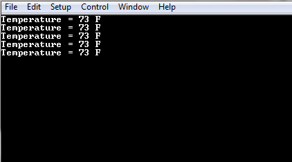

# Getting Started Application on SAM D21 Xplained Pro Evaluation Kit
-----
## Description:

> The application reads the current room temperature from the temperature sensor on the I/O1 Xplained Pro Extension. The temperature 
  read is displayed on a serial console periodically every 500 milliseconds. The periodicity of the temperature values displayed on 
  the serial console is changed to 1 second, 2 seconds, 4 seconds and back to 500 milliseconds every time you press the switch SW0 
  on the SAM D21 Xplained Pro Evaluation Kit. Also, an LED0 is toggled every time the temperature is displayed on the serial console. 

## Modules/Technology Used:
- Peripheral Modules  
	- PORTS
	- RTC
	- DMAC
	- SERCOM(I2C)
	- SERCOM(USART)	

## Hardware Used:

- [SAM D21 Xplained Pro Evaluation Kit](https://www.microchip.com/developmenttools/ProductDetails/atsamd21-xpro)
- [I/O1 Xplained Pro Extension Kit](https://www.microchip.com/Developmenttools/ProductDetails/ATIO1-XPRO)

## Software/Tools Used:
 *This project has been verified to work with the following versions of software tools:*  
 - [MPLAB Harmony v3 "csp" repo v3.5.2](https://github.com/Microchip-MPLAB-Harmony/csp/releases/tag/v3.5.2)
 - [MPLAB Harmony v3 "dev_packs" repo v3.5.0](https://github.com/Microchip-MPLAB-Harmony/dev_packs/releases/tag/v3.5.0)  
 - [MPLAB Harmony v3 "mhc" repo v3.3.3](https://github.com/Microchip-MPLAB-Harmony/mhc/releases/tag/v3.3.3)   
 -  MPLAB Harmony Configurator Plugin v3.3.1
 - [MPLAB X IDE v5.25](https://www.microchip.com/mplab/mplab-x-ide)
 - [MPLAB XC32 Compiler v2.20](https://www.microchip.com/mplab/compilers)
 - [MPLAB X IPE v5.25](https://www.microchip.com/mplab/mplab-integrated-programming-environment)
 - Any Serial Terminal application like Tera Term terminal application.  
 *Because Microchip regularly update tools, occasionally issue(s) could be discovered while using the newer versions of the tools. If the project doesn’t seem to work and version incompatibility is suspected, It is recommend to double-check and use the same versions that the project was tested with.*  

## Setup:
- Verify that the temperature sensor (I/O1 Xplained Pro Extension Kit) is connected to Extension Header 1 (EXT1) on the SAM D21 Xplained Pro Evaluation Kit
- The SAM D21 Xplained Pro Evaluation Kit allows using the Embedded Debugger (EDBG) for debugging. Connect the Type-A male to micro-B USB cable to micro-B 
  DEBUG USB port to power and debug the SAM D21 Xplained Pro Evaluation Kit  
  

## Programming binary/hex file:
- If you are not interested in installing development tools. The pre-built binary/hex file can be programmed to the target
	### Steps to program the hex file using MPLAB X IPE
	- Open MPLAB X IPE
	- Select Device has "ATSAMD21J18A"
	- Power the SAM D21 Xplained Pro Evaluation Kit from a Host PC through a Type-A male to Micro-B USB cable connected to Micro-B port
	- Once Power cable is connected, "EDBG" hardware tool is identified as a programmer
	- Browse to hex file (getting_started_hex_file.hex)
	- Click on program button. The device gets programmed in sometime
	- Follow the steps in "Running the Demo" section below

## Programming/Debugging Application Project:
- Open the project (getting_started\firmware\sam_d21_xpro.X) in MPLAB X IDE
- Ensure "EDBG" is selected as hardware tool to program/debug the application
- Build the code and program the device by clicking on the "make and program" button in MPLAB X IDE tool bar
- Follow the steps in "Running the Demo" section below

## Running the Demo:
- Open the Tera Term terminal application on your PC (from the Windows® Start menu by pressing the Start button)
- Change the baud rate to 115200
- You should see the temperature values (in °F) being displayed on the terminal every 500 milliseconds, as shown below  
  
- Also, notice the LED0 blinking at 500 millisecond rate
- You may vary the temperature by placing your finger on the temperature sensor (for a few seconds)  
  
- Press the switch SW0 on SAM D21 Xplained Pro Evaluation Kit to change the default sampling rate to one second  
  
  
- Every subsequent pressing of switch SW0 on SAM D21 Xplained Pro Evaluation Kit changes the default sampling rate to two seconds, 
  four seconds and 500 ms and back to one second in cyclic order as shown below  
    
- While the temperature sampling rate changes on every switch SW0 press, notice the LED0 toggling at the same sampling rate

## Comments:
- Reference Training Module: [Getting Started with Harmony v3 Peripheral Libraries on SAM D21 MCUs](https://microchipdeveloper.com/harmony3:samd21-getting-started-training-module)
- This application demo builds and works out of box by following the instructions above in "Running the Demo" section. If you need to enhance/customize this application demo, you need to use the MPLAB Harmony v3 Software framework. Refer links below to setup and build your applications using MPLAB Harmony. 
	- [How to Setup MPLAB Harmony v3 Software Development Framework](https://www.microchip.com/mymicrochip/filehandler.aspx?ddocname=en1000821) 
	- [How to Build an Application by Adding a New PLIB, Driver, or Middleware to an Existing MPLAB Harmony v3 Project](http://ww1.microchip.com/downloads/en/DeviceDoc/How_to_Build_Application_Adding_PLIB_%20Driver_or_Middleware%20_to_MPLAB_Harmony_v3Project_DS90003253A.pdf)  
- The application is available on MPLAB Harmony v3 GitHub repository [reference_apps](https://github.com/Microchip-MPLAB-Harmony/reference_apps/tree/master/apps/sam_d21_xpro/getting_started)	
               
## Revision: 
- v1.0 released demo application
