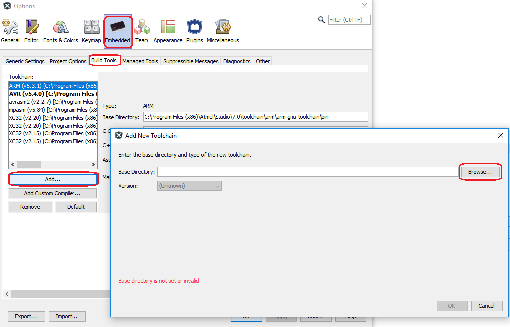
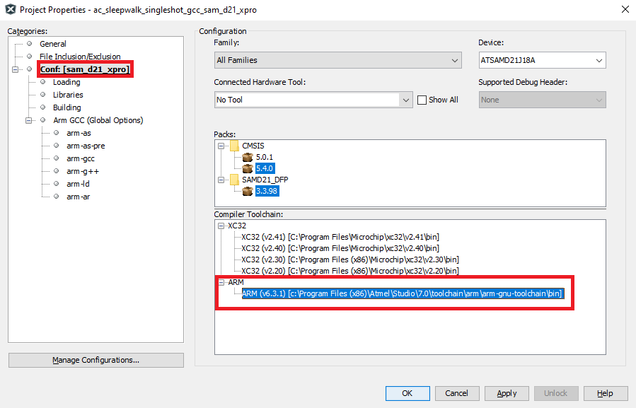
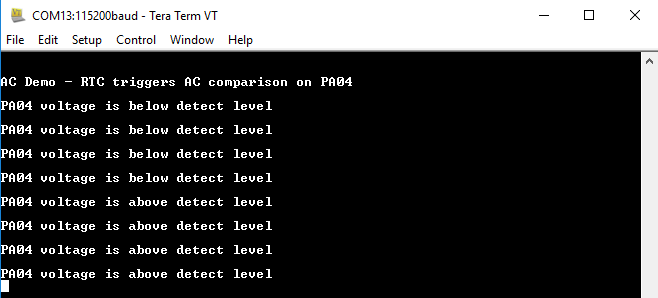

# AC Sleepwalking Application built with GCC Toolchain on SAM D21 Xplained Pro Kit
<h2 align="center"> <a href="https://github.com/MicrochipTech/MPLAB-Harmony-Reference-Apps/releases/latest/download/samd21_ac_sleepwalk_singleshot_gcc.zip" > Download </a> </h2>

-----
## Description:

> This application demonstrates how to use the AC (Analog Comparators) Peripheral library to perform a single-shot conversion when the peripheral is triggered by the RTC (Real-Time Counter) compare event. The generation of a trigger and compare operation is done while the CPU is in the standby sleep mode. The AC generates the interrupt at the end of the comparison which wakes the CPU.

> The application demonstrates to build an MPLAB Harmony v3 project with [ARM GNU Toolchain](https://www.microchip.com/mplab/avr-support/avr-and-arm-toolchains-c-compilers) in MPLABX IDE. The page demonstrates configuring, building, and running an MPLAB Harmony v3 peripheral library (PLIB) based application with the ARM GCC toolchain developed on the **SAM D21 Xplained Pro Evaluation Kit**.

## Modules/Technology Used:
- Peripheral Modules
    - AC
    - PORTS
    - RTC
    - PM (Power Manager)
    - SERCOM (USART)

## Hardware Used:
- [SAM D21 Xplained Pro Evaluation Kit](https://www.microchip.com/developmenttools/ProductDetails/atsamd21-xpro)

## Software/Tools Used:
 *This project has been verified to work with the following versions of software tools:*

- [MPLAB Harmony v3 "csp" repo v3.9.1](https://github.com/Microchip-MPLAB-Harmony/csp/releases/tag/v3.9.1)  
- [MPLAB Harmony v3 "csp_apps_sam_d21_da1" repo v3.1.0](https://github.com/Microchip-MPLAB-Harmony/csp_apps_sam_d21_da1/releases/tag/v3.1.0)
- [MPLAB Harmony v3 "dev_packs" repo v3.9.0](https://github.com/Microchip-MPLAB-Harmony/dev_packs/releases/tag/v3.9.0)  
- [MPLAB Harmony v3 "mhc" repo v3.7.2](https://github.com/Microchip-MPLAB-Harmony/mhc/releases/tag/v3.7.2)  
- MPLAB Harmony 3 Launcher Plugin v3.6.4  
- [MPLAB X IDE v5.50](https://www.microchip.com/mplab/mplab-x-ide)  
- [ARM GNU Toolchain v6.3.1](https://www.microchip.com/mplab/avr-support/avr-and-arm-toolchains-c-compilers)
- Any Serial Terminal application like Tera Term terminal application.

 *Because Microchip regularly update tools, occasionally issue(s) could be discovered while using the newer versions of the tools. If the project doesn’t seem to work and version incompatibility is suspected, It is recommended to double-check and use the same versions that the project was tested with.* 

## Setting up SAM D21 Xplained Pro Evaluation Kit:
- Connect a voltage below VDD to pin 17 of the EXT1 connector
- Connect the Debug USB port on the board to the computer using a micro USB cable

## Prerequisite:
- Download and install [ARM GNU Toolchain v6.3.1](https://www.microchip.com/mplab/avr-support/avr-and-arm-toolchains-c-compilers).
- **Note:** If [Atmel Studio](https://www.microchip.com/mplab/avr-support/atmel-studio-7) is already installed in PC, then installing ARM GCC toolchain is not required as [Atmel Studio](https://www.microchip.com/mplab/avr-support/atmel-studio-7) is already bundled with [ARM GNU Toolchain](https://www.microchip.com/mplab/avr-support/avr-and-arm-toolchains-c-compilers).

## Configure the project to use ARM GCC Toolchain:
This can be done with two methods, either automatically or manually.

1. Automatic Detection: If Atmel Studio is installed in PC, By default, MPLAB X IDE detects the ARM GCC toolchain (installed as a part of Atmel Studio) and shows it in the MPLAB X IDE's Project properties.
Since the ARM GCC toolchain is already available, switch to the ARM GCC toolchain from the project properties.
2. Manual: If Atmel Studio is not installed, install the ARM GCC toolchain manually.
  Go to MPLAB X IDE -> Tools -> Options -> Embedded -> Build Tools -> Add -> give the base directory -> Enter the path of “xx/xxx/toolchain/arm/arm-gnu-toolchain\bin”. Save it.
- 
- Now, select the ARM GCC toolchain in the project properties. Select the Project -> Right Click -> Properties -> select the ARM GCC toolchain in compiler options and save.
- 

## Programming hex file:
The pre-built hex file can be programmed by following the below steps

### Steps to program the hex file:
- Open MPLAB X IDE
- Close all existing projects in IDE, if any project is opened.
- Go to File -> Import -> Hex/ELF File
- In the "Import Image File" window, Step 1 - Create Prebuilt Project, click the "Browse" button to select the prebuilt hex file.
- Select Device has "ATSAMD21J18A"
- Ensure the proper tool is selected under "Hardware Tool"
- Click on "Next" button
- In the "Import Image File" window, Step 2 - Select Project Name and Folder, select appropriate project name and folder
- Click on "Finish" button
- In MPLAB X IDE, click on "Make and Program Device" Button. The device gets programmed in sometime.
- Follow the steps in "Running the Demo" section below

## Programming/Debugging Application Project:
- Open the project (sam_d21_xpro\samd21_ac_sleepwalk_singleshot_gcc\firmware\sam_d21_xpro.X) in MPLAB X IDE
- Ensure "SAM D21 Xplained Pro" is selected as hardware tool to program/debug the application
- Build the code and program the device by clicking on the "Make and Program Device" button in MPLAB X IDE tool bar
- Follow the steps in "Running the Demo" section below

## Running the Demo:
- Perform [Prerequisite](#prerequisite), [Configure the project to use ARM GCC Toolchain](#Configure-the-project-to-use-ARM-GCC-Toolchain) and [Setting up SAM D21 Xplained Pro Evaluation Kit](#Setting-up-SAM-D21-Xplained-Pro-Evaluation-Kit) steps mentioned above, if not done already.
- Open the Tera Term terminal application on your PC (from the Windows® Start menu by pressing the Start button)
- Connect to the EDBG Virtual COM port and configure the baud rate to **115200**
- Build and Program the application using the MPLAB X IDE.
- The console displays the message stating whether voltage at PA04 is lower or greater than the internal bandgap voltage (1.1 V)
- LED0 toggles when comparison is done.  

## Comments:
- Reference Guide: [Build MPLAB Harmony v3 project with ARM GCC toolchain in MPLAB X IDE](https://microchip-mplab-harmony.github.io/quick_docs/source/migration/build_harmony_3_project_with_gcc/readme.html)
- Reference Training Module: [Getting Started with Harmony v3 Peripheral Libraries on SAM D21 MCUs](https://microchipdeveloper.com/harmony3:samd21-getting-started-training-module)
- This application demo builds and works out of box by following the instructions above in "Running the Demo" section. If you need to enhance/customize this application demo, you need to use the MPLAB Harmony v3 Software framework. Refer links below to setup and build your applications using MPLAB Harmony.
    - [How to Setup MPLAB Harmony v3 Software Development Framework](https://www.microchip.com/mymicrochip/filehandler.aspx?ddocname=en1000821)
    - [How to Build an Application by Adding a New PLIB, Driver, or Middleware to an Existing MPLAB Harmony v3 Project](http://ww1.microchip.com/downloads/en/DeviceDoc/How_to_Build_Application_Adding_PLIB_%20Driver_or_Middleware%20_to_MPLAB_Harmony_v3Project_DS90003253A.pdf)

## Revision:
- v1.3.0 regenerated and tested demo application
- v1.2.0 regenerated and tested demo application
- v1.1.0 released demo application
