# Low Power Application on SAM D21 Xplained Pro Evaluation Kit
<h2 align="center"> <a href="https://github.com/Microchip-MPLAB-Harmony/reference_apps/releases/latest/download/samd21_low_power.zip" > Download </a> </h2>

-----
## Description

> On power-up, the application prints a menu on a PC serial terminal. The menu provides options to measure the device power consumption in sleep modes or to measure wake-up time when the device is wake-up from one of the sleep modes. Once the option is selected, the application sets up EIC peripheral clock source and goes to standby sleep mode to enable measurement modes.  

> In this training module,  
- The power consumption of the SAM D21 Xplained Pro board is measured using two tools  
	- External Power Debugger - A hardware tool  
	- Data Visualizer - A software tool

 The steps to connect and measure the power consumption using these tools are provided in the following sections.  
- Device wake-up time is measured using the Logic Analyzer. The steps to connect and measure the wake-up time are provided in the following sections.  

> **Power Measurement Mode**:
By default, the application is running with the device in standby sleep mode; while the device is in standby sleep mode, the user can measures the device's power consumption in standby sleep mode by following the instructions provided in the following sections.  

> The device wakes up from standby mode and enters active mode when you cover the light sensor (by placing a hand over it, for example) on the I/O1 Xplained Pro Extension kit.  Here, the user can observe the transition of device power consumption from standby sleep mode to active mode on the Data Visualizer tool.  

> The application prints the room temperature on a serial terminal, and the device goes back to standby sleep mode. The LED0 on the SAM D21 Xplained Pro Evaluation Kit is toggled every time the serial console displays the temperature.  

> When the user presses the switch button SW0, the application switches from standby sleep mode to idle sleep mode; here, the user can observe the transition of device power consumption from standby sleep mode to active mode and from active mode to idle Sleep mode. At this point, the user can measure the device's power consumption in idle sleep mode by following the instructions provided in the following sections.  

> The device wakes up from idle mode and enters active mode when you cover the light sensor (by placing a hand over it, for example) on the I/O1 Xplained Pro extension kit. Here, the user can observe the transition of device power consumption from idle sleep mode to active mode on the Data Visualizer tool.  

> The application prints the room temperature on a serial terminal, and the device goes back to standby sleep mode. The LED0 on the SAM D21 Xplained Pro Evaluation Kit is toggled every time the serial console displays the temperature.  

> **Wake-up Time Measurement Mode**:
By default, the application is running with the device in standby sleep mode, and the device wakes up from standby sleep mode when you press a switch on the development board.  

> The application toggles the Wake-up GPIO pin on the device wake-up and then goes to the idle sleep mode. The user can measure the wake-up time by monitoring the switch SW0 pin and Wake-up GPIO pin on the Logic Analyzer tool.  

> In the next switch press, the user can measure the wake-up time from idle sleep mode by monitoring the same switch SW0 pin and Wake-up GPIO pin on the Logic Analyzer tool.  

> The application switches the device sleep mode between standby sleep mode and idle sleep mode whenever the user presses a switch SW0. Therefore, the user can measure the wake-up time from these sleep modes by monitoring the switch SW0 on the Logic Analyzer tool.  

> Also, the device wakes up from standby mode or idle mode when you cover the light sensor by placing your hand, prints the wake-up reason message, and goes back to sleep mode.

## Modules/Technology Used:

- Peripheral Modules
	- I2C
	- RTC
	- USART
	- AC
	- PM
	- EIC
	- EVSYS

## Hardware Used:

- [SAM D21 Xplained Pro Evaluation Kit](https://www.microchip.com/developmenttools/ProductDetails/atsamd21-xpro)
- [I/O1 Xplained Pro Extension Kit](https://www.microchip.com/Developmenttools/ProductDetails/ATIO1-XPRO)  

## Software/Tools Used:
 This project has been verified to work with the following versions of software tools:  

Refer [Project Manifest](./firmware/src/config/sam_d21_xpro/harmony-manifest-success.yml) present in harmony-manifest-success.yml under the project folder *firmware/src/config/sam_d21_xpro*  
- Refer the [Release Notes](../../../release_notes.md#development-tools) to know the **MPLAB X IDE** and **MHC/MCC** Plugin version. Alternatively, [Click Here](https://github.com/Microchip-MPLAB-Harmony/reference_apps/blob/master/release_notes.md#development-tools).  
- Any Serial Terminal application like Tera Term terminal application.
- [Data Visualizer](https://www.microchip.com/mplab/avr-support/data-visualizer)  

 Because Microchip regularly update tools, occasionally issue(s) could be discovered while using the newer versions of the tools. If the project doesn’t seem to work and version incompatibility is suspected, It is recommended to double-check and use the same versions that the project was tested with.  To download original version of MPLAB Harmony v3 packages, refer to document [How to Use the MPLAB Harmony v3 Project Manifest Feature](https://ww1.microchip.com/downloads/en/DeviceDoc/How-to-Use-the-MPLAB-Harmony-v3-Project-Manifest-Feature-DS90003305.pdf)

## Setup:
- Connect the I/O1 Xplained Pro extension kit to the Extension Header 1 (EXT1) of the SAMD21 Xplained Pro evaluation kit.
- Sort Ext1 Pin 3 (Light Sensor Analog output from I/O1 Xplained board) to Ext1 Pin 17 (AC AIN0 pin - PA04) as highlighted in the hardware setup figure.
- Connect the wires between power measurement pin header of the target MCU and Atmel power debugger channel A, as highlighted in the hardware setup figure to measure the power values.
- Probe PA15 (SW0 pin) and PA27 (wake-up test pin) on Extension Header 3 (EXT3) as highlighted in the Hardware Setup figure to measure wake-up time.
- Connect a USB cable to the DEBUG USB port for programming.  

  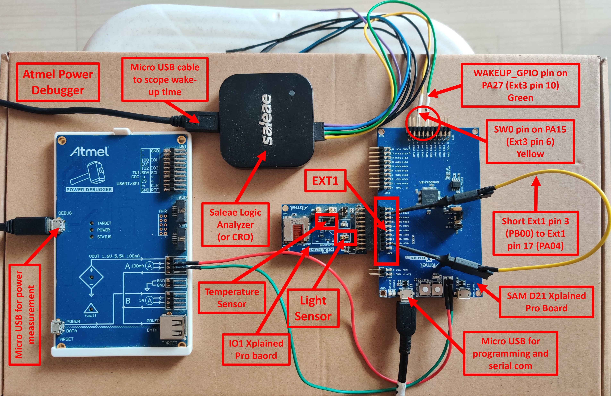

  **Note:** Make sure to keep the complete hardware setup or the light sensor on the I/O1 Xplained Pro board under proper lighting when testing the application, this will help to wake-up the device when you keep the hand on the light sensor.

## Programming hex file:
The pre-built hex file can be programmed by following the below steps

### Steps to program the hex file
- Open MPLAB X IDE
- Close all existing projects in IDE, if any project is opened
- Go to File -> Import -> Hex/ELF File
- In the "Import Image File" window, Step 1 - Create Prebuilt Project, click the "Browse" button to select the prebuilt hex file.
- Select Device has "ATSAMD21J18A"
- Ensure "SAM D21 Xplained Pro" is selected as hardware tool to program/debug the application
- Click on "Next" button
- In the "Import Image File" window, Step 2 - Select Project Name and Folder, select appropriate project name and folder
- Click on "Finish" button
- In MPLAB X IDE, click on "Make and Program Device" Button. The device gets programmed in sometime.
- Follow the steps in "Running the Demo" section below

## Programming/Debugging Application Project:
- Open the project (samd21_low_power\firmware\sam_d21_xpro.X) in MPLAB X IDE.
- Ensure "SAM D21 Xplained Pro" is selected as hardware tool to program/debug the application
- Build the code and program the device by clicking on the "Make and Program Device" button in MPLAB X IDE tool bar
- Follow the steps in "Running the Demo" section below.  

## Running the Demo:
- Open Tera Term, connect to serial console. If there is any connection issue on tera terminal, unplug the USB cable
connected to Micro-B port, and reconnect it back.
- Change the baud rate to 4800
- Perform reset by pressing the "RESET" switch
- Verify the application displayed the Measurement Menu along with application  
  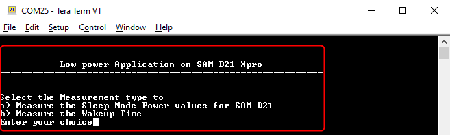  

- Select the Power Measurement Mode by entering option **'a'**.  
  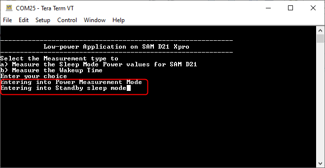  

- Cover the light sensor on the IO Xplained Pro board (by placing your hand over it) to print the temperature on the terminal and remove the hand. Repeat this step to print the temperature on the terminal.  
  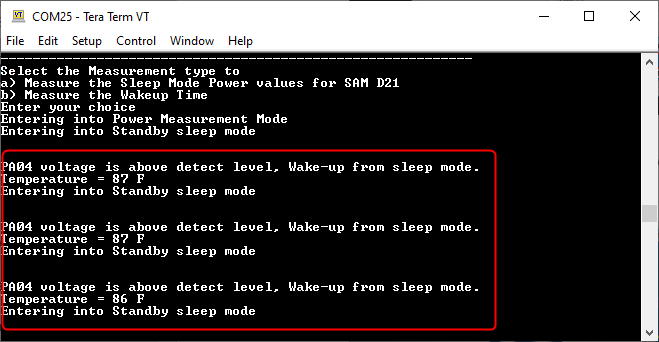  

  You should see the temperature values (in °F) getting printed on the terminal when the light sensor is covered, as shown above.

- Observe Current Consumption on Data Visualizer  
  **Note**: The Data Visualizer is a program to process and visualize data. The Data Visualizer can receive data from various sources such as the Embedded Debugger Data Gateway Interface (EDBG DGI) and COM ports. It is possible to track an application in run-time using a terminal graph or oscilloscope. It analyzes the power consumption of an application through correlation of code execution and power consumption when used together with a supported probe or board.  
  **Note**: Before start measuring the power consumption, power on reset the device and select the Power Measurement Mode by entering option **'a'** on the Serial terminal.

- Open the **Data Visualizer** application from your PC and select the connected **Power Debugger Data Gateway** board on the **DGI Control Panel**, then click on **Connect**. The Data Visualizer will then start searching for protocols from the Power Debugger board.

  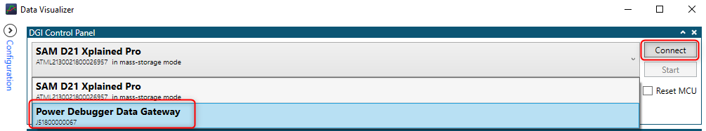  

- Once the Data Visualizer is connected to the Power Debugger, different interfaces will appear. Select the **Power** interface and click on the **Start** button to start measuring the power consumption of the device.

  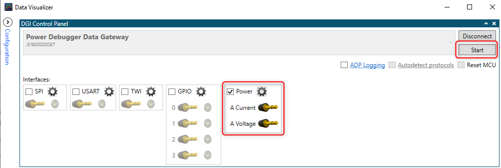  

- Ensure that the hardware setup connected as mentioned in the Setup section.  
  **Note:** The **Power Analysis** window will appear on the Data Visualizer tool interface.

  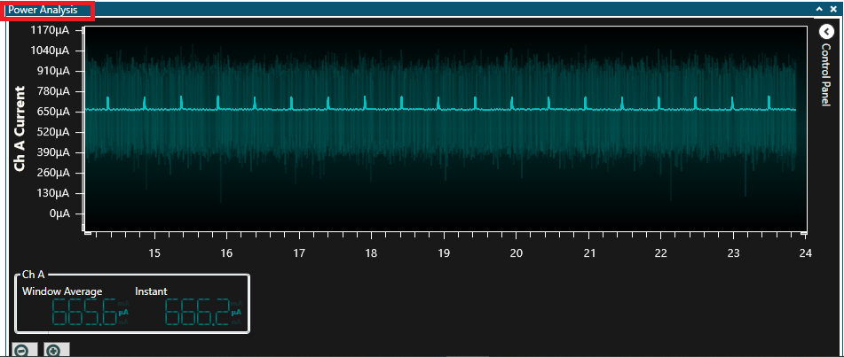  

- The image below shows the device in Standby mode with its measured power consumption. You can observe small peaks that illustrate the 500 milliseconds Real-Time Clock (RTC) timer expiry.  
  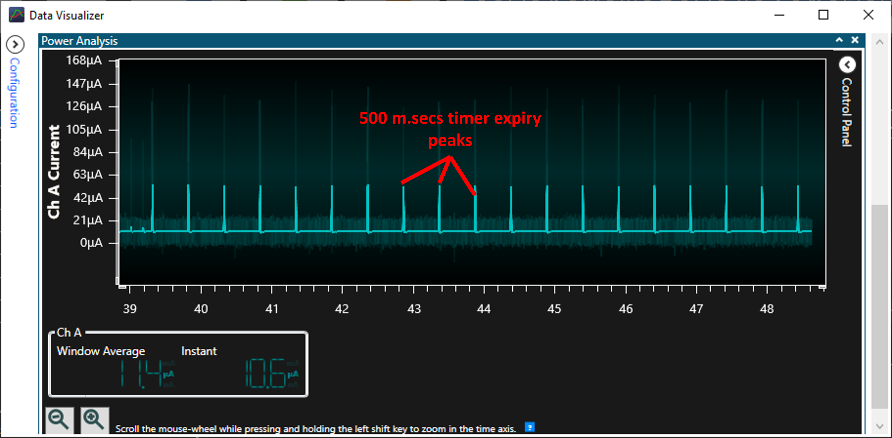  

  **Note:** The average value is considered when measuring the power consumption of the device because the instant value is not stable. Then, the power consumption of the device in Standby mode is 11.4 µA.

- Cover the light sensor on the I/O Xplained Pro board by placing your hand over it (or another element) to print the temperature on the terminal and observe the power consumption of the device.  
  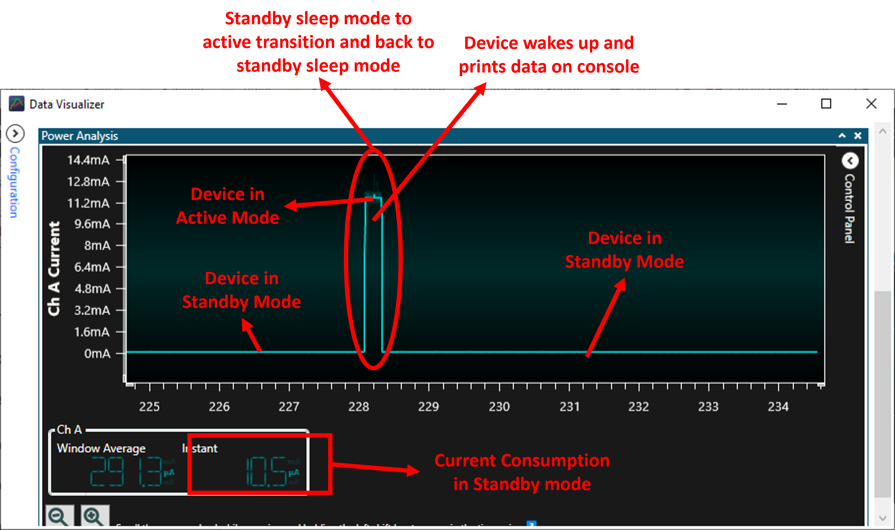  

  **Note:** The power consumption of the device in Active mode is 11.3 mA and the power consumption of the same device in Standby mode is 10.5 µA. This shows the device in Standby mode will consume less power.  
  The message printed on serial terminal when you have done this step.
  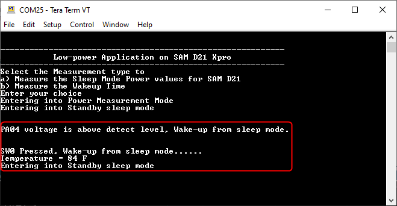  

- Press the **SW0** button to switch from Standby mode to Idle mode. The following image shows the transition of the power consumption from Standby Sleep mode to Idle Sleep mode.  
  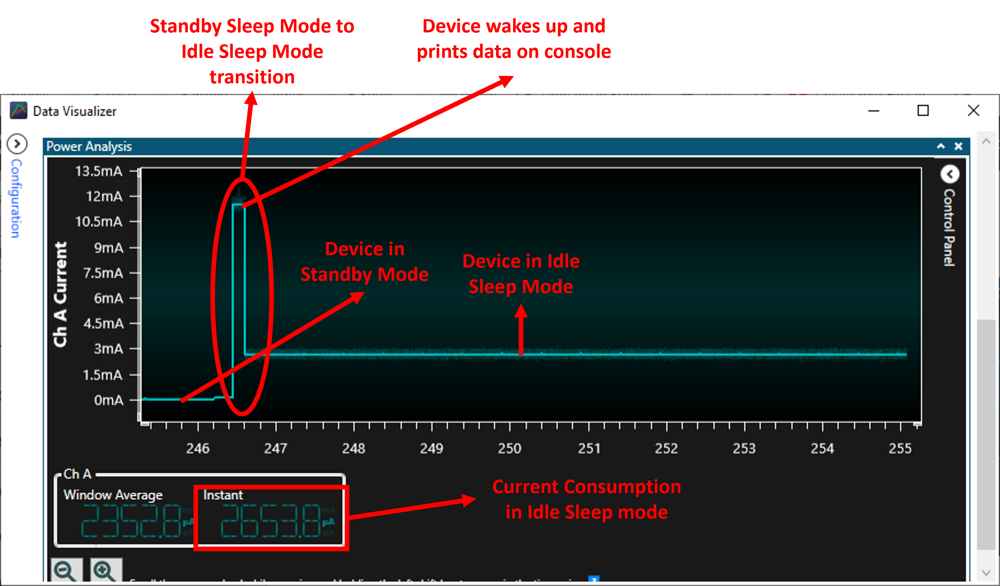  

  The power consumption of the device in Standby Sleep mode is in uA and the power consumption of the same device in Idle Sleep mode is ~2.7 mA. This shows the device in Idle Sleep mode will consume little higher power than Standby Sleep mode.  
  The message printed on serial terminal when you have done this step.
  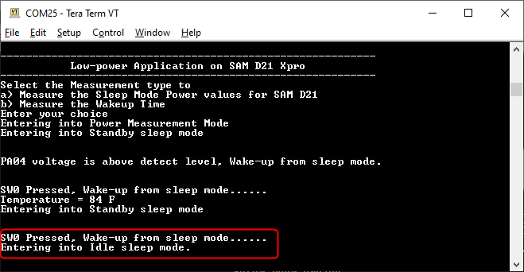  

- Place your hand nearer to the light sensor. Device wakes up, reads and prints temperature value on serial console, and re-enters the Standby mode. The following image shows the transition power consumption values from Idle to Standby mode.  
  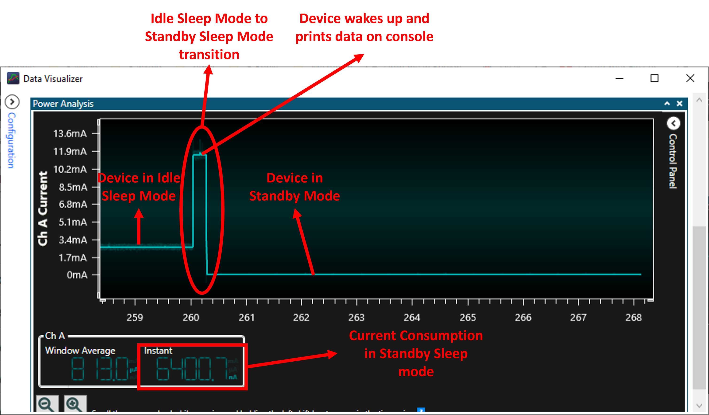  

  The message printed on serial terminal when you have done this step.
  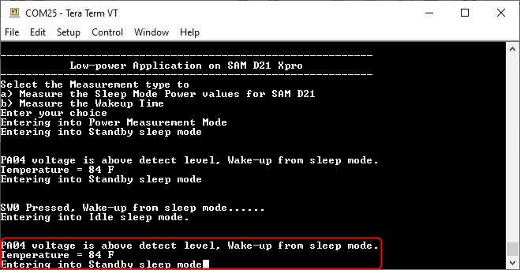  

  The following image shows the device in Idle mode with a measured power consumption of 2680 µA.  
  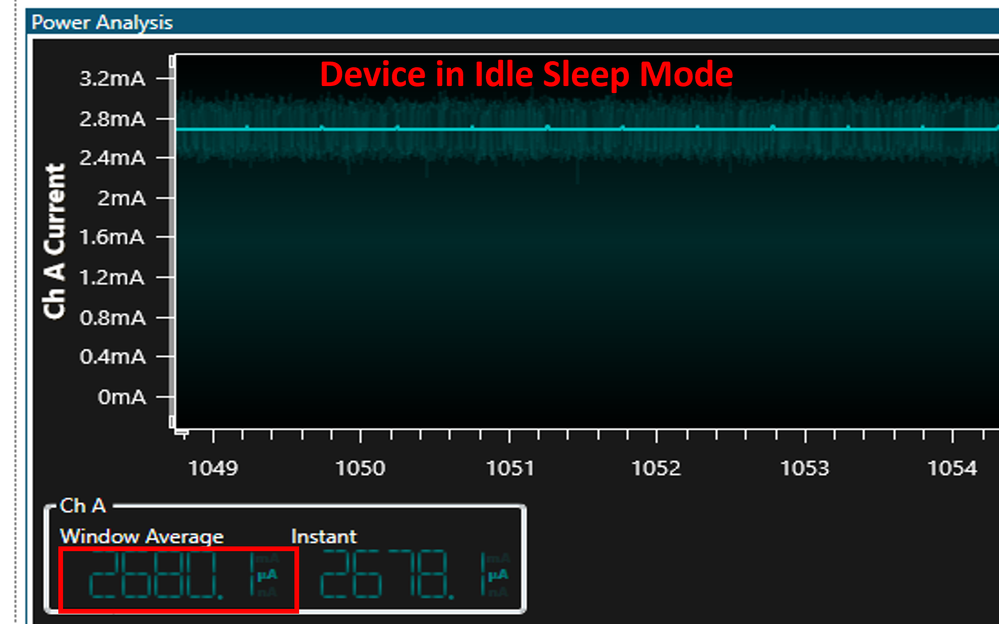  

- You can observe that the small peaks coming from RTC timer expiry disappeared because the power consumption in Idle mode is higher than the power required to start AC conversion.  

  **Note** that the above results highlight the power consumption is lower in Standby mode than in Idle mode.

- Wake-up Time Measurement Using Logic Analyzer/ Cathode-Ray Oscilloscope (CRO)  
To demonstrate the CPU wake up time, switch SW0 is configured to generate an interrupt. A General Purpose Input/Output (GPIO) is toggled in the Interrupt Service Routine (ISR) of the switch press event. The MCU comes out of Sleep mode when an interrupt occurs (in this case, the switch press interrupt). The time between the switch press and the GPIO toggle in the ISR is the wake-up time.

  Before start measuring the Wake-up Time, power on reset the device and select the Wake-up Time Measurement Mode by entering option **'b'** on the Serial terminal.
- Connect your logic analyzer or your CRO to the board as mentioned in the Setup section.

- Now, press the **SW0** switch and capture the signals to measure the wake-up time from Standby Sleep to Active.  
  The following image shows the wake-up time for the device Standby Sleep mode to Active Mode:  
    

  The message printed on serial terminal when you have done this step.
  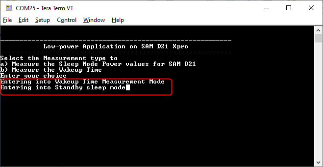  

- Press the **SW0** switch and capture the signals to measure the wake-up time from Idle Sleep to Active.  
  The following image shows the wake-up time for the device Idle Sleep mode to Active Mode:  

  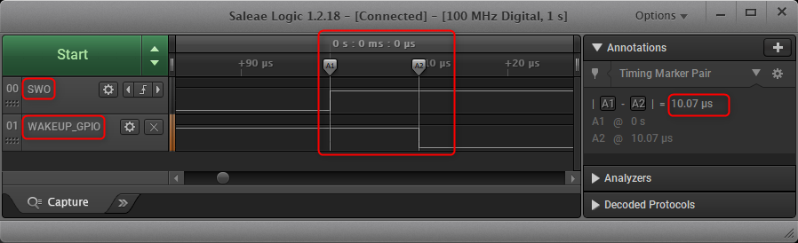  

  The message printed on serial terminal when you have done this step.
  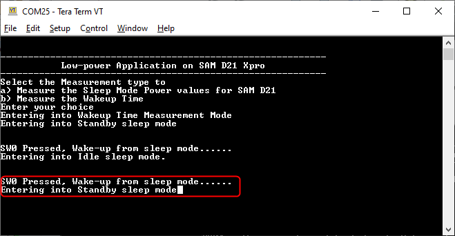  

- When you repeat the switch SW0 pressing, the device sleep state will switch between Standby to Idle and Idle to Standby, the message printed on serial terminal when you have done this step.  
  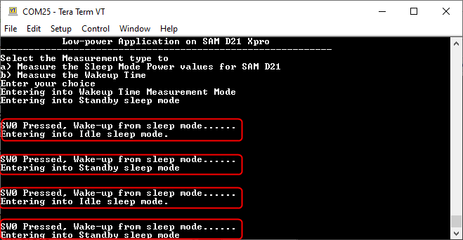  

- By observing the outputs, you can conclude that the wake-up time is greater in Standby mode than in Idle mode.

## Comments:
- Reference Training Module:  
	1. [Getting Started with Harmony v3 Drivers on SAM D21 MCUs Using FreeRTOS](https://microchipdeveloper.com/harmony3:samd21-getting-started-tm-drivers-freertos)
	2. [Low Power Application on SAM D21 (Arm® Cortex® M4) MCUs Using MPLAB® Harmony v3 Peripheral Libraries](https://microchipdeveloper.com/harmony3:low-power-application-on-sam-d21)
- This application demo builds and works out of box by following the instructions above in "Running the Demo" section. If you need to enhance/customize this application demo, you need to use the MPLAB Harmony v3 Software framework. Refer links below to setup and build your applications using MPLAB Harmony.
	- [How to Setup MPLAB Harmony v3 Software Development Framework](https://www.microchip.com/mymicrochip/filehandler.aspx?ddocname=en1000821)
	- [How to Build an Application by Adding a New PLIB, Driver, or Middleware to an Existing MPLAB Harmony v3 Project](http://ww1.microchip.com/downloads/en/DeviceDoc/How_to_Build_Application_Adding_PLIB_%20Driver_or_Middleware%20_to_MPLAB_Harmony_v3Project_DS90003253A.pdf)  

## Revision:
- v1.4.0 - Released demo application
