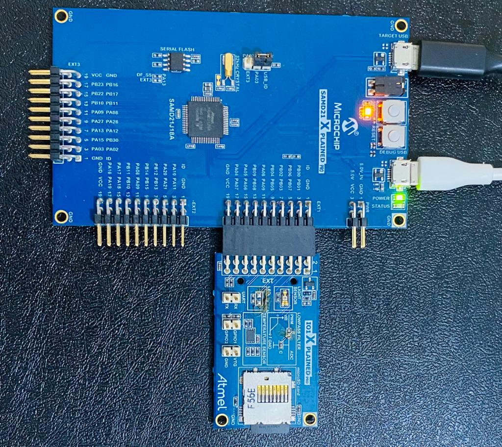
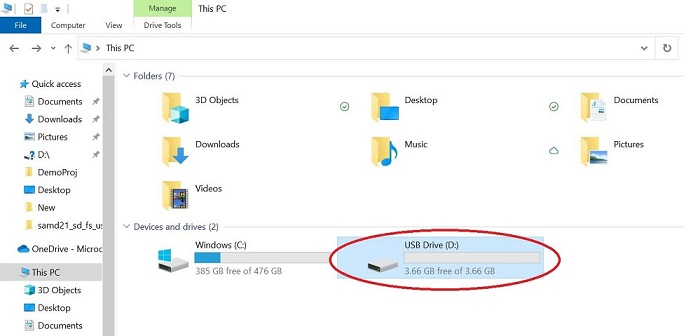
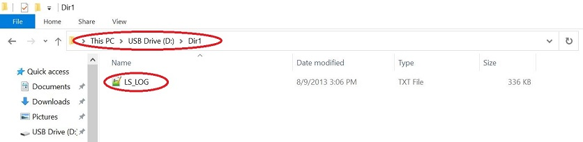

# SD Card, USB Data Logger Application on SAM D21 Xplained Pro Evaluation Kit
<h2 align="center"> <a href="https://github.com/Microchip-MPLAB-Harmony/reference_apps/releases/latest/download/samd21_sdcard_usb_datalogger.zip" > Download </a> </h2>

## Description

This application shows an example of using the MPLAB Harmony v3 File System to store the sensor data (light intensity values) into a SD card using the SDSPI and a SPI driver. The SD card is also enumerated as a MSD(Mass Storage Device) device on the PC(USB Host) enabling logged data viewing.

The SDSPI driver uses an instance of the SPI driver to communicate to the SD card over the SPI bus. The application creates a directory named **Dir1** in the root directory and creates a new file named LS_LOG.txt. The application writes the light sensor values into this newly created file when the user presses the switch button SW0. The logged light intensity values are read via USB with the SD card enumerated as an MSD(Mass Storage Device).

## Modules/Technology Used:
- Peripheral Modules  
	- Timer
	- DMAC
	- ADC
  - PORTS
  - EVENT SYSTEM
  - SERCOM (USART)
  - SERCOM (SPI)
  - RTC
- Drivers
	- SDSPI Driver
  - USB Driver
  - SPI Driver
- Libraries  
  - USB MSD Library
  - File System Library
  - Debug System service Library
  - STDIO Library

## Hardware Used:
- [SAM D21 Xplained Pro Evaluation Kit](https://www.microchip.com/developmenttools/ProductDetails/atsamd21-xpro)
- [I/O1 Xplained Pro Extension Kit](https://www.microchip.com/Developmenttools/ProductDetails/ATIO1-XPRO)
- Micro-SD card formatted to FAT filesystem.

## Software/Tools Used:
 This project has been verified to work with the following versions of software tools:  

Refer [Project Manifest](./firmware/src/config/sam_d21_xpro/harmony-manifest-success.yml) present in harmony-manifest-success.yml under the project folder *firmware/src/config/sam_d21_xpro*  
- Refer the [Release Notes](../../../release_notes.md#development-tools) to know the **MPLAB X IDE** and **MHC/MCC** Plugin version.  
- Any Serial Terminal application like Tera Term terminal application.

 Because Microchip regularly update tools, occasionally issue(s) could be discovered while using the newer versions of the tools. If the project doesn’t seem to work and version incompatibility is suspected, It is recommended to double-check and use the same versions that the project was tested with.  To download original version of MPLAB Harmony v3 packages, refer to document [How to Use the MPLAB Harmony v3 Project Manifest Feature](https://microchip.com/DS90003305)

## Setup:
- Verify that the temperature sensor (I/O1 Xplained Pro Extension Kit) is connected to Extension Header 1 (EXT1) on the SAM D21 Xplained Pro Evaluation Kit		
- Insert microSD card on to the [I/O1 Xplained Pro Extension Kit](https://www.microchip.com/developmenttools/ProductDetails/ATIO1-XPRO)  
- The SAM D21 Xplained Pro Evaluation Kit allows using the Embedded Debugger (EDBG) for debugging. Connect the Type-A male to micro-B USB cable to micro-B DEBUG USB port to power and debug the SAM D21 Xplained Pro Evaluation Kit

	

## Programming hex file:
The pre-built hex file can be programmed by following the below steps

### Steps to program the hex file
- Open MPLAB X IDE
- Close all existing projects in IDE, if any project is opened.
- Go to File -> Import -> Hex/ELF File
- In the "Import Image File" window, Step 1 - Create Prebuilt Project, click the "Browse" button to select the prebuilt hex file.
- Select Device has "ATSAMD21J18A"
- Ensure the proper tool is selected under "Hardware Tool"
- Click on "Next" button
- In the "Import Image File" window, Step 2 - Select Project Name and Folder, select appropriate project name and folder
- Click on "Finish" button
- In MPLAB X IDE, click on "Make and Program Device" Button. The device gets programmed in sometime.
- Follow the steps in "Running the Demo" section below

## Programming/Debugging Application Project:
- Open the project (samd21_sdcard_usb_datalogger/firmware/sam_d21_xpro.X) in MPLAB X IDE
- Ensure "EDBG" is selected as hardware tool to program/debug the application
- Build the code and program the device by clicking on the "make and program" button in MPLAB X IDE tool bar
- Follow the steps in "Running the Demo" section below

## Running the Demo:

1. Press the switch button SW0 to log light intensity values from the light sensor into the SD card.

2. To read the logged light intensity values, connect the Target USB port on the board to the computer using a micro USB cable.

3. LED0 is illuminated when SD card is enumerated as a Mass Storage Device by the USB host.(see below image)
	

4. Access the LS_LOG.txt via USB inside the Dir1 folder.(see below image)
	

5. The sample log file looks as below.
	

## Comments:
- Reference Training Module:
	- [Getting Started with Harmony v3 Peripheral Libraries on SAM D21 MCUs](https://microchipdeveloper.com/harmony3:samd21-getting-started-training-module)
	- [Getting Started with Harmony v3 Drivers on SAM D21 MCUs Using FreeRTOS](https://microchipdeveloper.com/harmony3:samd21-getting-started-tm-drivers-freertos)  
- This application demo builds and works out of box by following the instructions above in "Running the Demo" section. If you need to enhance/customize this application demo, you need to use the MPLAB Harmony v3 Software framework. Refer links below to setup and build your applications using MPLAB Harmony.
	- [How to Setup MPLAB Harmony v3 Software Development Framework](https://www.microchip.com/mymicrochip/filehandler.aspx?ddocname=en1000821)
	- [How to Build an Application by Adding a New PLIB, Driver, or Middleware to an Existing MPLAB Harmony v3 Project](http://ww1.microchip.com/downloads/en/DeviceDoc/How_to_Build_Application_Adding_PLIB_%20Driver_or_Middleware%20_to_MPLAB_Harmony_v3Project_DS90003253A.pdf)  

## Revision:
- v1.4.0 - Released demo application
