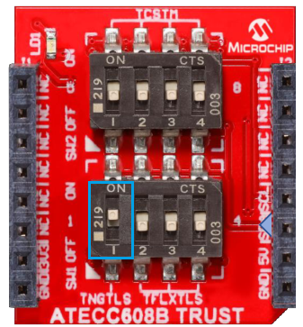
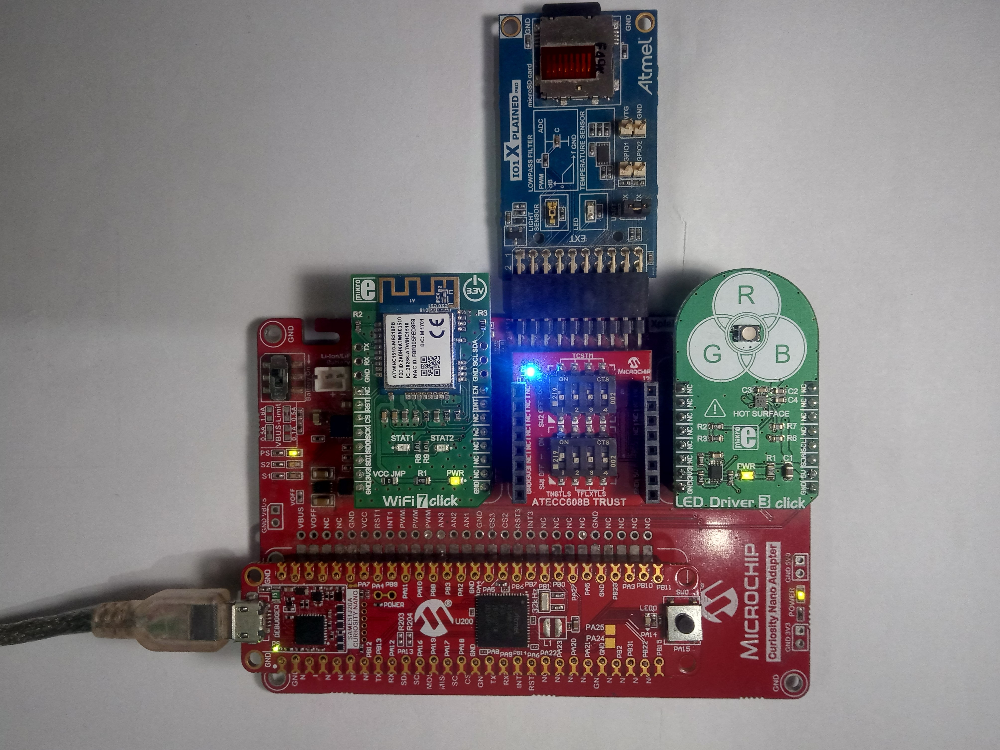
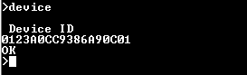
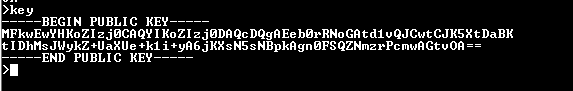
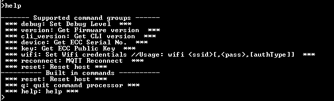
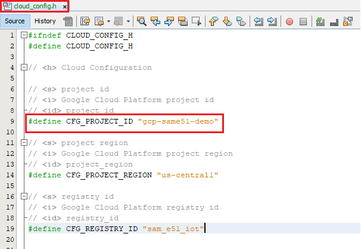

# Google Cloud IoT Core Application on SAM E51 Curiosity Nano Evaluation Kit
<h2 align="center"> <a href="https://github.com/Microchip-MPLAB-Harmony/reference_apps/releases/latest/download/same51n_google_cloud_iot_core.zip" > Download </a> </h2>

-----

## Description:

> This application demonstrates the implementation of an IoT sensor node on the Google cloud platform.
The demo is developed on the SAM E51 Curiosity Nano Evaluation Kit connected with Curiosity Nano Base.
The SAM E51 Curiosity Nano Evaluation Kit is based on SAM E51 microcontroller, is a small and easily expandable demonstration and development platform for applications.

> Typical IoT application development problem can be partitioned into three blocks:  
	-	Smart (Application logic): Implemented through the ATSAME51 microcontroller  
	-	Security: Implemented through the ATECC608 secure element  
	-	Connectivity: Implemented through the ATWINC1510 WiFi controller module

>This application utilizes Mikroelektronika click interface and Microchip XPRO interfaces available on Curiosity Nano base to create a Google IoT node application. The application demonstrates MQTT data transfer of light and temperature sensor data to Google IoT cloud.

> Below is the Index of topics in this document.  

- [Modules/Technology Used](#Modules_Technology_Used)  
- [ATWINC1510 Firmware upgrade and Google Cloud IoT Provisioning Guide](#WINC_Firmware_upgrade_and_Google_Cloud_IoT_Provisioning_Guide)  
- [Hardware Used](#Hardware_Used)  
- [Software/Tools Used](#Software_Tools_Used)  
- [Setup](#Setup)  
- [Programming hex file](#Programming_hex_file)  
- [Programming/Debugging Application Project](#Programming_Debugging_Application_Project)  
- [Running the Demo](#Running_the_Demo)  
	- [WiFi configuration process](#WiFi_configuration_process)  
	- [Reading Device signature](#Reading_Device_signature)  
	- [Google IoT Core Account Setup Guide](#Google_IoT_Core_Account_Setup_Guide)  
	- [Instructions to add your device to Google cloud registry](#Instructions_to_add_your_device_to_Google_cloud_registry)  
	- [Fetching data from Google Cloud and displaying on UI](#Fetching_data_from_Google_Cloud_and_displaying_on_UI)  
- [Comments](#Comments)  
- [Revision](#Revision)

## 
## Modules/Technology Used:

- Peripheral Modules
	- ADC
	- Trust&Go
	- ATECC608
	- COMMAND
	- CONSOLE
	- Core
	- EIC
	- RTC
	- SysTick
	-  SPI
	-  USART
	-  I2C
	- Timer
	- WINC

## 
## ATWINC1510 Firmware upgrade and Google Cloud IoT Provisioning (Root certificate upgrade) Guide
 [Refer the documentation in utilities  folder](./utilities/readme.md)   
 **If this is the first time you are building/running this version of the demo, you must complete this step before proceeding further. Otherwise, you may skip this step.** 

## 
## Hardware Used:

  - [SAM E51 Curiosity Nano Evaluation Kit](https://www.microchip.com/DevelopmentTools/ProductDetails/PartNO/EV76S68A)
  - [Curiosity Nano Base for Click Boards](https://www.microchip.com/Developmenttools/ProductDetails/AC164162)
  - [I/O1 Xplained Pro Extension Kit](https://www.microchip.com/Developmenttools/ProductDetails/ATIO1-XPRO)
  - [WIFI 7 CLICK](https://www.mikroe.com/wifi-7-click)
  - [ATECC608B Trust](https://www.microchip.com/developmenttools/ProductDetails/DT100104)
  - [LED DRIVER 3 CLICK](https://www.mikroe.com/led-driver-3-click)

## 
## Software/Tools Used:
 This project has been verified to work with the following versions of software tools:  

Refer [Project Manifest](./firmware/src/config/default/harmony-manifest-success.yml) present in harmony-manifest-success.yml under the project folder *firmware/src/config/default*  
- Refer the [Release Notes](../../../release_notes.md#development-tools) to know the **MPLAB X IDE** and **MHC/MCC** Plugin version.  

 Because Microchip regularly update tools, occasionally issue(s) could be discovered while using the newer versions of the tools. If the project doesn’t seem to work and version incompatibility is suspected, It is recommended to double-check and use the same versions that the project was tested with.  To download original version of MPLAB Harmony v3 packages, refer to document [How to Use the MPLAB Harmony v3 Project Manifest Feature](https://microchip.com/DS90003305)

## 
## Setup:
- Mount SAM E51 Curiosity Nano Evaluation Kit on "CNANO56_HOST_CONN"(U3) connector of Curiosity Nano Base board
- Mount WiFi 7 Click board on mikroBUS  click 1 connector of Curiosity Nano Base board
- Mount ATECC608B TRUST add on board on the mikroBUS  click 2 connector of Curiosity Nano Base board
- Slide the DIP SW1 of 1 on  ATECC608B TRUST add on board to the ON state to enable the device selection  
	
- Mount LED Driver 3 Click board on mikroBUS click 3 connector of Curiosity Nano Base board
- Connect the I/O1 Xplained Pro extension kit to the Extension Header 1 (EXT1) connector of Curiosity Nano Base board
- Connect a USB cable to the DEBUG USB port for programming  

## 
## Programming hex file:
The pre-built hex file can be programmed by following the below steps

### Steps to program the hex file
- Open MPLAB X IDE
- Close all existing projects in IDE, if any project is opened
- Go to File -> Import -> Hex/ELF File
- In the "Import Image File" window, Step 1 - Create Prebuilt Project, click the "Browse" button to select the prebuilt hex file.
- Select Device has "ATSAME51J20A"
- Ensure the proper tool is selected under "Hardware Tool"
- Click on "Next" button
- In the "Import Image File" window, Step 2 - Select Project Name and Folder, select appropriate project name and folder
- Click on "Finish" button
- In MPLAB X IDE, click on "Make and Program Device" Button. The device gets programmed in sometime.
- Follow the steps in "Running the Demo" section below

## 
## Programming/Debugging Application Project:
- Open the project (same51n_google_cloud_iot_core/firmware/sam_e51_cnano.X) in MPLAB X IDE.
- Ensure "PKOB nano" is selected as hardware tool to program/debug the application.
- Build the code and program the device by clicking on the "make and program" button in MPLAB X IDE tool bar.
- Follow the steps in "Running the Demo" section below.  

## 
## Running the Demo

  
<h3> 1. WiFi configuration process	 </h3>
<h4> WiFi configuration through Command Line Interface(CLI) </h4>  

- Open a serial terminal application on a host PC for the virtual COM port of the connected SAM E51 Curiosity Evaluation Kit, with 9600-8-None-1 settings.  
- Enter the below command to set the WiFi credentials.  
		wifi <SSID>,<PASSWORD>,<SECURITY TYPE>
    - SSID : WIFI Name
    - PASSWORD : WIFI PASSWORD
    - SECURITY TYPE : (1 or 2 or 3)
     	- OPEN         ------ (1)
     	- WPA/WPA2     ------ (2)
     	- WEP          ------ (3)

**Note** : No need of repeating this step every time while running the demo, Device remembers last used WiFi credentials and try to connect to it. If WiFi credentials changes, this step should be performed.			

<h3> 2. Reading Device signature </h3>
<h4> This device signature will be used to register the device with a Google cloud account </h4>

- Make sure serial terminal application is running
- Enter the below command to read the device serial number 
		device  
       
- Enter the below command to read the device's ECC public key 
  	key  
	  

  **Note** : Type "help" to see full command list  
  

<h3> 3. Google IoT Core Account Setup Guide </h3>

- Log into the [console](https://console.cloud.google.com/start?tutorial=iot_core_quickstart)
- Use your personal Gmail account to log in. Select “Try for free”.  
  **Note** : If you do not have a Gmail account, create a new email account from [HERE](https://accounts.google.com/signup/v2/webcreateaccount?hl=en&flowName=GlifWebSignIn&flowEntry=SignUp)
- Create a new Google cloud project by clicking the **Select a project** option
  
- Click on **NEW PROJECT**  
  
- Enter a Project name as **gcp-same51-demo**  
- Select organization (if available) or "No organization"  

- Once the project is created, the home page looks like below.  
  
**Note** : This Project Id is user unique identifier. It is defined in the cloud_config.h file, this helps to send the data to particular GCP account  
   
- In the search bar, type “billing” to get to the billing page. Click **Link a billing account** to add the credit card information. Follow the prompts to complete the billing information. Once it is completed you can use the free trail version available
**Note** : Credit card is mandatory to complete the bill section  
  

- In the search bar type “Pub/Sub API” and click on “Enable API”.  
 
- Enter “Google Cloud IoT API” in the search bar. Once you select it, click Enable  

- In the navigation pane, select Pub/Sub -> Topics as shown in the below figure  

- Click **Create Topic**  

- Enter the name of topic as “events” and click “Create Topic”  

- Click on "Subscriptions" and click on "CREATE SUBSCRIPTION"  

- Enter the "subscription ID" as **example** and select a "Cloud Pub/Sub topic" as below and click on **CREATE**
   
- In the navigation pane, select **IoT Core**  

- Click on "CREATE REGISTRY"  

- Enter details as shown below and click on "Create a Registry"  
  
- Search for “IAM and admin” -> service accounts  

- Click on "CREATE SERVICE ACCOUNT"  
  
- Enter the details as shown below and click on "CREATE"  
  

- Select the roles as shown below  
    
- Click on "CONTINUE"  

- Select the created demo class from service accounts  

- Navigate to "KEYS" tab  
    
- Select "ADD KEY" and "Create new key"  
   
- Select "JSON" and click on "CREATE"  

- A JSON file will be downloaded, Rename it to "example.json", copy and paste into scripts folder of same51n_google_cloud_iot_core project

**Note** : Creating a Google could account and adding registry to it is one time process

<h3> 4. Instructions to add your device to Google cloud registry </h3>
- In Google cloud search bar, search for IOT core and select the "sam_e51_iot" registry which was created earlier
 
- Select "Devices" and click on "CREATE A DEVICE"  

- Enter the device serial number starting with 'd' as shown below and click on create
 
- Add the public key read from the device in command prompt as shown below
 
- You have successfully added device into Registry of google cloud

**Note** : Following above steps, you can add more devices

Fetching_data_from_Google_Cloud_and_displaying_on_UI
<h3> 5. Fetching data from Google Cloud and displaying on UI </h3>
- If the WiFi network is active, then the SAME51 Curiosity Nano Evaluation kit establishes connectivity with the WiFi network and securely connects to the Google IoT cloud.
- After successful connection, the SAME51 Curiosity Nano Evaluation kit pushes the real time light and temperature sensors data to the cloud.
- Open command prompt on your PC
- Navigate to **scripts** folder and type below command 
        python gcp_gui.py --creds example.json example
- A UI opens and starts displaying light and temperature values fetching from google cloud with serial number of the particular device
 

## Comments:
- This application demo builds and works out of box by following the instructions above in "Running the Demo" section. If you need to enhance/customize this application demo, you need to use the MPLAB Harmony v3 Software framework. Refer links below to setup and build your applications using MPLAB Harmony.
	- [How to Setup MPLAB Harmony v3 Software Development Framework](https://www.microchip.com/mymicrochip/filehandler.aspx?ddocname=en1000821)
	- [How to Build an Application by Adding a New PLIB, Driver, or Middleware to an Existing MPLAB Harmony v3 Project](http://ww1.microchip.com/downloads/en/DeviceDoc/How_to_Build_Application_Adding_PLIB_%20Driver_or_Middleware%20_to_MPLAB_Harmony_v3Project_DS90003253A.pdf)  

### Revision:
- v1.3.0 released demo application
