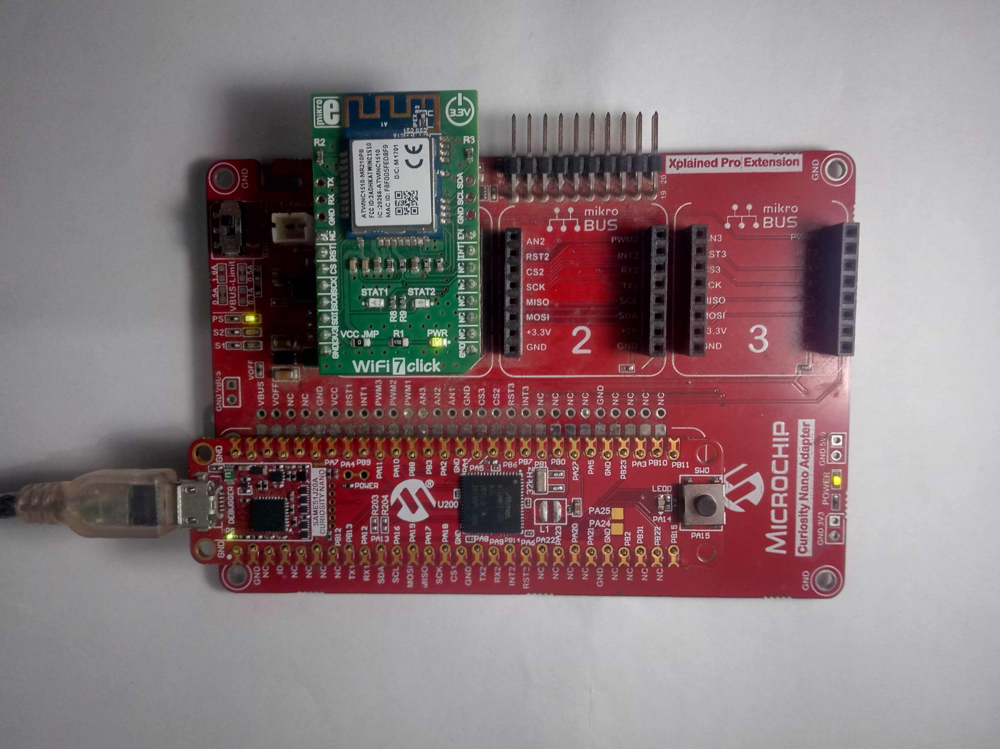

# Serial Bridge Application to upgrade ATWINC1510 Firmware and Google Cloud IoT Provisioning

## Description:

> This application acts as a serial bridge between the PC utility (gcp_iot_winc_provisioning) and the ATWINC1510 module on WiFi 7 click board.
The application interfaces with the PC over UART and with the WiFi 7 click (ATWINC1510 module) board over the SPI lines.  

> The application receives the ATWINC1510 firmware and Google cloud root certificate bundle from the PC, and programs it into the ATWINC1510 module (on WiFi 7 click board).  

## Modules/Technology Used:

## Hardware Used:
  - [SAM E51 Curiosity Nano Evaluation Kit](https://www.microchip.com/DevelopmentTools/ProductDetails/PartNO/EV76S68A)
  - [Curiosity Nano Base for Click Boards](https://www.microchip.com/Developmenttools/ProductDetails/AC164162)
  - [WIFI 7 CLICK](https://www.mikroe.com/wifi-7-click)

## Software/Tools Used:
 *This project has been verified to work with the following versions of software tools:*  

 - [MPLAB X IDE v5.50](https://www.microchip.com/mplab/mplab-x-ide)  
 - [MPLAB XC32 Compiler v3.0](https://www.microchip.com/mplab/compilers)

  *Because Microchip regularly update tools, occasionally issue(s) could be discovered while using the newer versions of the tools. If the project doesn’t seem to work and version incompatibility is suspected, It is recommended to double-check and use the same versions that the project was tested with.*   

## Setup:
- Mount SAM E51 Curiosity Nano Evaluation Kit on "CNANO56_HOST_CONN"(U3) connector of Curiosity Nano Base board
- Mount WiFi 7 Click board on mikroBUS click 1 connector of Curiosity Nano Base board
- Connect a USB cable to the DEBUG USB port for programming  

## Programming hex file:
The pre-built hex file can be programmed by following the below steps

### Steps to program the hex file
- Open MPLAB X IDE
- Close all existing projects in IDE, if any project is opened
- Go to File -> Import -> Hex/ELF File
- In the "Import Image File" window, Step 1 - Create Prebuilt Project, click the "Browse" button to select the prebuilt hex file in "gcp_iot_provisioning_serial_bridge/hex" folder.
- Select Device has "ATSAME51J20A"
- Ensure the proper tool is selected under "Hardware Tool"
- Click on "Next" button
- In the "Import Image File" window, Step 2 - Select Project Name and Folder, select appropriate project name and folder
- Click on "Finish" button
- In MPLAB X IDE, click on "Make and Program Device" Button. The device gets programmed in sometime.
- Follow the steps in "Running the Demo" section below

## Running the Demo
- Ensure the board is powered on (a USB cable is connected to the DEBUG USB port)
- Refer the **"Running the Demo"** section in the documentation under utility/[readme](../readme.md) file

## Comments:
	- [How to Setup MPLAB Harmony v3 Software Development Framework](https://ww1.microchip.com/downloads/en/DeviceDoc/How_to_Setup_MPLAB_%20Harmony_v3_Software_Development_Framework_DS90003232C.pdf)
	- [How to Build an Application by Adding a New PLIB, Driver, or Middleware to an Existing MPLAB Harmony v3 Project](http://ww1.microchip.com/downloads/en/DeviceDoc/How_to_Build_Application_Adding_PLIB_%20Driver_or_Middleware%20_to_MPLAB_Harmony_v3Project_DS90003253A.pdf)  

### Revision:
- v1.5.0 Removed MHC support, Regenerated and tested application.
- v1.4.0 Tested demo application.
- v1.3.0 released demo application
