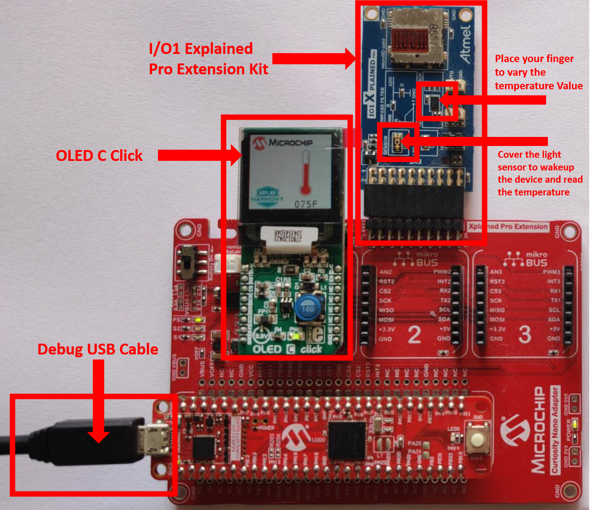
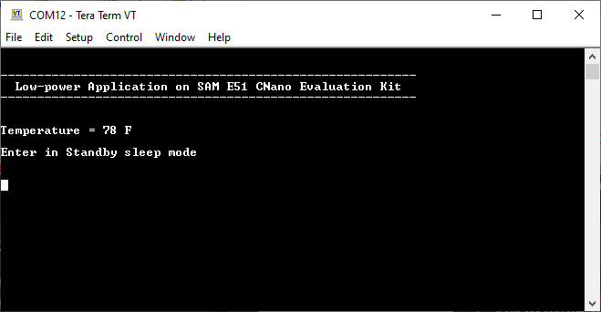
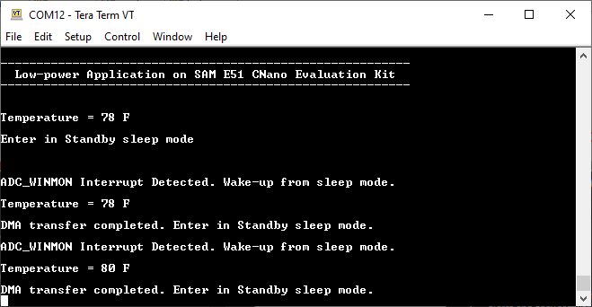
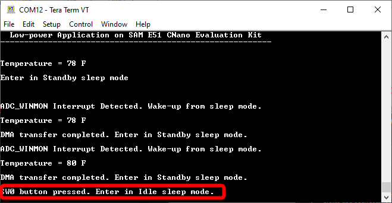
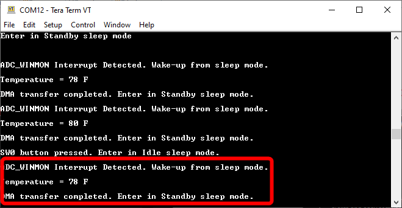

# Low Power Application on SAM E51 Curiosity Nano Evaluation Kit with OLED C click board for display using MPLAB Harmony Legato Graphics
-----
## Description

> In this application demonstration, the SAM E51 MCU is configured to operate in
  low power standby sleep mode on power-up. The device wakes up from standby mode
  and enters active mode when the user covers the light sensor (placing a hand over
  it, for example) on the I/O1 Xplained Pro extension kit.  

> When the light sensor is covered, the device reads the room temperature using
  temperature sensor on the I/O1 Xplained Pro extension kit and displays it on the
  OLED C Click display board. The application periodically prints room temperature
  on a serial terminal while the light sensor is covered.  

> The device goes back to standby mode when the user uncovers the light sensor.
  The temperature read is displayed on the OLED C Click and also on the serial console.
  LED0 in the SAM E51 Curiosity Nano Evaluation Kit is toggled every time the
  temperature is displayed on the OLED C Click. When the user presses the switch button SW0,
  the application switches Sleep mode from Standby to Idle mode.

## Modules/Technology Used:

- Peripheral Modules
	- I2C
	- RTC
	- USART
	- DMAC
	- ADC0
	- PM
	- SUPC
	- EIC
	- EVSYS
	- SPI
	- SysTick
	- Timer
	- Legato graphics
	- LE External controller

## Hardware Used:

- [SAM E51 Curiosity Nano Evaluation Kit](https://www.microchip.com/DevelopmentTools/ProductDetails/PartNO/EV76S68A)
- [Curiosity Nano Base for Click Boards](https://www.microchip.com/Developmenttools/ProductDetails/AC164162)
- [I/O1 Xplained Pro Extension Kit](https://www.microchip.com/Developmenttools/ProductDetails/ATIO1-XPRO)
- [OLED C Click](https://www.mikroe.com/oled-c-click)

## Software/Tools Used:
 *This project has been verified to work with the following versions of software tools:*  

- [MPLAB Harmony v3 "csp" repo v3.8.3](https://github.com/Microchip-MPLAB-Harmony/csp/releases/tag/v3.8.3)  
- [MPLAB Harmony v3 "core" repo v3.8.1](https://github.com/Microchip-MPLAB-Harmony/core/releases/tag/v3.8.1)  
- [MPLAB Harmony v3 "dev_packs" repo v3.8.0](https://github.com/Microchip-MPLAB-Harmony/dev_packs/releases/tag/v3.8.0)  
- [MPLAB Harmony v3 "mhc" repo v3.6.5](https://github.com/Microchip-MPLAB-Harmony/mhc/releases/tag/v3.6.5)  
- [MPLAB Harmony v3 "gfx" repository v3.9.0](https://github.com/Microchip-MPLAB-Harmony/gfx/releases/tag/v3.9.0)  
- MPLAB Harmony 3 Launcher Plugin v3.6.2  
- [MPLAB X IDE v5.45](https://www.microchip.com/mplab/mplab-x-ide)  
- [MPLAB XC32 Compiler v2.41](https://www.microchip.com/mplab/compilers)  
- Any Serial Terminal application like Tera Term terminal application.  

 *Because Microchip regularly update tools, occasionally issue(s) could be discovered while using the newer versions of the tools. If the project doesn’t seem to work and version incompatibility is suspected, It is recommended to double-check and use the same versions that the project was tested with.* 

## Setup:
- Mount SAM E51 Curiosity Nano Evaluation Kit on "CNANO56_HOST_CONN"(U3) connector of Curiosity Nano Base board
- Mount OLED C Click board on mikro bus click 1 connector of Curiosity Nano Base board
- Connect the I/O1 Xplained Pro extension kit to the Extension Header 1 (EXT1) connector of Curiosity Nano Base board
- Connect a USB cable to the DEBUG USB port for programming  

## Programming hex file:
The pre-built hex file can be programmed by following the below steps

### Steps to program the hex file
- Open MPLAB X IDE
- Close all existing projects in IDE, if any project is opened
- Go to File -> Import -> Hex/ELF File
- In the "Import Image File" window, Step 1 - Create Prebuilt Project, click the "Browse" button to select the prebuilt hex file.
- Select Device has "ATSAME51J20A"
- Ensure the proper tool is selected under "Hardware Tool"
- Click on "Next" button
- In the "Import Image File" window, Step 2 - Select Project Name and Folder, select appropriate project name and folder
- Click on "Finish" button
- In MPLAB X IDE, click on "Make and Program Device" Button. The device gets programmed in sometime.
- Follow the steps in "Running the Demo" section below

## Programming/Debugging Application Project:
- Open the project (same51n_low_power_with_oled_c_click\firmware\sam_e51_cnano.X) in MPLAB X IDE.
- Ensure "PKOB nano" is selected as hardware tool to program/debug the application.
- Build the code and program the device by clicking on the "make and program" button in MPLAB X IDE tool bar.
- Follow the steps in "Running the Demo" section below.  

## Running the Demo:
- Open Tera Term, connect to serial console. If there is any connection issue on tera terminal, unplug the USB cable
connected to Micro-B port, and reconnect it back.
- Change the baud rate to 115200
- After power up, the application displays the temperature on OLED C Click board
- Verify the application title message with the current temperature value displayed on Serial Console  

- Cover the light sensor on the I/O Xplained Pro board by placing your hand over it (or another element
  to put the light sensor in a dark environment) to print the temperature and message on the terminal.
  You should see the following messages (containing the temperature value in °F) on the terminal every
  500 milliseconds for the duration the light sensor is covered  

- Press the switch button SW0, the application switches Sleep mode from Standby mode to Idle mode.  

  Cover the light sensor on the I/O Xplained Pro board by placing your hand over it to wakeup and print the temperature and message on the terminal.  

**Note**:
- When the device reads the room temperature and prints it on the serial terminal, the temperature
  is also displayed on the OLED C Click board.  
- This application demo does not provide the power consumption values of SAM E51 MCU in standby or
  idle sleep mode. Interested users could refer "[Low Power Application on SAM E54 (Cortex M4) MCUs Using
  MPLAB Harmony v3 Peripheral Libraries](https://microchipdeveloper.com/harmony3:low-power-application-on-sam-e54)"
  for power consumption numbers presented for an MCU (SAM E54) of the same family as SAM E51.

## Comments:
- Reference Training Module: [Low Power Application on SAM E54 (Cortex M4) MCUs Using MPLAB Harmony v3 Peripheral Libraries](https://microchipdeveloper.com/harmony3:low-power-application-on-sam-e54)
- This application demo builds and works out of box by following the instructions above in "Running the Demo" section. If you need to enhance/customize this application demo, you need to use the MPLAB Harmony v3 Software framework. Refer links below to setup and build your applications using MPLAB Harmony.
	- [How to Setup MPLAB Harmony v3 Software Development Framework](https://www.microchip.com/mymicrochip/filehandler.aspx?ddocname=en1000821)
	- [How to Build an Application by Adding a New PLIB, Driver, or Middleware to an Existing MPLAB Harmony v3 Project](http://ww1.microchip.com/downloads/en/DeviceDoc/How_to_Build_Application_Adding_PLIB_%20Driver_or_Middleware%20_to_MPLAB_Harmony_v3Project_DS90003253A.pdf)  

## Revision:
- v1.2.0 - Released demo application
