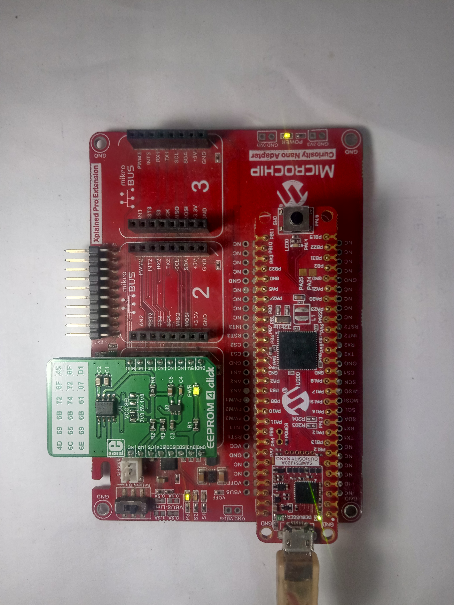
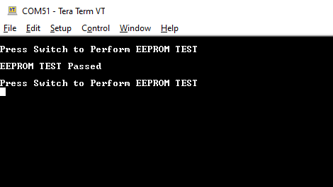
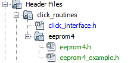
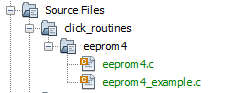
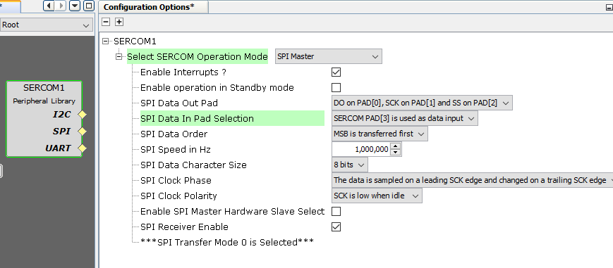
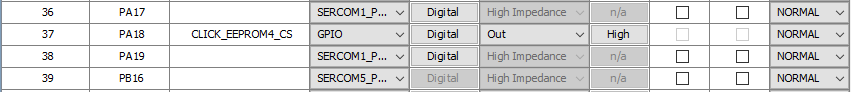
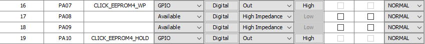
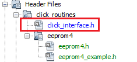
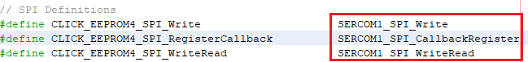

# EEPROM 4 Click example on SAM E51 Curiosity Nano Evaluation Kit
<h2 align="center"> <a href="https://github.com/Microchip-MPLAB-Harmony/reference_apps/releases/latest/download/eeprom4.zip" > Download </a> </h2>

-----
## Description:

> This example demonstrates writing and reading known data to EEPROM 4 memory location when the switch is pressed on SAM E51 Curiosity Nano Evaluation Kit. The data read is matched with written data and printed on a serial terminal when the EEPROM test is successful.

## Modules/Technology Used:
- Peripheral Modules
	- EIC
	- GPIO
	- SERCOM (SPI)
	- SERCOM (USART)

## Hardware Used:

- [SAM E51 Curiosity Nano Evaluation Kit](https://www.microchip.com/DevelopmentTools/ProductDetails/PartNO/EV76S68A)
- [Curiosity Nano Base for Click Boards](https://www.microchip.com/Developmenttools/ProductDetails/AC164162)
- [MikroElektronika EEPROM 4 Click](https://www.mikroe.com/eeprom-4-click)

## Software/Tools Used:
 This project has been verified to work with the following versions of software tools:  

Refer [Project Manifest](./firmware/src/config/default/harmony-manifest-success.yml) present in harmony-manifest-success.yml under the project folder *firmware/src/config/default*  
- Refer the [Release Notes](../../../../release_notes.md#development-tools) to know the **MPLAB X IDE** and **MCC** Plugin version. Alternatively, [Click Here](https://github.com/Microchip-MPLAB-Harmony/reference_apps/blob/master/release_notes.md#development-tools).
- Any Serial Terminal application like Tera Term terminal application.

 Because Microchip regularly update tools, occasionally issue(s) could be discovered while using the newer versions of the tools. If the project doesn’t seem to work and version incompatibility is suspected, It is recommended to double-check and use the same versions that the project was tested with.  To download original version of MPLAB Harmony v3 packages, refer to document [How to Use the MPLAB Harmony v3 Project Manifest Feature](https://ww1.microchip.com/downloads/en/DeviceDoc/How-to-Use-the-MPLAB-Harmony-v3-Project-Manifest-Feature-DS90003305.pdf)

## Setup:
- Mount SAM E51 Curiosity Nano Evaluation Kit on "CNANO56_HOST_CONN"(U3) connector of Curiosity Nano Base board
- Mount EEPROM 4 Click board on mikroBUS click 1 connector of Curiosity Nano Base board
- Connect the SAM E51 Curiosity Nano Evaluation Kit to the Host PC as a USB Device through a Type-A male to micro-B USB cable connected to Micro-B USB (Debug USB) port

  

## Programming hex file:
The pre-built hex file can be programmed by following the below steps.  

### Steps to program the hex file
- Open MPLAB X IDE
- Close all existing projects in IDE, if any project is opened.
- Go to File -> Import -> Hex/ELF File
- In the "Import Image File" window, Step 1 - Create Prebuilt Project, Click the "Browse" button to select the prebuilt hex file.
- Select Device has "ATSAME51J20A"
- Ensure the proper tool is selected under "Hardware Tool"
- Click on Next button
- In the "Import Image File" window, Step 2 - Select Project Name and Folder, select appropriate project name and folder
- Click on Finish button
- In MPLAB X IDE, click on "Make and Program Device" Button. The device gets programmed in sometime
- Follow the steps in "Running the Demo" section below

## Programming/Debugging Application Project:
- Open the project (eeprom4/firmware/sam_e51_cnano.X) in MPLAB X IDE
- Ensure "PKOB nano" is selected as hardware tool to program/debug the application
- Build the code and program the device by clicking on the "make and program" button in MPLAB X IDE tool bar
- Follow the steps in "Running the Demo" section below

## Running the Demo:
- Open the Tera Term terminal application on your PC (from the Windows® Start menu by pressing the Start button)
- Set the baud rate to 115200
- Press the switch SW0 on the SAM E51 Curiosity Nano Evaluation Kit to test the EEPROM 4 by writing and reading know data

	
- For every switch press, the SAM E51 Curiosity Nano Evaluation Kit tests the EEPROM 4.  

## Instructions to add eeprom4 functionality to your application:

You could use this demonstration as an example to add eeprom4 functionality to your MPLAB Harmony v3 based application. Follow the below steps.  
1. If you haven't downloaded the eeprom4 demo yet [Click Here](https://github.com/Microchip-MPLAB-Harmony/reference_apps/releases/latest/download/eeprom4.zip) to download, otherwise go to next step
2. Unzip the downloaded .zip file  
3. From the unzipped folder eeprom4/firmware/src, copy the folder **click_routines** to the folder firmware/src under your MPLAB Harmony v3 application project  
4. Open MPLAB X IDE  
5. Open your application project  
6. In the project explorer, Right click on folder **Header Files**  
   and add a sub folder **click_routines** by selecting "Add Existing Items from Folders..."  
	   

- Click on "Add Folder..." button  
	  

- Select the "click_routines" folder and select "Files of Types" as Header Files  
	

- Click on "Add" button to add the selected folder  
	

- The eeprom4 click example header files gets added to your project  
	

7. In the project explorer, Right click on folder **Source Files**  
   and add a sub folder **click_routines** by selecting "Add Existing Items from Folders..."   
	   

 - Click on "Add Folder..." button  
 	  

 - Select the "click_routines" folder and select "Files of Types" as Source Files  
 	

 - Click on "Add" button to add the selected folder  
 	

 - The eeprom4 click example source files gets added to your project  
 	

8. The eeprom4 click example uses the **SPI** peripheral. The configuration of these peripherals for your application depends on the 32-bit MCU and development board you are using.

	- **Configure SPI**:
 		- Add the SPI peripheral block to the MCC project graph  
		- Configure SPI Pins using MCC Pin configuration Window  
		The SPI configuration depends on
 			- 32-bit MCU
 			- 32-bit MCU development board
 			- The socket on which you have mounted the eeprom4 click board  
 		*Example: The eeprom4 click example on SAM E51 Curiosity Nano Evaluation Kit uses mikroBUS socket #1 on the Curiosity Nano Base for Click boards to mount the eeprom4 click board. The SPI lines from MCU coming to this socket are from the SERCOM1 peripheral on the MCU.*  
		*MCC Project Graph - SPI configuration*  
		  

		*MCC Pin Configurator - SPI Chip select pin configuration*  
		  

		*MCC Pin Configurator - EEPROM write protect and Hold pin configuration*  
		

	- **Map Generic Macros**:
		- After generating the project, following the above configuration, map the generic macros used in the click routines to the Harmony PLIB APIs of the 32-bit MCU your project is running on
		- The generic macros should be mapped in the header file click_interface.h  

			  			
		*Example: The eeprom4 click routines for the example on SAM E51 Curiosity Nano Evaluation Kit uses the following Harmony PLIB APIs*  			
		  		

9. The **click_routines** folder contain an example C source file **eeprom4_example.c**. You could use **eeprom4_example.c** as a reference to add eeprom4 functionality in your application.

## Comments:
- Reference Training Module:  
	1. [Getting Started with Harmony v3 Peripheral Libraries on SAM D5x/E5x MCUs](https://microchipdeveloper.com/harmony3:same54-getting-started-training-module)  
	2. [Low Power Application on SAM E54 (Arm® Cortex® M4) MCUs Using MPLAB® Harmony v3 Peripheral Libraries](https://microchipdeveloper.com/harmony3:low-power-application-on-sam-e54)
	3. [Getting Started with Harmony v3 Drivers on SAM E54 MCUs Using FreeRTOS](https://microchipdeveloper.com/harmony3:same54-getting-started-tm-drivers-freertos#Steps_anchor)
- This application demo builds and works out of box by following the instructions above in "Running the Demo" section. If you need to enhance/customize this application demo, you need to use the MPLAB Harmony v3 Software framework. Refer links below to setup and build your applications using MPLAB Harmony.
	- [How to Setup MPLAB Harmony v3 Software Development Framework](https://ww1.microchip.com/downloads/en/DeviceDoc/How_to_Setup_MPLAB_%20Harmony_v3_Software_Development_Framework_DS90003232C.pdf)
	- [How to Build an Application by Adding a New PLIB, Driver, or Middleware to an Existing MPLAB Harmony v3 Project](http://ww1.microchip.com/downloads/en/DeviceDoc/How_to_Build_Application_Adding_PLIB_%20Driver_or_Middleware%20_to_MPLAB_Harmony_v3Project_DS90003253A.pdf)  
	-  **MPLAB Harmony v3 is also configurable through MPLAB Code Configurator (MCC). Refer to the below links for specific instructions to use MPLAB Harmony v3 with MCC.**
		- [Create a new MPLAB Harmony v3 project using MCC](https://microchipdeveloper.com/harmony3:getting-started-training-module-using-mcc)
		- [Update and Configure an Existing MHC-based MPLAB Harmony v3 Project to MCC-based Project](https://microchipdeveloper.com/harmony3:update-and-configure-existing-mhc-proj-to-mcc-proj)
		- [Getting Started with MPLAB Harmony v3 Using MPLAB Code Configurator](https://www.youtube.com/watch?v=KdhltTWaDp0)
		- [MPLAB Code Configurator Content Manager for MPLAB Harmony v3 Projects](https://www.youtube.com/watch?v=PRewTzrI3iE)	

## Revision:
- v1.5.0 - Removed MHC support, Regenerated and tested application.
- v1.4.0 - Added MCC support, Regenerated and tested application.
- v1.3.0 - Created application example
