# USB I2C Click example on SAM E51 Curiosity Nano Evaluation Kit
<h2 align="center"> <a href="https://github.com/Microchip-MPLAB-Harmony/reference_apps/releases/latest/download/usb_i2c.zip" > Download </a> </h2>

-----
## Description:

> This example demonstrates how to use the SERCOM-I2C peripheral in **slave mode** on SAM E51 Curiosity Nano Evaluation Kit using USB I2C Click board.

> This example uses the I2C peripheral library in slave mode and emulates an EEPROM of 512 bytes. The emulated EEPROM consists of two pages, each of size 256 bytes. The I2C slave expects two bytes of memory address from the I2C master (USB I2C Click) and the memory address can range from 0x00 to 0x1FF. The following operation can be made on the I2C slave (emulated EEPROM).

> **Byte Write:** The I2C master sends the slave address, followed by two bytes of the memory address. The slave provides the data present at the requested memory address.

> **Page Write:** A page write is initiated the same way as a byte write, but the I2C master can write up to 256 bytes (1 page). If the I2C master sends more than 256 bytes to the I2C slave, the memory address will “roll over,” and previous data will be overwritten. During writing, the address “rollover” is from the last byte of the current page to the first byte.

> **Read Operation:**  Reads the requested number of bytes from the start address of emulated EEPROM (i.e. 0x00 and the maximum 512 bytes can be read).

## Modules/Technology Used:
- Peripheral Modules
	- NVMCTRL
	- PORT
	- SERCOM (I2C)

## Hardware Used:

- [SAM E51 Curiosity Nano Evaluation Kit](https://www.microchip.com/DevelopmentTools/ProductDetails/PartNO/EV76S68A)
- [Curiosity Nano Base for Click Boards](https://www.microchip.com/Developmenttools/ProductDetails/AC164162)
- [MikroElektronika USB I2C Click](https://www.mikroe.com/usb-i2c-click)

## Software/Tools Used:
 This project has been verified to work with the following versions of software tools:

Refer [Project Manifest](./firmware/src/config/sam_e51_cnano/harmony-manifest-success.yml) present in harmony-manifest-success.yml under the project folder *firmware/src/config/sam_e51_cnano*
- Refer the [Release Notes](../../../../release_notes.md#development-tools) to know the **MPLAB X IDE** and **MCC** Plugin version. Alternatively, [Click Here](https://github.com/Microchip-MPLAB-Harmony/reference_apps/blob/master/release_notes.md#development-tools).
- [Download and Install MCP2221 I2C SMBus Terminal](https://ww1.microchip.com/downloads/en/DeviceDoc/MCP2221Terminal.zip) in your PC.

 Because Microchip regularly update tools, occasionally issue(s) could be discovered while using the newer versions of the tools. If the project doesn’t seem to work and version incompatibility is suspected, It is recommended to double-check and use the same versions that the project was tested with.  To download original version of MPLAB Harmony v3 packages, refer to document [How to Use the MPLAB Harmony v3 Project Manifest Feature](https://ww1.microchip.com/downloads/en/DeviceDoc/How-to-Use-the-MPLAB-Harmony-v3-Project-Manifest-Feature-DS90003305.pdf)

## Setup:
- Connect the [SAM E51 Curiosity Nano Evaluation Kit](https://www.microchip.com/DevelopmentTools/ProductDetails/PartNO/EV76S68A) to the Host PC as a USB Device through a Type-A male to micro-B USB cable connected to Micro-B USB (Debug USB) port
- Mount [MikroElektronika USB I2C Click](https://www.mikroe.com/usb-i2c-click) over mikroBUS socket #1 on the [SAM E51 Curiosity Nano Evaluation Kit](https://www.microchip.com/DevelopmentTools/ProductDetails/PartNO/EV76S68A).
- Connect the [MikroElektronika USB I2C Click](https://www.mikroe.com/usb-i2c-click) to the Host PC as a USB Device through a Type-A male to mini-B USB cable connected to mini-B USB port.

  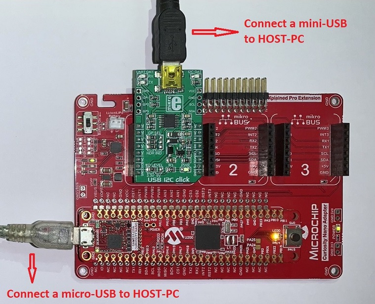

## Programming hex file:
The pre-built hex file can be programmed by following the below steps.  

### Steps to program the hex file
- Open MPLAB X IDE
- Close all existing projects in IDE, if any project is opened.
- Go to File -> Import -> Hex/ELF File
- In the "Import Image File" window, Step 1 - Create Prebuilt Project, Click the "Browse" button to select the prebuilt hex file.
- Select Device has "ATSAME51J20A"
- Ensure the proper tool is selected under "Hardware Tool"
- Click on Next button
- In the "Import Image File" window, Step 2 - Select Project Name and Folder, select appropriate project name and folder
- Click on Finish button
- In MPLAB X IDE, click on "Make and Program Device" Button. The device gets programmed in sometime
- Follow the steps in "Running the Demo" section below

## Programming/Debugging Application Project:
- Open the project (apps/sam_e51_cnano/same51n_mikroe_click/usb_i2c/firmware/sam_e51_cnano.X) in MPLAB X IDE
- Ensure "SAM E51 Curiosity Nano Evaluation Kit" is selected as hardware tool to program/debug the application
- Build the code and program the device by clicking on the "make and program" button in MPLAB X IDE tool bar
- Follow the steps in "Running the Demo" section below

## Running the Demo:
- Open **MCP2221 I2C SMBus Terminal** Application. If the MCP2221 board is recognized, you should see the 'Select Device' field populated with the component ID on the far upper-right corner of the window:

	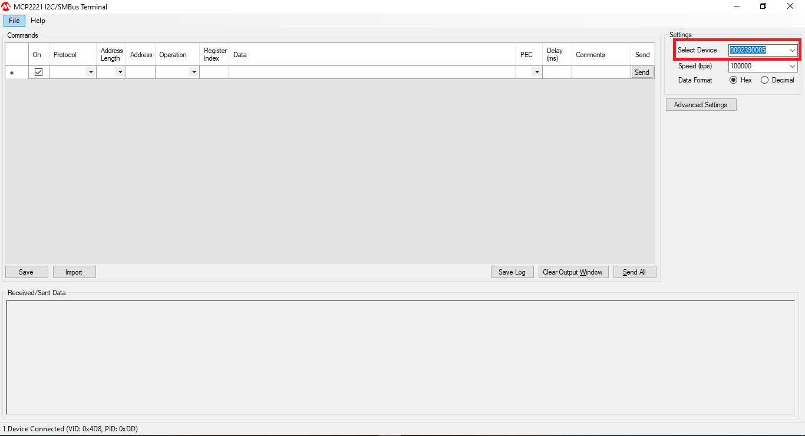

    **Note:** If there is no device ID on that field, please refer to the MCP2221 terminal installation instructions to install the board.
- Now, select File > Import Commands. Navigate to the project solution folder and select the file **MCP2221 - CMDs For I2C Slave Demo.csv**:

	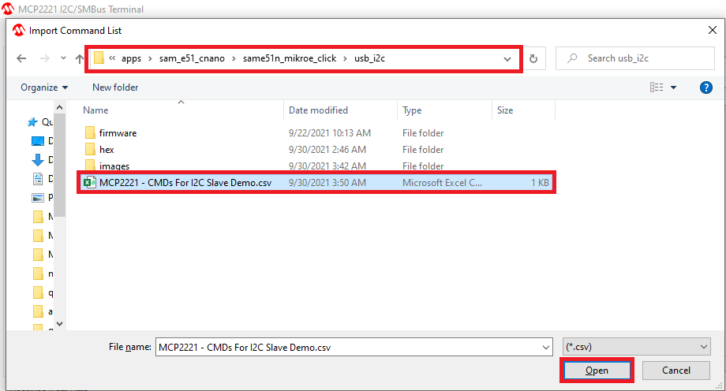
You should now have the following commands listed under the Command list:
	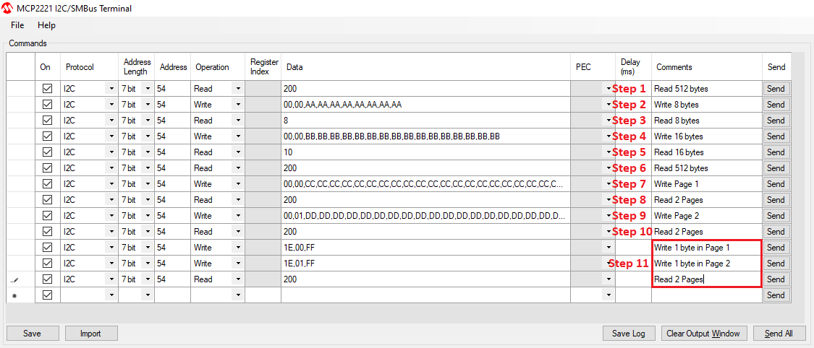
- **Step 1: Read 512 bytes from I²C Slave**

    After the Terminal is configured, issue the first command on the list by pressing the button Send on the right side. This command accesses the I²C device address 0x54, which is the Slave address selected for this example, and reads the 512 bytes data. This is the emulated EEPROM buffer on which the read and write operations are executed.

    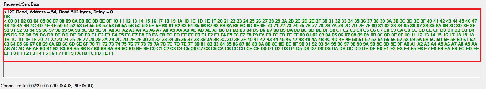

- **Step 2: Write 8 bytes to I²C Slave**
    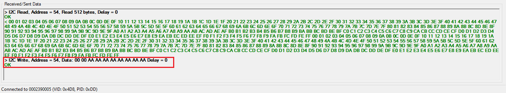

- **Step 3: Read 8 bytes from I²C Slave**
    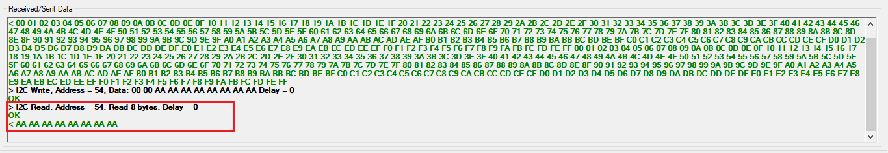

- **Step 4: Write 16 bytes to I²C Slave**
    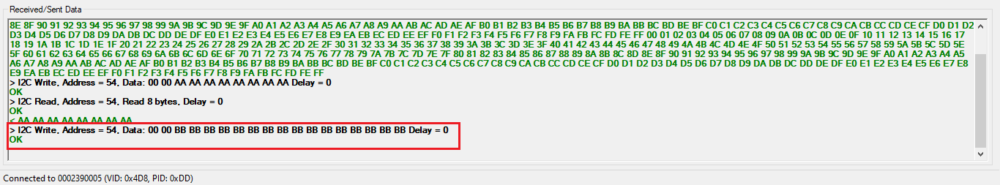

- **Step 5: Read 16 bytes from I²C Slave**
    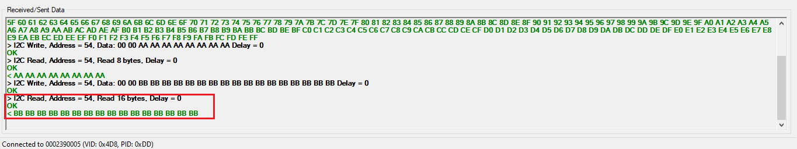

- **Step 6: Read 512 bytes from I²C Slave**
    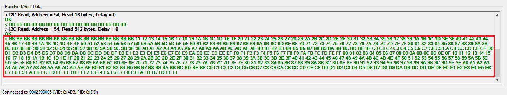

- **Step 7: Write page 1 (256bytes) to I²C Slave**
    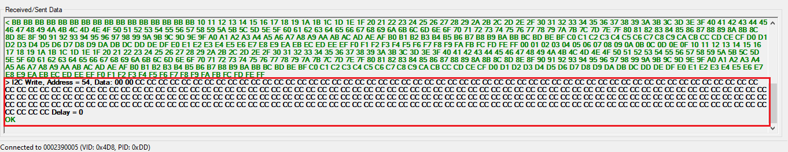

- **Step 8: Read two pages (256bytes) from I²C Slave**
    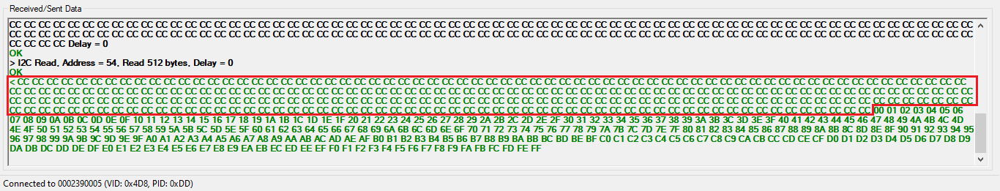

- **Step 9: Write page 2 (256bytes) to I²C Slave**
    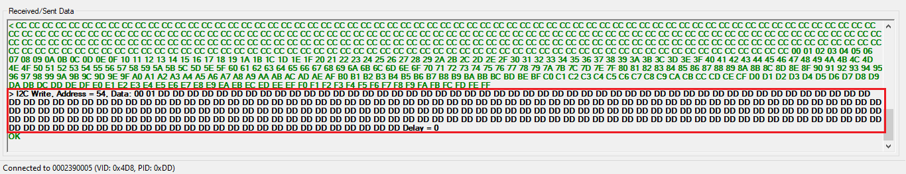

- **Step 10: Read two pages (256bytes) from I²C Slave**
    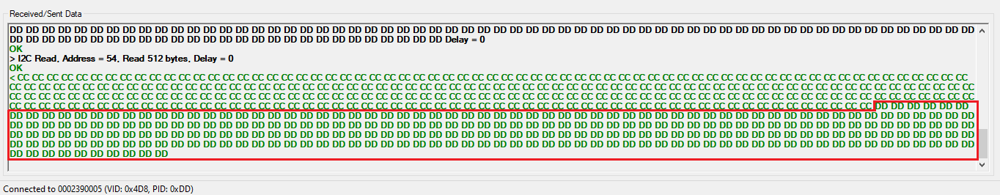

- **Step 11: Issue the following commands and observe output**
    - Write 1 byte to page 1 address **0x1E**.
    - Write 1 byte to page 2 address **0x1E**.
    - Read two pages. Check whether above bytes are written properly.
    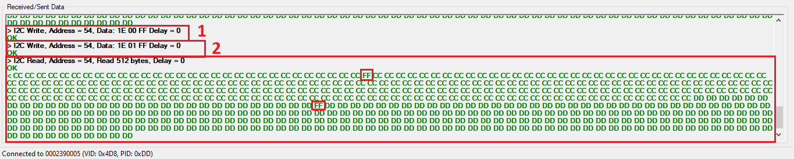

## Instructions to add USB I2C functionality to your application:

You could use this demonstration as an example to add USB I2C functionality to your MPLAB Harmony v3 based application. Follow the below steps.  
1. If you haven't downloaded the USB I2C demo yet [Click Here](https://github.com/Microchip-MPLAB-Harmony/reference_apps/releases/latest/download/usb_i2c.zip) to download, otherwise go to next step
2. Unzip the downloaded .zip file  
3. From the unzipped folder usb_i2c/firmware/src, copy the folder **click_routines** to the folder firmware/src under your MPLAB Harmony v3 application project  
4. Open MPLAB X IDE  
5. Open your application project  
6. In the project explorer, Right click on folder **Header Files**  
   and add a sub folder **click_routines** by selecting "Add Existing Items from Folders..."  
	   

- Click on "Add Folder..." button  
	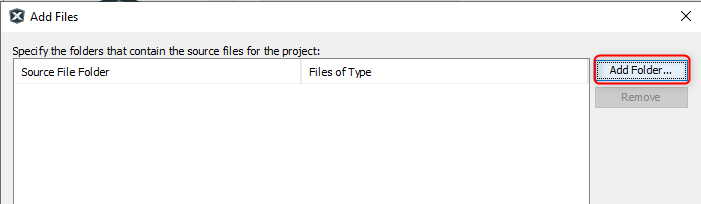  

- Select the "click_routines" folder and select "Files of Types" as Header Files  
	

- Click on "Add" button to add the selected folder  
	

- The USB I2C click example header files gets added to your project  
	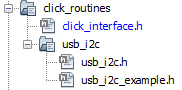

7. In the project explorer, Right click on folder **Source Files**  
   and add a sub folder **click_routines** by selecting "Add Existing Items from Folders..."   
	   

 - Click on "Add Folder..." button  
 	  

 - Select the "click_routines" folder and select "Files of Types" as Source Files  
 	

 - Click on "Add" button to add the selected folder  
 	

 - The USB I2C click example source files gets added to your project  
 	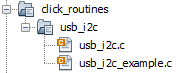

8. The USB I2C click example uses the **I2C** peripheral. The configuration of this peripheral for your application depends on the 32-bit MCU and development board you are using.

	- **Configure I2C**:
 		- Add the I2C peripheral block to the MCC project graph  
		- Configure I2C Pins using MCC Pin configuration Window  
		The I2C configuration depends on
 			- 32-bit MCU
 			- 32-bit MCU development board
 			- The socket on which you have mounted the USB I2C click board  
 		*Example: The USB I2C click example on SAM E51 Curiosity Nano Evaluation Kit uses mikroBUS socket #1 on the Curiosity Nano Base for Click boards to mount the USB I2C click board. The I2C lines from MCU coming to this socket are from the SERCOM4 peripheral on the MCU.*  
		*MCC Project Graph - I2C configuration*  
		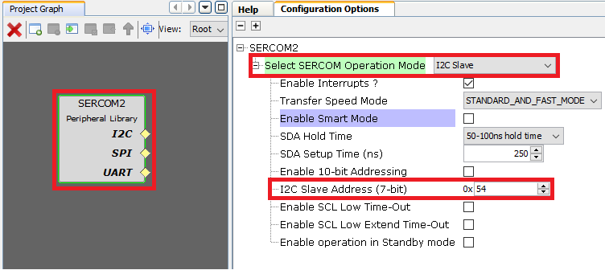  

		*MCC Pin Configurator - I2C pin configuration*  
		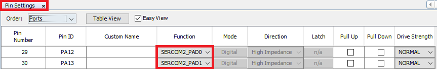  

	- **Map Generic Macros**:
		- After generating the project, following the above configuration, map the generic macros used in the click routines to the Harmony PLIB APIs of the 32-bit MCU your project is running on
		- The generic macros should be mapped in the header file click_interface.h  

			  			
		*Example: The USB I2C click routines for the example on SAM E51 Curiosity Nano Evaluation Kit uses the following Harmony PLIB APIs*  			
		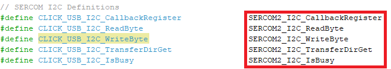

9. The **click_routines** folder contain an example C source file **usb_i2c_example.c**. You could use **usb_i2c_example.c** as a reference to add USB I2C functionality to your application.

## Comments:
- Reference Training Module:  
	1. [Getting Started with Harmony v3 Peripheral Libraries on SAM D5x/E5x MCUs](https://microchipdeveloper.com/harmony3:same54-getting-started-training-module)
	2. [Low Power Application on SAM E54 (Arm® Cortex® M4) MCUs Using MPLAB® Harmony v3 Peripheral Libraries](https://microchipdeveloper.com/harmony3:low-power-application-on-sam-e54)
	3. [Getting Started with Harmony v3 Drivers on SAM E54 MCUs Using FreeRTOS](https://microchipdeveloper.com/harmony3:same54-getting-started-tm-drivers-freertos)

- This application demo builds and works out of box by following the instructions above in "Running the Demo" section. If you need to enhance/customize this application demo, you need to use the MPLAB Harmony v3 Software framework. Refer links below to setup and build your applications using MPLAB Harmony.
	- [How to Setup MPLAB Harmony v3 Software Development Framework](https://ww1.microchip.com/downloads/en/DeviceDoc/How_to_Setup_MPLAB_%20Harmony_v3_Software_Development_Framework_DS90003232C.pdf)
	- [How to Build an Application by Adding a New PLIB, Driver, or Middleware to an Existing MPLAB Harmony v3 Project](http://ww1.microchip.com/downloads/en/DeviceDoc/How_to_Build_Application_Adding_PLIB_%20Driver_or_Middleware%20_to_MPLAB_Harmony_v3Project_DS90003253A.pdf)

## Revision:
- v1.5.0 - Removed MHC support, regenerated and tested application
- v1.4.0 - Released demo application
