# USB SPI Click example on SAM E51 Curiosity Nano Evaluation Kit
<h2 align="center"> <a href="https://github.com/Microchip-MPLAB-Harmony/reference_apps/releases/latest/download/usb_spi.zip" > Download </a> </h2>

-----
## Description:

> This example demonstrates how to use the SERCOM-SPI peripheral in **slave mode** on SAM E51 Curiosity Nano Evaluation Kit using USB SPI Click board.

> This example uses the SPI peripheral library in slave mode and emulates an EEPROM of 512 bytes. The emulated EEPROM consists of two pages, each of size 256 bytes. The SPI slave expects two bytes of memory address from the SPI master (USB SPI Click) and the memory address can range from 0x00 to 0x1FF. The following operation can be made on the SPI slave (emulated EEPROM).

> **Data Write:** The SPI master sends the slave address, followed by two bytes of the memory address, and followed by the data. The slave writes the data at the requested memory address.

> **Data Read:** Reads the requested number of bytes from the start address of emulated EEPROM in two steps,
 - SPI master sends the sends the slave address, followed by two bytes of the memory address (read location), and followed by the number of bytes read.
 - SPI master sends the dummy bytes (0x00s) to read the data from the slave and the count of dummy bytes to send is equal to the number of bytes read.

## Modules/Technology Used:
- Peripheral Modules
	- PORT
	- SERCOM (SPI)

## Hardware Used:

- [SAM E51 Curiosity Nano Evaluation Kit](https://www.microchip.com/DevelopmentTools/ProductDetails/PartNO/EV76S68A)
- [Curiosity Nano Base for Click Boards](https://www.microchip.com/Developmenttools/ProductDetails/AC164162)
- [MikroElektronika USB SPI Click](https://www.mikroe.com/usb-spi-click)

## Software/Tools Used:
 This project has been verified to work with the following versions of software tools:

Refer [Project Manifest](./firmware/src/config/sam_e51_cnano/harmony-manifest-success.yml) present in harmony-manifest-success.yml under the project folder *firmware/src/config/sam_e51_cnano*
- Refer the [Release Notes](../../../../release_notes.md#development-tools) to know the **MPLAB X IDE** and **MCC** Plugin version. Alternatively, [Click Here](https://github.com/Microchip-MPLAB-Harmony/reference_apps/blob/master/release_notes.md#development-tools).
- [Download and Install MCP2210 SPI Terminal](https://ww1.microchip.com/downloads/en/DeviceDoc/MCP2210_SpiTerminal-v1.0.zip) in your PC.

 Because Microchip regularly update tools, occasionally issue(s) could be discovered while using the newer versions of the tools. If the project doesn’t seem to work and version incompatibility is suspected, It is recommended to double-check and use the same versions that the project was tested with.  To download original version of MPLAB Harmony v3 packages, refer to document [How to Use the MPLAB Harmony v3 Project Manifest Feature](https://ww1.microchip.com/downloads/en/DeviceDoc/How-to-Use-the-MPLAB-Harmony-v3-Project-Manifest-Feature-DS90003305.pdf)

## Setup:
- Connect the [SAM E51 Curiosity Nano Evaluation Kit](https://www.microchip.com/DevelopmentTools/ProductDetails/PartNO/EV76S68A) to the Host PC as a USB Device through a Type-A male to micro-B USB cable connected to Micro-B USB (Debug USB) port
- Mount [MikroElektronika USB SPI Click](https://www.mikroe.com/usb-spi-click) over mikroBUS socket #1 on the [SAM E51 Curiosity Nano Evaluation Kit](https://www.microchip.com/DevelopmentTools/ProductDetails/PartNO/EV76S68A).
- Connect the [MikroElektronika USB SPI Click](https://www.mikroe.com/usb-spi-click) to the Host PC as a USB Device through a Type-A male to mini-B USB cable connected to mini-B USB port.

  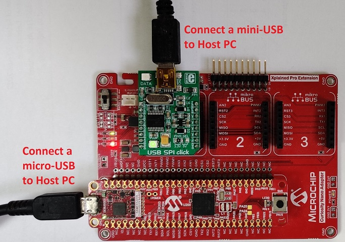

## Programming hex file:
The pre-built hex file can be programmed by following the below steps.  

### Steps to program the hex file
- Open MPLAB X IDE
- Close all existing projects in IDE, if any project is opened.
- Go to File -> Import -> Hex/ELF File
- In the "Import Image File" window, Step 1 - Create Prebuilt Project, Click the "Browse" button to select the prebuilt hex file.
- Select Device has "ATSAME51J20A"
- Ensure the proper tool is selected under "Hardware Tool"
- Click on Next button
- In the "Import Image File" window, Step 2 - Select Project Name and Folder, select appropriate project name and folder
- Click on Finish button
- In MPLAB X IDE, click on "Make and Program Device" Button. The device gets programmed in sometime
- Follow the steps in "Running the Demo" section below

## Programming/Debugging Application Project:
- Open the project (apps/sam_e51_cnano/same51n_mikroe_click/usb_spi/firmware/sam_e51_cnano.X) in MPLAB X IDE
- Ensure "SAM E51 Curiosity Nano Evaluation Kit" is selected as hardware tool to program/debug the application
- Build the code and program the device by clicking on the "make and program" button in MPLAB X IDE tool bar
- Follow the steps in "Running the Demo" section below

## Running the Demo:
- Open **MCP2210 SPI Terminal** Application. If the MCP2210 board is recognized, you should see the 'MCP2210 Status: Connected' on the far down-left corner of the window.
- Configure the MCP2210 SPI Terminal as below.  
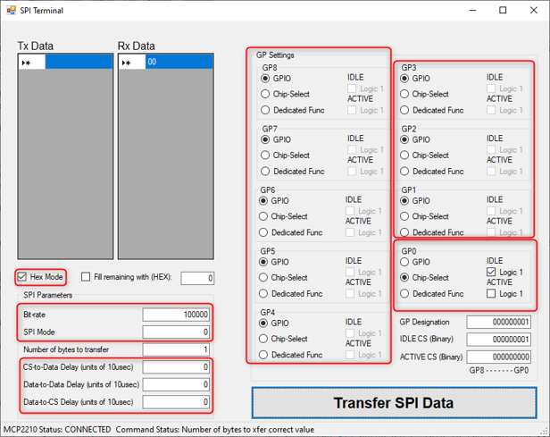
- **Data write to emulated EEPROM (SPI Slave)**

   **Example:** Write the data "0x99 and 0xAA" to emulated EEPROM at "0x000A" address location by transferring "0x02 0x00 0x0A 0x99 0xAA".

   Follow the below protocol to write the data to emulated EEPROM using MCP2210 SPI Terminal.

   **[*WR_CMD (0x02) | ADDR1 (MSB) | ADDR0 (LSB) | DATA0 | DATA1 | .. | DATAN*]**

   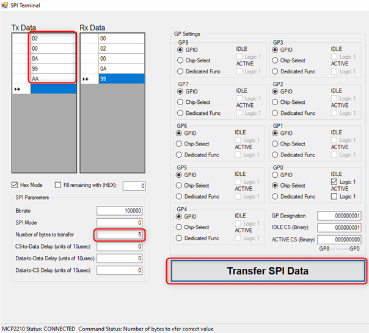

- **Data read from emulated EEPROM (SPI Slave)**

   **Example:** Read the two bytes of data from emulated EEPROM at "0x000A" address location by transferring "0x03 0x00 0x0A 0x02" and "0x00 0x00".

   Follow the below protocol to initiate the data read from emulated EEPROM using MCP2210 SPI Terminal.

   **[*RD_CMD (0x03) | ADDR1 (MSB) | ADDR0 (LSB) | Number of bytes read*]**

   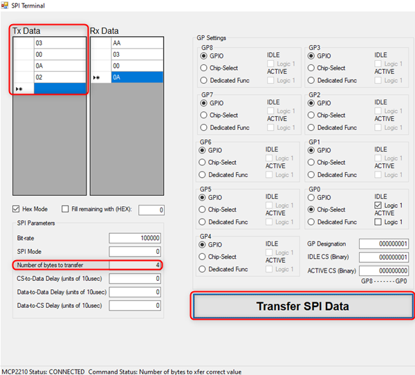

   Follow the below protocol to read the data from emulated EEPROM using MCP2210 SPI Terminal.

   **[*DUMMY | DUMMY | .. | DUMMY*]**

   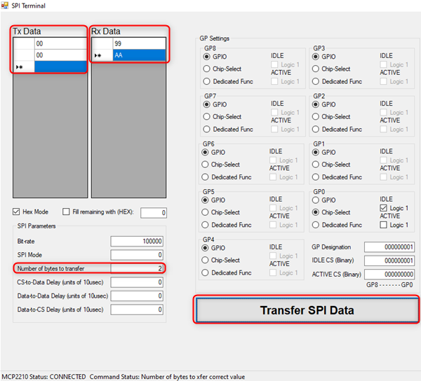

   See the received data on "Rx Data" section on MCP2210 SPI Terminal.

   **Note:** Make sure the dummy byte not be a read or write command value, i.e. 0x02 or 0x03.

## Instructions to add USB SPI functionality to your application:

You could use this demonstration as an example to add USB SPI functionality to your MPLAB Harmony v3 based application. Follow the below steps.  
1. If you haven't downloaded the USB SPI demo yet [Click Here](https://github.com/Microchip-MPLAB-Harmony/reference_apps/releases/latest/download/usb_spi.zip) to download, otherwise go to next step
2. Unzip the downloaded .zip file  
3. From the unzipped folder usb_spi/firmware/src, copy the folder **click_routines** to the folder firmware/src under your MPLAB Harmony v3 application project  
4. Open MPLAB X IDE  
5. Open your application project  
6. In the project explorer, Right click on folder **Header Files**  
   and add a sub folder **click_routines** by selecting "Add Existing Items from Folders..."  
	   

- Click on "Add Folder..." button  
	  

- Select the "click_routines" folder and select "Files of Types" as Header Files  
	

- Click on "Add" button to add the selected folder  
	

- The USB SPI click example header files gets added to your project  
	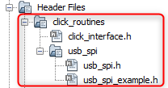

7. In the project explorer, Right click on folder **Source Files**  
   and add a sub folder **click_routines** by selecting "Add Existing Items from Folders..."   
	 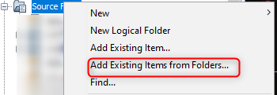  

 - Click on "Add Folder..." button  
 	  

 - Select the "click_routines" folder and select "Files of Types" as Source Files  
 	

 - Click on "Add" button to add the selected folder  
 	

 - The USB SPI click example source files gets added to your project  
 	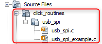

8. The USB SPI click example uses the **SPI** peripheral. The configuration of this peripheral for your application depends on the 32-bit MCU and development board you are using.

	- **Configure SPI**:
 		- Add the SPI peripheral block to the MCC project graph  
		- Configure SPI Pins using MCC Pin configuration Window  
		The SPI configuration depends on
 			- 32-bit MCU
 			- 32-bit MCU development board
 			- The socket on which you have mounted the USB SPI click board  
 		*Example: The USB SPI click example on SAM E51 Curiosity Nano Evaluation Kit uses mikroBUS socket #1 on the Curiosity Nano Base for Click boards to mount the USB SPI click board. The SPI lines from MCU coming to this socket are from the SERCOM1 peripheral on the MCU.*  
		*MCC Project Graph - SPI configuration*  
		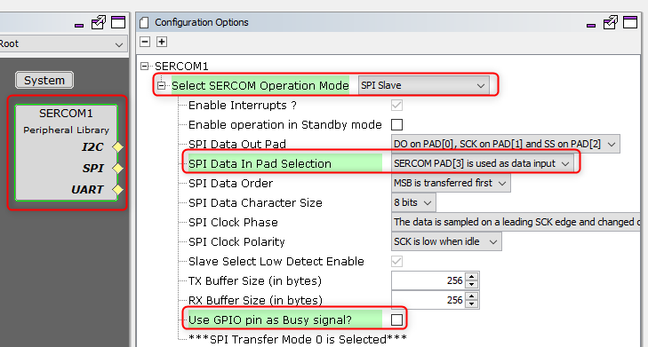  

		*MCC Pin Configurator - SPI pin configuration*  
		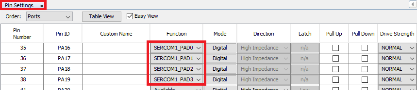  

	- **Map Generic Macros**:
		- After generating the project, following the above configuration, map the generic macros used in the click routines to the Harmony PLIB APIs of the 32-bit MCU your project is running on
		- The generic macros should be mapped in the header file click_interface.h  

			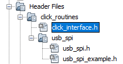  			
		*Example: The USB SPI click routines for the example on SAM E51 Curiosity Nano Evaluation Kit uses the following Harmony PLIB APIs*  			
		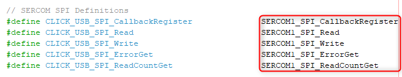

9. The **click_routines** folder contain an example C source file **usb_spi_example.c**. You could use **usb_spi_example.c** as a reference to add USB SPI functionality to your application.

## Comments:
- Reference Training Module:  
	1. [Getting Started with Harmony v3 Peripheral Libraries on SAM D5x/E5x MCUs](https://microchipdeveloper.com/harmony3:same54-getting-started-training-module)
	2. [Low Power Application on SAM E54 (Arm® Cortex® M4) MCUs Using MPLAB® Harmony v3 Peripheral Libraries](https://microchipdeveloper.com/harmony3:low-power-application-on-sam-e54)
	3. [Getting Started with Harmony v3 Drivers on SAM E54 MCUs Using FreeRTOS](https://microchipdeveloper.com/harmony3:same54-getting-started-tm-drivers-freertos)

- This application demo builds and works out of box by following the instructions above in "Running the Demo" section. If you need to enhance/customize this application demo, you need to use the MPLAB Harmony v3 Software framework. Refer links below to setup and build your applications using MPLAB Harmony.
	- [How to Setup MPLAB Harmony v3 Software Development Framework](https://ww1.microchip.com/downloads/en/DeviceDoc/How_to_Setup_MPLAB_%20Harmony_v3_Software_Development_Framework_DS90003232C.pdf)
	- [How to Build an Application by Adding a New PLIB, Driver, or Middleware to an Existing MPLAB Harmony v3 Project](http://ww1.microchip.com/downloads/en/DeviceDoc/How_to_Build_Application_Adding_PLIB_%20Driver_or_Middleware%20_to_MPLAB_Harmony_v3Project_DS90003253A.pdf)
	-  **MPLAB Harmony v3 is also configurable through MPLAB Code Configurator (MCC). Refer to the below links for specific instructions to use MPLAB Harmony v3 with MCC.**
		- [Create a new MPLAB Harmony v3 project using MCC](https://microchipdeveloper.com/harmony3:getting-started-training-module-using-mcc)
		- [Update and Configure an Existing MHC-based MPLAB Harmony v3 Project to MCC-based Project](https://microchipdeveloper.com/harmony3:update-and-configure-existing-mhc-proj-to-mcc-proj)
		- [Getting Started with MPLAB Harmony v3 Using MPLAB Code Configurator](https://www.youtube.com/watch?v=KdhltTWaDp0)
		- [MPLAB Code Configurator Content Manager for MPLAB Harmony v3 Projects](https://www.youtube.com/watch?v=PRewTzrI3iE)

## Revision:
- v1.5.0 - Released demo application
