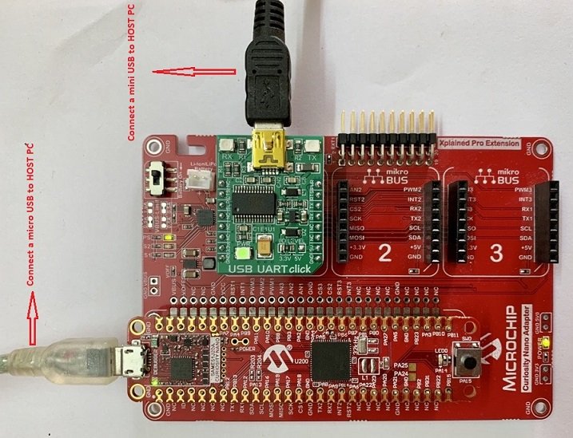
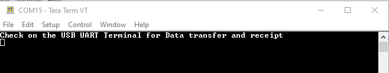
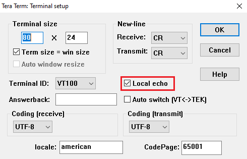
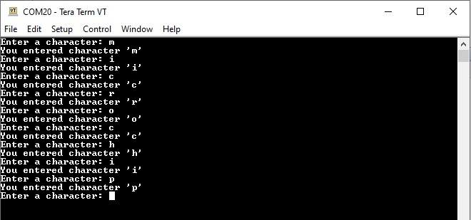
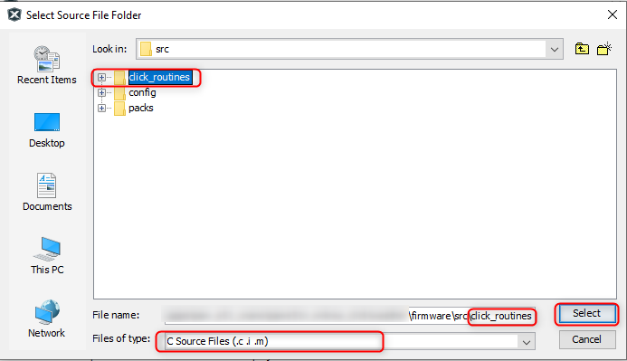
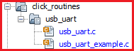
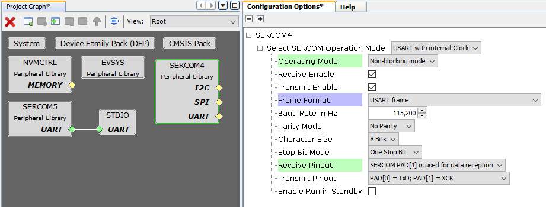
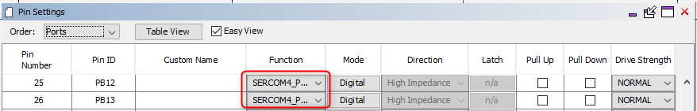
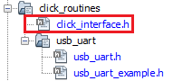
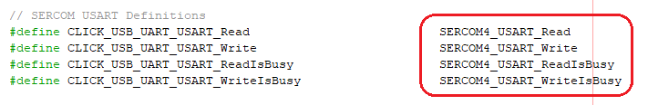

# USB UART Click example on SAM E51 Curiosity Nano Evaluation Kit
<h2 align="center"> <a href="https://github.com/MicrochipTech/MPLAB-Harmony-Reference-Apps/releases/latest/download/usb_uart.zip" > Download </a> </h2>

-----
## Description:

> This example demonstrates the reading of a character and displays it on a serial terminal on SAM E51 Curiosity Nano Evaluation Kit using USB UART Click board.

## Modules/Technology Used:
- Peripheral Modules
	- EIC
	- GPIO
	- SERCOM (USART)

## Hardware Used:

- [SAM E51 Curiosity Nano Evaluation Kit](https://www.microchip.com/DevelopmentTools/ProductDetails/PartNO/EV76S68A)
- [Curiosity Nano Base for Click Boards](https://www.microchip.com/Developmenttools/ProductDetails/AC164162)
- [MikroElektronika USB UART Click](https://www.mikroe.com/usb-uart-click)

## Software/Tools Used:
 *This project has been verified to work with the following versions of software tools:*  

- [MPLAB Harmony v3 "csp" repo v3.9.1](https://github.com/Microchip-MPLAB-Harmony/csp/releases/tag/v3.9.1)  
- [MPLAB Harmony v3 "dev_packs" repo v3.9.0](https://github.com/Microchip-MPLAB-Harmony/dev_packs/releases/tag/v3.9.0)  
- [MPLAB Harmony v3 "mhc" repo v3.7.2](https://github.com/Microchip-MPLAB-Harmony/mhc/releases/tag/v3.7.2)  
- MPLAB Harmony 3 Launcher Plugin v3.6.4  
- [MPLAB X IDE v5.50](https://www.microchip.com/mplab/mplab-x-ide)  
- [MPLAB XC32 Compiler v3.00](https://www.microchip.com/mplab/compilers)  
- Any Serial Terminal application like Tera Term terminal application.  

 *Because Microchip regularly update tools, occasionally issue(s) could be discovered while using the newer versions of the tools. If the project doesn’t seem to work and version incompatibility is suspected, It is recommended to double-check and use the same versions that the project was tested with.* 

## Setup:
- Connect the [SAM E51 Curiosity Nano Evaluation Kit](https://www.microchip.com/DevelopmentTools/ProductDetails/PartNO/EV76S68A) to the Host PC as a USB Device through a Type-A male to micro-B USB cable connected to Micro-B USB (Debug USB) port
- Mount [MikroElektronika USB UART Click](https://www.mikroe.com/usb-uart-click) over mikroBUS socket #1 on the [SAM E51 Curiosity Nano Evaluation Kit](https://www.microchip.com/DevelopmentTools/ProductDetails/PartNO/EV76S68A).
- Connect the [MikroElektronika USB UART Click](https://www.mikroe.com/usb-uart-click) to the Host PC as a USB Device through a Type-A male to mini-B USB cable connected to mini-B USB port.

  

## Programming hex file:
The pre-built hex file can be programmed by following the below steps.  

### Steps to program the hex file
- Open MPLAB X IDE
- Close all existing projects in IDE, if any project is opened.
- Go to File -> Import -> Hex/ELF File
- In the "Import Image File" window, Step 1 - Create Prebuilt Project, Click the "Browse" button to select the prebuilt hex file.
- Select Device has "ATSAME51J20A"
- Ensure the proper tool is selected under "Hardware Tool"
- Click on Next button
- In the "Import Image File" window, Step 2 - Select Project Name and Folder, select appropriate project name and folder
- Click on Finish button
- In MPLAB X IDE, click on "Make and Program Device" Button. The device gets programmed in sometime
- Follow the steps in "Running the Demo" section below

## Programming/Debugging Application Project:
- Open the project (apps/sam_e51_cnano/same51n_mikroe_click/usb_uart/firmware/sam_e51_cnano.X) in MPLAB X IDE
- Ensure "PKOB nano" is selected as hardware tool to program/debug the application
- Build the code and program the device by clicking on the "make and program" button in MPLAB X IDE tool bar
- Follow the steps in "Running the Demo" section below

## Running the Demo:
- Open the Tera Term terminal application on your PC (from the Windows® Start menu by pressing the Start button)
- Set the baud rate to **115200**

	

- Now, open another Tera Term terminal application on your PC and Set the baud rate to **115200** to test [MikroElektronika USB UART Click](https://www.mikroe.com/usb-uart-click).
- Goto Setup -> Terminal and enable **Local echo**

	

- For every key press, the entered key is printed on terminal.  

	

## Instructions to add USB UART functionality to your application:

You could use this demonstration as an example to add USB UART functionality to your MPLAB Harmony v3 based application. Follow the below steps.  
1. If you haven't downloaded the USB UART demo yet [Click Here](https://github.com/MicrochipTech/MPLAB-Harmony-Reference-Apps/releases/latest/download/usb_uart.zip) to download, otherwise go to next step  
2. Unzip the downloaded .zip file  
3. From the unzipped folder usb_uart/firmware/src, copy the folder **click_routines** to the folder firmware/src under your MPLAB Harmony v3 application project  
4. Open MPLAB X IDE  
5. Open your application project  
6. In the project explorer, Right click on folder **Header Files**  
   and add a sub folder **click_routines** by selecting "Add Existing Items from Folders..."  
	   

- Click on "Add Folder..." button  
	  

- Select the "click_routines" folder and select "Files of Types" as Header Files  
	

- Click on "Add" button to add the selected folder  
	

- The USB UART click example header files gets added to your project  
	

7. In the project explorer, Right click on folder **Source Files**  
   and add a sub folder **click_routines** by selecting "Add Existing Items from Folders..."   
	   

 - Click on "Add Folder..." button  
 	  

 - Select the "click_routines" folder and select "Files of Types" as Source Files  
 	

 - Click on "Add" button to add the selected folder  
 	

 - The USB UART click example source files gets added to your project  
 	

8. The USB UART click example uses the **USART** peripheral. The configuration of this peripheral for your application depends on the 32-bit MCU and development board you are using.

	- **Configure USART**:
 		- Add the USART peripheral block to the MHC project graph  
		- Configure USART Pins using MHC Pin configuration Window  
		The USART configuration depends on
 			- 32-bit MCU
 			- 32-bit MCU development board
 			- The socket on which you have mounted the USB UART click board  
 		*Example: The USB UART click example on SAM E51 Curiosity Nano Evaluation Kit uses mikroBUS socket #1 on the Curiosity Nano Base for Click boards to mount the USB UART click board. The USART lines from MCU coming to this socket are from the SERCOM4 peripheral on the MCU.*  
		*MHC Project Graph - USART configuration*  
		  

		*MHC Pin Configurator - USART pin configuration*  
		  

	- **Map Generic Macros**:
		- After generating the project, following the above configuration, map the generic macros used in the click routines to the Harmony PLIB APIs of the 32-bit MCU your project is running on
		- The generic macros should be mapped in the header file click_interface.h  

			  			
		*Example: The USB UART click routines for the example on SAM E51 Curiosity Nano Evaluation Kit uses the following Harmony PLIB APIs*  			
		

9. The **click_routines** folder contain an example C source file **usb_uart_example.c**. You could use **usb_uart_example.c** as a reference to add USB UART functionality to your application.

## Comments:
- Reference Training Module:  
	1. [Getting Started with Harmony v3 Peripheral Libraries on SAM D5x/E5x MCUs](https://microchipdeveloper.com/harmony3:same54-getting-started-training-module)
	2. [Low Power Application on SAM E54 (Arm® Cortex® M4) MCUs Using MPLAB® Harmony v3 Peripheral Libraries](https://microchipdeveloper.com/harmony3:low-power-application-on-sam-e54)
	3. [Getting Started with Harmony v3 Drivers on SAM E54 MCUs Using FreeRTOS](https://microchipdeveloper.com/harmony3:same54-getting-started-tm-drivers-freertos)

- This application demo builds and works out of box by following the instructions above in "Running the Demo" section. If you need to enhance/customize this application demo, you need to use the MPLAB Harmony v3 Software framework. Refer links below to setup and build your applications using MPLAB Harmony.
	- [How to Setup MPLAB Harmony v3 Software Development Framework](https://www.microchip.com/mymicrochip/filehandler.aspx?ddocname=en1000821)
	- [How to Build an Application by Adding a New PLIB, Driver, or Middleware to an Existing MPLAB Harmony v3 Project](http://ww1.microchip.com/downloads/en/DeviceDoc/How_to_Build_Application_Adding_PLIB_%20Driver_or_Middleware%20_to_MPLAB_Harmony_v3Project_DS90003253A.pdf)

## Revision:
- v1.3.0 - Created application example
