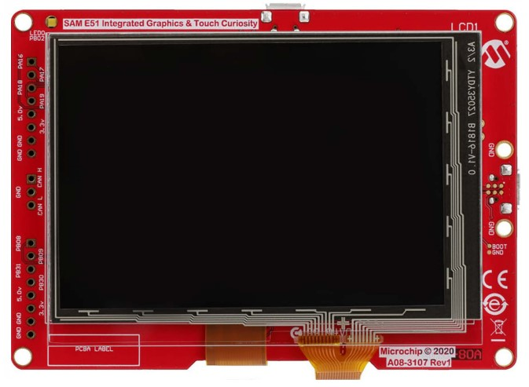

# SAM E51 Integrated Graphics & Touch Curiosity Evaluation Kit
<h4 align="left">  </h4>

This folder contains the MPLAB® Harmony 3 reference applications developed on [SAM E51 Integrated Graphics & Touch Curiosity Evaluation Kit](https://www.microchip.com/en-us/development-tool/ev14c17a).  

|SI No| Demo Name | Download Link |
| --- | --- | -- |
| 1 | [Barcode Scanner](./same51_barcode_scanner/readme.md) | Click Here |

### More Application Demos

For more application demos on **SAM E51 Integrated Graphics & Touch Curiosity board** and and other Development Boards/Kits like **SAM E51 Curiosity Nano Evaluation Kit** <a href="https://mplab-discover.microchip.com/v1/itemtype/com.microchip.ide.project?s0=ATSAME51J20A" target="_blank"> CLICK HERE </a>
