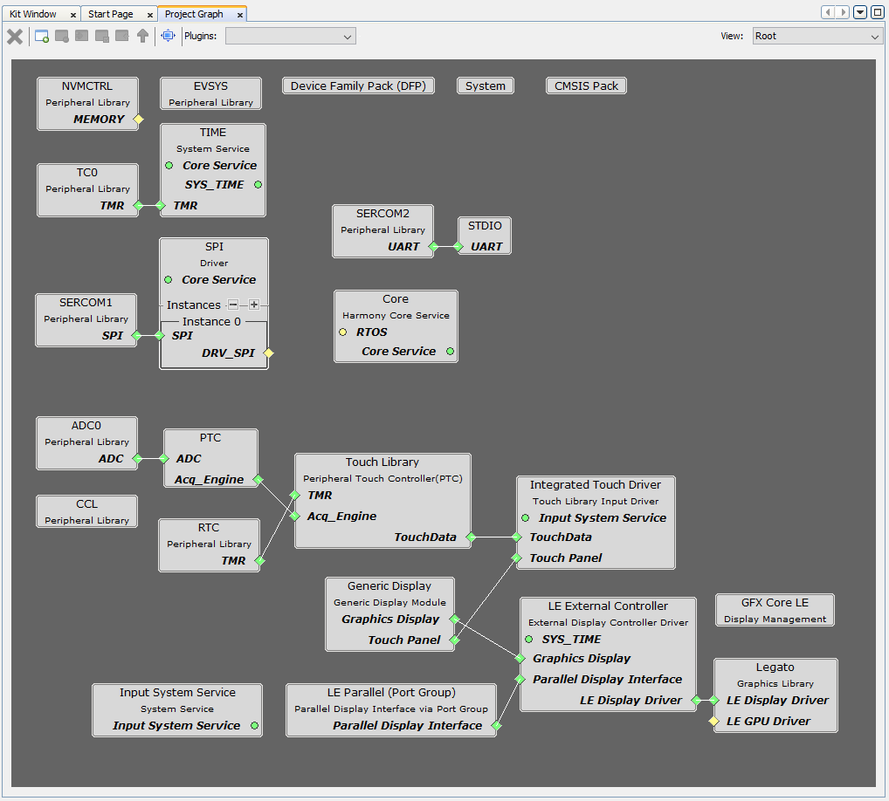
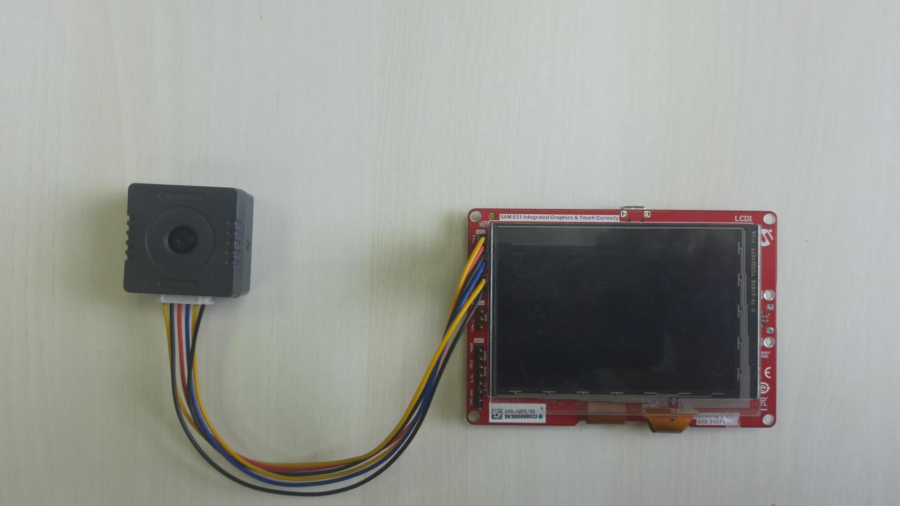
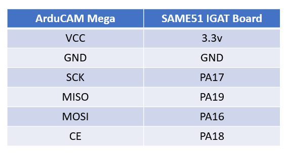
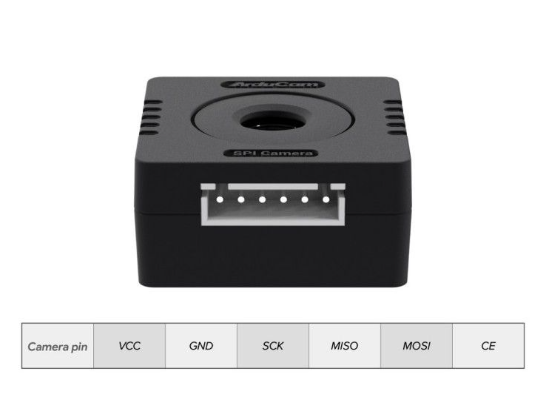
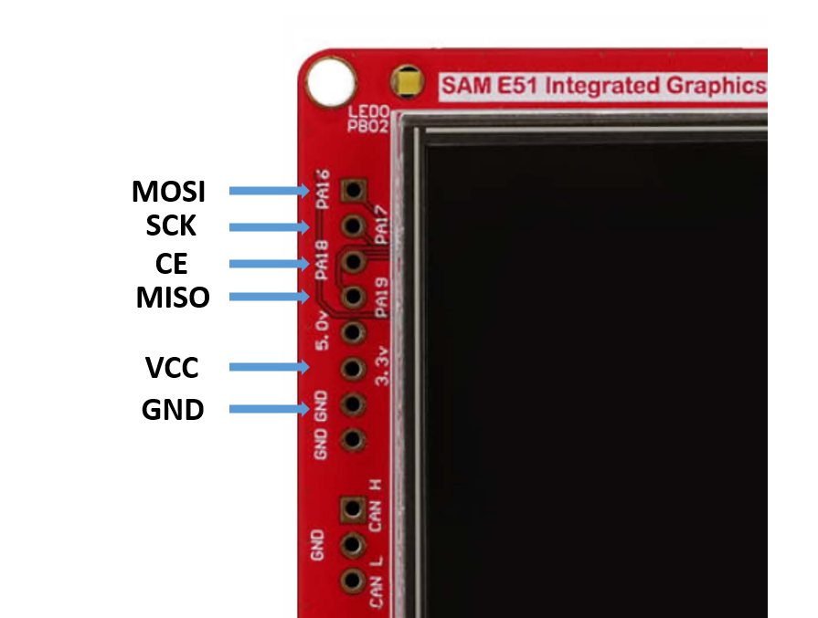
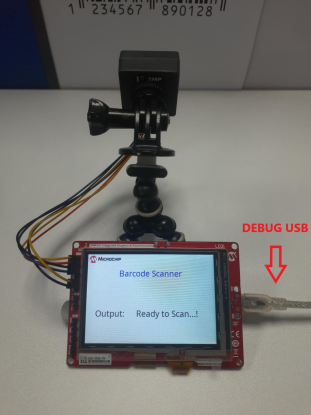
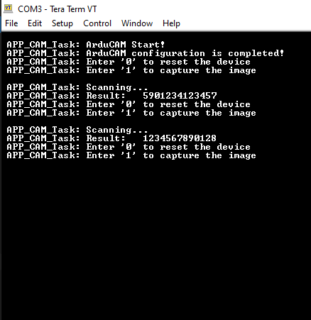
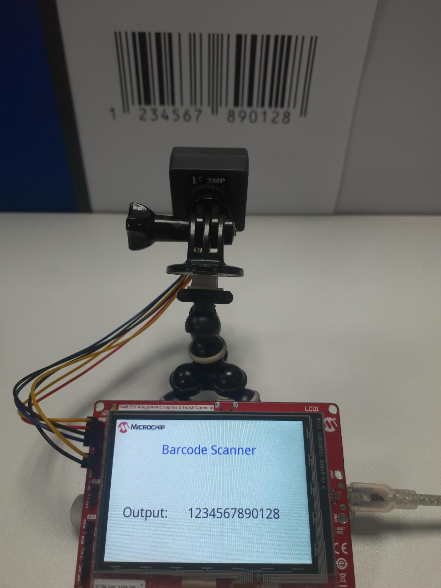

---

grand_parent: Reference Applications
parent: SAM E51 Integrated Graphics & Touch Curiosity Evaluation Kit
title: Barcode Scanner
nav_order: 1

---

---

# Barcode Scanner Application using SAM E51 Integrated Graphics & Touch Curiosity Evaluation Kit

<h2 align="center"> <a href="https://github.com/Microchip-MPLAB-Harmony/reference_apps/releases/latest/download/same51_barcode_scanner.zip" > Download </a> </h2>

-----

## Description:

> This application detects the barcode and decodes it with the help of the ArduCAM Mega camera module. The ArduCAM Mega captures an image with resolution 1920x1080 and stores the image in an internal memory. The decoded barcode is then displayed on the serial console and graphical display.

## Modules/Technology Used:

- Peripheral Modules
	- NVMCTRL
	- EVSYS
	- NVIC
	- PORT
	- SYSTICK
	- SERCOM - SPI
	- SERCOM - UART
	- TC

- Drivers
	- SPI Driver
	- External Display Controller Driver
- System Services
  - Time
  - STDIO
- Middleware libraries
	- Harmony Core
	- Legato Graphics

	 

## Hardware Used:

- [SAM E51 Integrated Graphics & Touch Curiosity Evaluation Kit](https://www.microchip.com/en-us/development-tool/ev14c17a)
- [ArduCAM Mega 3MP Camera Module](https://www.arducam.com/product/presale-mega-3mp-color-rolling-shutter-camera-module-with-solid-camera-case-for-any-microcontroller/) or [ArduCAM Mega 5MP Camera Module with Autofocus](https://www.arducam.com/product/presale-mega-5mp-color-rolling-shutter-camera-module-with-autofocus-lens-for-any-microcontroller/)

## Software/Tools Used:
 This project has been verified to work with the following versions of software tools:  

Refer [Project Manifest](./firmware/src/config/same51_barcode_scanner/harmony-manifest-success.yml) present in harmony-manifest-success.yml under the project folder *firmware/src/config/same51_barcode_scanner*  

- Refer the [Release Notes](../../../release_notes.md#development-tools) to know the **MPLAB® X IDE** and **MCC** Plugin version. Alternatively, [Click Here](https://github.com/Microchip-MPLAB-Harmony/reference_apps/blob/master/release_notes.md#development-tools)
- Any Serial Terminal application like Tera Term terminal application.

 Because Microchip regularly update tools, occasionally issue(s) could be discovered while using the newer versions of the tools. If the project doesn’t seem to work and version incompatibility is suspected, It is recommended to double-check and use the same versions that the project was tested with.  

To download original version of MPLAB® Harmony v3 packages, refer to document [How to Use the MPLAB® Harmony v3 Project Manifest Feature](https://ww1.microchip.com/downloads/en/DeviceDoc/How-to-Use-the-MPLAB-Harmony-v3-Project-Manifest-Feature-DS90003305.pdf)

## Setup:
- Connect the ArduCAM Camera module to the **SAM E51 Curiosity Evaluation Kit** as shown below.

	

		 
	

	- Connect the ArduCAM pins directly to the Extra Port pins interface (J203). i.e.
		
		  
		

- Connect a micro-USB cable to the **DEBUG USB** port of the **SAM E51 Integrated Graphics & Touch Curiosity board**  to power the board and for programming and debugging.

	 

## Programming hex file:

The pre-built hex file can be programmed by following the below steps

### Steps to program the hex file

- Open MPLAB® X IDE
- Close all existing projects in IDE, if any project is opened.
- Go to File -> Import -> Hex/ELF File
- In the "Import Image File" window, Step 1 - Create Prebuilt Project, Click the "Browse" button to select the prebuilt hex file.
- Select Device has "ATSAME51J20A"
- Ensure the proper tool is selected under "Hardware Tool"
- Click on "Next" button
- In the "Import Image File" window, Step 2 - Select Project Name and Folder, select appropriate project name and folder
- Click on "Finish" button
- In MPLAB® X IDE, click on "Make and Program Device" Button. The device gets programmed in sometime.
- Follow the steps in "Running the Demo" section below

## Programming/Debugging Application Project:
- Open the project (same51_barcode_scanner/firmware/sam_e51_igat.X) in MPLAB® X IDE
- Ensure "SAM E51 Integrated Graphics & Touch Curiosity" is selected as hardware tool to program/debug the application
- Build the code and program the device by clicking on the "Make and Program Device" button in MPLAB® X IDE tool bar
- Debugging the project can be done by clicking on the “Debug Main Project” button in MPLAB® X IDE tool bar
- Follow the steps in "Running the Demo" section below.

## Running the Demo:

- Open a standard terminal application on the computer (like Putty or Tera Term) and configure the virtual COM port.
- Set the serial baud rate to **115200** baud in the terminal application.
- Wait for the initialization prints in the serial port terminal. If it does not show any prints, give the command “**0**” through terminal console which resets the development board. 
- When the **ArduCAM Mega Camera** is enabled in the demonstration, wait for the initialization confirmation from the development board. This will be printed on the serial port terminal.
- Show the Barcode in front of the camera for capture (maintain a minimum distance of 10 to 15 cm).
- Give the command “**1**” through terminal console.
	- An LED “**LED0**” on the **SAM E51 Integrated Graphics & Touch Curiosity Evaluation Kit** toggles when the scanning is in progress.
- Once the scanning is completed, the result will be displayed in the terminal console as well as graphical display also.

	 
	 

## Comments:
- Reference Applications:
	- Getting Started Training Module: [Getting Started with Harmony v3 Peripheral Libraries on SAM E54 MCUs](https://microchipdeveloper.com/harmony3:same54-getting-started-training-module)
	- [MPLAB® Harmony 3 Graphics application examples for SAM D5x/E5x Family](https://microchip-mplab-harmony.github.io/gfx_apps_sam_d5x_e5x/)
- This application demo builds and works out of box by following the instructions above in "Running the Demo" section. If you need to enhance/customize this application demo, you need to use the MPLAB® Harmony v3 Software framework. Refer links below to setup and build your applications using MPLAB® Harmony.
	- [Getting Started with MPLAB® Harmony v3 Using MPLAB® Code Configurator](https://www.youtube.com/watch?v=KdhltTWaDp0)
	- [MPLAB® Code Configurator Content Manager for MPLAB® Harmony v3 Projects](https://www.youtube.com/watch?v=PRewTzrI3iE)

## Revision:

- v1.5.0 - Released demo application
