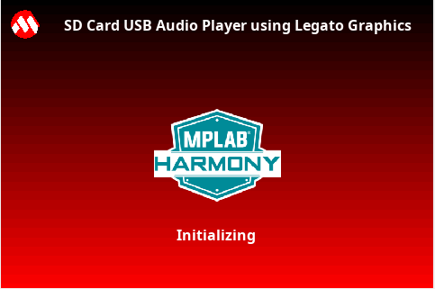
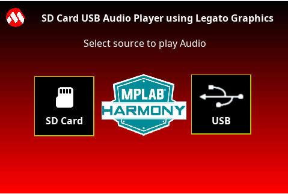
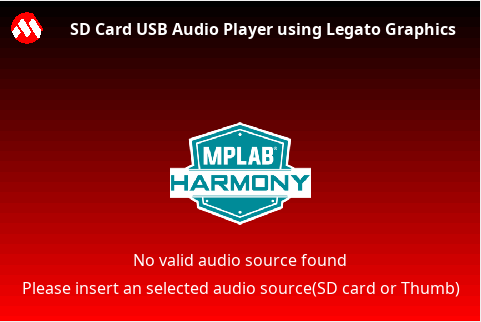
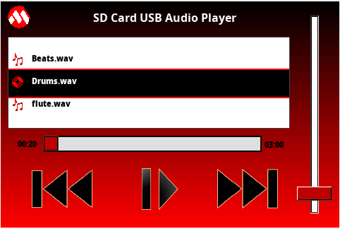
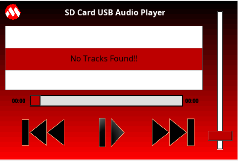

# SD Card USB Audio Player on SAM E54 Curiosity Ultra Development Board + maXTouch® Curiosity Pro Board using Legato Graphics  
<h2 align="center"> <a href="https://github.com/Microchip-MPLAB-Harmony/reference_apps/releases/latest/download/same54_sdcard_usb_audio_player.zip" > Download </a> </h2>

----

## Description

> This application reads a WAV audio file from the SD card or USB thumb drive on the SAM E54 Curiosity Ultra Development Board and streams
  it over the I²S interface through the audio CODEC. The application implements the functionality of an audio player
  (for WAV files only).  

  > The application displays audio tracks from the SD card/USB Thumb in a list wheel box. It allows to navigate the list to select and play a track.
  It also provides volume increase/decrease scroll bar, Play/Pause button, Next Track button, Rewind button, and a track progress bar.

## Modules/Technology Used:

- Peripheral Modules
	- SERCOM (I2C)
	- SERCOM (I2S)
	- Timer
- Drivers
	- I2S Driver
	- I2C Driver
	- WM8904 Driver
	- SDCARD (SPI) Driver
	- USB High Speed Driver
	- MSD Function Driver
	- Legato Graphics Display driver w/ MXT Curiosity Pro Display
	- Max Touch Controller Driver
- BSP Library
	- SAME54 Curiosity Ultra BSP
- Audio Decoder Libraries
	- WAV Decoder Library
- System Services
	- File System
	- Input System
- Middleware
	- USB device layer
	- Legato Graphics

## Hardware Used:

- [SAM E54 Curiosity Ultra Development Board](https://www.microchip.com/Developmenttools/ProductDetails/DM320210)
- [AC328904 - PIC32 Audio Codec Daughter Card](https://www.microchip.com/DevelopmentTools/ProductDetails/PartNO/AC328904#additional-summary)
- [maXTouch® Curiosity Pro Board](https://www.microchip.com/Developmenttools/ProductDetails/AC320007)
- Micro SD Card
- USB Thumb Drive

## Software/Tools Used:
 This project has been verified to work with the following versions of software tools:  

Refer [Project Manifest](./firmware/src/config/same54_cult/harmony-manifest-success.yml) present in harmony-manifest-success.yml under the project folder *firmware/src/config/sam_e54_cult*  
- Refer the [Release Notes](../../../release_notes.md#development-tools) to know the **MPLAB X IDE** and **MCC** Plugin version. Alternatively, [Click Here](https://github.com/Microchip-MPLAB-Harmony/reference_apps/blob/master/release_notes.md#development-tools)  

 Because Microchip regularly update tools, occasionally issue(s) could be discovered while using the newer versions of the tools. If the project doesn’t seem to work and version incompatibility is suspected, It is recommended to double-check and use the same versions that the project was tested with.  To download original version of MPLAB Harmony v3 packages, refer to document [How to Use the MPLAB Harmony v3 Project Manifest Feature](https://ww1.microchip.com/downloads/en/DeviceDoc/How-to-Use-the-MPLAB-Harmony-v3-Project-Manifest-Feature-DS90003305.pdf)

## Setup:
- Attach the 24-bit pass through card to the GFX Connector on the SAM E54 Curiosity Ultra board
- Connect the ribbon cable from the maXTouch Curiosity Pro Display to the ribbon connector on the 24-bit pass through card. Make sure that the S1 switch on the 24-bit pass through card is set to 2.
- On the backside of the maXTouch Curiosity Pro display, set the IM[2:0] switches to ‘011’ for 8-bit MCU mode.
- Connect AC328904 - PIC32 Audio Codec Daughter Card to XC32 Header on the SAM E54 Curiosity Ultra board
- Connect audio jack to HP OUT of Audio Codec Daughter Card to XC32 Header   
- Connect a USB cable from the host computer to the DEBUG USB port on the SAM E54 Curiosity Ultra board. This USB connection is used for code download and debugging.
- Connect the wired stereo headphone to the audio jack  

    

## Programming hex file:
The pre-built hex file can be programmed by following the below steps.

### Steps to program the hex file
- Open MPLAB X IDE
- Close all existing projects in IDE, if any project is opened.
- Go to File -> Import -> Hex/ELF File
- In the "Import Image File" window, Step 1 - Create Prebuilt Project, Click the "Browse" button to select the prebuilt hex file.
- Select Device has "ATSAME54P20A"
- Ensure the proper tool is selected under "Hardware Tool"
- Click on Next button
- In the "Import Image File" window, Step 2 - Select Project Name and Folder, select appropriate project name and folder
- Click on Finish button
- In MPLAB X IDE, click on "Make and Program Device" Button. The device gets programmed in sometime
- Follow the steps in "Running the Demo" section below

## Programming/Debugging Application Project:
- Open the project (sdcard_usb_audio_player\firmware\sam_e54_cult.X) in MPLAB X IDE
- Ensure "SAM E54 Curiosity Ultra" is selected as hardware tool to program/debug the application
- Build the code and program the device by clicking on the "make and program" button in MPLAB X IDE tool bar
- Follow the steps in "Running the Demo" section below

## Running the Demo:
- Make sure that the micro SD card/USB Thumb drive contains
WAV audio files
- Reset the board by pressing RESET switch  
- You should see a display as shown below  
	
- Wait till initialization completes and display renders as shown below  
  
- Select the source (SD CARD/USB) to play audio  
- The following screen is shown if the audio source is not connected or connected improperly. Make sure insert the SD Card or USB Thumb Drive properly in the sockets. You could unplug and re-plug if you are continuing to see the below screen.  
 **Note**:  
 1. SD Card socket is at J704 (Back side of the board) on SAME54 Curiosity Ultra Board
 2. USB Thumb drive connector is at J200 (Target USB) on SAME54 Curiosity Ultra Board  

	  

- Once the Source is mounted, display renders the audio player options as shown below  
      

- Description of the options available are shown in below image  

	  

  - **Track List** : Shows all the tracks in list wheel, available in the selected source(Move the list wheel to change the track)  
  - **Progress Indicator** : Indicates the current track progress time
  - **Rewind** : Re-plays the current track from starting
  - **Play/Pause** : Play and Pause the track
  - **Next Track** : Plays next track in the list
  - **Song Duration** : Duration of the track
  - **Volume Control** : Increases/Decreases the volume level  
- If the source mounted is empty, display renders as shown below  

	  

- Listen to your favorite track. Notice the track list will scroll as the tracks get played out one after the other.
- The user interface should respond to touch events and you should be able to select next or rewind tracks for playing, increase or decrease volume level, and select the particular track.

## Comments:
- This application demo builds and works out of box by following the instructions above in "Running the Demo" section. If you need to enhance/customize this application demo, you need to use the MPLAB Harmony v3 Software framework. Refer links below to setup and build your applications using MPLAB Harmony.
	- [How to Setup MPLAB Harmony v3 Software Development Framework](https://ww1.microchip.com/downloads/en/DeviceDoc/How_to_Setup_MPLAB_%20Harmony_v3_Software_Development_Framework_DS90003232C.pdf)
	- [How to Build an Application by Adding a New PLIB, Driver, or Middleware to an Existing MPLAB Harmony v3 Project](http://ww1.microchip.com/downloads/en/DeviceDoc/How_to_Build_Application_Adding_PLIB_%20Driver_or_Middleware%20_to_MPLAB_Harmony_v3Project_DS90003253A.pdf)
	-  **MPLAB Harmony v3 is also configurable through MPLAB Code Configurator (MCC). Refer to the below links for specific instructions to use MPLAB Harmony v3 with MCC.**
		- [Create a new MPLAB Harmony v3 project using MCC](https://microchipdeveloper.com/harmony3:getting-started-training-module-using-mcc)
		- [Update and Configure an Existing MHC-based MPLAB Harmony v3 Project to MCC-based Project](https://microchipdeveloper.com/harmony3:update-and-configure-existing-mhc-proj-to-mcc-proj)
		- [Getting Started with MPLAB Harmony v3 Using MPLAB Code Configurator](https://www.youtube.com/watch?v=KdhltTWaDp0)
		- [MPLAB Code Configurator Content Manager for MPLAB Harmony v3 Projects](https://www.youtube.com/watch?v=PRewTzrI3iE)	

## Revision:
- v1.5.0 - Removed MHC support, Regenerated and tested application.
- v1.4.0 - Added MCC support, Regenerated and tested application.
- v1.3.0 - Regenerated and tested application
- v1.2.0 - Regenerated and tested application
- v1.1.0 - released demo application
