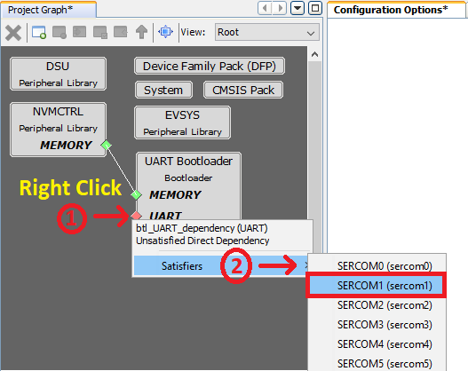
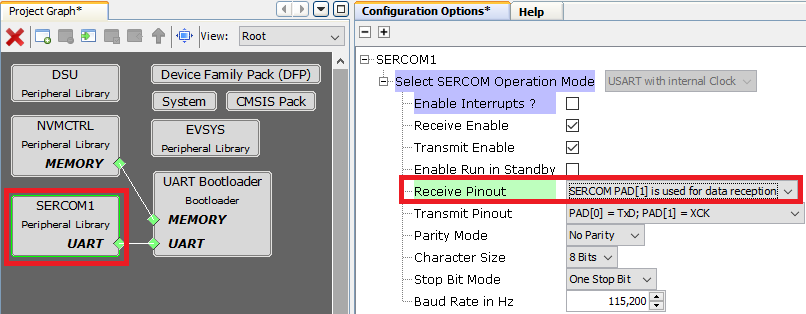
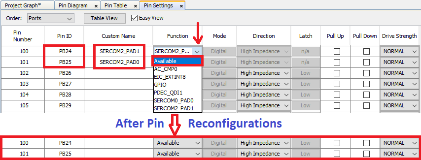
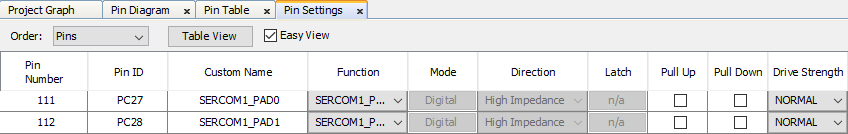
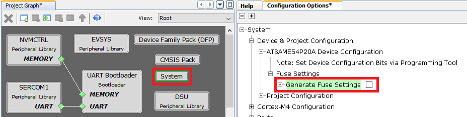
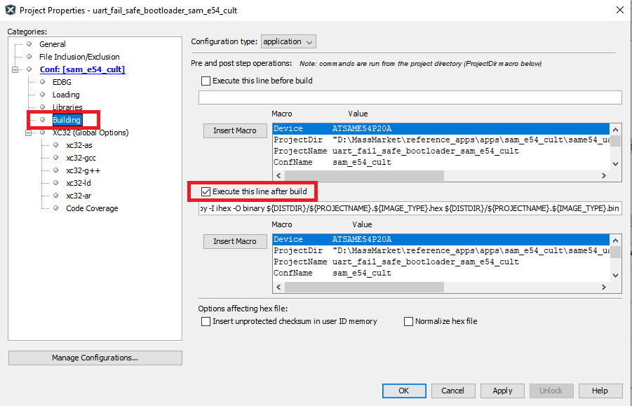
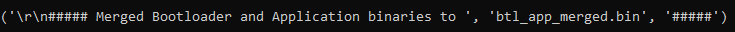
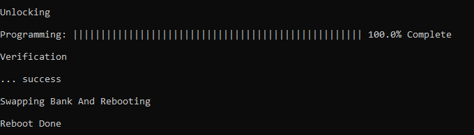
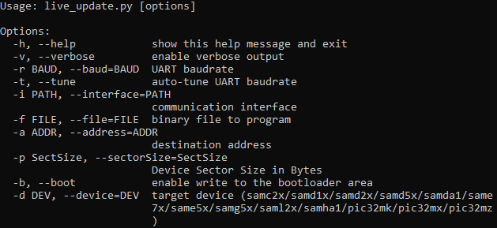
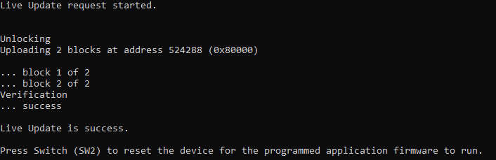

# Live Update Application on SAM E54 Curiosity Ultra Development Board
<h2 align="center"> <a href="https://github.com/MicrochipTech/MPLAB-Harmony-Reference-Apps/releases/latest/download/same54_uart_live_update.zip" > Download </a> </h2>

-----

## Description:

> The Live update application uses the dual bank flash feature available on the SAME54 Microcontrollers (MCUs).
The banks on SAME54 MCU are named as BANK-A and BANK-B. At any point in time, the application considers the bank on which it is currently executing as an active bank while the other bank is marked as an inactive bank. The dual bank flash enables programming the inactive bank with a new version of the firmware while running the current version of the firmware from the active bank.

> The application updates the new version of the firmware to the inactive bank while the current version of the firmware runs from the active bank.

> The Application Task checks the NVM Control status register to identify the flash bank which has the latest version of the firmware (active bank) and toggles a specific LED at a periodic rate. For example, when there is no Live update then the LED1 is toggled for every 500ms if the application running from BANK-A else 1000ms if it is running from BANK-B. When there is a Live update request from the Host PC, after receiving the firmware image, the LED1 stops toggling and LED2 starts toggling with the toggle rate same as LED1. After a successful Live update i.e., by pressing the SW2, the device swaps the banks and resets. Then the LED2 stops toggling and LED1 starts toggling. Here, you can observe the change in the LED1 toggle rate after firmware upgrade. For example, the LED1 is toggled for every 500ms if the application running from BANK-A else 1000ms if it is running from BANK-B.

## Modules/Technology Used:

- Peripheral Modules
	- NVMCTRL
	- DSU
	- SYSTICK
	- SERCOM
	- Harmony Core

## Hardware Used:

- [SAM E54 Curiosity Ultra Development Board](https://www.microchip.com/Developmenttools/ProductDetails/DM320210)

## Software/Tools Used:
 *This project has been verified to work with the following versions of software tools:*

- [MPLAB Harmony v3 "bsp" repo v3.9.0](https://github.com/Microchip-MPLAB-Harmony/bsp/releases/tag/v3.9.0)
- [MPLAB Harmony v3 "csp" repo v3.9.1](https://github.com/Microchip-MPLAB-Harmony/csp/releases/tag/v3.9.1)
- [MPLAB Harmony v3 "core" repo v3.9.1](https://github.com/Microchip-MPLAB-Harmony/core/releases/tag/v3.9.1)
- [MPLAB Harmony v3 "dev_packs" repo v3.9.0](https://github.com/Microchip-MPLAB-Harmony/dev_packs/releases/tag/v3.9.0)
- [MPLAB Harmony v3 "mhc" repo v3.7.2](https://github.com/Microchip-MPLAB-Harmony/mhc/releases/tag/v3.7.2)
- [MPLAB Harmony v3 "bootloader" repo v3.5.0](https://github.com/Microchip-MPLAB-Harmony/bootloader/tree/v3.5.0)
- [MPLAB Harmony v3 "bootloader_apps_uart" repo v3.1.0](https://github.com/Microchip-MPLAB-Harmony/bootloader_apps_uart/releases/tag/v3.1.0)
- MPLAB Harmony 3 Launcher Plugin v3.6.4
- [MPLAB X IDE v5.50](https://www.microchip.com/mplab/mplab-x-ide)
- [MPLAB XC32 Compiler v3.00](https://www.microchip.com/mplab/compilers)
- Windows command prompt
- Python 3.8.0
- Any Serial Terminal application like Tera Term terminal application.

 *Because Microchip regularly update tools, occasionally issue(s) could be discovered while using the newer versions of the tools. If the project doesn’t seem to work and version incompatibility is suspected, It is recommended to double-check and use the same versions that the project was tested with.* 

## Running the Bootloader application:

**For the first time, the Live update application is programmed by using either Harmony basic bootloader or Harmony fail-safe bootloader.**

1. Download the MPLAB Harmony [Bootloader](https://github.com/Microchip-MPLAB-Harmony/bootloader) package.
2. Download the MPLAB Harmony [UART Bootloader Applications](https://github.com/Microchip-MPLAB-Harmony/bootloader_apps_uart) package.
3. Connect a micro USB cable to the DEBUG port of the SAM E54 Curiosity Ultra Development Board.
4. Open the UART Fail Safe Bootloader which is in (path: `<Your Harmony Framework download folder>/bootloader_apps_uart/apps/uart_fail_safe_bootloader/bootloader/firmware/sam_e54_xpro.X`) using the MPLAB X IDE.
5. The project needs to be reconfigured to work on SAM E54 Curiosity Ultra Development Board. Launch the MHC and follow below steps to reconfigure for SAM E54 Curiosity Ultra Development Board.
    * Remove SERCOM2

    

    * Add SERCOM1 to Project Graph

    

    * Configure SERCOM1 peripheral

    

    * Launch Pin Configurations plugin under **MHC->Tools->Pin Configurations**. Remove SERCOM2 Pin configurations.

    

    * Configure SERCOM1 pins.

    

    - **Note:**
      - The SAM E54 Curiosity Ultra Development Board uses SERCOM1 peripheral for EDBG. Hence SERCOM peripheral and its pins need to be reconfigured from SAM E54 Xplained Pro to SAM E54 Curiosity Ultra Development Board.
      - Do not close the MHC as we have to build the project again.
6. **Regenerate the project. Build and program the UART Fail Safe Bootloader using the MPLAB X IDE.**
7. The following shows the steps to rebuild the UART Fail Safe Bootloader using the MPLAB X IDE. This step is to create Bootloader binary image which will be merged with Live Update application to create a single binary image as shown in Step 10.
    * Remove the Device Fuse configurations from the custom linker script as they will be updated by the UART Fail Safe Bootloader project

    

    * Enable Execute this line After Build option in the MPLAB X Project properties->Building option

    

    * Regenerate the project
8. Build the UART Fail Safe Bootloader application again using the MPLAB X IDE **but do not program**.
    * This is required to generate the binary file for Bootloader application
9. Build the Live update application (path: `<Live Update application folder>/firmware/sam_e54_cult.X`) using the MPLAB X IDE **but do not program**.
10. Run the **btl_app_merge_bin.py** script from command prompt to merge the generated Bootloader binary and Live update application binary.
    - `python <Your Harmony Framework download folder>/bootloader/tools_archive/btl_app_merge_bin.py -o 0x2000 -b <Your Harmony Framework download folder>/bootloader_apps_uart/apps/uart_fail_safe_bootloader/bootloader/firmware/sam_e54_xpro.X/dist/<Config Name>/production/<Project Name>.production.bin -a <Live Update application folder>/hex/sam_e54_cult.X.production.bin`
    - Below output should be displayed on command prompt.
    
11. Run the **btl_host.py** from command prompt to program the merged binary to opposite panel. The merged binary **btl_app_merged.bin** will be generated in the path from where the **btl_app_merge_bin.py** was called from.
    - `python <Your Harmony Framework download folder>/bootloader/tools_archive/btl_host.py -v -s -i <COM PORT> -d same5x -a 0x00080000 -f btl_app_merged.bin`
    - **Note:**
      - If you need to know more information on the bootloader host script, refer help for setting up the host script available at `<Your Harmony Framework download folder>/bootloader/doc/help_bootloader.chm and <Your Harmony Framework download folder>/bootloader_apps_uart/docs/index.html`
12. Following screenshot shows successful programming of the application binary.
    * The messages "Swapping Bank And Rebooting and Reboot Done" in below screenshot signifies that bootloading is successful.
    

## Running the Live update application:
1. Perform "Running the Bootloader application" steps mentioned above, if not done already.
2. If the above step is successful, then **LED1 should start blinking** on the SAM E54 Curiosity Ultra Development Board.
3. Run the host script "**live_update.py**" from command prompt available at `<Live Update application folder>/scripts` to program the new version of the firmware to an inactive panel while the current version of the application is being run from the active panel.
    - `python <Live Update application folder>/scripts/live_update.py -v -i <COM PORT> -d same5x -a <Address> -f btl_app_merged.bin`. The merged binary **btl_app_merged.bin** will be generated in the path from where the **btl_app_merge_bin.py** was called from.
    - **Note:** If you need to know more information on the Live Update Script, Open command prompt, goto `<Live Update application folder>/scripts` then enter `python live_update.py --help`. The below output shows the Live Update Script help.
    
    - Below output should be displayed on command prompt.
    
4. LED1 stops blinking and LED2 starts blinking which indicates the application programming is successful.
   * LED1 stops blinking and LED2 toggles for every 500ms then Application is running from BANK A
   * LED1 stops blinking and LED2 toggles for every 1000ms then Application is running from BANK B
5. **Press Switch SW2** to swap the bank and reset the device for the **programmed application firmware to run**.
   * LED2 stops blinking and LED1 toggles for every 500ms then Application is running from BANK A
   * LED2 stops blinking and LED1 toggles for every 1000ms then Application is running from BANK B
6. In case of any error during the Live update both LED1 and LED2 will be turned ON. Follow the below steps recover from the error.
   * Press and hold the Switch SW2 to reset the system then repeat the step 4 to program the Live update application.
   OR
   * Reset or Power cycle the device and repeat from the step 4 to program the Live update application.

## Comments:
- Reference Application Note: [Live Update application on SAME54 MCUs using MPLAB Harmony v3](https://www.microchip.com/wwwappnotes/appnotes.aspx?appnote=en1005443)
- This application demo builds and works out of box by following the instructions above in "Running the Demo" section. If you need to enhance/customize this application demo, you need to use the MPLAB Harmony v3 Software framework. Refer links below to setup and build your applications using MPLAB Harmony.
	- [How to Setup MPLAB Harmony v3 Software Development Framework](https://www.microchip.com/mymicrochip/filehandler.aspx?ddocname=en1000821)
	- [How to Build an Application by Adding a New PLIB, Driver, or Middleware to an Existing MPLAB Harmony v3 Project](http://ww1.microchip.com/downloads/en/DeviceDoc/How_to_Build_Application_Adding_PLIB_%20Driver_or_Middleware%20_to_MPLAB_Harmony_v3Project_DS90003253A.pdf)

## Revision:
- v1.3.0 regenerated and tested demo application
- v1.2.0 regenerated and tested demo application
- v1.1.0 released demo application
