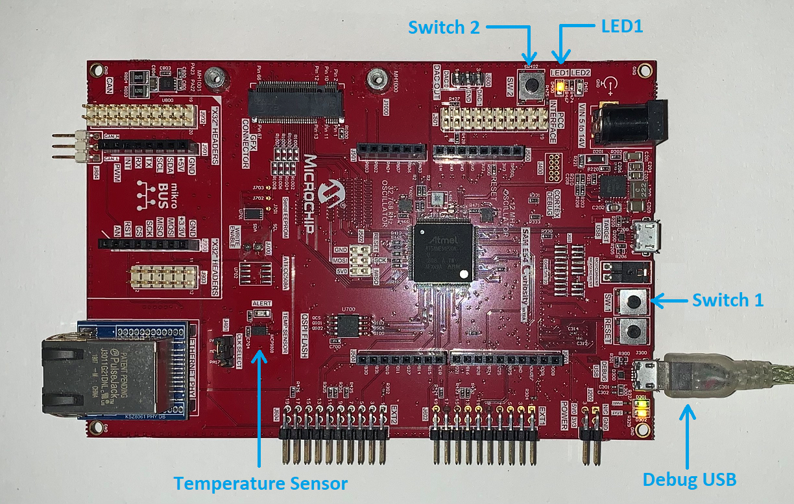
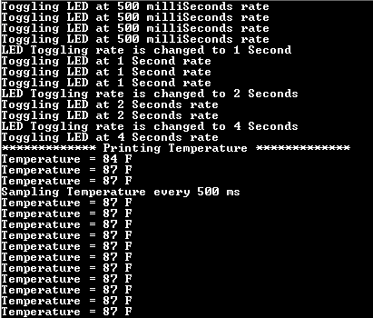

# Getting Started Application with SAM E54 Curiosity Ultra Development Board
-----
## Description

> This application demonstrates an LED1 toggle on timeout basis and print the LED toggling rate on the serial terminal. The periodicity of the timeout will change from 500 milliseconds to one second, two seconds, four seconds and back to 500 milliseconds every time you press the switch SW1 on the SAM E54 Curiosity Ultra Development Board.

> The demo application has additional functionality to print the current room temperature periodically using on board temperature sensor.

## Modules/Technology Used:

- Peripheral Modules      
	- SERCOM
	- RTC
	- EIC
	- DMAC

## Hardware Used:

- [SAM E54 Curiosity Ultra Development Board](https://www.microchip.com/Developmenttools/ProductDetails/DM320210)   

## Software/Tools Used:
 *This project has been verified to work with the following versions of software tools:*  

 - [MPLAB Harmony v3 "csp" repo v3.8.3](https://github.com/Microchip-MPLAB-Harmony/csp/releases/tag/v3.8.3)
 - [MPLAB Harmony v3 "dev_packs" repo v3.8.0](https://github.com/Microchip-MPLAB-Harmony/dev_packs/releases/tag/v3.8.0)  
 - [MPLAB Harmony v3 "mhc" repo v3.6.1](https://github.com/Microchip-MPLAB-Harmony/mhc/releases/tag/v3.6.1)   
 - MPLAB Harmony 3 Launcher Plugin v3.6.2
 - [MPLAB X IDE v5.45](https://www.microchip.com/mplab/mplab-x-ide)
 - [MPLAB XC32 Compiler v2.41](https://www.microchip.com/mplab/compilers)
 - Any Serial Terminal application like Tera Term terminal application.  

  *Because Microchip regularly update tools, occasionally issue(s) could be discovered while using the newer versions of the tools. If the project doesn’t seem to work and version incompatibility is suspected, It is recommended to double-check and use the same versions that the project was tested with.*   

## Hardware Setup:
- Connect the SAM E54 Curiosity Ultra Development Board to the Host PC as a USB Device
	through a Type-A male to micro-B USB cable connected to Micro-B USB (Debug USB) port.  

	

## Programming hex file:
The pre-built hex file can be programmed by following the below steps

### Steps to program the hex file
- Open MPLAB X IDE
- Close all existing projects in IDE, if any project is opened.
- Go to File -> Import -> Hex/ELF File
- In the "Import Image File" window, Step 1 - Create Prebuilt Project, click the "Browse" button to select the prebuilt hex file.
- Select Device has "ATSAME54P20A"
- Ensure the proper tool is selected under "Hardware Tool"
- Click on "Next" button
- In the "Import Image File" window, Step 2 - Select Project Name and Folder, select appropriate project name and folder
- Click on "Finish" button
- In MPLAB X IDE, click on "Make and Program Device" Button. The device gets programmed in sometime.
- Follow the steps in "Running the Demo" section below

## Programming/Debugging Application Project:
- Open the project (same54c_getting_started\firmware\sam_e54_cult.X) in MPLAB X IDE
- Ensure "SAM E54 Curiosity Ultra" is selected as hardware tool to program/debug the application
- Build the code and program the device by clicking on the "make and program" button in MPLAB X IDE tool bar
- Follow the steps in "Running the Demo" section below

## Running the Demo:
- Reset or power cycle the device.
- An LED1  on the SAM E54 Curiosity Ultra Development Board toggles on every timeout basis and the default periodicity of the timeout is 500 milliseconds.
- And the LED toggling rate is displayed on the serial terminal.
- Press the switch SW1 on the SAM E54 Curiosity Ultra Development Board to change the periodicity of the timeout to one second.
- Every subsequent pressing of the switch SW1 on the SAM E54 Curiosity Ultra Development Board changes the periodicity of the timeout to 2 seconds, 4 seconds, 500 milliseconds, and back to 1 second in cyclic order.
- Press the switch SW2 on the SAM E54 Curiosity Ultra Board to read and print the Temperature from the Temperature Sensor.
- The temperature read is displayed on a serial console on a periodical basis.
- Press the switch SW1 on the SAM E54 Curiosity Ultra Development Board to change the
periodicity of the temperature values displayed on the serial console. The periodicity will be changed between 500 milliseconds, one second, two seconds, four seconds and back to 500 milliseconds on every time user press the switch SW1 on the SAM E54 Curiosity Ultra Development Board.
- Below diagram shows the sample output log displayed on command prompt.
    * 

## Comments:
- Getting Started Training Module: [Getting Started with Harmony v3 Peripheral Libraries on SAM D5x/E5x MCUs](https://microchipdeveloper.com/harmony3:same54-getting-started-training-module)
- This application demo builds and works out of box by following the instructions above in "Running the Demo" section. If you need to enhance/customize this application demo, you need to use the MPLAB Harmony v3 Software framework. Refer links below to setup and build your applications using MPLAB Harmony.
	- [How to Setup MPLAB Harmony v3 Software Development Framework](https://www.microchip.com/mymicrochip/filehandler.aspx?ddocname=en1000821)
	- [How to Build an Application by Adding a New PLIB, Driver, or Middleware to an Existing MPLAB Harmony v3 Project](http://ww1.microchip.com/downloads/en/DeviceDoc/How_to_Build_Application_Adding_PLIB_%20Driver_or_Middleware%20_to_MPLAB_Harmony_v3Project_DS90003253A.pdf)

## Revision:
- v1.2.0 released demo application
