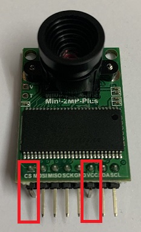
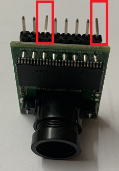
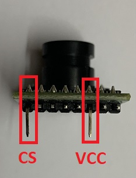
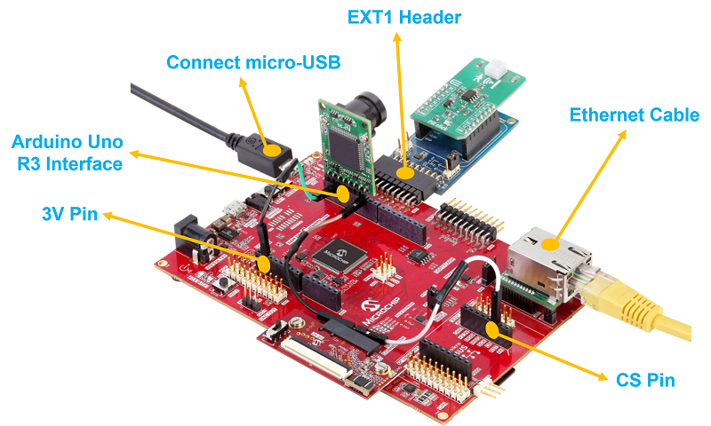
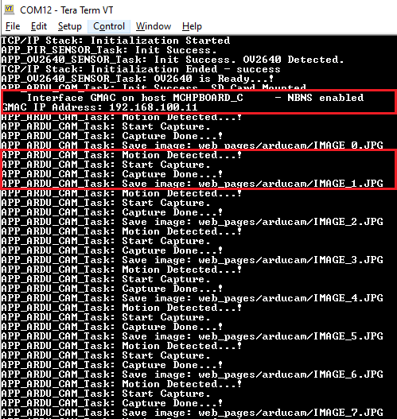
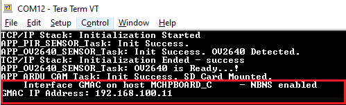
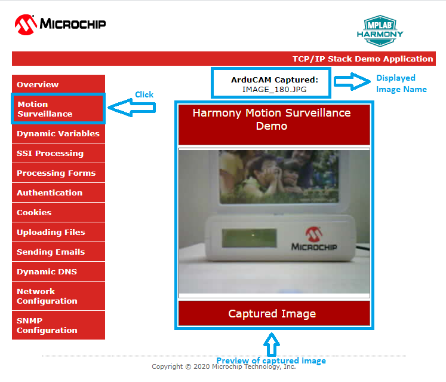
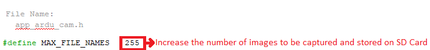

# Motion Surveillance Application on SAM E54 Curiosity Ultra Development Board
<h2 align="center"> <a href="https://github.com/Microchip-MPLAB-Harmony/reference_apps/releases/latest/download/same54c_motion_surveillance.zip" > Download </a> </h2>

-----

## Description:

> The Motion Surveillance application detects a motion in front of the ArduCAM (camera) using the PIR Click (motion sensor) board. ArduCAM captures an image with resolution 320x240 and stores the image in an external storage device (microSD Card). Additionally, the application demonstrates a live preview of captured images.

> The live preview of captured images is demonstrated by running an HTTP web server on the development board. The user connects to the webserver through an internet browser and view the live preview of the captured images.

## Modules/Technology Used:

- Peripheral Modules
	- NVMCTRL
	- PORT
	- SYSTICK
	- SERCOM - USART
	- SERCOM - I2C
	- SERCOM - SPI
	- RTC
	- SDHC
	- TC
	- CRYPTO
	- NVIC
- System Services
	- Debug
	- Command
	- File System
	- Time
	- Console
	- DMA
- Middleware libraries
	- TCP/IP Stack
	- Harmony Core
	- FreeRTOS

## Hardware Used:

- [SAM E54 Curiosity Ultra Development Board](https://www.microchip.com/Developmenttools/ProductDetails/DM320210)
- [Arducam Mini 2MP Plus – OV2640 SPI Camera Module](https://www.arducam.com/product/arducam-2mp-spi-camera-b0067-arduino/)
- [mikroBUS Xplained Pro](https://www.microchip.com/developmenttools/ProductDetails/ATMBUSADAPTER-XPRO)
- [MikroElektronika PIR Click](https://www.mikroe.com/pir-click)
- microSD Card
- [LAN8740 PHY daughter board](https://www.microchip.com/DevelopmentTools/ProductDetails/PartNO/AC320004-3)  
	**Note:** The link above points to **LAN8720A PHY Daughter Board**.
	You can procure the [PIC32MZ Embedded Connectivity with FPU (EF) Starter Kit](https://www.microchip.com/DevelopmentTools/ProductDetails/dm320007) and remove the LAN8740 PHY Daughter board on it and use it for this demo.

## Software/Tools Used:
 This project has been verified to work with the following versions of software tools:  

Refer [Project Manifest](./firmware/src/config/sam_e54_cult_freertos/harmony-manifest-success.yml) present in harmony-manifest-success.yml under the project folder *firmware/src/config/sam_e54_cult_freertos*  
- Refer the [Release Notes](../../../release_notes.md#development-tools) to know the **MPLAB X IDE** and **MHC/MCC** Plugin version.  
- Any Serial Terminal application like Tera Term terminal application.

 Because Microchip regularly update tools, occasionally issue(s) could be discovered while using the newer versions of the tools. If the project doesn’t seem to work and version incompatibility is suspected, It is recommended to double-check and use the same versions that the project was tested with.  To download original version of MPLAB Harmony v3 packages, refer to document [How to Use the MPLAB Harmony v3 Project Manifest Feature](https://microchip.com/DS90003305)

## Hardware Setup:
- Mount the [MikroElektronika PIR Click](https://www.mikroe.com/pir-click) on to the [mikroBUS Xplained Pro](https://www.microchip.com/developmenttools/ProductDetails/ATMBUSADAPTER-XPRO) adapter and then connect the [mikroBUS Xplained Pro](https://www.microchip.com/developmenttools/ProductDetails/ATMBUSADAPTER-XPRO) to EXT1 of the [SAM E54 Curiosity Ultra Development Board](https://www.microchip.com/Developmenttools/ProductDetails/DM320210)
- Bend the CS and VCC pins of [Arducam Mini 2MP Plus – OV2640 SPI Camera Module](https://www.arducam.com/product/arducam-2mp-spi-camera-b0067-arduino/) as shown in the following image.

    
    
    

- Mount the modified [Arducam Mini 2MP Plus – OV2640 SPI Camera Module](https://www.arducam.com/product/arducam-2mp-spi-camera-b0067-arduino/) on to the Arduino R3 Uno compatible interface (J503) present on the [SAM E54 Curiosity Ultra Development Board](https://www.microchip.com/Developmenttools/ProductDetails/DM320210) and connect the ArduCAM pins to the [SAM E54 Curiosity Ultra Development Board](https://www.microchip.com/Developmenttools/ProductDetails/DM320210) as shown bellow.
    - VCC -> 3V3 pin (3.3V) of Arduino R3 Uno compatible interface using a Male to Female Jumper Wire
    - CS  -> PC15 pin of mikroBUS header (CS pin) using a Male to Female Jumper Wire
        - **Note:** The CS pin from the ArduCAM module is not directly mounted to the SERCOM0 (SPI) SSL (PB28) pin coming on the Arduino R3 Uno interface. This is because the SSL (PB28) pin on Arduino R3 Uno interface is found to have signal integrity issue. As an alternative, the CS pin from the ArduCAM module is connected to PC15 pin coming on to the mikroBUS header and used as SPI slave select pin.
    - Connect the remaining ArduCAM pins directly to the Arduino R3 Uno compatible interface (J503). i.e.
        - SCL -> PD08
        - SDA -> PD09
        - GND -> GND
        - SCK -> PB25
        - MISO -> PC25
        - MOSI -> PB24

    
- Mount LAN8740 PHY daughter board on Ethernet PHY header

## TCP/IP Network Setup:
> To run the webserver component in the demo application, the target development board and the host computer should be in the same network. The host computer can be connected to a router via an ethernet cable or Wi-Fi. The target board should be connected to the router via an ethernet cable. Please refer to the following connection diagram.

1. The application is configured and build with [LAN8740 PHY](https://www.microchip.com/wwwproducts/en/LAN8740A) driver. To use a different PHY, use MPLAB® Harmony Configurator (MHC) to select and configure the PHY. Make sure that correct PHY address and configuration flags are used for the particular PHY daughter board. The MII/RMII and I/O configuration flags should match the hardware for the PHY board. This application demonstration assumes that IPv4 is enabled. If IPv4 is not enabled in MHC, the code in app.c will not build and needs to be updated to remove the IPv4 dependencies.

2. The demo has DHCP enabled, and expect a DHCP server to be available. If there is no DHCP server, then the default static IP address will be used: **192.168.100.11**. If this static address does not match your network settings, use MPLAB® Harmony Configurator (MHC) to modify the static IP address of the network interface.

3. The NetBIOS name of the application is specified during the initialization of TCP/IP stack. It is the hostName member of TCPIP_HOSTS_CONFIGURATION structure. The NetBIOS service must be enabled in demonstration configuration, for the demonstration to respond to NetBIOS queries. Alternatively, use the IPv4 or IPv6 address (if IPv6 is enabled) of the board directly.

4. The IPv4 and IPv6 addresses can be obtained by running the TCP/IP Discovery utility on the computer. Ex: ipconfig

## Programming hex file:
The pre-built hex file can be programmed by following the below steps.

### Steps to program the hex file
- Open MPLAB X IDE
- Close all existing projects in IDE, if any project is opened.
- Go to File -> Import -> Hex/ELF File
- In the "Import Image File" window, Step 1 - Create Prebuilt Project, Click the "Browse" button to select the prebuilt hex file.
- Select Device has "ATSAME54P20A"
- Ensure the proper tool is selected under "Hardware Tool"
- Click on Next button
- In the "Import Image File" window, Step 2 - Select Project Name and Folder, select appropriate project name and folder
- Click on Finish button
- In MPLAB X IDE, click on "Make and Program Device" Button. The device gets programmed in sometime
- Follow the steps in "Running the Demo" section below

## Programming/Debugging Application Project:
- Open the project **(same54c_motion_surveillance/firmware/sam_e54_cult_freertos.X)** in MPLAB X IDE
- Ensure "SAM E54 Curiosity Ultra" is selected as hardware tool to program/debug the application
- Build the code and program the device by clicking on the "Make and Program Device" button in MPLAB X IDE tool bar
- Follow the steps in "Running the Demo" section below

## Running the Surveillance application demo:
- Perform **"Hardware Setup"** steps mentioned above, if not done already.
- Ensure a microSD Card is formatted and loaded with the **web_pages** provided within the **same54c_motion_surveillance/firmware/src/web_pages** directory.
    - Insert this microSD Card at **J704** socket (back side of the board) on [SAM E54 Curiosity Ultra Development Board](https://www.microchip.com/Developmenttools/ProductDetails/DM320210).
- Build and download the demonstration project on the target board.
- **Serial Terminal Configuration:**
    - Open a standard terminal application on the computer (like Hyper-terminal or Tera Term) and configure the virtual COM port.
    - Set the serial baud rate to **115200** baud in the terminal application.
    - See that the initialization prints on the serial port terminal.

    

    - When the DHCP client is enabled in the demonstration, wait for the DHCP server to assign an IP address for the development board. This will be printed on the serial port terminal.

    

    - Alternatively: Use **ipconfig** to get the IP address of the board and ping to test if the device is reachable.
- An LED "LED2" on the [SAM E54 Curiosity Ultra Development Board](https://www.microchip.com/Developmenttools/ProductDetails/DM320210) toggles when a motion is detected in front of the motion sensor (PIR click).
- An JPEG format image with **320x240** resolution is captured and stored on the microSD Card. Check the logs in the terminal for the motion detection, start capture and saved image events.
- **Steps to preview the captured images:**
    - **Step 1: Live streaming of captured images:**
        - An HTTP server is hosted by the demonstration application. Open a web browser and direct it to the board running the HTTP server by typing the URL in the address bar (for example, https://mchpboard_c or by entering the assigned IP address i.e. http://192.168.100.11/ in the URL bar), and then press Enter key.
        - On the loaded page, Go to the **Motion Surveillance** under the left **Menu**.
        - The following image shows how the **Motion Surveillance** page looks. When the motion sensor detects a motion, the captured images will be live previewed on this page.

        

        - **Note:**
            - When the motion sensor detects a motion, the ArduCAM captures an image (resolution **320x240**) and stores in **web_pages/arducam** folder on the microSD Card.
            - The maximum number of images that the application stores on the microSD Card is **255**. If the number of images captured exceeds **255**, the application overwrites the images from the beginning. User can increase the storage size based on the available free size of the microSD Card by changing the **MAX_FILE_NAMES** macro in the **app_ardu_cam.h** header file.

            

            - If any error (check logs in the terminal), reset the device or reload the page or click **Motion Surveillance** menu option.

    - **Step 2: Preview the images stored on the microSD Card using Windows Photo Viewer application:**
        - Remove the microSD Card from the **J704** socket (back side of the board) on [SAM E54 Curiosity Ultra Development Board](https://www.microchip.com/Developmenttools/ProductDetails/DM320210) and insert into personal computer.
        - Goto **web_pages/arducam** folder and preview the captured images using any photo preview application.

## Comments:
- Reference Training Module:
	1. [Getting Started with Harmony v3 Peripheral Libraries on SAM D5x/E5x MCUs](https://microchipdeveloper.com/harmony3:same54-getting-started-training-module)
	2. [Low Power Application on SAM E54 (Arm® Cortex® M4) MCUs Using MPLAB® Harmony v3 Peripheral Libraries](https://microchipdeveloper.com/harmony3:low-power-application-on-sam-e54)
- This application demo builds and works out of box by following the instructions above in "Running the Demo" section. If you need to enhance/customize this application demo, you need to use the MPLAB Harmony v3 Software framework. Refer links below to setup and build your applications using MPLAB Harmony.
	- [How to Setup MPLAB Harmony v3 Software Development Framework](https://www.microchip.com/mymicrochip/filehandler.aspx?ddocname=en1000821)
	- [How to Build an Application by Adding a New PLIB, Driver, or Middleware to an Existing MPLAB Harmony v3 Project](http://ww1.microchip.com/downloads/en/DeviceDoc/How_to_Build_Application_Adding_PLIB_%20Driver_or_Middleware%20_to_MPLAB_Harmony_v3Project_DS90003253A.pdf)

## Revision:
- v1.4.0 Added MCC support, Regenerated and tested application.
- v1.3.0 Created demo application
