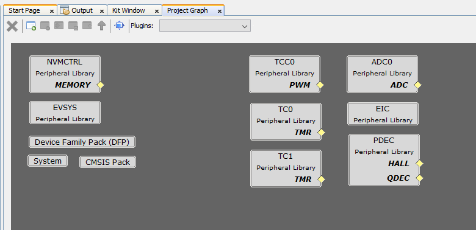
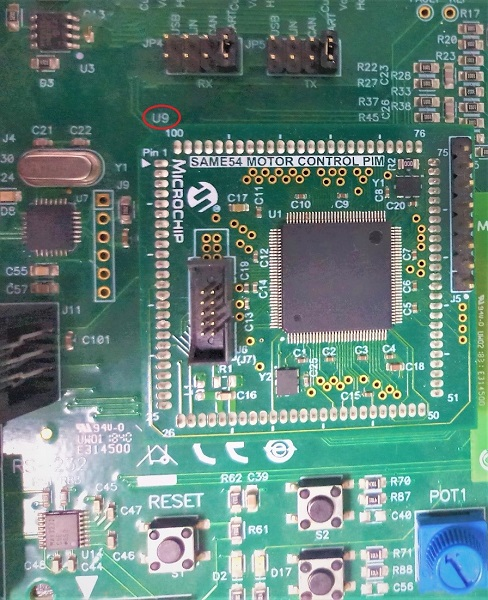
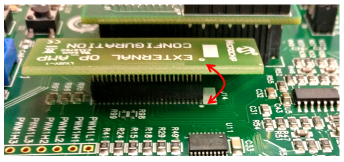
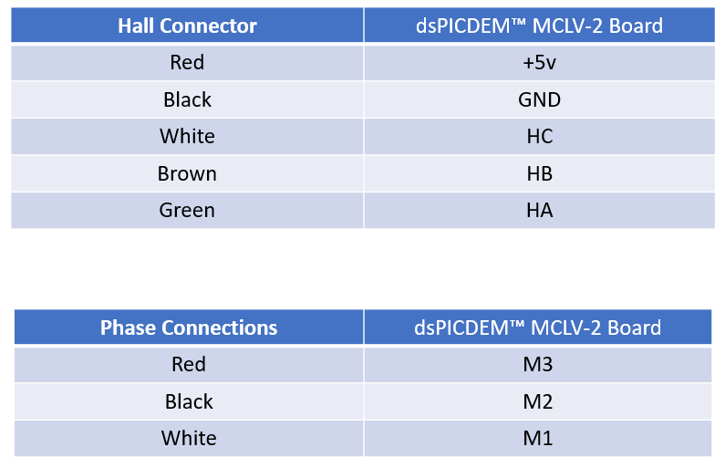
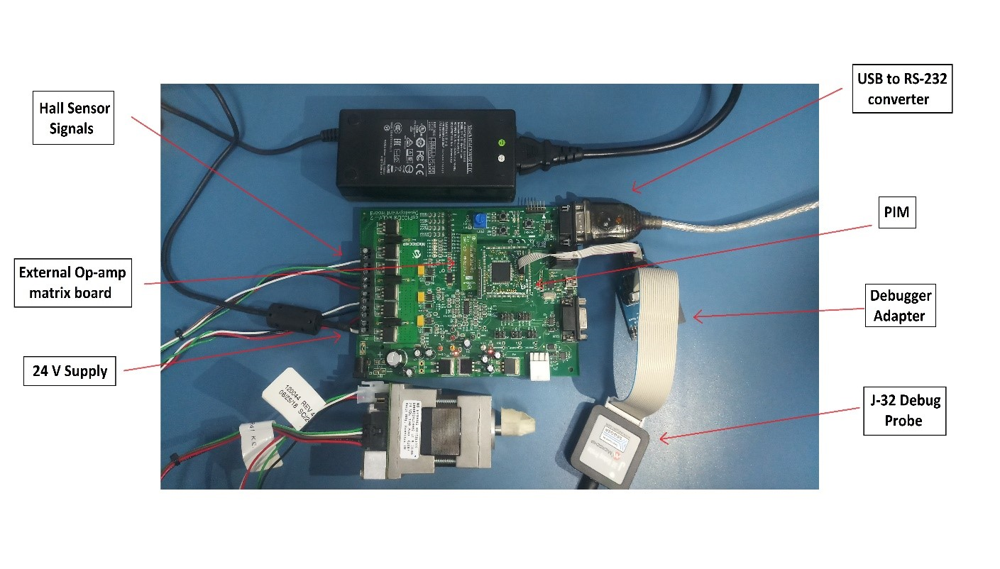

---

grand_parent: Reference Applications
parent: dsPICDEM™ MCLV-2 Development Board with SAME54 Motor Control PIM
title: BLDC Block Commutation
nav_order: 1

---

---

# BLDC Block Commutation using dsPICDEM™ MCLV-2 Development Board with SAME54 Motor Control PIM

<h2 align="center"> <a href="https://github.com/Microchip-MPLAB-Harmony/reference_apps/releases/latest/download/mc_bldc_block_commutation.zip" > Download </a> </h2>

-----

## Description:

> This application run the Block Commutation algorithm for Brushless Direct Current (BLDC) motor with the help of the dsPICDEM™ MCLV-2 Development Board with SAME54 Motor Control PIM.

## Modules/Technology Used:

- Peripheral Modules
	- NVMCTRL
	- EVSYS
	- NVIC
	- PORT
	- TC
	- EIC
	- TCC
	- ADC
	- PDEC

	 

## Hardware Used:

- [dsPICDEM™ MCLV-2 Development Board](https://www.microchip.com/en-us/development-tool/DM330021-2)

- [ATSAME54 Motor Control Plug In Module (PIM)](https://www.microchip.com/en-us/development-tool/MA320207)

- [24v 3-Phase brushless DC motor](https://www.microchip.com/en-us/development-tool/AC300020)

- [J-32 Debug Probe](https://www.microchip.com/en-us/development-tool/DV164232)

- [Debugger Adapter Board](https://www.microchip.com/en-us/development-tool/DV164232)

**Optional:** 

- USB to RS-232 Converter

**Note:** Use any debugger (for example, Atmel-ICE) and adapter that support the ATSAME54 device.

## Software/Tools Used:
 This project has been verified to work with the following versions of software tools:  

Refer [Project Manifest](./firmware/src/config/mc_bldc_block_commutation_dspicdem_mclv2_atsame54_pim/harmony-manifest-success.yml) present in harmony-manifest-success.yml under the project folder *firmware/src/config/mc_bldc_block_commutation_dspicdem_mclv2_atsame54_pim/*  

- Refer the [Release Notes](../../../release_notes.md#development-tools) to know the **MPLAB® X IDE** and **MCC** Plugin version. Alternatively, [Click Here](https://github.com/Microchip-MPLAB-Harmony/reference_apps/blob/master/release_notes.md#development-tools)

 Because Microchip regularly update tools, occasionally issue(s) could be discovered while using the newer versions of the tools. If the project doesn’t seem to work and version incompatibility is suspected, It is recommended to double-check and use the same versions that the project was tested with.  

To download original version of MPLAB® Harmony v3 packages, refer to document [How to Use the MPLAB® Harmony v3 Project Manifest Feature](https://ww1.microchip.com/downloads/en/DeviceDoc/How-to-Use-the-MPLAB-Harmony-v3-Project-Manifest-Feature-DS90003305.pdf)

## Setup:
- Mount the ATSAME54 Motor Control PIM on the U9 header of the dsPICDEM™ MCLV-2 Development Board as shown below.

	
  

- Place the External Op-amp Configuration Matrix board at J14.
	
	
	 

- Connect the motor phases and hall sensor interfaces. Hall and phase connections for Short Hurst motor are given below.

	
  

- Final hardware setup is shown below.

  

## Programming hex file:

The pre-built hex file can be programmed by following the below steps

### Steps to program the hex file

- Open MPLAB® X IDE
- Close all existing projects in IDE, if any project is opened.
- Go to File -> Import -> Hex/ELF File
- In the "Import Image File" window, Step 1 - Create Prebuilt Project, Click the "Browse" button to select the prebuilt hex file.
- Select Device has "ATSAME54P20A"
- Ensure the proper tool is selected under "Hardware Tool"
- Click on "Next" button
- In the "Import Image File" window, Step 2 - Select Project Name and Folder, select appropriate project name and folder
- Click on "Finish" button
- In MPLAB® X IDE, click on "Make and Program Device" Button. The device gets programmed in sometime.
- Follow the steps in "Running the Demo" section below

## Programming/Debugging Application Project:
- Open the project (mc_bldc_block_commutation/firmware/dspicdem_mclv2_atsame54_pim.X) in MPLAB® X IDE
- Ensure "J-32-SN:98xxxx" is selected as hardware tool to program/debug the application
- Build the code and program the device by clicking on the "Make and Program Device" button in MPLAB® X IDE tool bar
- Debugging the project can be done by clicking on the “Debug Main Project” button in MPLAB® X IDE tool bar
- Follow the steps in "Running the Demo" section below.

## Running the Demo:

- Press the **S2** swtich on the **dsPICDEM™ MCLV-2 Development Board** to start the motor.

- Press the **S3** swtich to toggle the motor direction.

- Vary the potentiometer to change the speed of the motor.

- Press the **S2** swtich again to stop the motor.

**Note:** Stop the motor before changing the motor direction. 

## Comments:
- Reference Applications:
	- [Create Your First Motor Control Application Using MPLAB Harmony v3](https://microchipdeveloper.com/harmony3:motor-control-getting-started-training-module)
	- Getting Started Training Module: [Getting Started with Harmony v3 Peripheral Libraries on SAM E54 MCUs](https://microchipdeveloper.com/harmony3:same54-getting-started-training-module)
	- [MPLAB® Harmony 3 Graphics application examples for SAM D5x/E5x Family](https://microchip-mplab-harmony.github.io/gfx_apps_sam_d5x_e5x/)
- This application demo builds and works out of box by following the instructions above in "Running the Demo" section. If you need to enhance/customize this application demo, you need to use the MPLAB® Harmony v3 Software framework. Refer links below to setup and build your applications using MPLAB® Harmony.
	- [Getting Started with MPLAB® Harmony v3 Using MPLAB® Code Configurator](https://www.youtube.com/watch?v=KdhltTWaDp0)
	- [MPLAB® Code Configurator Content Manager for MPLAB® Harmony v3 Projects](https://www.youtube.com/watch?v=PRewTzrI3iE)

## Revision:

- v1.7.0 - Released demo application
