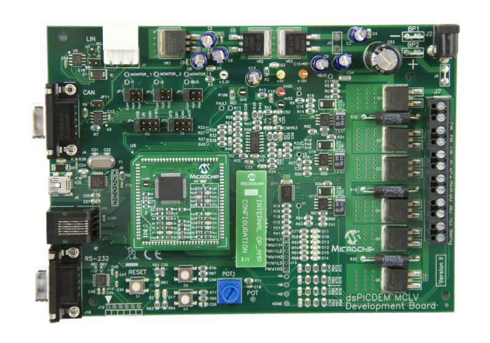

# dsPICDEM™ MCLV-2 Development Board with SAME54 Motor Control PIM
<h4 align="left">  </h4>

This folder contains the MPLAB® Harmony 3 reference applications developed on [dsPICDEM™ MCLV-2 Development Board with SAME54 Motor Control PIM](https://www.microchip.com/en-us/development-tool/DM330021-2).  

|SI No| Demo Name | Download Link |
| --- | --- | -- |
| 1 | [BLDC Block Commutation](./mc_bldc_block_commutation/readme.md) | [Click Here](https://github.com/Microchip-MPLAB-Harmony/reference_apps/releases/latest/download/mc_bldc_block_commutation.zip) |

### More Application Demos

For more application demos on **dsPICDEM™ MCLV-2 Development Board with SAME54 Motor Control PIM** <a href="https://mplab-discover.microchip.com/v2/category/com.microchip.code.examples/com.microchip.ide.project?dsl=ATSAME54P20A+AND+MCLV" target="_blank"> CLICK HERE </a>
