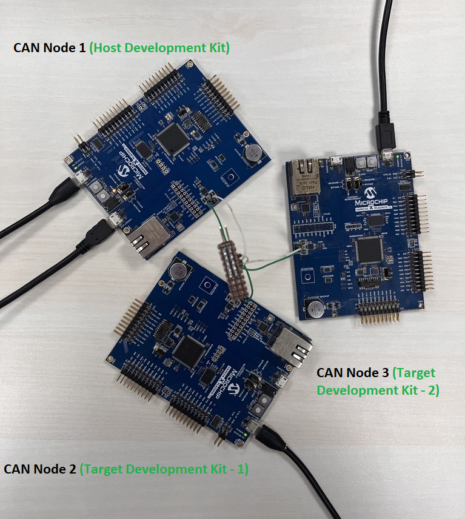
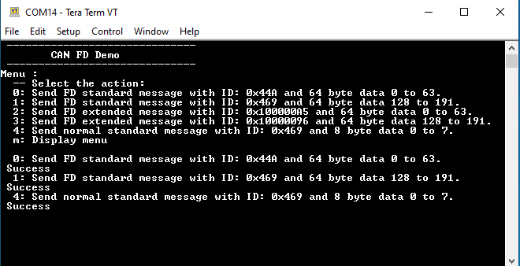
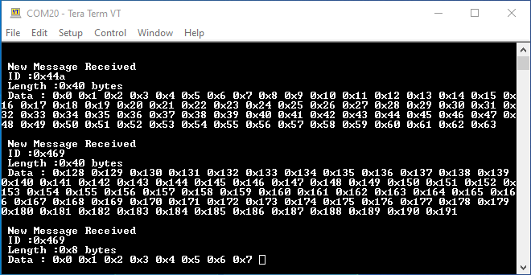
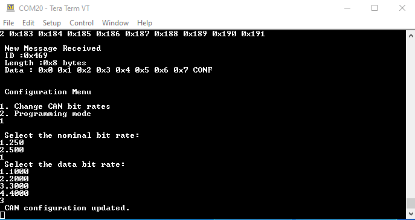
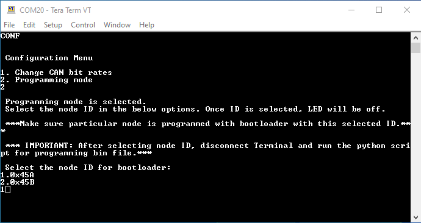
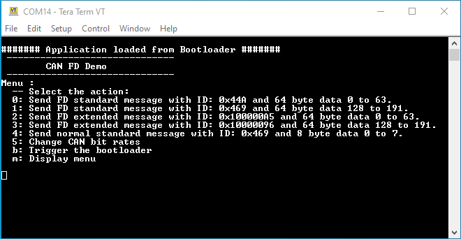

---


# CAN to USB bridge and CAN based NVM bootloader Host Application using SAM E54 Xplained Pro Evaluation Kit

<h2 align="center"> <a href="https://github.com/Microchip-MPLAB-Harmony/reference_apps/releases/latest/download/same54_can_usb_bridge.zip" > Download </a> </h2>

-----

## Description:

> This application acts as a CAN-USB bridge along with CAN based NVM bootloader host application. 
> With CAN-USB bridge functionality, it reads the data transmitted on a CAN network via the CAN peripheral and displays it on the PC serial terminal window using the USB CDC virtual COM port.
> With CAN NVM bootloader host functionality, it sends the binary image from the Python script to the target over the CAN bus for programming.   

## Modules/Technology Used:

- Peripheral Modules  
  - CAN
  - USB
- Core
- Drivers
  - USB Full Speed Driver
- Libraries
  - USB Device Stack
  - Bootloader

## Hardware Used:

- [SAM E54 Xplained Pro Evaluation Kit](https://www.microchip.com/DevelopmentTools/ProductDetails/ATSAME54-XPRO)
- To connect three nodes, terminate the CANL and CANH lines with 120ohm.

## Software/Tools Used:

<span style="color:blue"> This project has been verified to work with the following versions of software tools:</span>  

Refer [Project Manifest](./firmware/can_usb_bridge_with_nvm_bootloader_host/firmware/src/config/sam_e54_xpro/harmony-manifest-success.yml) present in harmony-manifest-success.yml under the project folder *firmware/src/config/sam_e54_xpro*  

- Refer the [Release Notes](../../../release_notes.md#development-tools) to know the **MPLAB X IDE** and **MCC** Plugin version. Alternatively, [Click Here](https://github.com/Microchip-MPLAB-Harmony/reference_apps/blob/master/release_notes.md#development-tools)
- Any Serial Terminal application like Tera Term terminal application.
- Python (from versions 3.9) with the following modules already installed,
  serial, struct, os, optparse, math, __future__

<span style="color:blue"> Because Microchip regularly update tools, occasionally issue(s) could be discovered while using the newer versions of the tools. If the project doesn’t seem to work and version incompatibility is suspected, It is recommended to double-check and use the same versions that the project was tested with. </span> To download original version of MPLAB Harmony v3 packages, refer to document [How to Use the MPLAB Harmony v3 Project Manifest Feature](https://ww1.microchip.com/downloads/en/DeviceDoc/How-to-Use-the-MPLAB-Harmony-v3-Project-Manifest-Feature-DS90003305.pdf)

## Setup:

### Hardware setup with three nodes:



Host Development Kit: CAN Node with the Host application (SAME54 Xplained Pro)

Target Development Kits: Two CAN Nodes, each programmed with Bootloader of different node ID(SAME54 Xplained Pro)

### Hardware setup with two nodes:


Host Development Kit: CAN Node with the Host application (SAME54 Xplained Pro)

Target Development Kit: CAN Node programmed with Bootloader of node ID 0x45A (SAME54 Xplained Pro)

- Connect a micro-USB cable from the PC to the DEBUG USB port of the Host development kit to power the board and for programming and debugging.

- Connect another micro-USB cable from the PC to the Target USB port of the Host development kit, this is for the USB Communication (USB CDC Virtual COM Port).

- Connect a micro-USB cable from the PC to the DEBUG USB port of the Target development kit to power the board and for programming and debugging.

- Connect the ground and CAN lines - CANH and CANL from the Host development kit to the Target development kit.

## Programming hex file:

The pre-built hex file can be programmed by following the below steps

### Steps to program the hex file

- Open MPLAB X IDE
- Close all existing projects in IDE, if any project is opened.
- Go to File -> Import -> Hex/ELF File
- In the "Import Image File" window, Step 1 - Create Prebuilt Project, click the "Browse" button to select the prebuilt hex file.
- Select Device has "ATSAME54P20A"
- Ensure the proper tool is selected under "Hardware Tool"
- Click on "Next" button
- In the "Import Image File" window, Step 2 - Select Project Name and Folder, select appropriate project name and folder
- Click on "Finish" button
- In MPLAB X IDE, click on "Make and Program Device" Button. The device gets programmed in sometime.
- Follow the steps in "Running the Demo" section below

## Programming/Debugging Application Project:

- Open the project (same54_can_usb_bridge/firmware/can_usb_bridge_with_nvm_bootloader_host/firmware/sam_e54_xpro.X) in MPLAB X IDE.
- Ensure "SAM E54 Xplained Pro" is selected as hardware tool to program/debug the application
- Build the code and program the device by clicking on the "Make and Program Device" button in MPLAB X IDE tool bar
- Debugging the project can be done by clicking on the “Debug Main Project” button in MPLAB X IDE tool bar
- Follow the steps in "Running the Demo" section below.

## Running the Demo:

- After programming, the board should get detected as USB virtual COM port in the device manager.
  
  

- **Note:** After programming using EDBG, we can unplug USB cable in DEBUG USB and use only TARGET USB for USB communication. In this case, ensure that current measurement jumpers are in bypass position like below.  
  
  

- Open the Teraterm terminal window on your PC, select the USB Virtual COM port
  
  ## Testing the datalogger Mode:

- Transmit CAN messages from the connected CAN nodes(**Target**).Use the CAN FD interrupt example to program the target(Refer comments below). Open the terminal to send the CAN FD messages.(from the target)
  
  

- See the data logging happening on the USB-CAN Bridge(**Host**) USB terminal window.
  
  
  
  ## Testing the Configurations:

- Type "CONF" or "conf" to view the configuration options in the **Host**. In case of mistyping, Invalid input is displayed on the terminal.
  
  Note: Enable the local echo option in the terminal application that you use to see the character being typed.

- Enter the choice of mode to perform either CAN bit rate change or firmware update.

- Select “Change CAN bit rates” to change the nominal bit rate and the data bit rate as per application requirement.
  
  

- Select the “Programming mode” to program the MCU.
  
  

- After selecting the programmer mode, choose which node to program based on the node ID(Select option 1).
  
  LED0 on the host development kit will be turned OFF once the choice of the node is entered.
  
  Note: Make sure the connected node is programmed with the bootloader of same CAN node ID 0x45A. For CAN bootloader, refer to the can_bootloader/bootloader/firmware in [bootloader_apps_can](https://github.com/Microchip-MPLAB-Harmony/bootloader_apps_can/tree/master/apps/can_bootloader). By default, this CAN bootloader is configured with ID 0x45A. 

- Close the Terminal application and run the Python script to parse your hex file.
  (Note: Programming example shown for test_app_can.bin file which is present in the folder. This test application gets the input from user via EDBG virtual COM port and sends the CAN messages accordingly. Also,it provides options for changing CAN bit rates and bootloader trigger. So,open the target development kit’s Virtual COM port before parsing the hex file)

### Below is the syntax and an example of running the Python script

```
python <harmony-3 path>/reference_apps/apps/sam_e54_xpro/same54_can_usb_bridge/programming_script.py -b <binary_file>
```

```
python <harmony-3 path>/reference_apps/apps/sam_e54_xpro/same54_can_usb_bridge/programming_script.py    -b <harmony-3 path>/reference_apps/apps/sam_e54_xpro/same54_can_usb_bridge/hex/test_app_can/sam_e54_xpro.X.production.bin
```

(Note: Make sure the mentioned Python modules on the Software library section are installed before running the python script)

- Enter the COM port number of the USB-CAN Bridge.

- Press the SW0 button in the host development kit  to program the CAN node with the test_app_can .bin file.
  
  

- Once the programming is complete,
  
  - LED0 on the Host development kit will be turned on indicating success.
  
  - The target development kit will be reset. Upon re-start, the bootloader will jump to the user application.
    
    
  
  - Now, you can see the CAN FD Demo with options for transmitting CAN messages in the target development kit console.

- Select an option of a CAN message to be transmitted to the bridge.

- See the data being logged in the host development kit console
  
  (Note: Both the nodes have a default nominal bitrate of 500 and data bitrate of 3000)

- CAN bit rates can be changed by using option 5 in this application.Try changing the CAN bit rates from the node and check the datalogging.Make sure the same CAN bit rates are configured in the Host Development kit.

If you are connecting third node (TARGET DEVELOPMENT KIT 2) in this setup , program this node with bootloader of different node ID(say 0x45B) and follow the above procedure for programming the application bin file. To change the CAN node ID in the bootloader, change the Standard Filter 1 configurations of CAN1 in MCC. After generating the project in MCC, change the CAN_FILTER_ID in bootloader_can.c file available in the bootloader project. You can also use a different test application test_app_led which is present in same54_can_usb_bridge/firmware folder. Make sure host development kit is reset before programming third node. 

## Comments:

- Reference Applications:  
  - [CAN FD interrrupt](https://microchip-mplab-harmony.github.io/csp_apps_sam_d5x_e5x/apps/can/can_fd_operation_interrupt_timestamp/readme.html). This demo can be used as a CAN node to connect to the **SAM E54 Xplained Pro Evaluation Kit**.
  - [Harmony 3 USB Device application examples](https://microchip-mplab-harmony.github.io/usb_apps_device/)  
- This application demo builds and works out of box by following the instructions above in "Running the Demo" section. If you need to enhance/customize this application demo, you need to use the MPLAB Harmony v3 Software framework. Refer links below to setup and build your applications using MPLAB Harmony.
  - [How to Setup MPLAB Harmony v3 Software Development Framework](https://ww1.microchip.com/downloads/en/DeviceDoc/How_to_Setup_MPLAB_%20Harmony_v3_Software_Development_Framework_DS90003232C.pdf)
  - [How to Build an Application by Adding a New PLIB, Driver, or Middleware to an Existing MPLAB Harmony v3 Project](http://ww1.microchip.com/downloads/en/DeviceDoc/How_to_Build_Application_Adding_PLIB_%20Driver_or_Middleware%20_to_MPLAB_Harmony_v3Project_DS90003253A.pdf)  
  - <span style="color:blue"> **MPLAB Harmony v3 is also configurable through MPLAB Code Configurator (MCC). Refer to the below links for specific instructions to use MPLAB Harmony v3 with MCC.**</span>
    - [Create a new MPLAB Harmony v3 project using MCC](https://microchipdeveloper.com/harmony3:getting-started-training-module-using-mcc)
    - [Update and Configure an Existing MHC-based MPLAB Harmony v3 Project to MCC-based Project](https://microchipdeveloper.com/harmony3:update-and-configure-existing-mhc-proj-to-mcc-proj)
    - [Getting Started with MPLAB Harmony v3 Using MPLAB Code Configurator](https://www.youtube.com/watch?v=KdhltTWaDp0)
    - [MPLAB Code Configurator Content Manager for MPLAB Harmony v3 Projects](https://www.youtube.com/watch?v=PRewTzrI3iE)

## Revision:

- v1.6.0 - Updated application to add CAN Host Bootloader functionality
- v1.5.0 - Released demo application
