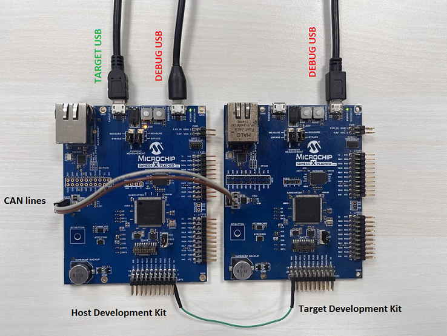
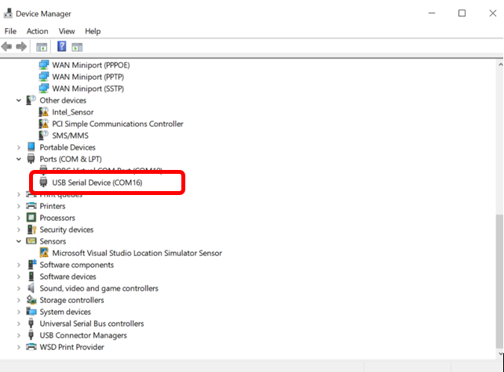
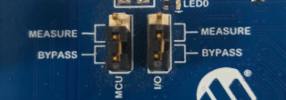
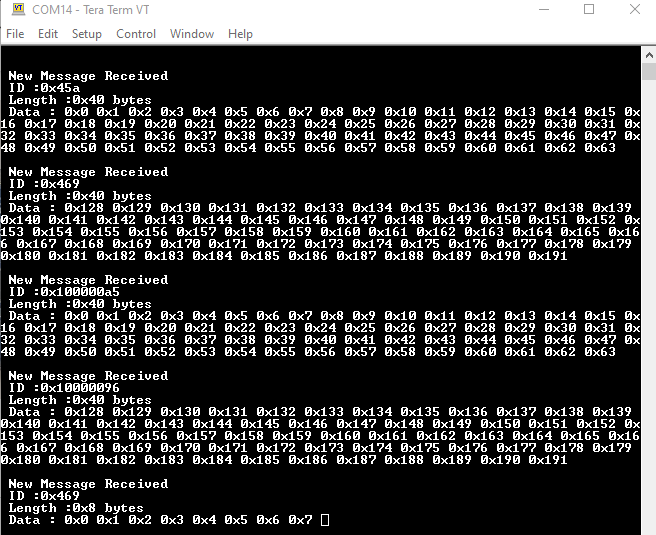

---

# CAN to USB bridge Application using SAM E54 Xplained Pro Evaluation Kit
<h2 align="center"> <a href="https://github.com/Microchip-MPLAB-Harmony/reference_apps/releases/latest/download/same54_can_usb_bridge.zip" > Download </a> </h2>

-----
## Description:

> This application acts as a CAN-USB bridge and enables viewing the data transmitted over an existing CAN network.
It reads the data transmitted on a CAN network via the CAN peripheral and displays it on the PC serial terminal window using the USB CDC virtual COM port.   

## Modules/Technology Used:
- Peripheral Modules  
	- CAN
	- USB

## Hardware Used:

- [SAM E54 Xplained Pro Evaluation Kit](https://www.microchip.com/DevelopmentTools/ProductDetails/ATSAME54-XPRO)

## Software/Tools Used:
 This project has been verified to work with the following versions of software tools:  

Refer [Project Manifest](./firmware/src/config/sam_e54_xpro/harmony-manifest-success.yml) present in harmony-manifest-success.yml under the project folder *firmware/src/config/sam_e54_xpro*  
- Refer the [Release Notes](../../../release_notes.md#development-tools) to know the **MPLAB X IDE** and **MHC/MCC** Plugin version. Alternatively, [Click Here](https://github.com/Microchip-MPLAB-Harmony/reference_apps/blob/master/release_notes.md#development-tools)
- Any Serial Terminal application like Tera Term terminal application.

 Because Microchip regularly update tools, occasionally issue(s) could be discovered while using the newer versions of the tools. If the project doesn’t seem to work and version incompatibility is suspected, It is recommended to double-check and use the same versions that the project was tested with.  To download original version of MPLAB Harmony v3 packages, refer to document [How to Use the MPLAB Harmony v3 Project Manifest Feature](https://ww1.microchip.com/downloads/en/DeviceDoc/How-to-Use-the-MPLAB-Harmony-v3-Project-Manifest-Feature-DS90003305.pdf)

## Setup:
- Connect a micro-USB cable to the DEBUG USB port of the SAME54 Xplained pro to power the board and for programming and debugging.
- Connect another micro-USB cable to the Target USB port of the SAME54 Xplained pro board, this is for the USB Communication (USB CDC Virtual COM Port).
- Connect the CAN lines CANL and CANH to the CAN network.

  

## Programming hex file:
The pre-built hex file can be programmed by following the below steps

### Steps to program the hex file
- Open MPLAB X IDE
- Close all existing projects in IDE, if any project is opened.
- Go to File -> Import -> Hex/ELF File
- In the "Import Image File" window, Step 1 - Create Prebuilt Project, click the "Browse" button to select the prebuilt hex file.
- Select Device has "ATSAME54P20A"
- Ensure the proper tool is selected under "Hardware Tool"
- Click on "Next" button
- In the "Import Image File" window, Step 2 - Select Project Name and Folder, select appropriate project name and folder
- Click on "Finish" button
- In MPLAB X IDE, click on "Make and Program Device" Button. The device gets programmed in sometime.
- Follow the steps in "Running the Demo" section below

## Programming/Debugging Application Project:
- Open the project (can_usb_bridge/firmware/sam_e54_xpro.X) in MPLAB X IDE.
- Ensure "SAM E54 Xplained Pro" is selected as hardware tool to program/debug the application
- Build the code and program the device by clicking on the "Make and Program Device" button in MPLAB X IDE tool bar
- Debugging the project can be done by clicking on the “Debug Main Project” button in MPLAB X IDE tool bar
- Follow the steps in "Running the Demo" section below.

## Running the Demo:
- After programming, the board should get detected as USB virtual COM port in the device manager.

  

- Note:

> After programming using EDBG, we can unplug USB cable in DEBUG USB and use only TARGET USB for USB communication. In this case, ensure that current measurement jumpers are in bypass position like below.

  

- Open the Teraterm terminal window on your PC, select the USB Virtual COM port
- Transmit CAN messages from the nodes, and the messages can be viewed on the USB-CAN bridge terminal window.

  

## Comments:
- Reference Applications:  
	1. [CAN FD interrrupt](https://microchip-mplab-harmony.github.io/csp_apps_sam_d5x_e5x/apps/can/can_fd_operation_interrupt_timestamp/readme.html). This demo can be used as a CAN node to connect to the **SAM E54 Xplained Pro Evaluation Kit**.
	2. [Harmony 3 USB Device application examples](https://microchip-mplab-harmony.github.io/usb_apps_device/)
-This application demo builds and works out of box by following the instructions above in "Running the Demo" section. If you need to enhance/customize this application demo, you need to use the MPLAB Harmony v3 Software framework. Refer links below to setup and build your applications using MPLAB Harmony.
	- [How to Setup MPLAB Harmony v3 Software Development Framework](https://www.microchip.com/mymicrochip/filehandler.aspx?ddocname=en1000821)
	- [How to Build an Application by Adding a New PLIB, Driver, or Middleware to an Existing MPLAB Harmony v3 Project](http://ww1.microchip.com/downloads/en/DeviceDoc/How_to_Build_Application_Adding_PLIB_%20Driver_or_Middleware%20_to_MPLAB_Harmony_v3Project_DS90003253A.pdf)  

## Revision:
- v1.5.0 - Released demo application
