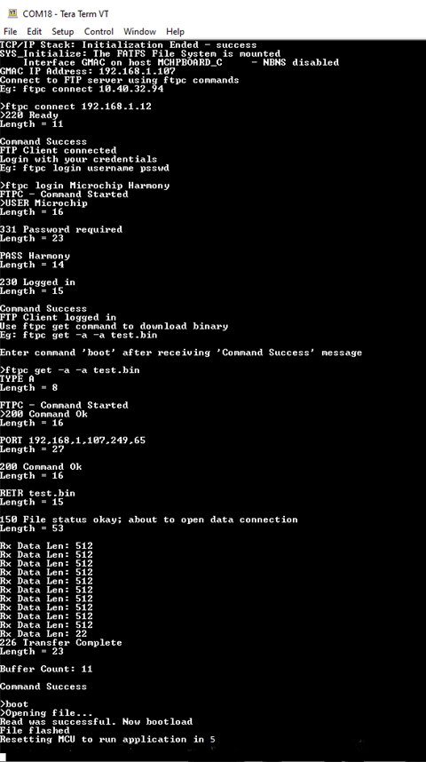

# File Transfer Protocol - Client Application on SAM E54 Xplained Pro Development Board
<h2 align="center"> <a href="https://github.com/Microchip-MPLAB-Harmony/reference_apps/releases/latest/download/same54_ftp_client.zip" > Download </a> </h2>

-----

## Description:

> FTP Client implementation using MPLAB Harmony v3 TCP/IP stack in the SAME54 microcontroller. FTP client demonstration implements an Ethernet bootloader using FTP through which it downloads an application binary from an FTP server and upgrades the firmware by self-programming.

## Modules/Technology Used:

- Peripheral Modules
	- NVMCTRL
	- SERCOM2 (USART)
	- SERCOM4 (SPI)
	- Harmony Core
	- SDHC
	- Timer (TC0)
- Drivers
    - SD Card SPI Driver
- System Services
    - DEBUG
	- Command
	- File System
	- Time
	- Console
- Middleware libraries
    - TCP/IP Stack

## Hardware Used:

- [SAM E54 Xplained Pro Development Board](https://www.microchip.com/en-us/development-tool/atsame54-xpro)
- [IO1 Xplained Pro Extension Kit](
https://www.microchip.com/en-us/development-tool/ATIO1-XPRO)

## Software/Tools Used:
 This project has been verified to work with the following versions of software tools:

Refer [Project Manifest](./firmware/src/config/same54_xpro/harmony-manifest-success.yml) present in harmony-manifest-success.yml under the project folder *firmware/src/config/sam_e54_xpro*  
- Refer the [Release Notes](../../../release_notes.md#development-tools) to know the **MPLAB X IDE** and **MHC/MCC** Plugin version.  
- Any Serial Terminal application like Tera Term terminal application.
- Windows command prompt

 Because Microchip regularly update tools, occasionally issue(s) could be discovered while using the newer versions of the tools. If the project doesn’t seem to work and version incompatibility is suspected, It is recommended to double-check and use the same versions that the project was tested with.  To download original version of MPLAB Harmony v3 packages, refer to document [How to Use the MPLAB Harmony v3 Project Manifest Feature](https://microchip.com/DS90003305)

## Setup:
- Insert microSD Card in the IO1 Xplained Pro. The microSD at this client would store the application binary file which will be downloaded from the server.
- Connect the IO1 Xplained Pro to the Extension 1 of the SAME54 Xplained Pro evaluation kit.
- Connect the micro USB cable from the computer to the DEBUG USB connector on the SAM E54 Xplained Pro Development Kit as shown in the below image.
- Connect the RJ45 cable from SAM E54 Xplained Pro kit's Ethernet Port (Client) to Server's Ethernet Port.

## Programming hex file:
The pre-built hex file can be programmed by following the below steps.

### Steps to program the hex file
- Open MPLAB X IDE
- Close all existing projects in IDE, if any project is opened.
- Go to File -> Import -> Hex/ELF File
- In the "Import Image File" window, Step 1 - Create Prebuilt Project, Click the "Browse" button to select the prebuilt hex file.
- Select Device has "ATSAME54P20A"
- Ensure the proper tool is selected under "Hardware Tool"
- Click on Next button
- In the "Import Image File" window, Step 2 - Select Project Name and Folder, select appropriate project name and folder
- Click on Finish button
- In MPLAB X IDE, click on "Make and Program Device" Button. The device gets programmed in sometime
- Follow the steps in "Running the Demo" section below

## Programming/Debugging Application Project:
- Open the project(ftp_sam_e54/sam_e54_ftp_client/firmware/ftp_client_sam_e54_xpro.X) in MPLAB X IDE
- Ensure "EDBG" is selected as hardware tool to program/debug the application
- Build the code and program the devices by clicking on the "Make and Program" button in MPLAB X IDE tool bar
- Follow the steps in "Running the Demo" section below

## Running the Demo:

### FTP Client Connect
- From a terminal window application (like Tera Term), connect to the COM port enumerated by SAM E54 Xplained Pro evaluation kit.
- Restart the application (i.e reset the SAM E54 board)
- The IP address will be displayed on the terminal once it is ready. Now, user can connect to the FTP server
	- Type “ftpc connect <host ip address>”
- Upon successful connection, enter the login details
	- Type “ftpc login <username> <password>”
- Once logged in, use ftpc get command to download a binary from the server
	- Type “ftpc get -a -a <test.bin>”
- After the binary is successfully downloaded it can be flashed to the MCU by using the ‘boot’ command.
- MCU is reset after the programming is complete and test application code starts executing.

#### Output
-Please make sure the tera term baud rate to be 115200 for seeing the output properly.

-

## Comments:
- Reference Application Note: [File Transfer Protocol using MPLAB Harmony v3 TCP/IP Stack ](http://ww1.microchip.com/downloads/en/Appnotes/File-Transfer-Protocol-Using-MPLAB-Harmonyv3-TCPIP-DS00003475A.pdf)
- Getting Started Training Module: [Getting Started with Harmony v3 Peripheral Libraries on SAM D5x/E5x MCUs](https://microchipdeveloper.com/harmony3:same54-getting-started-training-module)
- This application demo builds and works out of box by following the instructions above in "Running the Demo" section. If you need to enhance/customize this application demo, you need to use the MPLAB Harmony v3 Software framework. Refer links below to setup and build your applications using MPLAB Harmony.
	- [How to Setup MPLAB Harmony v3 Software Development Framework](https://ww1.microchip.com/downloads/en/DeviceDoc/How_to_Setup_MPLAB_%20Harmony_v3_Software_Development_Framework_DS90003232C.pdf)
	- [How to Build an Application by Adding a New PLIB, Driver, or Middleware to an Existing MPLAB Harmony v3 Project](http://ww1.microchip.com/downloads/en/DeviceDoc/How_to_Build_Application_Adding_PLIB_%20Driver_or_Middleware%20_to_MPLAB_Harmony_v3Project_DS90003253A.pdf)
	-  **MPLAB Harmony v3 is also configurable through MPLAB Code Configurator (MCC). Refer to the below links for specific instructions to use MPLAB Harmony v3 with MCC.**
		- [Create a new MPLAB Harmony v3 project using MCC](https://microchipdeveloper.com/harmony3:getting-started-training-module-using-mcc)
		- [Update and Configure an Existing MHC-based MPLAB Harmony v3 Project to MCC-based Project](https://microchipdeveloper.com/harmony3:update-and-configure-existing-mhc-proj-to-mcc-proj)
		- [Getting Started with MPLAB Harmony v3 Using MPLAB Code Configurator](https://www.youtube.com/watch?v=KdhltTWaDp0)
		- [MPLAB Code Configurator Content Manager for MPLAB Harmony v3 Projects](https://www.youtube.com/watch?v=PRewTzrI3iE)

## Revision:

- v1.6.0 Released demo application
