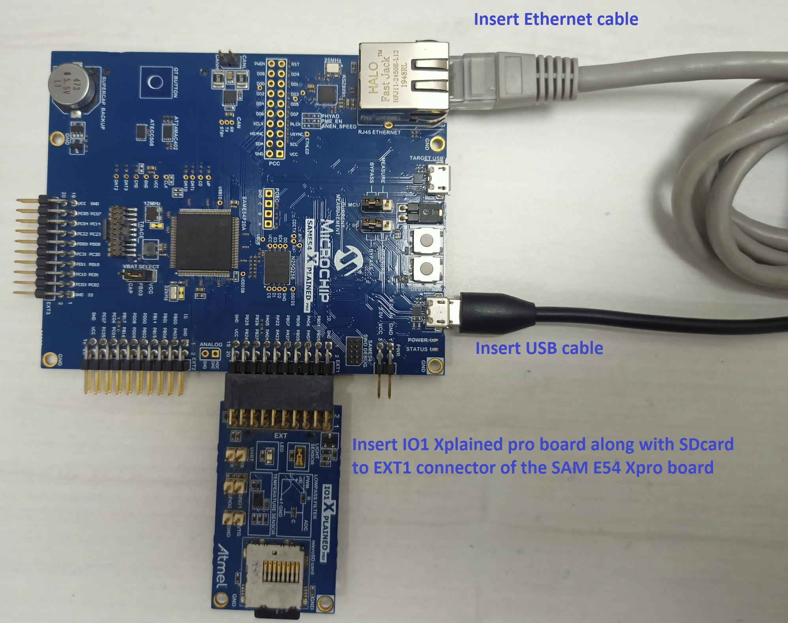
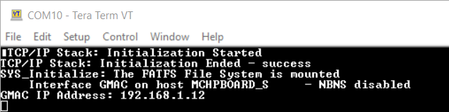
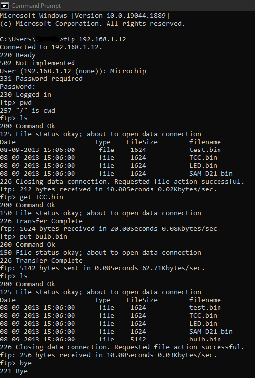

# File Transfer Protocol - Server application on SAM E54 Xplained Pro Development Board
<h2 align="center"> <a href="https://github.com/Microchip-MPLAB-Harmony/reference_apps/releases/latest/download/same54_ftp_server.zip" > Download </a> </h2>

-----

## Description:

> FTP Server implementation using MPLAB Harmony v3 TCP/IP stack in the SAME54 microcontroller.

> FTP Server configuration demonstrates creating an application where FTP server will use FATFS with SDCARD as media through the IO1 Xplained Pro extension kit. The FAT FS File System is used for storing any type of files and FTP server will read from and write to this File system.

## Modules/Technology Used:

- Peripheral Modules
	- NVMCTRL
	- SERCOM2 (USART)
	- SERCOM4 (SPI)
	- Harmony Core
	- SDHC
	- Timer (TC0)
- Drivers
    - SD Card SPI Driver
- System Services
    - DEBUG
	- Command
	- File System
	- Time
	- Console
- Middleware libraries
    - TCP/IP Stack

## Hardware Used:

- [SAM E54 Xplained Pro Development Board](https://www.microchip.com/en-us/development-tool/atsame54-xpro)
- [IO1 Xplained Pro Extension Kit](
https://www.microchip.com/en-us/development-tool/ATIO1-XPRO)

## Software/Tools Used:
 This project has been verified to work with the following versions of software tools:

Refer [Project Manifest](./firmware/src/config/same54_xpro/harmony-manifest-success.yml) present in harmony-manifest-success.yml under the project folder *firmware/src/config/sam_e54_xpro*  
- Refer the [Release Notes](../../../release_notes.md#development-tools) to know the **MPLAB X IDE** and **MHC/MCC** Plugin version.  
- Any Serial Terminal application like Tera Term terminal application.
- Windows command prompt

 Because Microchip regularly update tools, occasionally issue(s) could be discovered while using the newer versions of the tools. If the project doesn’t seem to work and version incompatibility is suspected, It is recommended to double-check and use the same versions that the project was tested with.  To download original version of MPLAB Harmony v3 packages, refer to document [How to Use the MPLAB Harmony v3 Project Manifest Feature](https://microchip.com/DS90003305)  

## Setup:
- Insert the SD Card in the IO1 Xplained Pro. The microSD at the Server will be FAT FS File system, that can store all files, which can be downloaded by client (or) client can upload a file to this storage Media.   
- Connect the IO1 Xpro to EXT1 of the SAME54 Xplained Pro evaluation kit.
- Connect the micro USB cable from the computer to the DEBUG USB connector on the SAM E54 Xplained Pro Kit as shown in the below image.
- Connect the RJ45 cable from SAM E54 Xplained Pro kit's Ethernet Port (Server) to Client's Ethernet Port.

## Programming hex file:
The pre-built hex file can be programmed by following the below steps.

### Steps to program the hex file
- Open MPLAB X IDE
- Close all existing projects in IDE, if any project is opened.
- Go to File -> Import -> Hex/ELF File
- In the "Import Image File" window, Step 1 - Create Prebuilt Project, Click the "Browse" button to select the prebuilt hex file.
- Select Device has "ATSAME54P20A"
- Ensure the proper tool is selected under "Hardware Tool"
- Click on Next button
- In the "Import Image File" window, Step 2 - Select Project Name and Folder, select appropriate project name and folder
- Click on Finish button
- In MPLAB X IDE, click on "Make and Program Device" Button. The device gets programmed in sometime
- Follow the steps in "Running the Demo" section below

## Programming/Debugging Application Project:
- Open the project(ftp_sam_e54/sam_e54_ftp_server/firmware/ftp_server_sam_e54_xpro.X) in MPLAB X IDE
- Ensure "EDBG" is selected as hardware tool to program/debug the application
- Build the code and program the devices by clicking on the "Make and Program" button in MPLAB X IDE tool bar
- Follow the steps in "Running the Demo" section below

## Running the Demo:

### Verifying FTP Server application separately with PC (Client)

- [Configure the PC with any static IP address](https://ww1.microchip.com/downloads/en/Appnotes/Embedded_WebServer_Application_Using%20SAME54_DS00003120A.pdf#page=7)
- Open the command prompt in PC (Client) and enter the FTP Server IP Address.
	- Note: Any FTP Client software with this FTP Server can be used.  
- Connect to this FTP Server through the configured IP address (192.168.1.12).
- Enter login credentials (username & password) once connected
- Once Logged in, enter required ftp commands and perform required operations.
- The output of uploading and downloading single file between client and server is shown below.
	- Note: For the attached application demo the below are the credentials
		- FTP Server IP: 192.168.1.12
		- Username:      Microchip
		- Password:      Harmony
- The path of file for sending/receiving in the host(client) would be c:/users/local pc account. By going to this location and verify the downloaded file from the FTP server (SAM E54 Xpro board).

#### Output
-Once FTP server application is programmed in the SAM E54 xpro board, The initialization status of the TCP/IP stack is seen in the tera term window, also file system mounting status and GMAC IP address are listed in tera term console. Please make sure the tera term baud rate to be 115200 for seeing the output properly.

- 

-Use PC's command prompt for verification of upload and download the files from FTP server

- 

## Comments:
- Reference Application Note: [File Transfer Protocol using MPLAB Harmony v3 TCP/IP Stack ](http://ww1.microchip.com/downloads/en/Appnotes/File-Transfer-Protocol-Using-MPLAB-Harmonyv3-TCPIP-DS00003475A.pdf)
- [TCP/IP WEB-NET & FTP SERVER Running Application documentation](https://github.com/Microchip-MPLAB-Harmony/net_apps_sam_e5x/blob/master/apps/web_ftp_server_mpfs_fatfs/docs/readme_run_application.md)
- Getting Started Training Module: [Getting Started with Harmony v3 Peripheral Libraries on SAM D5x/E5x MCUs](https://microchipdeveloper.com/harmony3:same54-getting-started-training-module)
- This application demo builds and works out of box by following the instructions above in "Running the Demo" section. If you need to enhance/customize this application demo, you need to use the MPLAB Harmony v3 Software framework. Refer links below to setup and build your applications using MPLAB Harmony.
	- [How to Setup MPLAB Harmony v3 Software Development Framework](https://ww1.microchip.com/downloads/en/DeviceDoc/How_to_Setup_MPLAB_%20Harmony_v3_Software_Development_Framework_DS90003232C.pdf)
	- [How to Build an Application by Adding a New PLIB, Driver, or Middleware to an Existing MPLAB Harmony v3 Project](http://ww1.microchip.com/downloads/en/DeviceDoc/How_to_Build_Application_Adding_PLIB_%20Driver_or_Middleware%20_to_MPLAB_Harmony_v3Project_DS90003253A.pdf)
	-  **MPLAB Harmony v3 is also configurable through MPLAB Code Configurator (MCC). Refer to the below links for specific instructions to use MPLAB Harmony v3 with MCC.**
		- [Create a new MPLAB Harmony v3 project using MCC](https://microchipdeveloper.com/harmony3:getting-started-training-module-using-mcc)
		- [Update and Configure an Existing MHC-based MPLAB Harmony v3 Project to MCC-based Project](https://microchipdeveloper.com/harmony3:update-and-configure-existing-mhc-proj-to-mcc-proj)
		- [Getting Started with MPLAB Harmony v3 Using MPLAB Code Configurator](https://www.youtube.com/watch?v=KdhltTWaDp0)
		- [MPLAB Code Configurator Content Manager for MPLAB Harmony v3 Projects](https://www.youtube.com/watch?v=PRewTzrI3iE)

## Revision:
- v1.6.0 Released demo application
