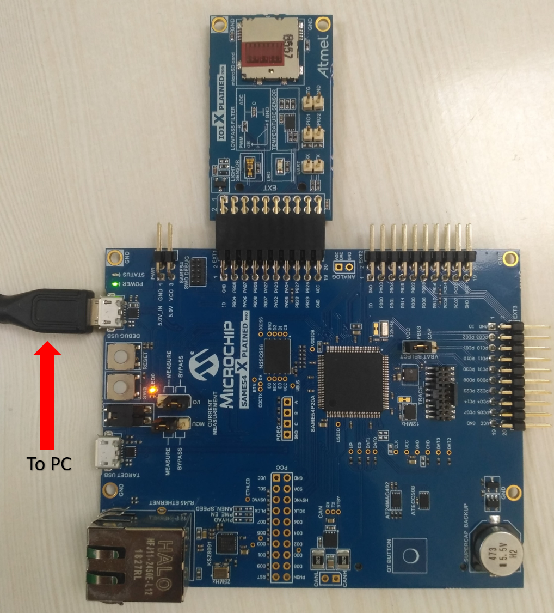
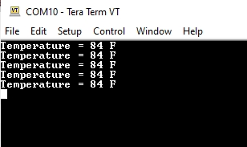
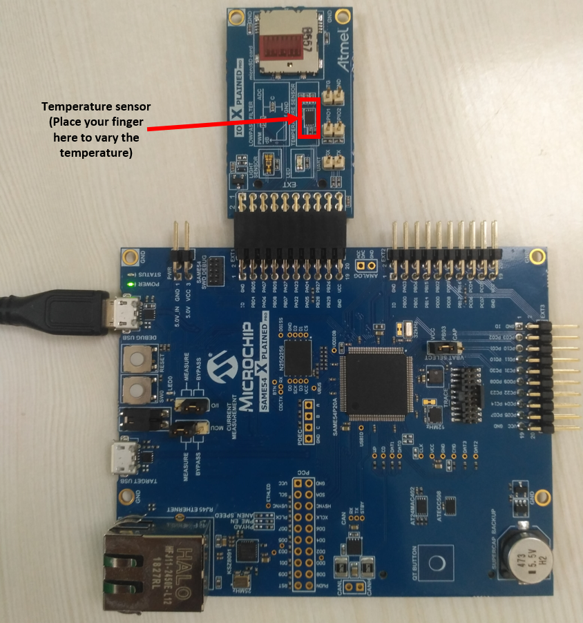
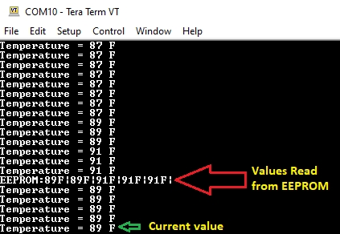

# Getting Started with Harmony v3 Drivers on SAM E54 MCU Using FreeRTOS
<h2 align="center"> <a href="https://github.com/Microchip-MPLAB-Harmony/reference_apps/releases/latest/download/same54_getting_started_freertos.zip" > Download </a> </h2>

-----
## Description:

> The application reads the current room temperature from the temperature sensor on the I/O1 Xplained Pro Extension Kit.
  The temperature reading is displayed on a serial console periodically every second. Further, the application writes the
  temperature readings to EEPROM. When a character is entered on the console, the last five written temperature values are
  read from the EEPROM and displayed on the console. Also, an LED0 is toggled every time the temperature is displayed on
  the serial console

## Modules/Technology Used:
- Peripheral Modules  
	- PORTS
	- SERCOM(I2C)
	- SERCOM(USART)
- Drivers
	- SERCOM(I2C)
	- USART
- Third Party Libraries
	- FreeRTOS

## Hardware Used:

- [SAM E54 Xplained Pro Evaluation Kit](https://www.microchip.com/developmenttools/ProductDetails/atsame54-xpro)
- [I/O1 Xplained Pro Extension Kit](https://www.microchip.com/Developmenttools/ProductDetails/ATIO1-XPRO)

## Software/Tools Used:
 This project has been verified to work with the following versions of software tools:  

Refer [Project Manifest](./firmware/src/config/sam_e54_xpro/harmony-manifest-success.yml) present in harmony-manifest-success.yml under the project folder *firmware/src/config/sam_e54_xpro*  
- Refer the [Release Notes](../../../release_notes.md#development-tools) to know the **MPLAB X IDE** and **MCC** Plugin version. Alternatively, [Click Here](https://github.com/Microchip-MPLAB-Harmony/reference_apps/blob/master/release_notes.md#development-tools).
- Any Serial Terminal application like Tera Term terminal application.

 Because Microchip regularly update tools, occasionally issue(s) could be discovered while using the newer versions of the tools. If the project doesn’t seem to work and version incompatibility is suspected, It is recommended to double-check and use the same versions that the project was tested with.  To download original version of MPLAB Harmony v3 packages, refer to document [How to Use the MPLAB Harmony v3 Project Manifest Feature](https://ww1.microchip.com/downloads/en/DeviceDoc/How-to-Use-the-MPLAB-Harmony-v3-Project-Manifest-Feature-DS90003305.pdf)

## Setup:
- Verify that the temperature sensor (I/O1 Xplained Pro Extension Kit) is connected to Extension Header 1 (EXT1) on the SAM E54 Xplained Pro Evaluation Kit
- The SAM E54 Xplained Pro Evaluation Kit allows using the Embedded Debugger (EDBG) for debugging. Connect the Type-A male to micro-B USB cable to micro-B
  DEBUG USB port to power and debug the SAM E54 Xplained Pro Evaluation Kit  
  

## Programming hex file:
The pre-built hex file can be programmed by following the below steps

### Steps to program the hex file
- Open MPLAB X IDE
- Close all existing projects in IDE, if any project is opened.
- Go to File -> Import -> Hex/ELF File
- In the "Import Image File" window, Step 1 - Create Prebuilt Project, click the "Browse" button to select the prebuilt hex file.
- Select Device has "ATSAME54P20A"
- Ensure the proper tool is selected under "Hardware Tool"
- Click on "Next" button
- In the "Import Image File" window, Step 2 - Select Project Name and Folder, select appropriate project name and folder
- Click on "Finish" button
- In MPLAB X IDE, click on "Make and Program Device" Button. The device gets programmed in sometime.
- Follow the steps in "Running the Demo" section below

## Programming/Debugging Application Project:
- Open the project (same54_getting_started/firmware/drivers_freertos_sam_e54_xpro.X) in MPLAB X IDE
- Ensure "SAM E54 Xplained Pro" is selected as hardware tool to program/debug the application
- Build the code and program the device by clicking on the "Make and Program Device" button in MPLAB X IDE tool bar
- Follow the steps in "Running the Demo" section below

## Running the Demo:
- Open the Tera Term terminal application on your PC (from the Windows® Start menu by pressing the Start button)
- Change the baud rate to 115200
- You should see the temperature values (in °F) being displayed on the terminal every second, as shown below  

    
- Also, notice the LED0 blinking at one second rate
- You may vary the temperature by placing your finger on the temperature sensor (for a few seconds)  
    
- Press any key to display the last five written temperature values from the EEPROM  
    

## Comments:
- Reference Training Module: [Getting Started with Harmony v3 Drivers on SAM E54 MCUs Using FreeRTOS](https://microchipdeveloper.com/harmony3:same54-getting-started-tm-drivers-freertos)
- This application demo builds and works out of box by following the instructions above in "Running the Demo" section. If you need to enhance/customize this application demo, you need to use the MPLAB Harmony v3 Software framework. Refer links below to setup and build your applications using MPLAB Harmony.
	- [How to Setup MPLAB Harmony v3 Software Development Framework](https://ww1.microchip.com/downloads/en/DeviceDoc/How_to_Setup_MPLAB_%20Harmony_v3_Software_Development_Framework_DS90003232C.pdf)
	- [How to Build an Application by Adding a New PLIB, Driver, or Middleware to an Existing MPLAB Harmony v3 Project](http://ww1.microchip.com/downloads/en/DeviceDoc/How_to_Build_Application_Adding_PLIB_%20Driver_or_Middleware%20_to_MPLAB_Harmony_v3Project_DS90003253A.pdf)  

## Revision:
- v1.5.0 - Removed MHC support, Regenerated and tested application.
- v1.4.0 - Updated the hardware setup image, Added MCC support, Regenerated and tested application.
- v1.3.0 - Released demo application
