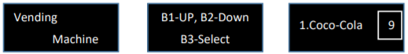
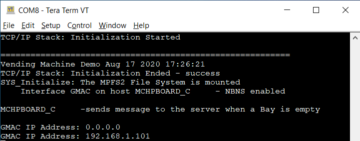
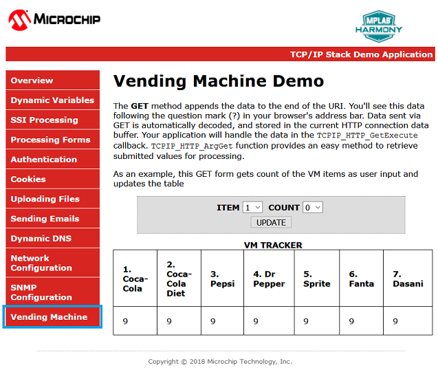
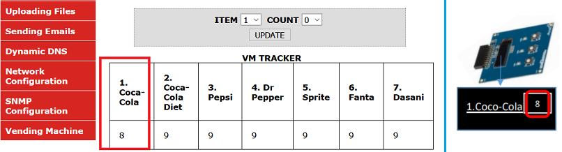
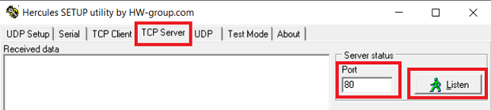
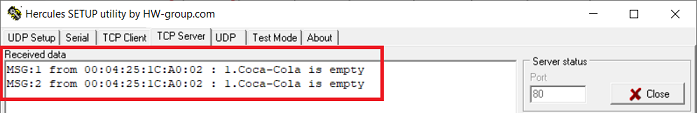
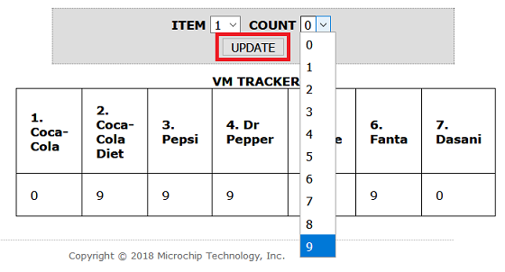

# Vending Machine Application on SAM E54 Xplained Pro Evaluation Kit
-----

## Description:
The application implements an embedded network application to update and track drinks status of a Vending Machine (VM).
- The SAM E54 Xplained Pro Evaluation Kit will act as a HTTP-Server to keep track of the items in the Vending Machine.
- The HTTP-Client (PC web page) talks to the HTTP-server and displays the status of the Vending Machine.
- The OLED1 Xplained Pro extension kit will act man machine interface (MMI) to select and confirm drinks with buttons (up/down and select) and an OLED displays VM information.
  - The VM application uses Button 1 (Down) and Button 2 (Up) to scroll through the VM items and Button 3 to select an item from the Vending Machine.
  - The LEDs above the button indicates a button press with a blink.
  - The OLED (128 x 32) is used to display the drink name and their corresponding number of the items in a Vending Machine.
  - When Button 3 (Select) is pressed the HTTP-Server will decrement the count of an item and updates the HTTPClient(Web page) through ethernet interface.
- When a Bay of a VM is empty it sends out a message to a specific TCP server.

## Modules/Technology Used:
- Peripheral Modules
    - TC
    - NVMCTRL
    - SERCOM(SPI)
    - SERCOM(USART)
- Driver Modules
    - MEMORY
    - I2C Driver
- System service
  - TIME
  - CONSOLE, DEBUG, COMMAND
- Libraries
  - TCP/IP stack
  - Microchip File System (together with [MPFS utility](https://github.com/Microchip-MPLAB-Harmony/net/tree/master/utilities/mpfs_generator))
- Third Party Library
  - FreeRTOS
- gfx mono library (from [ASF](https://www.microchip.com/mplab/avr-support/advanced-software-framework))

## Hardware Used:
- [SAM E54 Xplained Pro Evaluation Kit](https://www.microchip.com/DevelopmentTools/ProductDetails/ATSAME54-XPRO)
- [OLED1 Xplained Pro extension kit](https://www.microchip.com/Developmenttools/ProductDetails/ATOLED1-XPRO)
- Cat 5 Ethernet Cable
- USB Male A to USB Male B Micro Cable

## Software/Tools Used:
 *This project has been verified to work with the following versions of software tools:*

 - [MPLAB Harmony v3 "csp" repo v3.7.1](https://github.com/Microchip-MPLAB-Harmony/csp/releases/tag/v3.7.1)
 - [MPLAB Harmony v3 "dev_packs" repo v3.7.0](https://github.com/Microchip-MPLAB-Harmony/dev_packs/releases/tag/v3.7.0)
 - [MPLAB Harmony v3 "mhc" repo v3.4.1](https://github.com/Microchip-MPLAB-Harmony/mhc/releases/tag/v3.4.1)
 - MPLAB Harmony Configurator Plugin v3.5.1
 - [MPLAB Harmony v3 "core" repo v3.7.2](https://github.com/Microchip-MPLAB-Harmony/core/releases/tag/v3.7.2)
 - [MPLAB Harmony v3 "CMSIS-FreeRTOS" repo v10.3.0](https://github.com/Microchip-MPLAB-Harmony/CMSIS-FreeRTOS/releases/tag/v10.3.0)
 - [MPLAB Harmony v3 "net" repo v3.6.1](https://github.com/Microchip-MPLAB-Harmony/net/releases/tag/v3.6.1)
 - [MPLAB X IDE v5.40](https://www.microchip.com/mplab/mplab-x-ide)
 - [MPLAB XC32 Compiler v2.40](https://www.microchip.com/mplab/compilers)
 - Any Serial Terminal application, such as Tera Term terminal application.
 - Any TCP/IP debug application, such as Hercules SETUP utility - useful serial port terminal (RS-485 or RS-232 terminal) , UDP/IP terminal and TCP/IP Client Server terminal. Produced by www.HW-group.com.

 *Because Microchip regularly update tools, occasionally issue(s) could be discovered while using the newer versions of the tools. If the project doesn’t seem to work and version incompatibility is suspected, It is recommended to double-check and use the same versions that the project was tested with.* 

## Setup:
- Connect the OLED1 Xplained Pro extension kit to Extension Header 1 (EXT1) on the SAM E54 Xplained Pro Evaluation Kit
- Establish a connection between the router/switch with the SAM E54 Xplained Pro Evaluation Kit through the RJ45 connector. Make sure your PC is connected to the same router/switch.
- Connect the micro USB cable from the computer to the DEBUG USB connect on the SAM E54 Xplained Pro Evaluation Kit

  

## Programming hex file:
The pre-built hex file can be programmed by following the below steps

### Steps to program the hex file
- Open MPLAB X IDE
- Close all existing projects in IDE, if any project is opened.
- Go to File -> Import -> Hex/ELF File
- In the "Import Image File" window, Step 1 - Create Prebuilt Project, click the "Browse" button to select the prebuilt hex file.
- Select Device has "ATSAME54P20A"
- Ensure the proper tool is selected under "Hardware Tool"
- Click on "Next" button
- In the "Import Image File" window, Step 2 - Select Project Name and Folder, select appropriate project name and folder
- Click on "Finish" button
- In MPLAB X IDE, click on "Make and Program Device" Button. The device gets programmed in sometime.
- Follow the steps in "Running the Demo" section below

## Programming/Debugging Application Project:
- Open the project (same54_vending_machine\firmware\sam_e54_xpro.X) in MPLAB X IDE
- Ensure "EDBG" is selected as hardware tool to program/debug the application
- Build the code and program the device by clicking on the "make and program" button in MPLAB X IDE tool bar
- Follow the steps in "Running the Demo" section below

## Running the Demo:
- Open the Tera Term terminal application on your PC, select the virtual COM port of SAM E54 Xplained Pro Evaluation Kit, and change the baud rate to 115200
- You should see the text on the OLED screen in series like the screens below:
  
- You should see demo information and IP address (after DHCP success) in Tera Term terminal, as shown below:
  
- Open a web browser and enter the HTTP- Server IP address (e.g. http://192.168.1.101) that you got on the tera term in the previous step. Click on the 'Vending Machine' tab to see the page for the Vending Machine Demo.

  
- Use the Button 1 and Button 2 on the OLED1 Xplained Pro to scroll through the items of the Vending
Machine. Use the Button 3 on the OLED to pick an item from the VM. The count of the corresponding item on the OLED screen will be decremented by 1 and is reflected on the Web page as well as on the OLED screen.

    
- Run Hercules SETUP utility, and start TCP Server to listen on Port 80
    
  - Note: you need to update source code in app.c to fill your PC's IP address that running this TCP Server
- Press the select Button 3 and make one or more item to zero count. After few second, you will see this screen to notice bay empty (e.g. item 1. coca-cola).

    
- In 'Vending Machine' webpage, you can pick an **ITEM** and change the **COUNT** to a new number, then press **UPDATE** to confirm.
    

## Comments:
- Reference Training Module:
  - [Getting Started with Harmony v3 Peripheral Libraries on SAM D5x/E5x MCUs](https://microchipdeveloper.com/harmony3:same70-getting-started-training-module)
  - [Create your first tcpip application](https://github.com/Microchip-MPLAB-Harmony/net/wiki/Create-your-first-tcpip-application)
- This application demo builds and works out of box by following the instructions above in "Running the Demo" section. If you need to enhance/customize this application demo, you need to use the MPLAB Harmony v3 Software framework. Refer links below to setup and build your applications using MPLAB Harmony.
    - [How to Setup MPLAB Harmony v3 Software Development Framework](https://www.microchip.com/mymicrochip/filehandler.aspx?ddocname=en1000821)
    - [How to Build an Application by Adding a New PLIB, Driver, or Middleware to an Existing MPLAB Harmony v3 Project](http://ww1.microchip.com/downloads/en/DeviceDoc/How_to_Build_Application_Adding_PLIB_%20Driver_or_Middleware%20_to_MPLAB_Harmony_v3Project_DS90003253A.pdf)

## Revision:
- v1.0 released demo application
