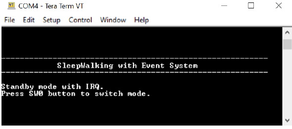
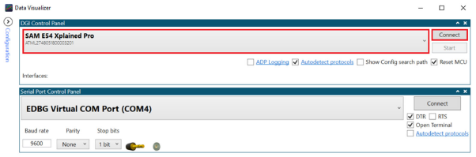
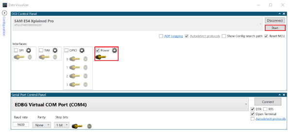

# SleepWalking Application on SAM E54 Xplained Pro Evaluation Kit
<h2 align="center"> <a href="https://github.com/Microchip-MPLAB-Harmony/reference_apps/releases/latest/download/sleepwalking.zip" > Download </a> </h2>

-----

## Description:

> This application demonstrates SleepWalking using the Event System. The application uses an ADC with a Window Monitoring feature in Standby mode for the following use
cases:  
- Standby mode with Interrupts (IRQ)  
- Standby mode with Event System (SleepWalking)  
On power up, the application is in STDBY_IRQ_MODE. It is possible to switch from STDBY_IRQ_MODE to
STDBY_EVSYS_MODE by pressing the switch button (SW0) embedded on the SAM E54 Xplained Pro board. The
application wakes up from Sleep mode and enters into ACTIVE_MODE when the embedded light sensor on the I/O1
Xplained Pro extension kit is covered.

## Modules/Technology Used:

- Peripheral Modules
	- ADC
	- CMCC
	- DMAC
	- EVSYS
	- NVMCTRL
	- PM
	- RTC
	- SERCOM
	- SUPC
	- SYSTICK
- STDIO Library

## Hardware Used:

- [SAM E54 Xplained Pro Evaluation Kit](https://www.microchip.com/developmenttools/ProductDetails/atsame54-xpro)   
- [I/O1 Xplained Pro Extension Kit](https://www.microchip.com/DevelopmentTools/ProductDetails/ATIO1-XPRO)

## Software/Tools Used:
 This project has been verified to work with the following versions of software tools:  

Refer [Project Manifest](./firmware/src/config/sam_e54_xpro/harmony-manifest-success.yml) present in harmony-manifest-success.yml under the project folder *firmware/src/config/sam_e54_xpro*  
- Refer the [Release Notes](../../../release_notes.md#development-tools) to know the **MPLAB X IDE** and **MCC** Plugin version. Alternatively, [Click Here](https://github.com/Microchip-MPLAB-Harmony/reference_apps/blob/master/release_notes.md#development-tools)   
- Any Serial Terminal application like Tera Term terminal application.  
- [Standalone Data Visualizer](https://www.microchip.com/mplab/avr-support/data-visualizer)  

 Because Microchip regularly update tools, occasionally issue(s) could be discovered while using the newer versions of the tools. If the project doesn’t seem to work and version incompatibility is suspected, It is recommended to double-check and use the same versions that the project was tested with.  To download original version of MPLAB Harmony v3 packages, refer to document [How to Use the MPLAB Harmony v3 Project Manifest Feature](https://ww1.microchip.com/downloads/en/DeviceDoc/How-to-Use-the-MPLAB-Harmony-v3-Project-Manifest-Feature-DS90003305.pdf)

## Setup:
- Ensure jumper to measure MCU current is set to MEASURE
- Ensure jumper to measure I/O current is set to BYPASS
- Connect the I/O1 Xplained Pro Extension Kit to the EXT XPRO connector 2 on the SAM E54 Xplained Pro Evaluation Kit
- Connect the micro USB cable from the computer to the DEBUG USB connector on the SAM E54 Xplained Pro Evaluation Kit
- 

## Programming hex file:
The pre-built hex file can be programmed by following the below steps.  

### Steps to program the hex file
- Open MPLAB X IDE
- Close all existing projects in IDE, if any project is opened.
- Go to File -> Import -> Hex/ELF File
- In the "Import Image File" window, Step 1 - Create Prebuilt Project, Click the "Browse" button to select the prebuilt hex file.
- Select Device has "ATSAME54P20A"
- Ensure the proper tool is selected under "Hardware Tool"
- Click on Next button
- In the "Import Image File" window, Step 2 - Select Project Name and Folder, select appropriate project name and folder
- Click on Finish button
- In MPLAB X IDE, click on "Make and Program Device" Button. The device gets programmed in sometime
- Follow the steps in "Running the Demo" section below

## Programming/Debugging Application Project:
- Open the project (sleepwalking\firmware\sam_e54_xpro.X) in MPLAB X IDE
- Ensure "SAM E54 Xplained Pro" is selected as hardware tool to program/debug the application
- Build the code and program the device by clicking on the "make and program" button in MPLAB X IDE tool bar
- Follow the steps in "Running the Demo" section below

## Running the Demo:

- Open Tera Term or any equivalent serial communication tool  
- In the Tera Term: New Connection window, select the Serial Port number allocated to the connected SAM E54  
- Configure the Tera Term Serial port interface to 115200 speed  
- Reset the board by pressing the reset button. The application will start by displaying the following message on the serial terminal.  

   
- Open the standalone Data Visualizer tool  
- In the Data Visualizer window, select SAM E54 Xplained Pro, and then click Connect  
  
- Once the protocols are displayed, select the protocol Power and then click Start  
  
- The Data Visualizer will display the power consumption details in the Power Analysis window  
  
- When the application starts, the device will run on Standby with IRQ mode. The data analyzer shows the power consumption of the device when the CPU is woken up every 10 milliseconds by an RTC Compare ‘0’ interrupt to start an ADC conversion  
- Using the SW0 push button, it is possible to change the application mode from Standby with IRQ to SleepWalking. In this mode the CPU is woken up only when an ADC window monitoring interrupt occurs. The data analyzer shows the power consumption of the device when running in Standby with the Event System (SleepWalking)  

## Comments:
- Reference Application Note: [SleepWalking with Event System Using the SAM E54](http://ww1.microchip.com/downloads/en/Appnotes/SleepWalking_%20with_%20Event_%20System_Using%20_%20SAME54_AN_DS00003342A.pdf)
- Getting Started Training Module: [Getting Started with Harmony v3 Peripheral Libraries on SAM D5x/E5x MCUs](https://microchipdeveloper.com/harmony3:same54-getting-started-training-module)  	
- This application demo builds and works out of box by following the instructions above in "Running the Demo" section. If you need to enhance/customize this application demo, you need to use the MPLAB Harmony v3 Software framework. Refer links below to setup and build your applications using MPLAB Harmony
	- [How to Setup MPLAB Harmony v3 Software Development Framework](https://ww1.microchip.com/downloads/en/DeviceDoc/How_to_Setup_MPLAB_%20Harmony_v3_Software_Development_Framework_DS90003232C.pdf)
	- [How to Build an Application by Adding a New PLIB, Driver, or Middleware to an Existing MPLAB Harmony v3 Project](http://ww1.microchip.com/downloads/en/DeviceDoc/How_to_Build_Application_Adding_PLIB_%20Driver_or_Middleware%20_to_MPLAB_Harmony_v3Project_DS90003253A.pdf)
	-  **MPLAB Harmony v3 is also configurable through MPLAB Code Configurator (MCC). Refer to the below links for specific instructions to use MPLAB Harmony v3 with MCC.**
		- [Create a new MPLAB Harmony v3 project using MCC](https://microchipdeveloper.com/harmony3:getting-started-training-module-using-mcc)
		- [Update and Configure an Existing MHC-based MPLAB Harmony v3 Project to MCC-based Project](https://microchipdeveloper.com/harmony3:update-and-configure-existing-mhc-proj-to-mcc-proj)
		- [Getting Started with MPLAB Harmony v3 Using MPLAB Code Configurator](https://www.youtube.com/watch?v=KdhltTWaDp0)
		- [MPLAB Code Configurator Content Manager for MPLAB Harmony v3 Projects](https://www.youtube.com/watch?v=PRewTzrI3iE)	

## Revision:
- v1.5.0 - Removed MHC support, Regenerated and tested application.
- v1.4.0 - Added MCC support, Regenerated and tested application.
- v1.3.0 - Regenerated and tested application
- v1.2.0 - Regenerated and tested application
- v1.1.0 regenerated and tested the demo application
- v1.0.0 released demo application
