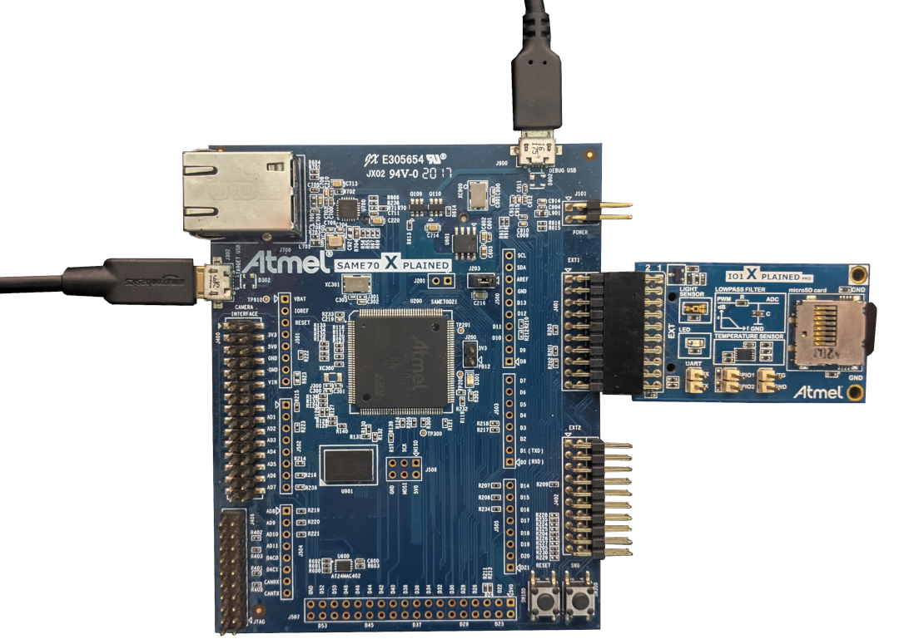
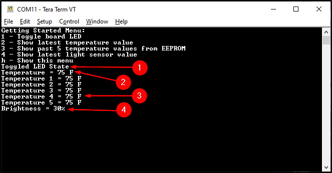

# Getting Started with Drivers and Middleware (USB) on SAM E70 Xplained Evaluation Kit
<h2 align="center"> <a href="https://github.com/Microchip-MPLAB-Harmony/reference_apps/releases/latest/download/getting_started_drivers_middleware.zip" > Download </a> </h2>

-----
## Description:

> This application reads the current room temperature from the [AT30TSE758A](https://www.microchip.com/wwwproducts/en/AT30TSE758A) temperature sensor chip on the I/O1 Xplained Pro every second using I2C. This is indicated by a blinking orange LED on the I/O1 Xplained Pro. Further, it also writes these temperature values into the sensor chip's own integrated EEPROM using the same I2C peripheral instance. The application also uses an ADC channel to read the output voltage of the [TEMT6000](https://www.vishay.com/docs/81579/temt6000.pdf) ambient light sensor on the I/O1 Xplained Pro Extension Kit and displays it as a percentage of the sensor's full-scale output when requested through the serial terminal menu.

> The serial terminal menu is made available through the SAM E70 Xplained Evaluation Kit's TARGET USB port by configuring it as a USB CDC class device. This menu allows you to fetch temperature, light sensor data and even toggle the LED on the SAME70 Xplained Evaluation Kit.

## Modules/Technology Used:
- Peripheral Modules  
	- PORTS
	- Timer
- Drivers
	- TWIHS(I2C)
	- USART
	- USB CDC
- System Services
	- Timer
- Middleware
	- USB Device Stack (USBHS)

## Hardware Used:

- [SAM E70 Xplained Evaluation Kit](https://www.microchip.com/DevelopmentTools/ProductDetails/PartNO/ATSAME70-XPLD)
- [I/O1 Xplained Pro Extension Kit](https://www.microchip.com/Developmenttools/ProductDetails/ATIO1-XPRO)

## Software/Tools Used:
 This project has been verified to work with the following versions of software tools:  

Refer [Project Manifest](./firmware/src/config/sam_e70_xpld/harmony-manifest-success.yml) present in harmony-manifest-success.yml under the project folder *firmware/src/config/sam_e70_xpld*  
- Refer the [Release Notes](../../../release_notes.md#development-tools) to know the **MPLAB X IDE** and **MCC** Plugin version. Alternatively, [Click Here](https://github.com/Microchip-MPLAB-Harmony/reference_apps/blob/master/release_notes.md#development-tools).
- Any Serial Terminal application like Tera Term terminal application.

 Because Microchip regularly update tools, occasionally issue(s) could be discovered while using the newer versions of the tools. If the project doesn’t seem to work and version incompatibility is suspected, It is recommended to double-check and use the same versions that the project was tested with.  To download original version of MPLAB Harmony v3 packages, refer to document [How to Use the MPLAB Harmony v3 Project Manifest Feature](https://ww1.microchip.com/downloads/en/DeviceDoc/How-to-Use-the-MPLAB-Harmony-v3-Project-Manifest-Feature-DS90003305.pdf)

## Setup:
- Verify that the temperature sensor (I/O1 Xplained Pro Extension Kit) is connected to Extension Header 1 (EXT1) on the SAM E70 Xplained Evaluation Kit
- The SAM E70 Xplained Evaluation Kit allows the Embedded Debugger (EDBG) to be used for programming and debugging. Connect the Type-A male to micro-B USB cable to the
  micro-B DEBUG USB port to power and debug the SAM E70 Xplained Evaluation Kit.
- Connect the Type-A male to micro-B USB cable to the
  micro-B TARGET USB port which is configured as USB CDC class device to test the demo.
- **Note:**
    - The kit can be powered from the EDBG USB or from the target USB.
    - The kit automatically selects a source to draw power. Priority is given to TARGET USB power input.

	

## Programming hex file:
The pre-built hex file can be programmed by following the below steps

### Steps to program the hex file
- Open MPLAB X IDE
- Close all existing projects in IDE, if any project is opened.
- Go to File -> Import -> Hex/ELF File
- In the "Import Image File" window, Step 1 - Create Prebuilt Project, click the "Browse" button to select the prebuilt hex file.
- Select Device has "ATSAME70Q21B"
- Ensure the proper tool is selected under "Hardware Tool"
- Click on "Next" button
- In the "Import Image File" window, Step 2 - Select Project Name and Folder, select appropriate project name and folder
- Click on "Finish" button
- In MPLAB X IDE, click on "Make and Program Device" Button. The device gets programmed in sometime.
- Follow the steps in "Running the Demo" section below

## Programming/Debugging Application Project:
- Open the project (getting_started_drivers_middleware/firmware/sam_e70_xult.X) in MPLAB X IDE
- Ensure "SAM E70 Xplained" is selected as hardware tool to program/debug the application
- Build the code and program the device by clicking on the "Make and Program Device" button in MPLAB X IDE tool bar
- Follow the steps in "Running the Demo" section below

## Running the Demo:
- Open the Tera Term terminal application on your PC (from the Windows® Start menu by pressing the Start button)
- Configure the TARGET USB port in the Tera terminal application and change the baud rate to 115200
- Press **"h"** to show the **Getting Started Menu**.
    - **1** - Toggle board LED ()
    - **2** - Show latest temperature value
    - **3** - Show past 5 temperature values from EEPROM
    - **4** - Show latest light sensor value
    - **h** - Show this menu

    

## Comments:
- Reference Training Module: [Getting Started with USB on SAM MCUs Using MPLAB® Harmony v3](https://microchipdeveloper.com/harmony3:usb-getting-started-training-module)
- This application demo builds and works out of box by following the instructions above in "Running the Demo" section. If you need to enhance/customize this application demo, you need to use the MPLAB Harmony v3 Software framework. Refer links below to setup and build your applications using MPLAB Harmony.
	- [How to Setup MPLAB Harmony v3 Software Development Framework](https://ww1.microchip.com/downloads/en/DeviceDoc/How_to_Setup_MPLAB_%20Harmony_v3_Software_Development_Framework_DS90003232C.pdf)
	- [How to Build an Application by Adding a New PLIB, Driver, or Middleware to an Existing MPLAB Harmony v3 Project](http://ww1.microchip.com/downloads/en/DeviceDoc/How_to_Build_Application_Adding_PLIB_%20Driver_or_Middleware%20_to_MPLAB_Harmony_v3Project_DS90003253A.pdf)  
	-  **MPLAB Harmony v3 is also configurable through MPLAB Code Configurator (MCC). Refer to the below links for specific instructions to use MPLAB Harmony v3 with MCC.**
		- [Create a new MPLAB Harmony v3 project using MCC](https://microchipdeveloper.com/harmony3:getting-started-training-module-using-mcc)
		- [Update and Configure an Existing MHC-based MPLAB Harmony v3 Project to MCC-based Project](https://microchipdeveloper.com/harmony3:update-and-configure-existing-mhc-proj-to-mcc-proj)
		- [Getting Started with MPLAB Harmony v3 Using MPLAB Code Configurator](https://www.youtube.com/watch?v=KdhltTWaDp0)
		- [MPLAB Code Configurator Content Manager for MPLAB Harmony v3 Projects](https://www.youtube.com/watch?v=PRewTzrI3iE)	

## Revision:
- v1.5.0 - Removed MHC support, Regenerated and tested application.
- v1.4.0 - Added MCC support, Regenerated and tested application.
- v1.3.0 - regenerated and tested application
- v1.2.0 - Created demo application
