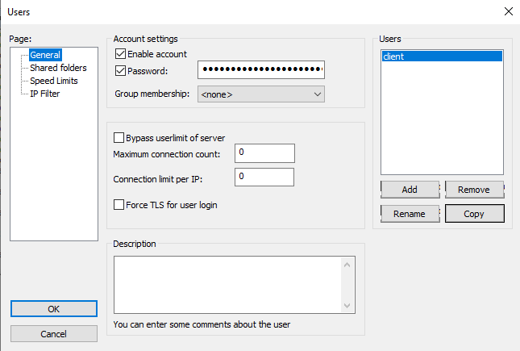
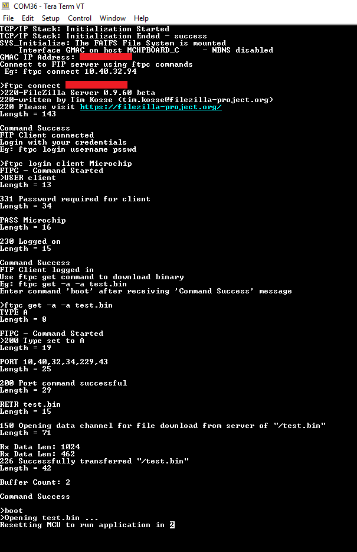
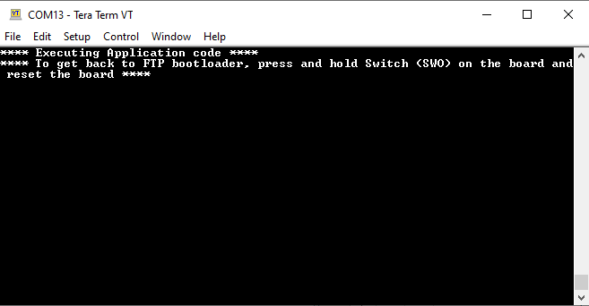

# File Transfer Protocol Application on SAM E70 Xplained Ultra Evaluation Kit
<h2 align="center"> <a href="https://github.com/Microchip-MPLAB-Harmony/reference_apps/releases/latest/download/ftp_bootloader.zip" > Download </a> </h2>

-----

## Description:

> This application demonstrates creating ethernet bootloader where an FTP client downloads a binary file
   from the FTP server, which in turn is used to program the microcontroller. The FAT-FS File
   System with SDCARD as storage media is used in the application and the FTP client will
   write to and read from this FS.

## Modules/Technology Used:

- Peripheral Modules
	- USART1
	- Timer (TC0)
	- HSMCI
- System Services
	- DEBUG
    - Command
    - File System
    - Time
    - Console
- Middleware libraries
	- TCP/IP Stack

## Hardware Used:

- [SAM E70 Xplained Ultra Evaluation Kit](https://www.microchip.com/Developmenttools/ProductDetails/DM320113)

## Software/Tools Used:
 This project has been verified to work with the following versions of software tools:  

Refer [Project Manifest](./firmware/src/config/default/harmony-manifest-success.yml) present in harmony-manifest-success.yml under the project folder *firmware/src/config/default*  
- Refer the [Release Notes](../../../release_notes.md#development-tools) to know the **MPLAB X IDE** and **MCC** Plugin version. Alternatively, [Click Here](https://github.com/Microchip-MPLAB-Harmony/reference_apps/blob/master/release_notes.md#development-tools).
- Any Serial Terminal application like Tera Term terminal application.

 Because Microchip regularly update tools, occasionally issue(s) could be discovered while using the newer versions of the tools. If the project doesn’t seem to work and version incompatibility is suspected, It is recommended to double-check and use the same versions that the project was tested with.  To download original version of MPLAB Harmony v3 packages, refer to document [How to Use the MPLAB Harmony v3 Project Manifest Feature](https://ww1.microchip.com/downloads/en/DeviceDoc/How-to-Use-the-MPLAB-Harmony-v3-Project-Manifest-Feature-DS90003305.pdf)

## Setup:
- Ensure the ERASE (J400) jumper is Open on SAM E70 Xplained Ultra Evaluation Kit
- Open the J805 Jumper which on the ETHERNET PHY MODULE
    -  
- Insert the LAN8740 PHY daughter board on the ETHERNET PHY MODULE header
- Connect the micro USB cable from the computer to the DEBUG USB connector on the SAM E70 Xplained Ultra Evaluation Kit
- Establish a connection between the router/switch with the SAM E70 Xplained Ultra Evaluation Kit through the RJ45 connector
- Copy **test.bin** from **ftp_bootloader** to **microSD**
- Insert the microSD card into the microSD card slot on the backside of the hardware board
- 

## Programming hex file:
The pre-built hex file can be programmed by following the below steps.

### Steps to program the hex file
- Open MPLAB X IDE
- Close all existing projects in IDE, if any project is opened.
- Go to File -> Import -> Hex/ELF File
- In the "Import Image File" window, Step 1 - Create Prebuilt Project, Click the "Browse" button to select the prebuilt hex file.
- Select Device has "ATSAME70Q21B"
- Ensure the proper tool is selected under "Hardware Tool"
- Click on Next button
- In the "Import Image File" window, Step 2 - Select Project Name and Folder, select appropriate project name and folder
- Click on Finish button
- In MPLAB X IDE, click on "Make and Program Device" Button. The device gets programmed in sometime
- Follow the steps in "Running the Demo" section below

## Programming/Debugging Application Project:
- Open the project (ftp_bootloader\firmware\sam_e70_xult.X) in MPLAB X IDE
- Ensure "SAM E70 Xplained Ultra" is selected as hardware tool to program/debug the application
- Build the code and program the device by clicking on the "Make and Program Device" button in MPLAB X IDE tool bar
- Follow the steps in "Running the Demo" section below

## Running the Demo:
### FTP Server Setup
- Before running the FTP client application, an FTP server should be setup. For this demonstration, the FileZilla Server Interface is used as the FTP server running on the user PC. Refer to https://wiki.filezilla-project.org/Documentation for more information on this
- FileZilla Server setup:
	- Open the FileZilla server interface
	- In the pop-up window, enter a hostname, port and password for admin interface. Click “Connect”
	- Click on User icon User or go to Edit->User for adding client
	- In the User window, click “General”. Add client by clicking “Add” option enable account and password. This will be the username and password for connecting from the FTP client
	- 
	- In Shared folders, add the path of folder where the binary to be downloaded is located
	- 

### FTP Client Connect
- From a terminal window application (like Tera Term), connect to the COM port enumerated by SAM E70 Xplained Ultra board
- Restart the application (i.e reset the SAM E70 Xplained Ultra board)
- The IP address will be displayed on the terminal once it is ready. Now, user can connect to the FTP server
	- Type “ftpc connect <host ip address>”
- Upon successful connection, enter the login details
	- Type “ftpc login <username> <password>”
- Once logged in, use ftpc get command to download a binary from the server
	- Type “ftpc get -a -a <test.bin>”
- After the binary is successfully downloaded it can be flashed to the MCU by using the ‘boot’ command.
- MCU is reset automatically after the programming is complete and application code starts executing. Displaying the message: **** Executing Application code ****

#### Output
- 
- After MCU reset, the following message gets printed:
- 

## Comments:
- Reference Application Note: [File Transfer Protocol using MPLAB Harmony v3 TCP/IP Stack ](http://ww1.microchip.com/downloads/en/Appnotes/File-Transfer-Protocol-Using-MPLAB-Harmonyv3-TCPIP-DS00003475A.pdf)
- Getting Started Training Module: [Getting Started with Harmony v3 Peripheral Libraries on SAM E70 MCUs](https://microchipdeveloper.com/harmony3:same70-getting-started-training-module)
- This application demo builds and works out of box by following the instructions above in "Running the Demo" section. If you need to enhance/customize this application demo, you need to use the MPLAB Harmony v3 Software framework. Refer links below to setup and build your applications using MPLAB Harmony
	- [How to Setup MPLAB Harmony v3 Software Development Framework](https://ww1.microchip.com/downloads/en/DeviceDoc/How_to_Setup_MPLAB_%20Harmony_v3_Software_Development_Framework_DS90003232C.pdf)
	- [How to Build an Application by Adding a New PLIB, Driver, or Middleware to an Existing MPLAB Harmony v3 Project](http://ww1.microchip.com/downloads/en/DeviceDoc/How_to_Build_Application_Adding_PLIB_%20Driver_or_Middleware%20_to_MPLAB_Harmony_v3Project_DS90003253A.pdf)

## Revision:
- v1.5.0 Removed MHC support, Regenerated and tested application.
- v1.4.0 Added MCC support, Regenerated and tested application.
- v1.3.0 regenerated and tested the application
- v1.2.0 regenerated and tested the application
- v1.1.0 regenerated and tested the application
- v1.0.0 released demo application
