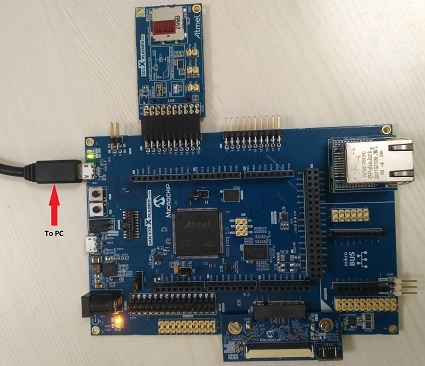
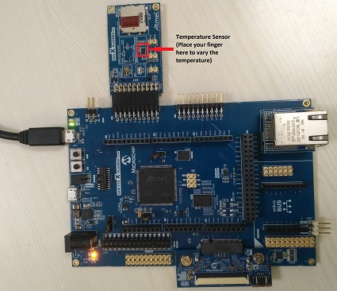

# Getting Started Application using Harmony v3 Drivers and FreeRTOS on SAM E70 Xplained Ultra Evaluation Kit
-----
## Description:

> The application reads the current room temperature from the temperature sensor on the I/O1 Xplained Pro Extension Kit. The temperature
  reading is displayed on a serial console periodically every second. Further, the application writes the temperature readings to EEPROM. 
  When a character is entered on the console, the last five written temperature values are read from the EEPROM and displayed on the 
  console. Also, an LED (LED3) is toggled every time the temperature is displayed on the serial console.

## Modules/Technology Used:
- Peripheral Modules  
	- PORTS
	- USART
	- Timer
	- XDMAC
- Drivers
	- TWIHS(I2C)	
	- USART
- System Services	
	- Timer
- Third Party Libraries
	- FreeRTOS
		

## Hardware Used:

- [SAM E70 Xplained Ultra Evaluation Kit](https://www.microchip.com/Developmenttools/ProductDetails/DM320113)
- [I/O1 Xplained Pro Extension Kit](https://www.microchip.com/Developmenttools/ProductDetails/ATIO1-XPRO)

## Software/Tools Used:
 *This project has been verified to work with the following versions of software tools:*  

 - [MPLAB Harmony v3 "csp" repo v3.5.2](https://github.com/Microchip-MPLAB-Harmony/csp/releases/tag/v3.5.2)
 - [MPLAB Harmony v3 "core" repo v3.5.2](https://github.com/Microchip-MPLAB-Harmony/core/releases/tag/v3.5.2) 
 - [MPLAB Harmony v3 "dev_packs" repo v3.5.0](https://github.com/Microchip-MPLAB-Harmony/dev_packs/releases/tag/v3.5.0)  
 - [MPLAB Harmony v3 "mhc" repo v3.3.4](https://github.com/Microchip-MPLAB-Harmony/mhc/releases/tag/v3.3.4)    
 - MPLAB Harmony Configurator Plugin v3.3.4 
 - [MPLAB X IDE v5.30](https://www.microchip.com/mplab/mplab-x-ide)
 - [MPLAB XC32 Compiler v2.30](https://www.microchip.com/mplab/compilers)
 - [MPLAB X IPE v5.30](https://www.microchip.com/mplab/mplab-integrated-programming-environment)
 - Any Serial Terminal application like Tera Term terminal application.  

 *Because Microchip regularly update tools, occasionally issue(s) could be discovered while using the newer versions of the tools. If the project doesn’t seem to work and version incompatibility is suspected, It is recommended to double-check and use the same versions that the project was tested with.*  

## Setup:
- Verify that the temperature sensor (I/O1 Xplained Pro Extension Kit) is connected to Extension Header 1 (EXT1) on the SAM E70 Xplained Ultra Evaluation Kit
- The SAM E70 Xplained Ultra Evaluation Kit allows the Embedded Debugger (EDBG) to be used for debugging. Connect the Type-A male to micro-B USB cable to the
  micro-B DEBUG USB port to power and debug the SAM E70 Xplained Ultra Evaluation Kit.  
  
### Hardware Modification:
- IO1 Xplained Pro features Microchip’s AT30TSE758 temperature sensor chip with an 8 kbit serial EEPROM. 
	  The temperature sensor has two TWI addresses: one for the temperature sensor and one for the EEPROM. 
	  The A2 address line of TWI must be soldered to 0. This is done to modify the address of the EEPROM 
	  on the I/O1 Xplained Pro Extension Kit so that it does not conflict with the address of EEPROM on 
	  SAM E70 Xplained Evaluation Kit. The modification changes the address of temperature sensor to 0x4B 
	  and EEPROM to 0x50. These modified addresses are used in this demo application  
	   

## Programming binary/hex file:
If you are not interested in installing development tools. The pre-built binary/hex file can be programmed to the target

### Steps to program the hex file using MPLAB X IPE
- Open MPLAB X IPE
- Select Device has "ATSAME70Q21B"
- Power the SAM E70 Xplained Ultra Evaluation Kit from a Host PC through a Type-A male to Micro-B USB cable connected to Micro-B port
- Once Power cable is connected, "EDBG" hardware tool is identified as a programmer
- Browse to hex file (getting_started_freertos_hex_file.hex)
- Click on program button. The device gets programmed in sometime
- Follow the steps in "Running the Demo" section below

## Programming/Debugging Application Project:
- Open the project (getting_started_freertos\firmware\drivers_freertos_sam_e70_xult.X) in MPLAB X IDE
- Ensure "EDBG" is selected as hardware tool to program/debug the application
- Build the code and program the device by clicking on the "make and program" button in MPLAB X IDE tool bar
- Follow the steps in "Running the Demo" section below

## Running the Demo:
- Open the Tera Term terminal application on your PC (from the Windows® Start menu by pressing the Start button)
- Change the baud rate to 115200
- You should see the temperature values (in °F) being displayed on the terminal every 500 milliseconds, as shown below  
  
- Also, notice the LED3 blinking at 1 second rate
- Press any character on the terminal to display the last five values written to the EEPROM  
  
- You may vary the temperature by placing your finger on the temperature sensor (for a few seconds)  
  

## Comments:
- Reference Training Module: [Getting Started with Harmony v3 Drivers on SAM E70/S70/V70/V71 MCUs Using FreeRTOS](https://microchipdeveloper.com/harmony3:same70-getting-started-tm-drivers-freertos)
- This application demo builds and works out of box by following the instructions above in "Running the Demo" section. If you need to enhance/customize this application demo, you need to use the MPLAB Harmony v3 Software framework. Refer links below to setup and build your applications using MPLAB Harmony. 
	- [How to Setup MPLAB Harmony v3 Software Development Framework](https://www.microchip.com/mymicrochip/filehandler.aspx?ddocname=en1000821) 
	- [How to Build an Application by Adding a New PLIB, Driver, or Middleware to an Existing MPLAB Harmony v3 Project](http://ww1.microchip.com/downloads/en/DeviceDoc/How_to_Build_Application_Adding_PLIB_%20Driver_or_Middleware%20_to_MPLAB_Harmony_v3Project_DS90003253A.pdf)  
              

## Revision: 
- v1.0 released demo application
