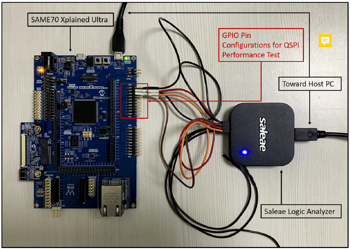

# XDMAC with QSPI Application on SAM E70 Xplained Ultra Evaluation Kit
-----

## Description:

> This application demonstrates the usage of Extended Direct Memory Access Controller (XDMAC) with QSPI on Cortex-M7 based MCU (SAM E70).
  The application writes and reads 80KB data into the External Serial Flash memory using the QSPI, with and without using XDMAC.

## Modules/Technology Used:

- Peripheral Modules
	- EFC
	- MPU
	- QSPI
	- XDMAC
	- SYSTICK

## Hardware Used:

- [SAM E70 Xplained Ultra Evaluation Kit](https://www.microchip.com/Developmenttools/ProductDetails/DM320113) 
- Logic Analyzer or Oscilloscope  

## Software/Tools Used:
 *This project has been verified to work with the following versions of software tools:*  
 - [MPLAB Harmony v3 "csp" repo v3.6.1](https://github.com/Microchip-MPLAB-Harmony/csp/releases/tag/v3.6.1)
 - [MPLAB Harmony v3 "dev_packs" repo v3.6.1](https://github.com/Microchip-MPLAB-Harmony/dev_packs/releases/tag/v3.6.1)
 - [MPLAB Harmony v3 "mhc" repo v3.3.5](https://github.com/Microchip-MPLAB-Harmony/mhc/releases/tag/v3.3.5)
 - MPLAB Harmony Configurator Plugin v3.4.2 
 - [MPLAB X IDE v5.35](https://www.microchip.com/mplab/mplab-x-ide)
 - [MPLAB XC32 Compiler v2.40](https://www.microchip.com/mplab/compilers)
 - [MPLAB X IPE v5.35](https://www.microchip.com/mplab/mplab-integrated-programming-environment)
 - Any Serial Terminal application like Tera Term terminal application.  
  *Because Microchip regularly update tools, occasionally issue(s) could be discovered while using the newer versions of the tools. If the project doesn’t seem to work and version incompatibility is suspected, It is recommended to double-check and use the same versions that the project was tested with.* 

## Setup:
- Connect the micro USB to the Host computer
- Connect the Saleae Logic Analyzer and establish a connection with the Host PC
- Configure the four channels to measure the QSPI throughput as follows
	- Channel 0 is PA19, which is configured to Set and Clear the pin before and after the QSPI Write without DMA
	- Channel 1 is PB2, which is configured to Set and Clear the pin before and after the QSPI Read without DMA
	- Channel 2 is PC31, which is configured to Set and Clear the pin before and after the QSPI Write with DMA
	- Channel 3 is PB3, which is configured to Set and Clear the pin before and after the QSPI Read with DMA
- 

## Programming binary/hex file:
- If you are not interested in installing development tools. The pre-built binary/hex file can be programmed to the target
	### Steps to program the hex file using MPLAB X IPE
	- Open MPLAB X IPE
	- Select Device has "ATSAME70Q21B"
	- Power the SAM E70 Xplained Ultra Evaluation Kit from a Host PC through a Type-A male to Micro-B USB cable connected to Micro-B port
	- Once Power cable is connected, "EDBG" hardware tool is identified as a programmer
	- Browse to hex file (qspi_xdmac_read_write_hex_file.hex)
	- Click on program button. The device gets programmed in sometime
	- Follow the steps in "Running the Demo" section below

## Programming/Debugging Application Project:
- Open the project (qspi_xdmac_read_write_hex_file\firmware\sam_e70_xult.X) in MPLAB X IDE
- Ensure "EDBG" is selected as hardware tool to program/debug the application
- Build the code and program the device by clicking on the "make and program" button in MPLAB X IDE tool bar
- Follow the steps in "Running the Demo" section below

## Running the Demo:
- Start capturing samples using the Logic Analyzer Software
- Reset the hardware to start the application run from the beginning
- Stop capturing the sample in the Logic Analyzer Software
- Verify the the above mentioned four GPIO Pin waveforms and timestamps to see the QSPI performance with and without using the XDMAC for the following cases
	- Write 80KB of data to external serial Flash without using the DMA
	- Read 80KB of data from the external serial Flash without using the DMA
	- Write 80KB of data to external serial Flash using the DMA
	- Read 80KB of data from the external serial Flash using the DMA
	- 
	
## Comments:
- Reference Application Note: [Using XDMAC with QSPI on CORTEX-M7 MCUs Using MPLAB Harmony v3](TBD)
- Getting Started Training Module: [Getting Started with Harmony v3 Peripheral Libraries on SAM E70 MCUs](https://microchipdeveloper.com/harmony3:same70-getting-started-training-module)
- This application demo builds and works out of box by following the instructions above in "Running the Demo" section. If you need to enhance/customize this application demo, you need to use the MPLAB Harmony v3 Software framework. Refer links below to setup and build your applications using MPLAB Harmony
	- [How to Setup MPLAB Harmony v3 Software Development Framework](https://www.microchip.com/mymicrochip/filehandler.aspx?ddocname=en1000821) 
	- [How to Build an Application by Adding a New PLIB, Driver, or Middleware to an Existing MPLAB Harmony v3 Project](http://ww1.microchip.com/downloads/en/DeviceDoc/How_to_Build_Application_Adding_PLIB_%20Driver_or_Middleware%20_to_MPLAB_Harmony_v3Project_DS90003253A.pdf)  
- The application is available on MPLAB Harmony v3 GitHub repository [reference_apps](https://github.com/Microchip-MPLAB-Harmony/reference_apps/tree/master/apps/sam_e70_xult/qspi_xdmac_read_write)	
	           
## Revision: 
- v1.0 released demo application
