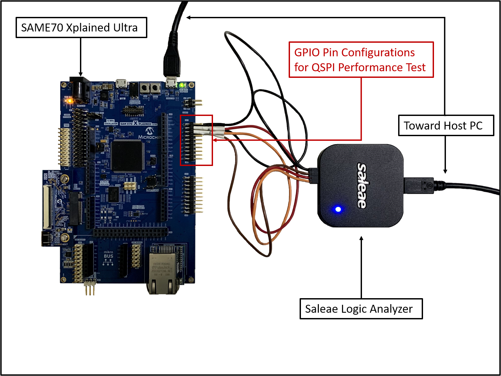
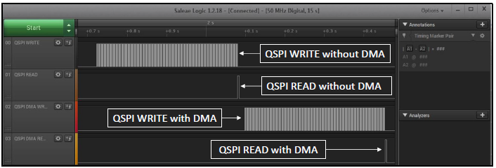

# XDMAC with QSPI Application on SAM E70 Xplained Ultra Evaluation Kit
<h2 align="center"> <a href="https://github.com/MicrochipTech/MPLAB-Harmony-Reference-Apps/releases/latest/download/qspi_xdmac_read_write.zip" > Download </a> </h2>

-----

## Description:

> This application demonstrates the usage of Direct Memory Access Controller (XDMAC) with QSPI on Cortex-M7 based MCU (SAM E70).
  The application writes and reads 80KB data into the External Serial Flash memory using the QSPI, with and without using XDMAC.

## Modules/Technology Used:

- Peripheral Modules
	- EFC
	- MPU
	- QSPI
	- XDMAC
	- SYSTICK

## Hardware Used:

- [SAM E70 Xplained Ultra Evaluation Kit](https://www.microchip.com/Developmenttools/ProductDetails/DM320113)
- Logic Analyzer or Oscilloscope

## Software/Tools Used:
 This project has been verified to work with the following versions of software tools:  

Refer [Project Manifest](./firmware/src/config/sam_e70_xult/harmony-manifest-success.yml) present in harmony-manifest-success.yml under the project folder *firmware/src/config/sam_e70_xult*  
- Refer the [Release Notes](../../../release_notes.md#development-tools) to know the **MPLAB X IDE** and **MHC/MCC** Plugin version.  
- Any Serial Terminal application like Tera Term terminal application.

 Because Microchip regularly update tools, occasionally issue(s) could be discovered while using the newer versions of the tools. If the project doesn’t seem to work and version incompatibility is suspected, It is recommended to double-check and use the same versions that the project was tested with.  To download original version of MPLAB Harmony v3 packages, refer to document [How to Use the MPLAB Harmony v3 Project Manifest Feature](https://microchip.com/DS90003305)

## Setup:
- Connect the micro USB to the Host computer
- Connect the Saleae Logic Analyzer and establish a connection with the Host PC
- Configure the four channels to measure the QSPI throughput as follows
	- Channel 0 is PA19, which is configured to Set and Clear the pin before and after the QSPI Write without DMA
	- Channel 1 is PB2, which is configured to Set and Clear the pin before and after the QSPI Read without DMA
	- Channel 2 is PC31, which is configured to Set and Clear the pin before and after the QSPI Write with DMA
	- Channel 3 is PB3, which is configured to Set and Clear the pin before and after the QSPI Read with DMA
- 

## Programming hex file:
The pre-built hex file can be programmed by following the below steps.

### Steps to program the hex file
- Open MPLAB X IDE
- Close all existing projects in IDE, if any project is opened.
- Go to File -> Import -> Hex/ELF File
- In the "Import Image File" window, Step 1 - Create Prebuilt Project, Click the "Browse" button to select the prebuilt hex file.
- Select Device has "ATSAME70Q21B"
- Ensure the proper tool is selected under "Hardware Tool"
- Click on Next button
- In the "Import Image File" window, Step 2 - Select Project Name and Folder, select appropriate project name and folder
- Click on Finish button
- In MPLAB X IDE, click on "Make and Program Device" Button. The device gets programmed in sometime
- Follow the steps in "Running the Demo" section below

## Programming/Debugging Application Project:
- Open the project (qspi_xdmac_read_write/firmware/sam_e70_xult.X) in MPLAB X IDE
- Ensure "SAM E70 Xplained Ultra" is selected as hardware tool to program/debug the application
- Build the code and program the device by clicking on the "Make and Program Device" button in MPLAB X IDE tool bar
- Follow the steps in "Running the Demo" section below

## Running the Demo:
- Start capturing samples using the Logic Analyzer Software
- Reset the hardware to start the application run from the beginning
- Stop capturing the sample in the Logic Analyzer Software
- Verify the the above mentioned four GPIO Pin waveforms and timestamps to see the QSPI performance with and without using the XDMAC for the following cases
	- Write 80KB of data to external serial Flash without using the DMA
	- Read 80KB of data from the external serial Flash without using the DMA
	- Write 80KB of data to external serial Flash using the DMA
	- Read 80KB of data from the external serial Flash using the DMA
	- 
- LED1 toggles on success else turns ON if any error

## Comments:
- Reference Application Note: [Using XDMAC with QSPI on CORTEX-M7 MCUs Using MPLAB Harmony v3](http://ww1.microchip.com/downloads/en/Appnotes/Using-XDMAC-with-QSPI-on-CORTEX-M7-MCUs-Using-MPLAB-Harmonyv3-DS00003466A.pdf)
- Getting Started Training Module: [Getting Started with Harmony v3 Peripheral Libraries on SAM E70 MCUs](https://microchipdeveloper.com/harmony3:same70-getting-started-training-module)
- This application demo builds and works out of box by following the instructions above in "Running the Demo" section. If you need to enhance/customize this application demo, you need to use the MPLAB Harmony v3 Software framework. Refer links below to setup and build your applications using MPLAB Harmony
	- [How to Setup MPLAB Harmony v3 Software Development Framework](https://www.microchip.com/mymicrochip/filehandler.aspx?ddocname=en1000821)
	- [How to Build an Application by Adding a New PLIB, Driver, or Middleware to an Existing MPLAB Harmony v3 Project](http://ww1.microchip.com/downloads/en/DeviceDoc/How_to_Build_Application_Adding_PLIB_%20Driver_or_Middleware%20_to_MPLAB_Harmony_v3Project_DS90003253A.pdf)

## Revision:
- v1.3.0 regenerated and tested the application
- v1.2.0 regenerated and tested the application
- v1.1.0 regenerated and tested the application
- v1.0.0 released demo application
