# Low Power Application on SAM L10 Xplained Pro Evaluation Kit
<h2 align="center"> <a href="https://github.com/Microchip-MPLAB-Harmony/reference_apps/releases/latest/download/saml10_low_power.zip" > Download </a> </h2>

-----
## Description

> The application demonstrates, on power-up, the device is set to Standby Sleep mode.
  The device wakes up from Standby mode and enters Active mode when you cover the light sensor
  (by placing a hand over it, for example) on the I/O1 Xplained Pro extension kit. The application
  periodically prints room temperature on a serial terminal while the light sensor is covered.
  The device goes back to Standby mode when you uncover the light sensor. LED0 in the SAM L10
  evaluation kit is toggled every time the temperature is displayed on the serial console. When
  you press the switch button SW0, the application switches Sleep mode from Standby mode to Idle mode.

## Modules/Technology Used:

- Peripheral Modules
	- I2C
	- RTC
	- USART
	- DMAC
	- ADC
	- PM
	- SUPC
	- EIC
	- EVSYS

## Hardware Used:

- [SAM L10 Xplained Pro Evaluation Kit](https://www.microchip.com/DevelopmentTools/ProductDetails/dm320204)
- [I/O1 Xplained Pro Extension Kit](https://www.microchip.com/Developmenttools/ProductDetails/ATIO1-XPRO)  
**Note**: The application is being developed on a SAM L10 XPRO board. Ensure that you use the same revision on
the evaluation board before going further, else you could face issues with power consumption values.

## Software/Tools Used:
 This project has been verified to work with the following versions of software tools:  

Refer [Project Manifest](./firmware/src/config/sam_l10_xpro/harmony-manifest-success.yml) present in harmony-manifest-success.yml under the project folder *firmware/src/config/sam_l10_xpro*  
- Refer the [Release Notes](../../../release_notes.md#development-tools) to know the **MPLAB X IDE** and **MHC/MCC** Plugin version.  
- Any Serial Terminal application like Tera Term terminal application.  
- [Data Visualizer](https://www.microchip.com/mplab/avr-support/data-visualizer)  

 Because Microchip regularly update tools, occasionally issue(s) could be discovered while using the newer versions of the tools. If the project doesn’t seem to work and version incompatibility is suspected, It is recommended to double-check and use the same versions that the project was tested with.  To download original version of MPLAB Harmony v3 packages, refer to document [How to Use the MPLAB Harmony v3 Project Manifest Feature](https://ww1.microchip.com/downloads/en/DeviceDoc/How-to-Use-the-MPLAB-Harmony-v3-Project-Manifest-Feature-DS90003305.pdf)

## Setup:
- Connect the I/O1 Xplained Pro extension kit to the Extension Header 1 (EXT1) of the SAML10 Xplained Pro evaluation kit
- Probe PA27 (SW0 pin) and PA06 (wake-up test pin) on Extension Header 2 (EXT2) as highlighted in the Hardware Setup figure to measure wake-up time
- Connect a USB cable to the DEBUG USB port for programming  
**Note** :
Make sure common ground is connected with the board while using the logic analyzer or CRO.  

  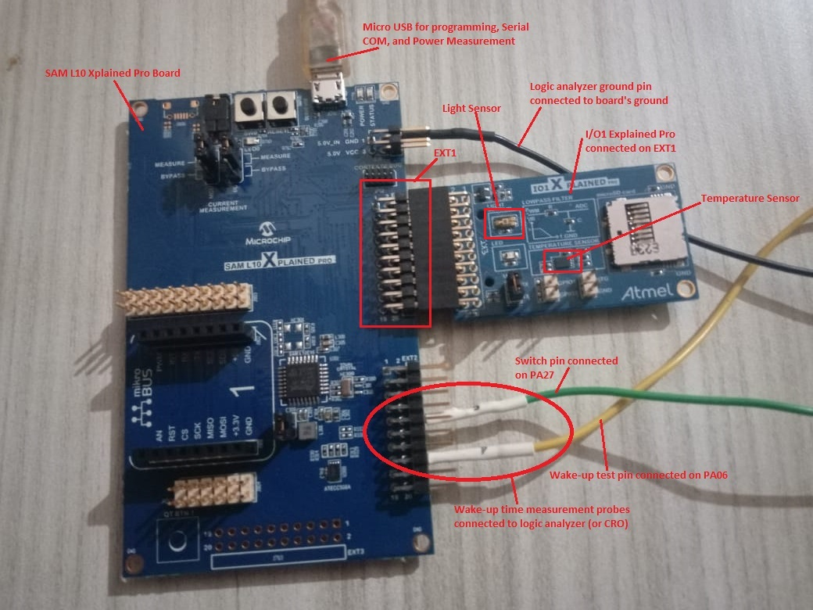

## Programming hex file:
The pre-built hex file can be programmed by following the below steps

### Steps to program the hex file
- Open MPLAB X IDE
- Close all existing projects in IDE, if any project is opened
- Go to File -> Import -> Hex/ELF File
- In the "Import Image File" window, Step 1 - Create Prebuilt Project, click the "Browse" button to select the prebuilt hex file.
- Select Device has "ATSAML10E16A"
- Ensure the proper tool is selected under "Hardware Tool"
- Click on "Next" button
- In the "Import Image File" window, Step 2 - Select Project Name and Folder, select appropriate project name and folder
- Click on "Finish" button
- In MPLAB X IDE, click on "Make and Program Device" Button. The device gets programmed in sometime.
- Follow the steps in "Running the Demo" section below

## Programming/Debugging Application Project:
- Open the project (saml10_low_power\firmware\low_power_app_sam_l10_xpro.X) in MPLAB X IDE.
- Ensure "SAML10 Xplained Pro" is selected as hardware tool to program/debug the application.
- Build the code and program the device by clicking on the "Make and Program Device" button in MPLAB X IDE tool bar
- Follow the steps in "Running the Demo" section below.  

## Running the Demo:
- Open Tera Term, connect to serial console. If there is any connection issue on tera terminal, unplug the USB cable
connected to Micro-B port, and reconnect it back.
- Change the baud rate to 115200
- Perform reset by pressing the "RESET" switch
- Verify the application title message is displayed  

  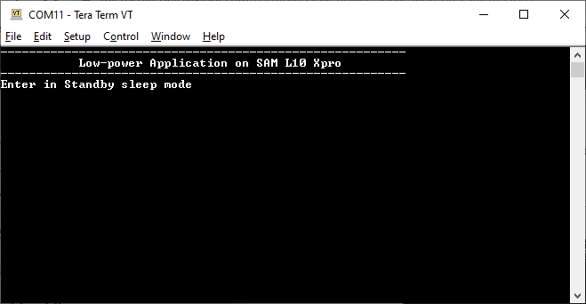  
- Cover the light sensor on the I/O Xplained Pro board by placing your hand over it (or another element to put the light sensor in a dark environment) to print the temperature and message on the terminal. You should see the following messages (containing the temperature value in °F) on the terminal every 500 milliseconds for the duration the light sensor is covered  
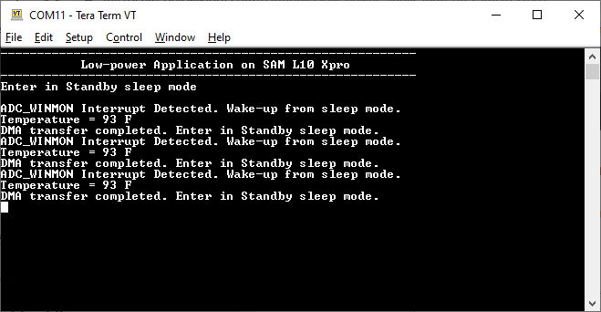  
- Observe Current Consumption on Data Visualizer  
**Note**: The Data Visualizer is a program to process and visualize data. The Data Visualizer can receive data from various sources such as the Embedded Debugger Data Gateway Interface (EDBG DGI) and COM ports. It is possible to track an application in run-time using a terminal graph or oscilloscope. It analyzes the power consumption of an application through correlation of code execution and power consumption when used together with a supported probe or board.
- Open the Data Visualizer application from your PC and select the connected SAM L10 Xplained Pro B board on the DGI Control Panel, then click on Connect. The Data Visualizer will then start searching for protocols from the SAM L10 Xplained Pro board through the EDBG  

  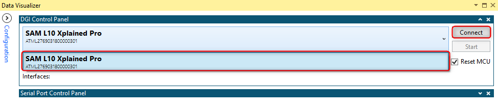
- Once the Data Visualizer is connected to the SAM L10 EDBG, different interfaces will appear. Select the Power interface and click on the Start button to start measuring the power consumption of the device  
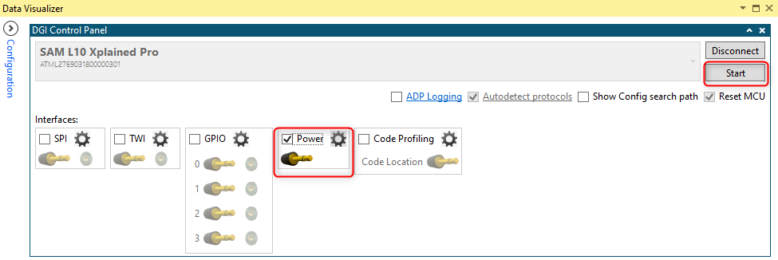
- Ensure that the jumpers for Current Measurement on the SAM L10 Xplained Pro are set to MEASURE for the MCU and BYPASS for the I/Os  
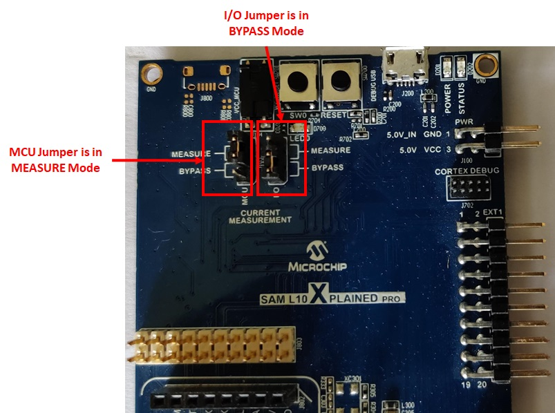
- The Power Analysis window will appear on the Data Visualizer tool interface  
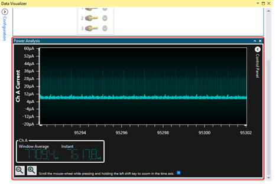  
- The step image shows the device in Standby mode with its measured power consumption. You can observe small peaks that illustrate the 500 milliseconds Real-Time Clock (RTC) timer expiry  
  

**Note**: The average value is considered when measuring the power consumption of the device because the instant value is not stable. Then, the power consumption of the device in Standby mode is 8.66 µA.
- Cover the light sensor on the I/O Xplained Pro board by placing your hand over it (or another element) to print the temperature on the terminal and observe the power consumption of the device  
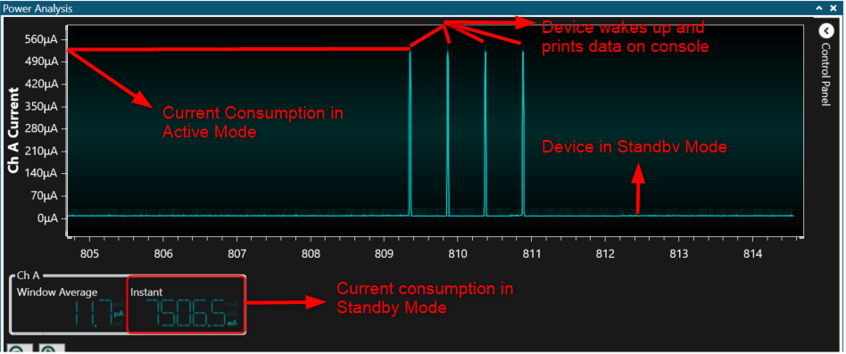
- Press the SW0 button to switch from Standby mode to Idle mode. The following image shows the transition of the power consumption from Standby mode to Idle mode  
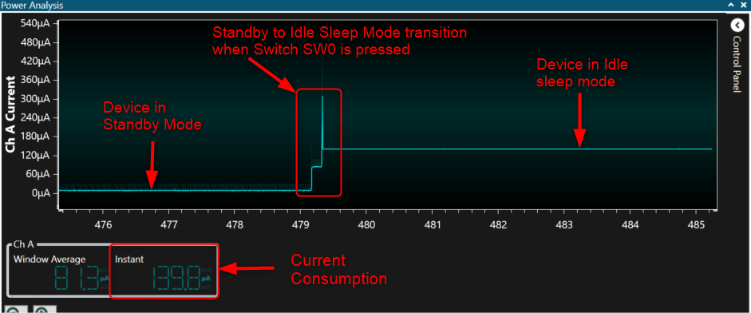
- The following image shows the device in Idle mode with a measured power consumption of 844 µA  
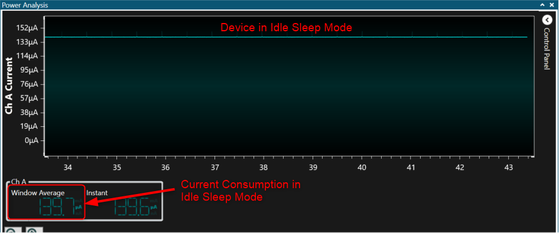  

**Note**: You can observe that the small peaks coming from RTC timer expiry disappeared because the power consumption in Idle mode is higher than the power required to start ADC conversion.  
- Place your hand over the light sensor. The device will wake up on the next ADC window monitor interrupt, read and print data on serial and then re-enter Standby mode. The following image shows the transition of the power consumption by switching from Idle mode to Standby mode  
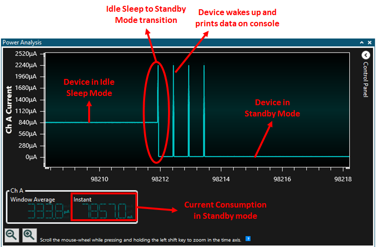  

**Note** that the above results highlight the power consumption is lower in Standby mode than in Idle mode.
- Wake-up Time Measurement Using Logic Analyzer/ Cathode-Ray Oscilloscope (CRO)  
To demonstrate the CPU wake up time, switch SW0 is configured to generate an interrupt. A General Purpose Input/Output (GPIO) is toggled in the Interrupt Service Routine (ISR) of the switch press event. The MCU comes out of Sleep mode when an interrupt occurs (in this case, the switch press interrupt). The time between the switch press and the GPIO toggle in the ISR is the wake up time.
- Connect your logic analyzer or your CRO to the board according to the step image  

- Press the SW0 switch and capture the signals to measure the wake-up time in Standby and Idle mode. The following image shows the wake-up time from Standby mode  
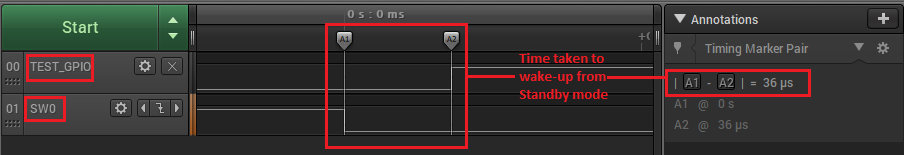  
- The following image shows the wake-up time from Idle mode  
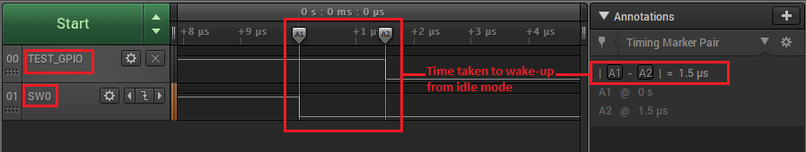  

  By observing the outputs, you can conclude that the wake-up time is greater in Standby mode than in Idle mode

## Comments:
- Reference Training Module: [Low Power Application on SAM L10 (Cortex M0+) MCUs Using MPLAB Harmony v3 Peripheral Libraries](https://microchipdeveloper.com/harmony3:low-power-application-on-saml10#Steps_anchor)
- This application demo builds and works out of box by following the instructions above in "Running the Demo" section. If you need to enhance/customize this application demo, you need to use the MPLAB Harmony v3 Software framework. Refer links below to setup and build your applications using MPLAB Harmony.
	- [How to Setup MPLAB Harmony v3 Software Development Framework](https://www.microchip.com/mymicrochip/filehandler.aspx?ddocname=en1000821)
	- [How to Build an Application by Adding a New PLIB, Driver, or Middleware to an Existing MPLAB Harmony v3 Project](http://ww1.microchip.com/downloads/en/DeviceDoc/How_to_Build_Application_Adding_PLIB_%20Driver_or_Middleware%20_to_MPLAB_Harmony_v3Project_DS90003253A.pdf)  

## Revision:
- v1.4.0 - Added MCC support, regenerated and tested application.
- v1.3.0 - Regenerated and tested application.
- v1.2.0 - Regenerated and tested application.
- v1.1.0 - Regenerated and tested application.
- v1.0.0 - Released demo application
