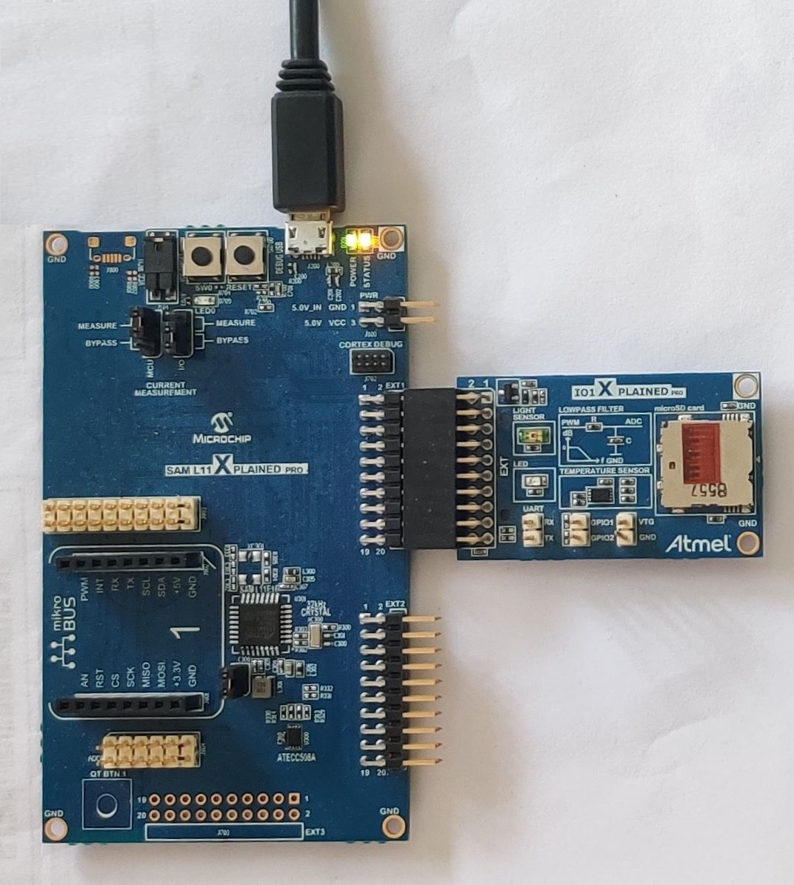
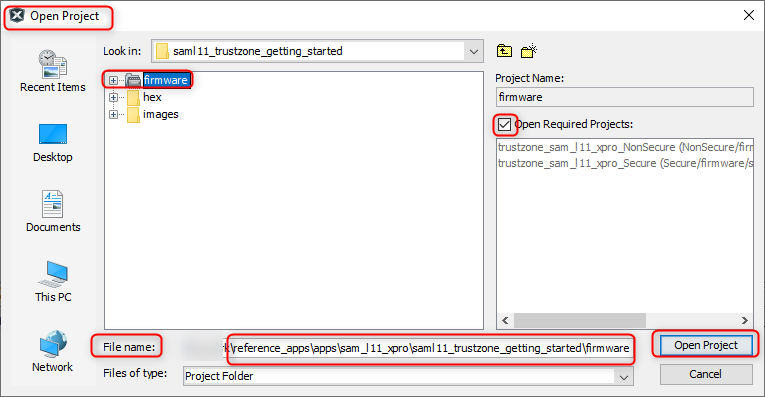
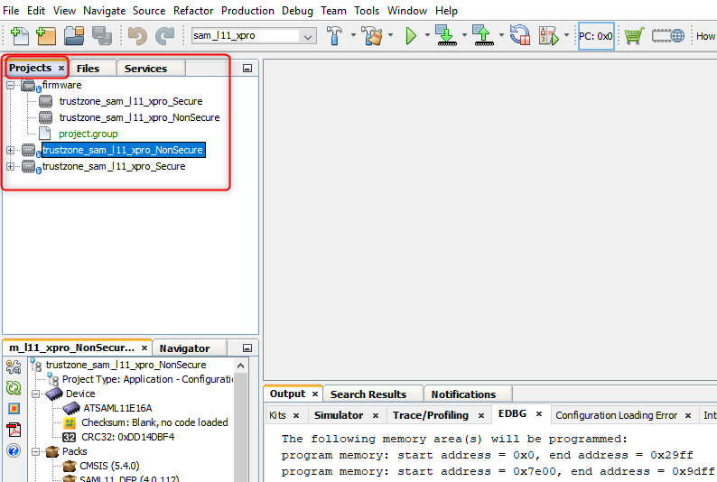
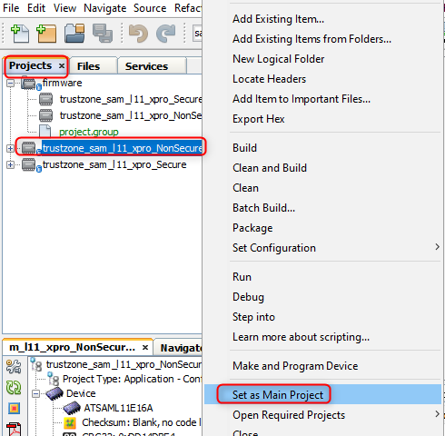
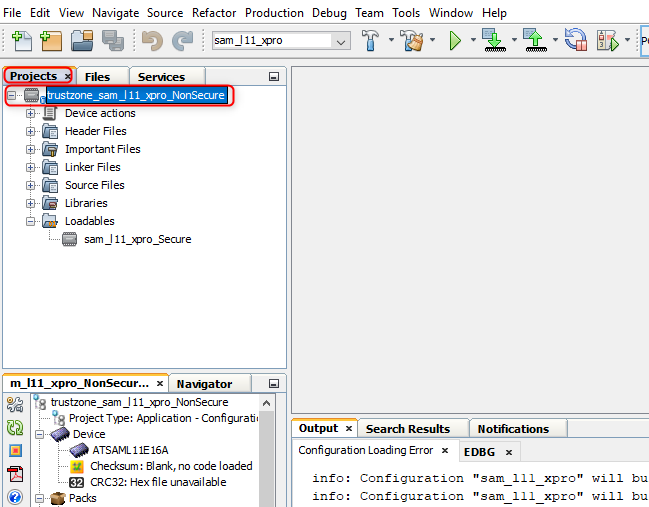
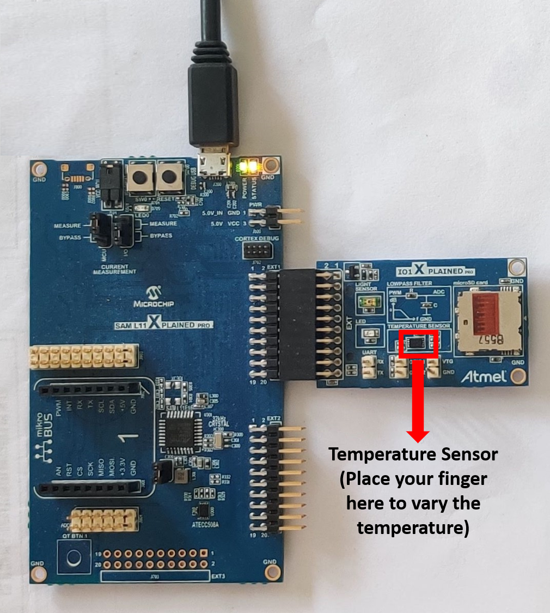
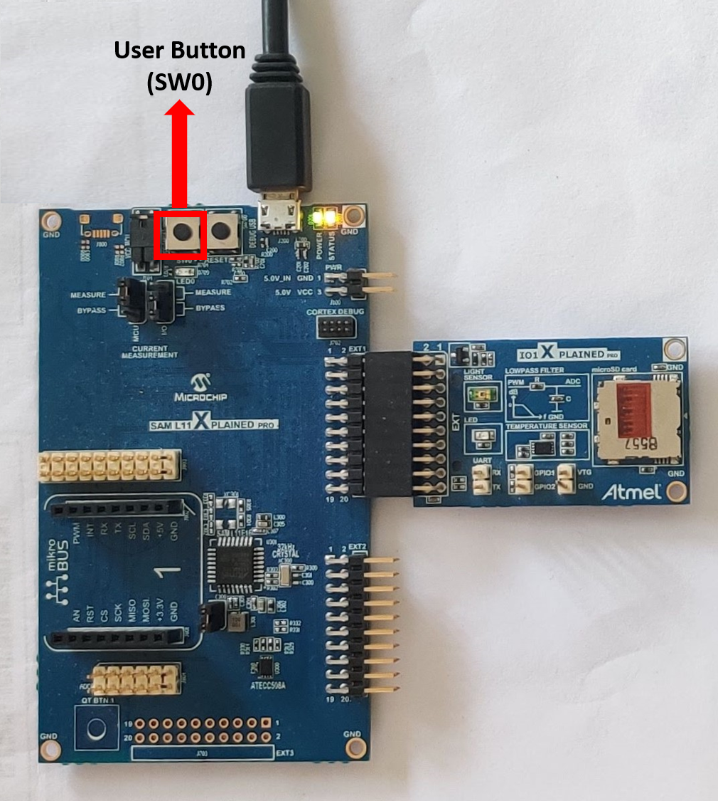

# TrustZone Getting Started Application on SAM L11 Xplained Pro Evaluation Kit
<h2 align="center"> <a href="https://github.com/MicrochipTech/MPLAB-Harmony-Reference-Apps/releases/latest/download/saml11_trustzone_getting_started.zip" > Download </a> </h2>

-----
## Description

> This Application demonstrates the TrustZone feature on SAM L11 microcontroller (MCU). The application has two projects pertaining to Secure and Non-Secure modes of SAM L11, that work together on the same MCU and offers security isolation between the trusted and the non-trusted resources in the device.

- The Secure mode application reads the current room temperature from the temperature sensor on the I/O1 Xplained Pro
  Extension Kit every 500 milliseconds. Further, the application writes the temperature readings to EEPROM and reads
  when a request received from the Non-secure mode application. Also, an LED (LED0) is toggled every time the temperature
  is displayed on the serial console. The periodicity of the temperature values reading can be changed to 1 second, 2 seconds,
  4 seconds, and back to 500 milliseconds every time when the user presses the switch SW0 on the SAM L11 Xplained Pro Evaluation Kit.
  The temperature readings are transferred to Non-secure mode application when it requests to Secure application through
  Non Secure Callable (NSC).

- The Non-secure mode application requests the Secure mode application temperature values and prints them on a serial
  console once it receives from the Secure mode application. Further,  when it receives a request from the user (in the
  form of a key press on the serial console), it will request Secure mode application to retrieve the last five stored
  temperature values in the EEPROM. The Non-secure application prints the last five stored temperature values on the console.

## Modules/Technology Used:

- Peripheral Modules
	- Secure PORT Pins (All pins by default are secure)
	- Secure I2C
	- Secure RTC
	- Secure EIC
	- Non-secure USART
	- Non-secure DMAC
	- Non-secure PORT Pins (USART Pins only)

## Hardware Used:

- [SAM L11 Xplained Pro Evaluation Kit](https://www.microchip.com/DevelopmentTools/ProductDetails/dm320205)
- [I/O1 Xplained Pro Extension Kit](https://www.microchip.com/Developmenttools/ProductDetails/ATIO1-XPRO)

## Software/Tools Used:
 *This project has been verified to work with the following versions of software tools:*  

- [MPLAB Harmony v3 "csp" repo v3.8.3](https://github.com/Microchip-MPLAB-Harmony/csp/releases/tag/v3.8.3)  
- [MPLAB Harmony v3 "dev_packs" repo v3.8.0](https://github.com/Microchip-MPLAB-Harmony/dev_packs/releases/tag/v3.8.0)  
- [MPLAB Harmony v3 "mhc" repo v3.6.5](https://github.com/Microchip-MPLAB-Harmony/mhc/releases/tag/v3.6.5)  
- MPLAB Harmony 3 Launcher Plugin v3.6.2  
- [MPLAB X IDE v5.45](https://www.microchip.com/mplab/mplab-x-ide)  
- [MPLAB XC32 Compiler v2.41](https://www.microchip.com/mplab/compilers)  
- Any Serial Terminal application like Tera Term terminal application.  

 *Because Microchip regularly update tools, occasionally issue(s) could be discovered while using the newer versions of the tools. If the project doesn’t seem to work and version incompatibility is suspected, It is recommended to double-check and use the same versions that the project was tested with.* 

## Setup:
- Connect the I/O1 Xplained Pro Extension Kit to the Extension Header 1 (EXT1) of the SAM L11 Xplained Pro Evaluation Kit
- The SAM L11 Xplained Pro Evaluation Kit allows the Embedded Debugger (EDBG) to be used for debugging. Connect the Type-A male to micro-B USB cable to the micro-B DEBUG USB port to power and debug the SAM L11 Xplained Pro Evaluation Kit.

  

## Programming hex file:
The pre-built hex file can be programmed by following the below steps

### Steps to program the hex file
- Open MPLAB X IDE
- Close all existing projects in IDE, if any project is opened
- Go to File -> Import -> Hex/ELF File
- In the "Import Image File" window, Step 1 - Create Prebuilt Project, click the "Browse" button to select the prebuilt hex file.
- Select Device has "ATSAML11E16A"
- Ensure the proper tool is selected under "Hardware Tool"
- Click on "Next" button
- In the "Import Image File" window, Step 2 - Select Project Name and Folder, select appropriate project name and folder
- Click on "Finish" button
- In MPLAB X IDE, click on "Make and Program Device" Button. The device gets programmed in sometime.
- Follow the steps in "Running the Demo" section below

## Programming/Debugging Application Project:
- The Trustzone project can be opened in two ways.  
  - Procedure 1:
	- Open MPLAB X IDE
	- Close all existing projects in IDE (if any project is opened)
	- Go to File -> Open Project
	- Select project path "../reference_apps/apps/sam_l11_xpro/saml11_trustzone_getting_started"
	- Select "firmware" folder, enable "Open Required Projects" and click on "Open Project" button
	    

	    

	- Once the project opens, set the "trustzone_sam_l11_xpro_NonSecure" project as Main Project by right clicking on the project.  
	
  - Procedure 2:
	- Open MPLAB X IDE
	- Close all existing projects in IDE (if any project is opened)
	- Open the project (../saml11_trustzone_getting_started/firmware/NonSecure/firmware/sam_l11_xpro_NonSecure.X) in MPLAB X IDE.
	  
- Ensure "SAML11 Xplained Pro (EDBG)" is selected as hardware tool to program/debug the application.
- Build the code and program the device by clicking on the "make and program" button in MPLAB X IDE tool bar.
- Follow the steps in "Running the Demo" section below.  

## Running the Demo:
- Open the Tera Term terminal application on your PC (from the Windows® Start menu by pressing the Start button)
- Change the baud rate to 115200
- You should see the temperature values (in °F) being displayed on the terminal every 500 milliseconds, as shown below  

    
- Also, notice the LED0 blinking at 500 millisecond rate
- You may vary the temperature by placing your finger on the temperature sensor (for a few seconds)  
  
- Press the switch SW0 on SAM L11 Xplained Pro Evaluation Kit to change the default sampling rate to 1 second.  
    
    
- Every subsequent pressing of switch SW0 on SAM L11 Xplained Pro Evaluation Kit changes the default sampling
  rate to 2 seconds, 4 seconds, and 500 ms and back to 1 second in cyclic order as shown below.  
    
- While the temperature sampling rate changes on every switch SW0 press, notice the LED0 toggling at the same sampling rate
- Press any character on the terminal to display the last five values written to the EEPROM  
  

## Comments:
- Reference Training Module: [Arm TrustZone Getting Started Application on SAM L11 MCUs](https://microchipdeveloper.com/harmony3:saml11-trustzone-getting-started-training-module)
- This application demo builds and works out of box by following the instructions above in "Running the Demo" section. If you need to enhance/customize this application demo, you need to use the MPLAB Harmony v3 Software framework. Refer links below to setup and build your applications using MPLAB Harmony.
	- [How to Setup MPLAB Harmony v3 Software Development Framework](https://www.microchip.com/mymicrochip/filehandler.aspx?ddocname=en1000821)
	- [How to Build an Application by Adding a New PLIB, Driver, or Middleware to an Existing MPLAB Harmony v3 Project](http://ww1.microchip.com/downloads/en/DeviceDoc/How_to_Build_Application_Adding_PLIB_%20Driver_or_Middleware%20_to_MPLAB_Harmony_v3Project_DS90003253A.pdf)  

## Revision:
- v1.2.0 - Regenerated and tested application.
- v1.1.0 - Released demo application
