# BLE Fitness Tracker Application on SAM L21 Xplained Pro Evaluation Kit and Click boards
<h2 align="center"> <a href="https://github.com/Microchip-MPLAB-Harmony/reference_apps/releases/latest/download/saml21_ble_fitness_tracker.zip" > Download </a> </h2>

-----

## Description:
> The application demonstrates a low power solution based on Microchip products for the health care industry
  and wearable products. The application displays heart rate readings (in beats per minute - bpm)
  on a very low power consuming display and posts this Heart Rate data to Microchip Bluetooth Data (MBD)
  android mobile application via BLE (Bluetooth Low Energy).  

> **The application will be in continuous low power standby mode until user presses a switch on SAM L21 Xplained
  board or initiate a communication from Bluetooth using MBD android app. Then device wakes up, reads heart rate
	, displays on eink dispaly and posts heart rate value to MBD android app via Bluetooth.**

> The Mikro Elektronika Heart Rate 9 click board is used to read the heart pulse.
  Mikroelektronika eINK click bundle is used for displaying heart rate.
  The eINK click bundle contains the eINK click adapter board and the eINK display. BM71
  Bluetooth module is used to send the heart rate data over BLE.

> The Heart Rate 9 click introduces Microchip's proprietary method of measuring multiple
  signals in a body using pseudorandom binary sequence generation and phase division multiplexing
  This algorithm for processing data from the sensor and it can send data for 3 different diodes
  (green, ir, red) who give out a diagram of the heartbeat and its frequency per minute.

> The eINK display is a very low power consumption display and it can retain the information,
  even after disconnecting from the power source. The host MCU SAM L21 is interfaced with the
  Heart Rate 9 click over the USART interface and eINK click over SPI Interface.

## Modules/Technology Used:

- Peripheral Modules  
	- Timer
	- EIC
	- SERCOM (SPI)
	- SERCOM (USART)
    - SUPC
    - PM
    - SysTick
- BM71 Driver
- STDIO Library

## Hardware Used:

- [SAM L21 XPLAINED PRO EVALUATION KIT](https://www.microchip.com/en-us/development-tool/atsaml21-xpro-b)
- [Heart Rate 9 click](https://www.mikroe.com/heart-rate-9-click)
- [EINK CLICK BUNDLE](https://www.mikroe.com/eink-click)
- [BM71-XPRO](https://www.microchip.com/Developmenttools/ProductDetails/DM164146)
- [MIKROBUS XPLAINED PRO](https://www.microchip.com/en-us/development-tool/ATMBUSADAPTER-XPRO)

## Software/Tools Used:
<span style="color:blue"> This project has been verified to work with the following versions of software tools:</span>  

Refer [Project Manifest](./firmware/src/config/sam_l21_xpro/harmony-manifest-success.yml) present in harmony-manifest-success.yml under the project folder *firmware/src/config/sam_l21_xpro*  
- Refer the [Release Notes](../../../release_notes.md#development-tools) to know the **MPLAB X IDE** and **MCC** Plugin version. Alternatively, [Click Here](https://github.com/Microchip-MPLAB-Harmony/reference_apps/blob/master/release_notes.md#development-tools)   
- Install [Microchip Bluetooth Data Android App](https://play.google.com/store/apps/details?id=com.microchip.bluetooth.data&hl=en_IN&gl=US) in your android mobile  

<span style="color:blue"> Because Microchip regularly update tools, occasionally issue(s) could be discovered while using the newer versions of the tools. If the project doesn’t seem to work and version incompatibility is suspected, It is recommended to double-check and use the same versions that the project was tested with. </span> To download original version of MPLAB Harmony v3 packages, refer to document [How to Use the MPLAB Harmony v3 Project Manifest Feature](https://ww1.microchip.com/downloads/en/DeviceDoc/How-to-Use-the-MPLAB-Harmony-v3-Project-Manifest-Feature-DS90003305.pdf)

## Adding private characteristics to BM71:
#### Hardware Setup
- In BM71-XPRO, Change jumper J2 to select USB
- In BM71-XPRO, Configure DIP switch SW2 with the below configurations
  - All DIP switch ON
- Power the BM71-XPRO from a Host PC through a Type-A male to Micro-B USB cable connected to Micro-B port (J1)
- Perform reset by pressing switch SW1 on BM71-XPRO and check blue LD1 is ON  
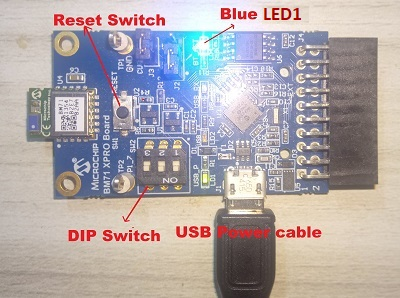

#### Programming private characteristics
- Download the manual configuration tool from [BM70/71 Firmware & Software Tools v1.11](https://ww1.microchip.com/downloads/en/DeviceDoc/Firmware%20&%20Software%20Tools%20v1.11.zip)
- Extract and locate configuration tool from below location
 	- Your_downloaded_folder ```\Firmware & Software Tools v1.11\ConfigurationTool\IS187x_102_BLEDK3v1.11_UI1.00```
- Double click on "`IS187x_102_BLEDK3v1.11_UI1.00.exe` "
- Click on "Load" button and select "Load Text File"  
 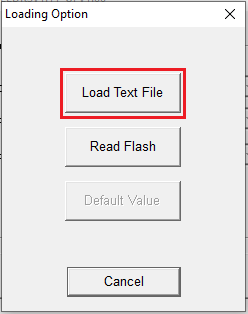
- Select “**bm71_heart_rate_service_chars_config.txt**” from **bm71_configuration** folder present in **firmware** folder  
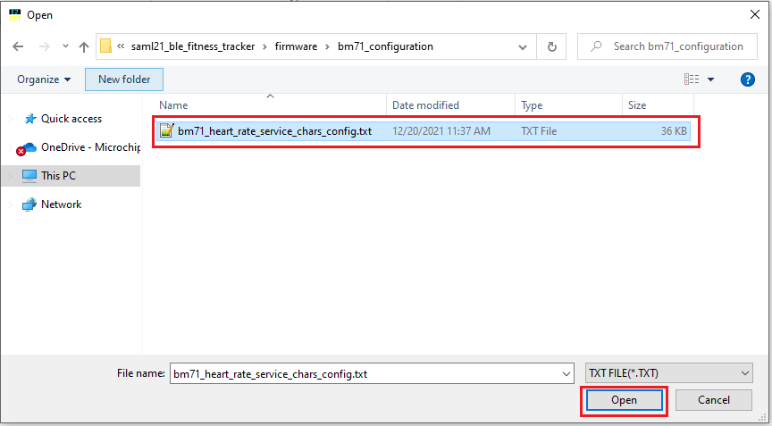  
- Click on "EDIT" option  


- Select "0x01: BM71" in BLEDK and click ok

  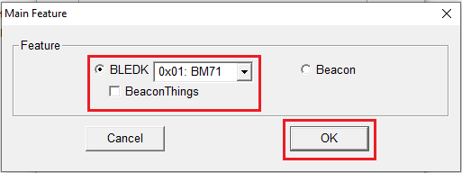

- Click on "Finish"  
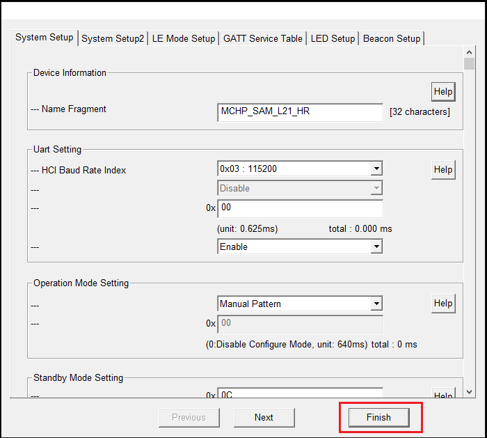

- Click on “Write”  


- Select respective COM Port and set baud rate to 115200 then click on Write  
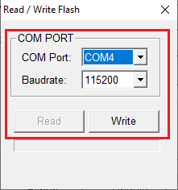

- Click on Yes to successfully update the private characteristics on to BM71 module  
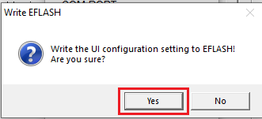

- After successful update, click OK and remove the power from BM71-XPRO and change jumper J2 to select EXT  
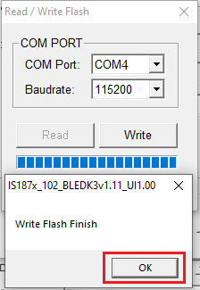

- Turn OFF DIP 1 switch

## Setup:
- Mount Heart Rate 9 click board on mikrobus xplained pro adapter and connect to EXT 1 connector of SAM L21 XPRO Evaluation kit
- Mount the eINK click bundle (eINK click + eINK dispaly) mikrobus xplained pro adapter and connect to EXT 2 connector of SAM L21 XPRO Evaluation kit
- Connect the BM71-XPRO on to EXT 3 connector of SAM L21 XPRO Evaluation kit  
- Power the SAM L21 XPRO Evaluation kit from a Host PC through a Type-A male to Micro-B USB cable connected to Micro-B port (J105)  

  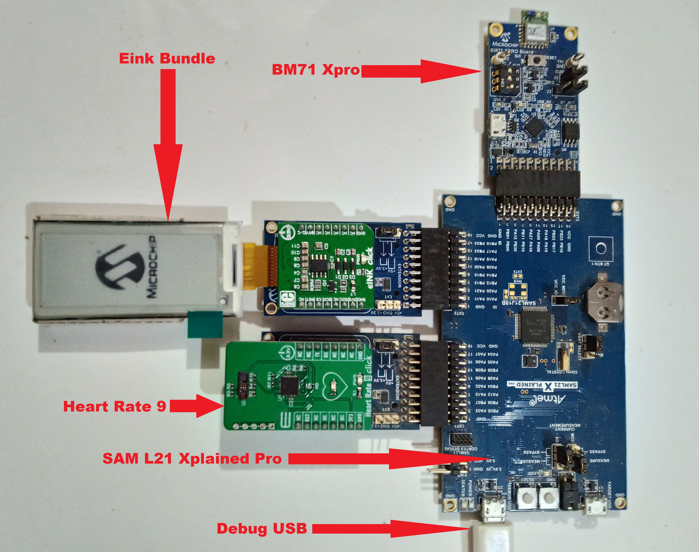  


## Programming hex file:
The prebuilt hex file can be programmed by following the below steps.  

### Steps to program the hex file
- Open MPLAB X IDE
- Close all existing projects in IDE, if any project is opened.
- Go to File -> Import -> Hex/ELF File
- In the "Import Image File" window, Step 1 - Create Prebuilt Project, Click the "Browse" button to select the prebuilt hex file.
- Select Device has "ATSAML21J18B"
- Ensure the proper tool is selected under "Hardware Tool"
- Click on Next button
- In the "Import Image File" window, Step 2 - Select Project Name and Folder, select appropriate project name and folder
- Click on Finish button
- In MPLAB X IDE, click on "Make and Program Device" Button. The device gets programmed in sometime
- Follow the steps in "Running the Demo" section below

## Programming/Debugging Application Project:
- Open the project (saml21_ble_fitness_tracker\firmware\sam_l21_xpro.X) in MPLAB X IDE
- Ensure "SAM L21 Xplained Pro" is selected as hardware tool to program/debug the application
- Build the code and program the device by clicking on the "Make and Program Device" button in MPLAB X IDE tool bar
- Follow the steps in "Running the Demo" section below

## Running the Demo:
<span style="color:blue"> *Before proceeding, install the Microchip Bluetooth Data android app in an Android Smartphone.* </span>
- Enable Bluetooth and location from Smartphone settings
- Perform reset by unplugging and re-plugging the power cable of SAM L21 Xplained Pro Evaluation Kit
- Parallelly, open the "**Microchip Bluetooth Data (MBD)**" android app from your smartphone
  and tap on "Bluetooth Smart" icon on the dashboard. If prompted, allow the application to turn on Bluetooth.  
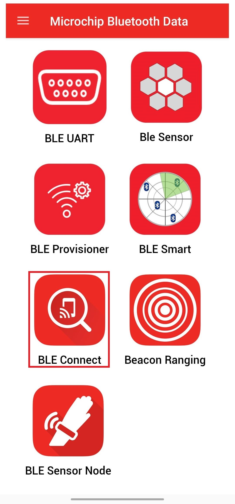

- After power-up, the application displays the Microchip logo on the eINK display and initializes the heart rate sensor
- After successful initialization of the heart rate sensor, two integrated LEDs on the heart rate 9 click lights up and MCU goes to sleep (low power standby mode)

-  Now, scan for Bluetooth devices by tapping START SCAN option on the MBD APP.
  The BM71 device should appear as **MCHP_SAM_L21_HR** in the list of Bluetooth devices.  
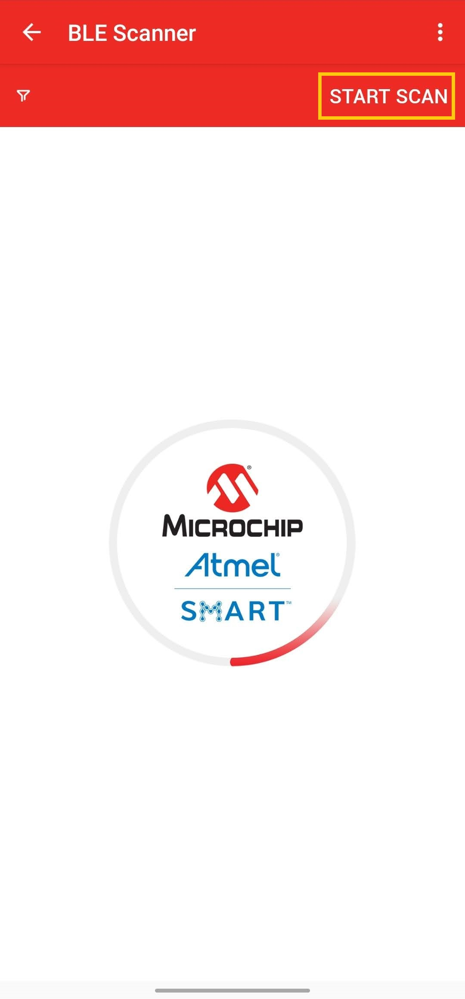
- Stop the scan and connect the **MCHP BLE device** by clicking on **MCHP_SAM_L21_HR**.
  This will establish a connection between the MBD BLE application and the BM71 BLE device and wakes up the MCU from sleep mode.  
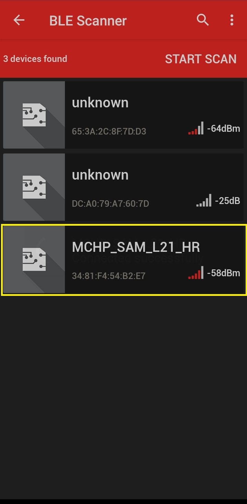
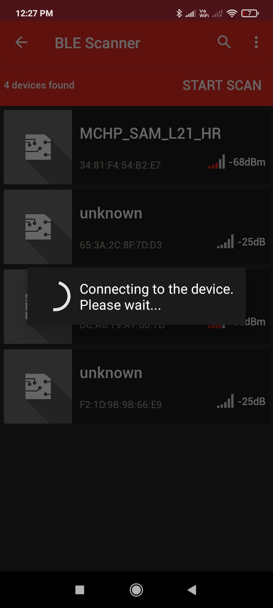

- Once BLE device is connected, the application shows the different services screen. Scroll down
  and tap on the **Heart Rate Service**, it will redirect to **Sensor Location** screen.  


- Keep your finger on Pulse Detection Indicator on the heart rate 9 click sensor as shown in the figure below.  
  

  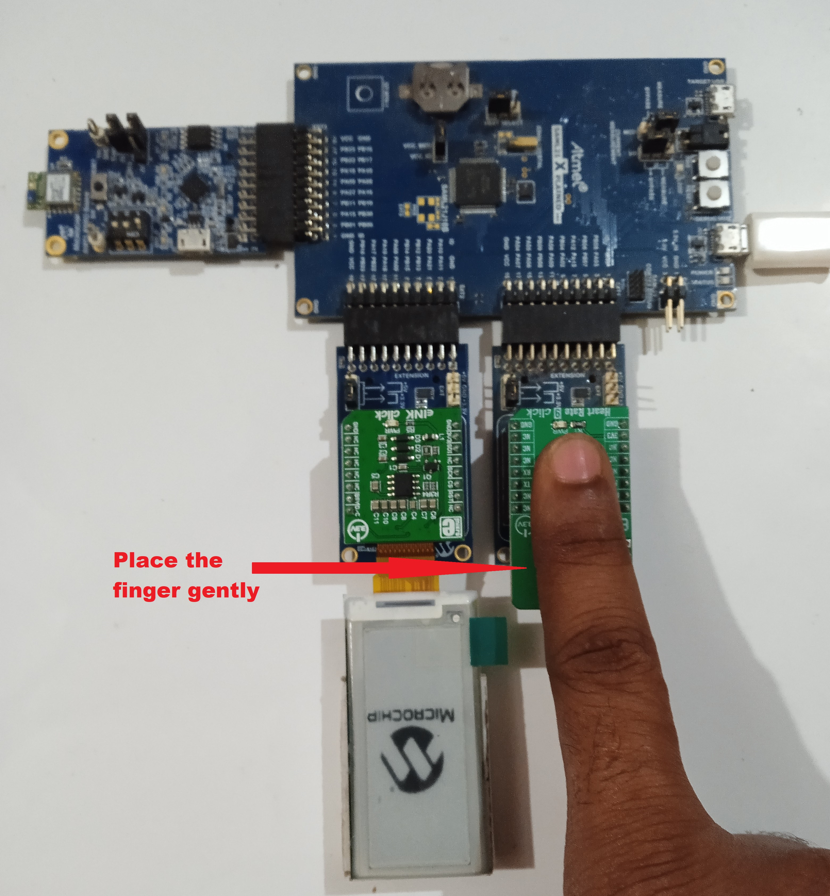

- In the bottom right corner of the **Sensor Location** screen, disable and enable the **Notify Button**.  

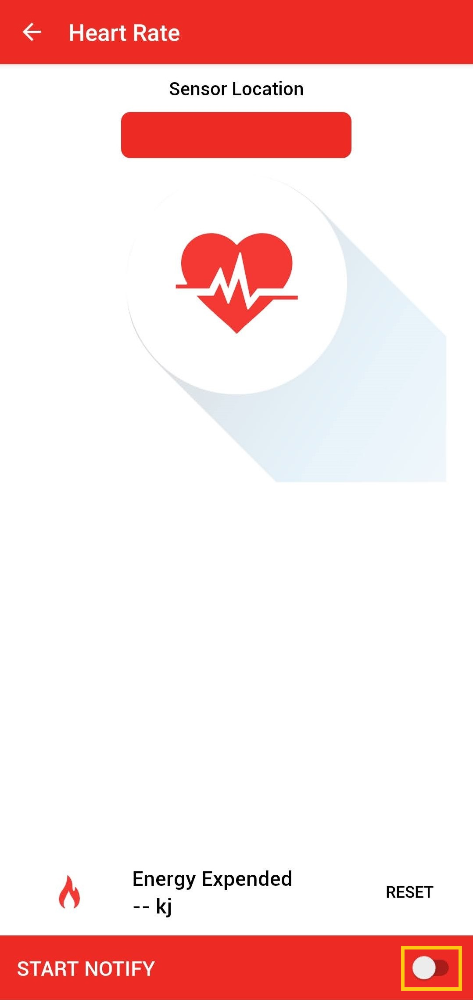  

- Wait till the LED "LED0" on SAM L21 Xplained Pro Evaluation Kit goes off. Once the LED is off, lift your finger.  
  **Note**: Make sure smartphone screens are not turned off and don't switch to any other App(s) on your smartphone.
- The heart rate value (in bpm - beats per minute) gets displayed on the **Sensor Loaction** screen as shown
  in the figure below. Also, the same heart rate value gets displayed on the eINK display and MCU goes back to sleep mode.  
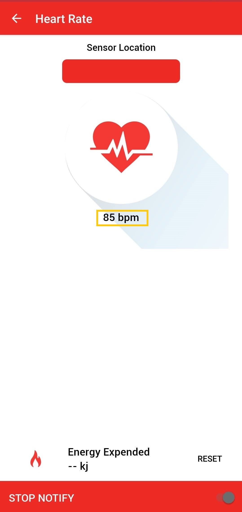

### Running the Demo without BLE:
#### Note: To test the demo without BLE, disconnect the BM71-XPRO from EXT 3 connector of the Curiosity Nano Base board.
- Perform reset by unplugging and re-plugging the power cable of SAM L21 Xplained Pro Evaluation Kit
- After power-up, the application displays the Microchip logo on the eINK display and initializes the heart rate sensor
- After successful initialization of the heart rate sensor, two integrated LEDs on the heart rate 9 click lights up and MCU goes to sleep (low power standby mode)
- Press the switch "SW0" on SAM L21 Xplained Pro Evaluation Kit, MCU wakes up from sleep mode and LED "LED0" on SAM L21 Xplained Pro Evaluation Kit glows on
- Place your index finger gently on the heart rate 9 click sensor as shown in the figure below  

- Wait till the LED "LED0" on SAM L21 Xplained Pro Evaluation Kit goes off and then lift your finger
- The heart rate value (in bpm - beats per minute) gets displayed on the eINK display and MCU goes back to sleep mode. 

## Comments:
- Place your index finger gently on the heart rate 9 click sensor, don't push or put pressure on the sensor (the heart rate values may not be accurate)
- Make sure the smartphone screen is not turned off when reading Heart Rate Sensor data using the MBD smartphone APP and also, don't switch to any other smartphone
- Code related for Heart Rate services is added manually. Harmony v3 framework doesn't generate code for heart rate service
- Reference Training Module: [Low Power Application on SAM L21 (Cortex M0+) MCUs Using MPLAB Harmony v3 Peripheral Libraries](https://microchipdeveloper.com/harmony3:low-power-application-on-saml21#Steps_anchor)
- This application demo builds and works out of box by following the instructions above in "Running the Demo" section. If you need to enhance/customize this application demo, you need to use the MPLAB Harmony v3 Software framework. Refer links below to setup and build your applications using MPLAB Harmony.
	- [How to Setup MPLAB Harmony v3 Software Development Framework](https://ww1.microchip.com/downloads/en/DeviceDoc/How_to_Setup_MPLAB_%20Harmony_v3_Software_Development_Framework_DS90003232C.pdf)
	- [How to Build an Application by Adding a New PLIB, Driver, or Middleware to an Existing MPLAB Harmony v3 Project](http://ww1.microchip.com/downloads/en/DeviceDoc/How_to_Build_Application_Adding_PLIB_%20Driver_or_Middleware%20_to_MPLAB_Harmony_v3Project_DS90003253A.pdf)  	
	- <span style="color:blue"> **MPLAB Harmony v3 is also configurable through MPLAB Code Configurator (MCC). Refer to the below links for specific instructions to use MPLAB Harmony v3 with MCC.**</span>
		- [Create a new MPLAB Harmony v3 project using MCC](https://microchipdeveloper.com/harmony3:getting-started-training-module-using-mcc)
		- [Update and Configure an Existing MHC-based MPLAB Harmony v3 Project to MCC-based Project](https://microchipdeveloper.com/harmony3:update-and-configure-existing-mhc-proj-to-mcc-proj)
		- [Getting Started with MPLAB Harmony v3 Using MPLAB Code Configurator](https://www.youtube.com/watch?v=KdhltTWaDp0)
		- [MPLAB Code Configurator Content Manager for MPLAB Harmony v3 Projects](https://www.youtube.com/watch?v=PRewTzrI3iE)	

## Revision:
- v1.5.0 - Released demo application
