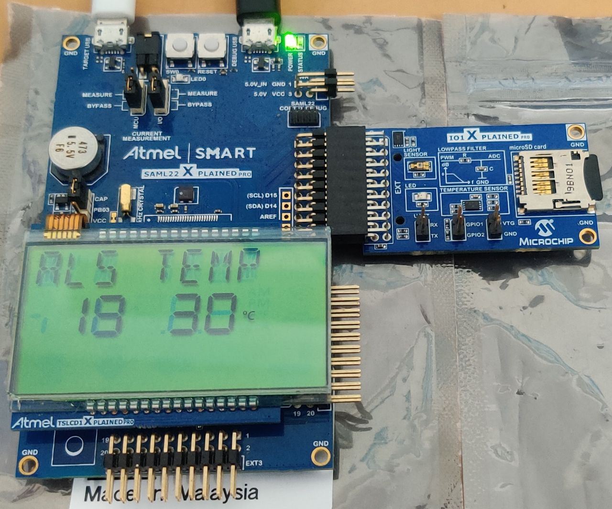
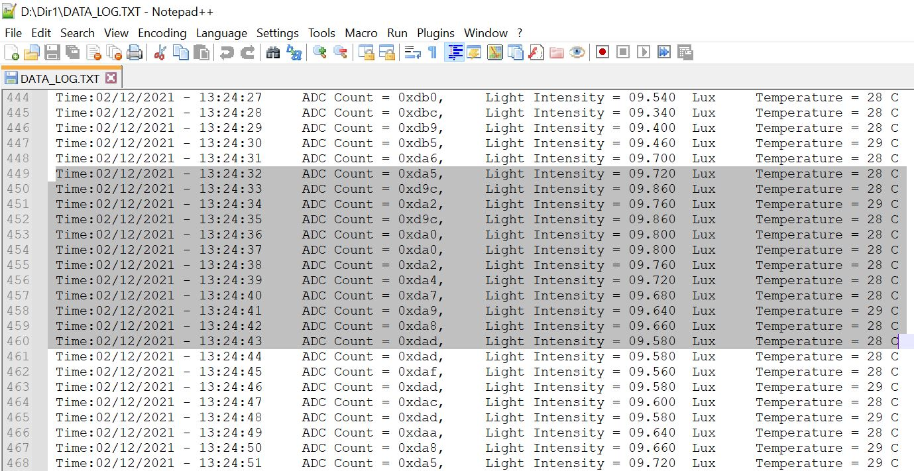

# SD Card, USB Data Logger Application on SAM L22 Xplained Pro Evaluation Kit

<h2 align="center"> <a href="https://github.com/Microchip-MPLAB-Harmony/reference_apps/releases/latest/download/saml22_sdcard_usb_slcd_datalogger.zip" > Download </a> </h2>

## Description

This application shows an example of using the MPLAB Harmony v3 File System to store the sensor data (light intensity values) and temperature values into a SD card using the SDSPI and a SPI driver. The SD card is also enumerated as a MSD(Mass Storage Device) device on the PC(USB Host) enabling logged data viewing.

The SDSPI driver uses an instance of the SPI driver to communicate to the SD card over the SPI bus. The application creates a directory named **Dir1** in the root directory and creates a new file named DATA_LOG.txt. The application writes the light sensor and temperature values into this newly created file every 1 second and also display it on the SLCD. If the directory and file already exists the values are logged into the existing file itself. The logged light intensity and temperature values along with time stamp are read via USB with the SD card enumerated as an MSD( Mass Storage Device). The application parallelly continues to log the data with the SD card enumerated as an MSD.

## Modules/Technology Used:

- Peripheral Modules
  - Timer
  - DMAC
  - ADC
    - PORTS
    - EVENT SYSTEM
    - SERCOM (USART)
    - SERCOM (SPI)
    - SERCOM(I2C)
    - RTC
- Drivers
  - SDSPI Driver
    - USB Full Speed Driver
    - SPI Driver
    - SLCD
- Libraries
  - USB MSD Library
  - File System Library
  - Debug System service Library
  - STDIO Library

## Hardware Used:

- [SAM L22 Xplained Pro Evaluation Kit](https://www.microchip.com/en-us/development-tool/atsaml22-xpro-b)
- [I/O1 Xplained Pro Extension Kit](https://www.microchip.com/Developmenttools/ProductDetails/ATIO1-XPRO)
- [Touch SLCD1 Xplained pro](http://ww1.microchip.com/downloads/en/DeviceDoc/Atmel-42558-Touch-SLCD1-Xplained-Pro_User-Guide.pdf)
- Micro-SD card formatted to FAT32 filesystem.

## Software/Tools Used:

This project has been verified to work with the following versions of software tools:

Refer [Project Manifest](./firmware/src/config/sam_l22_xpro/harmony-manifest-success.yml) present in harmony-manifest-success.yml under the project folder *firmware/src/config/sam_l22_xpro*

- Refer the [Release Notes](../../../release_notes.md#development-tools) to know the **MPLAB X IDE** and **MHC/MCC** Plugin version.

Because Microchip regularly update tools, occasionally issue(s) could be discovered while using the newer versions of the tools. If the project doesn’t seem to work and version incompatibility is suspected, It is recommended to double-check and use the same versions that the project was tested with. To download original version of MPLAB Harmony v3 packages, refer to document [How to Use the MPLAB Harmony v3 Project Manifest Feature](https://ww1.microchip.com/downloads/en/DeviceDoc/How-to-Use-the-MPLAB-Harmony-v3-Project-Manifest-Feature-DS90003305.pdf)

## Setup:

- Verify that the  I/O1 Xplained Pro Extension Kit is connected to Extension Header 1 (EXT1) on the SAM L22 Xplained Pro Evaluation Kit

- Insert microSD(upto 32GB) card on to the [I/O1 Xplained Pro Extension Kit](https://www.microchip.com/developmenttools/ProductDetails/ATIO1-XPRO)

- Insert the Touch SLCD1 Xplained pro into EXT 5

- The SAM L22 Xplained Pro Evaluation Kit allows using the Embedded Debugger (EDBG) for debugging. Connect the Type-A male to micro-B USB cable to micro-B DEBUG USB port to power and debug the SAM L22 Xplained Pro Evaluation Kit.

- SAM L22 Xplained pro will be in battery backup mode initially. The device is not woken up when switched from battery backup power to Main Power. Press the RESET push button on the SAM L22 Xplained pro to wake up the device.

- Place the jumper between CAP & PB03 in the VBAT select jumper.

- The system time can be set via the SetTime() function in app.c file.
  
  

## Programming hex file:

The pre-built hex file can be programmed by following the below steps

### Steps to program the hex file

- Open MPLAB X IDE
- Close all existing projects in IDE, if any project is opened.
- Go to File -> Import -> Hex/ELF File
- In the "Import Image File" window, Step 1 - Create Prebuilt Project, click the "Browse" button to select the prebuilt hex file.
- Select Device has "ATSAML22N18A"
- Ensure the proper tool is selected under "Hardware Tool"
- Click on "Next" button
- In the "Import Image File" window, Step 2 - Select Project Name and Folder, select appropriate project name and folder
- Click on "Finish" button
- In MPLAB X IDE, click on "Make and Program Device" Button. The device gets programmed in sometime.
- Follow the steps in "Running the Demo" section below

## Programming/Debugging Application Project:

- Open the project (saml22_sdcard_usb_slcd__datalogger/firmware/sam_l22_xpro.X) in MPLAB X IDE
- Ensure "SAM L22 Xplained Pro" is selected as hardware tool to program/debug the application
- Build the code and program the device by clicking on the "Make and program" button in MPLAB X IDE tool bar
- Follow the steps in "Running the Demo" section below

## Running the Demo:

1. When Powered up, the Application shows the light intensity(ALS in Lux) and temperature (TEMP in °C) on the SLCD.

2. Light intensity ADC count, Light intensity and temperature values are stored every 1 second along with time stamp. To read the logged light intensity values, connect the Target USB port on the board to the computer using a micro USB cable.

3. Access the DATA_LOG.txt via USB inside the Dir1 folder.(see below image)

4. The sample log file looks as below.
   
   

5. Always eject the USB drive before removing it.

6. To reset the system time press the SW0 on the SAM L22.

## Comments:

- This application demo builds and works out of box by following the instructions above in "Running the Demo" section. If you need to enhance/customize this application demo, you need to use the MPLAB Harmony v3 Software framework. Refer links below to setup and build your applications using MPLAB Harmony.
  - [How to Setup MPLAB Harmony v3 Software Development Framework](https://www.microchip.com/mymicrochip/filehandler.aspx?ddocname=en1000821)
  - [How to Build an Application by Adding a New PLIB, Driver, or Middleware to an Existing MPLAB Harmony v3 Project](http://ww1.microchip.com/downloads/en/DeviceDoc/How_to_Build_Application_Adding_PLIB_%20Driver_or_Middleware%20_to_MPLAB_Harmony_v3Project_DS90003253A.pdf)

## Revision:

- v1.5.0 - Released demo application
