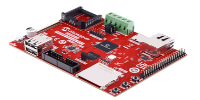

# SAM9X60 Curiosity Development Board
<h4 align="left">  </h4>

This folder contains the MPLAB® Harmony 3 reference applications developed on [SAM9X60 Curiosity Development Board](https://www.microchip.com/en-us/development-tool/EV40E67A).

|SI No| Demo Name | Download Link |
| --- | --- | -- |
| 1 | [Graphics Getting Started ](./sam9x60_cu_graphics_getting_started/readme.md) | [Click Here](https://github.com/Microchip-MPLAB-Harmony/reference_apps/releases/latest/download/sam9x60_cu_graphics_getting_started.zip) |
| 2 | [Snake Game ](./sam9x60_cu_snake_game/readme.md) | [Click Here](https://github.com/Microchip-MPLAB-Harmony/reference_apps/releases/latest/download/sam9x60_cu_snake_game.zip) |

### More Application Demos

For more application demos on **SAM9X60 Curiosity Development Board** and other Development Boards/Kits having the same part number **(SAM9X60)** <a href="https://mplab-discover.microchip.com/v1/itemtype/com.microchip.ide.project?s0=SAM9X60" target="_blank"> CLICK HERE </a>
