# Graphics Getting Started  Application on SAM9X60 Curiosity Development Board
<h2 align="center"> <a href="https://github.com/Microchip-MPLAB-Harmony/reference_apps/releases/latest/download/sam9x60_cu_graphics_getting_started.zip" > Download </a> </h2>

-----
## Description

>  This graphics application demonstrates how to display the Microchip Graphics Quick Start project template to the Maxtouch 5-inch display on the SAM9X60 Curiosity Development board.

## Key Highlights of [SAM9X60 Curiosity Development Board](https://www.microchip.com/en-us/development-tool/EV40E67A):

* LCD Interface.
* External Non-Volatile Memories like NAND, SD, and MicroSD card interfaces.
* Additional sensors can be interfaced using "click boards" through an on-board [mikroBUS connector](https://www.mikroe.com/click).
* Two mechanical programmable buttons.
* One User Input Switch and one RGB LED.
* UART, USB and CAN Interfaces.
* Raspberry pi connectors.

## Modules/Technology Used:

- Peripheral Modules
    - Flexcom
    - LCDC Interface
    - TC0 (TWI/I2C)
    - MAXTOUCH Controller interface   
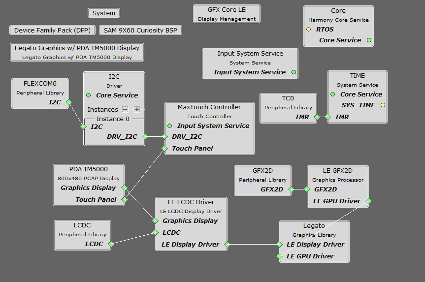

## Hardware Used:  

- [SAM9X60 Curiosity development board](https://www.microchip.com/en-us/development-tool/EV40E67A)
- [High-Performance WVGA LCD Display Module with maXTouch ® Technology](https://www.microchip.com/en-us/development-tool/AC320005-5)
- Micro SD Card

## Software/Tools Used:
- [MPLAB® X IDE](https://microchipdeveloper.com/mplabx:installation)
- [MPLAB® XC32 Compiler](https://microchipdeveloper.com/install:xc32)
- [MPLAB® Code Configurator (MCC)](https://microchipdeveloper.com/install:mcc)

 This project has been verified to work with the following versions of software tools:

Refer [Project Manifest](./firmware/src/config/lcdc_rgba8888_mxt_9x60_wvga/harmony-manifest-success.yml) present in harmony-manifest-success.yml under the project folder *firmware/src/config/lcdc_rgba8888_mxt_9x60_wvga* to know the **MPLAB® X IDE**, **MCC** Plugin, **libraries**  version

## Hardware Setup : 
- Connect the ribbon cable from the display to the J13 connector of the SAM9X60 Curiosity Development Board.
- Power up the board by connecting the USB cable to the USB port J1 on the SAM9X60 curiosity development board.
- Connect external debugger to J12.     
 
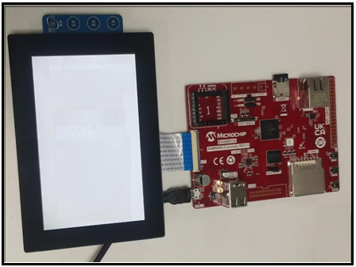

## Developing a graphics getting started demo

  
<B>Details</B>

- Launch MPLAB® X IDE- From the main menu, click on File, then New Project. Under "Projects" choose `32-bit MCC  Harmony Project`, click Next- For `Framework Path` choose the location on your PC where you want to download the Harmony 3 framework- Click Next.   
  
   
- Enter `Location` , `Folder` and `Name` of the project. Click Next.   
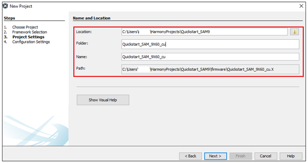   
- In the `Configuration Settings` window, for `Name`  enter `lcdc_rgba8888_mxt_9x60_wvga`, for `Device Family` select `SAM`, for `Target Device` select `SAM9X60D1G`. Click Finish.     
This creates an empty project and set this project as `main project` if there are other projects open in the project explorer window.   
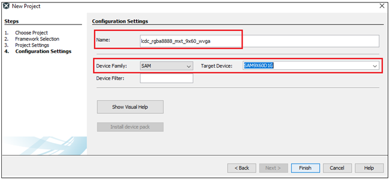   
- From main menu, click on `Tools` -> `Embedded` -> `MPLAB® Code Configurator` or click MCC button in the MPLAB® X IDE tool bar. It will launch Content manger Wizard. Then select MPLAB® Harmony.   
   
- In addition to the required packages, download the optional packages gfx_sam9x60, bsp, csp, core, gfx, dev_packs  and then click Finish. Content download will take some time. Please wait till all the contents are downloaded.   
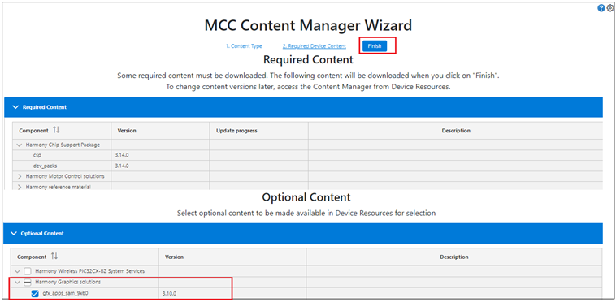   
- Now project graph will be displayed. From device resource add `Board Support Packages`  for `SAM9X60 Curiosity Kit BSP` to `Project Graph`.   
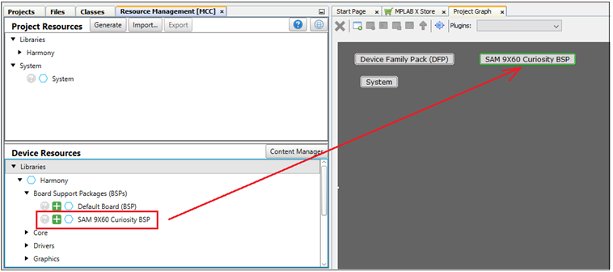   
- From device resource add Graphics -> Templates -> `Legato Graphics w/PDA TM5000 Display` to `Project Graph`. You will be prompted to allow auto-connection and auto-activation  of several components- Click on Yes for all of them except “FreeRTOS".   
   
- Choosing the `Legato Graphics w/PDA TM5000 Display` template automatically populates rest of the project components. This can be seen in the way the project graph is setup and connected.   
- In the project graph, click on `Flexcom6`. In the `Configuration Options` window, select clock speed as 100,000 (100KHz).     
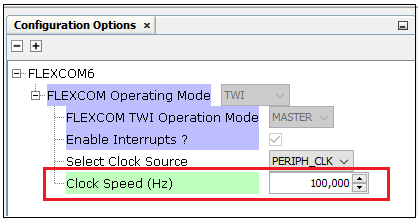   
- In the project graph, click on `LE LCDC Driver`. In the `Configuration Options` window, select output color mode  as 18BPP.   
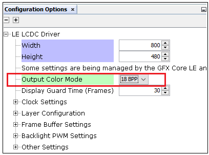   
- From the project graph window, plugins menu select `Pin Configuration`.   
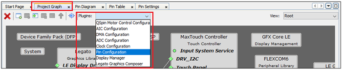   
- You can see that PA30 and PA31 are set to FLEXCOM6. Enable pullups for those pins. Ensure  all the pins are configured as below:   
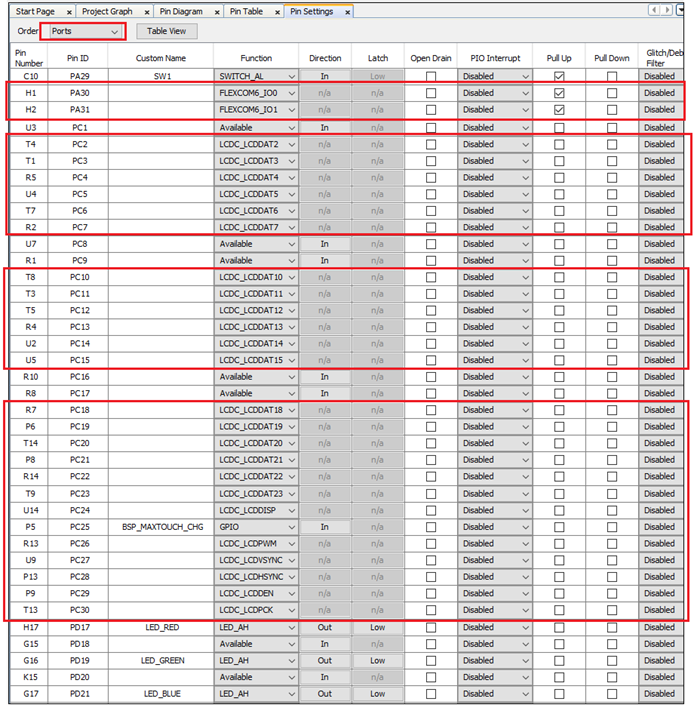   
- Now Save all. Then click generate code. This will generate code for all the peripherals that have been added in the project graph.   
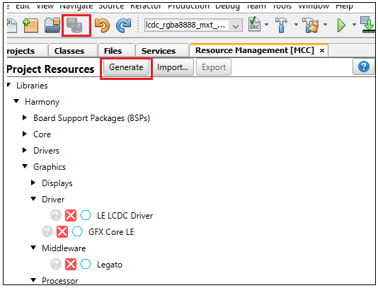   
- Now let us use Microchip Graphics Composer(MGC) to design the graphics to be displayed on the LCD screen and generate the legato library. From the Project graph -> plugin, launch Legato Graphics Composer. (From next software update, this plugin will be renamed to Microchip Graphics Composer)   
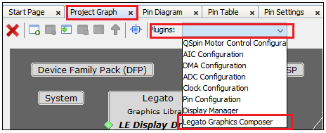   
- From the window that pops-up, click on `Create a new project` using the new project wizard.   
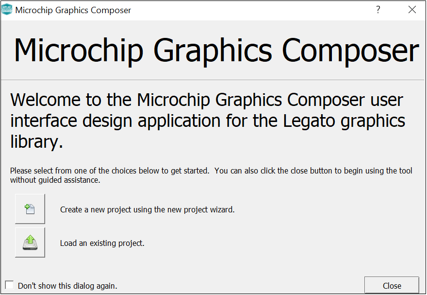   
- In the `Display Configuration` window, choose `WVGA (800x480)` for `Presets` and click on Apply. You will see that the Width and Height are updated. Click Next.   
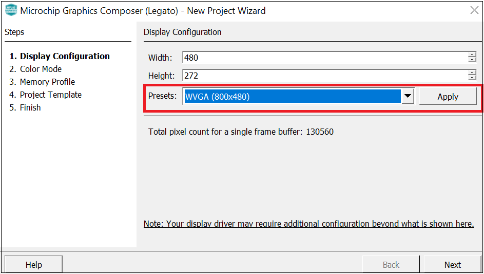   
- For `Color Mode` -> select RGBA_8888. Click Next. For `Memory Profile` -> select `MPU`. Click Next. In the `Project Template` window, select the `Start with a basic quickstart project template` checkbox. Click Next. Click Finish   
- You will see the following screen generated by the composer.   
   
- After the graphics display is composed, you can generate the design files by clicking the `Generate Code` from the File option in the main menu .   
   
- You can save the design files by clicking on File from the main menu and selecting `Save As`. Provide a filename with <configuration_name>_design and save it in the <configuration folder>( That way the next time MGC is launched, the design file is automatically opened) and click Save.   
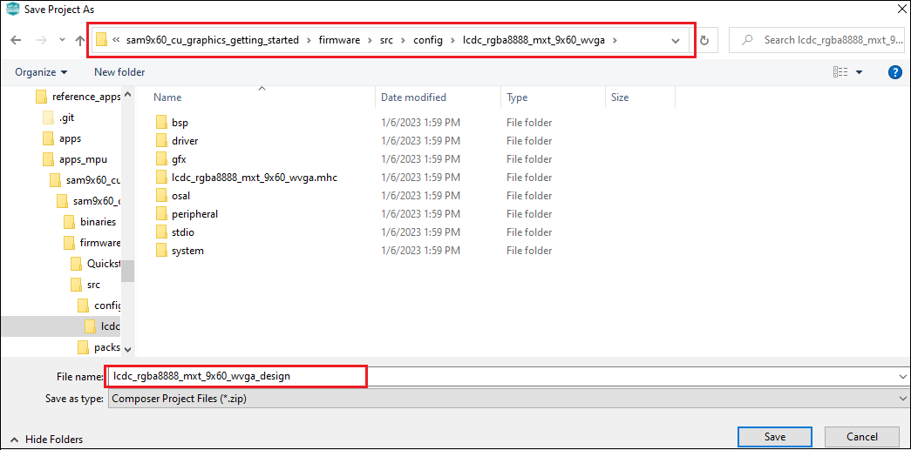   
- You can now exit Microchip Graphics Composer by clicking on Exit from File option in the main menu.   
- From MCC, click on Generate Code. This will generate code for the quickstart template designed using Microchip Graphics Composer.   
   
- Lastly change the following code. In Legato -> renderer -> legato_renderer.c, add proper section for no cache attribute as shown below:   
The `.region_nocache` memory location is defined in the linker file and lets the linker know which memory region is to be used for scratch buffers.   
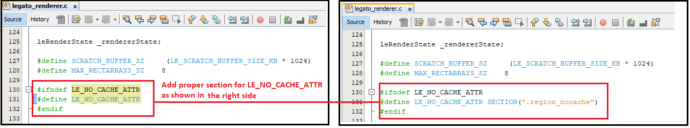   
- Now right click on the project and click `Properties`. For `Connected Hardware Tool` -> select connected hardware debugger used, for `Compiler Toolchain` -> select XC32 and click Apply.   
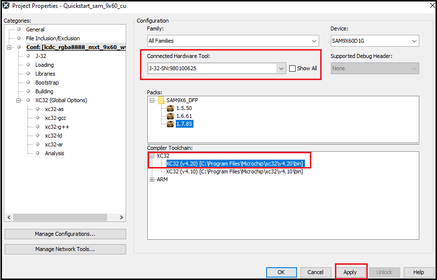   
- From J-32 , `Option categories` choose `Communication` and for `JTAG Method`, select `4-wire JTAG`.   
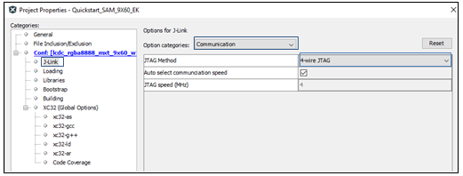   
- Select Bootstrap for Categories and select the `Use Bootstrap` checkbox. For `bootstrap file` -> select the at91bootstrap elf file from [here](./firmware/sam9x60_cu.X/)- Click on Apply and OK.   
   
- Clean and build the project. You should see a message on the output console that the project was successfully built. This completes the development of the basic graphics quickstart getting started  application.   

  

## Debugging Application Project on MPLAB® X IDE:  
- Open the project (sam9x60_cu_graphics_getting_started/firmware/sam9x60_cu.X) in MPLAB® X IDE.  
- Ensure "SAM9X60D1G" is selected as hardware tool to program/debug the application.  
- Build the code and Debug the code by clicking on the "Debug" button in MPLAB® X IDE tool bar.   
- Run the application by clicking "run" button in MPLAB® X IDE tool bar.  
- Now the below legato quickstart template application will get displayed on the LCD connected with SAM9X60 Curiosity development board.  

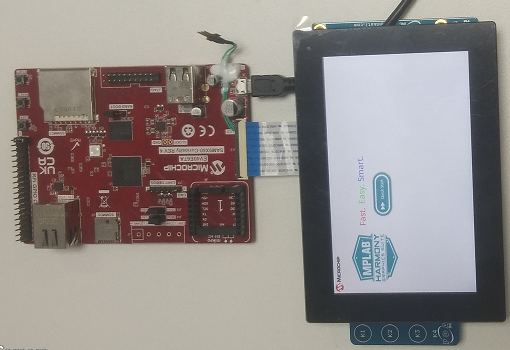  

## Running the pre-built harmony application from SD Card:
The pre-built application bin file can be programmed by following the below steps

### Steps to program the bin file on SD card
- Take a micro-SD Card formatted with FAT32 file system.  
- Copy the boot.bin and harmony.bin files from this [location](./hex) to the micro-SD card using your PC.  
- Insert the SD card to J3 on the SAM9X60 Curiosity development board.  

### Steps to run the bin file from SD card 
- Press the reset button.
- It will display the  below graphics getting started demo -a legato quickstart template application on the display connected with SAM9X60 Curiosity development board.

## Comments:
- This application demo builds and works out of box by following the instructions above in "Running the Demo" section- If you need to enhance/customize this application demo, you need to use the MPLAB® Harmony v3 Software framework- Refer links below to setup and build your applications using MPLAB® Harmony.
    - [How to Setup MPLAB® Harmony v3 Software Development Framework](https://ww1.microchip.com/downloads/en/DeviceDoc/How_to_Setup_MPLAB_%20Harmony_v3_Software_Development_Framework_DS90003232C.pdf)
    - [How to Build an Application by Adding a New PLIB, Driver, or Middleware to an Existing MPLAB® Harmony v3 Project](https://microchipdeveloper.com/32mpu:sam9x60-ek-h3-csp-app)
	- [Click Here for more graphics demos](https://github.com/Microchip-MPLAB-Harmony/gfx_apps_sam_9x60)  
    -  **MPLAB® Harmony v3 is also configurable through MPLAB® Code Configurator (MCC)- Refer to the below links for specific instructions to use MPLAB® Harmony v3 with MCC.**
    - [Getting Started with MPLAB® Harmony v3 Using MPLAB® Code Configurator](https://www.youtube.com/watch?v=KdhltTWaDp0)
    - [MPLAB® Code Configurator Content Manager for MPLAB® Harmony v3 Projects](https://www.youtube.com/watch?v=PRewTzrI3iE)

## Revision:
- v1.6.0 - Released demo application
