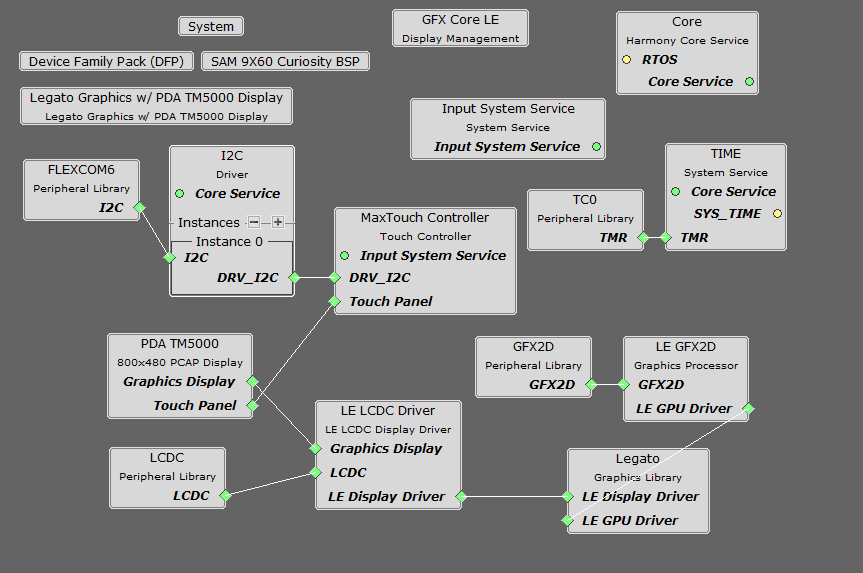
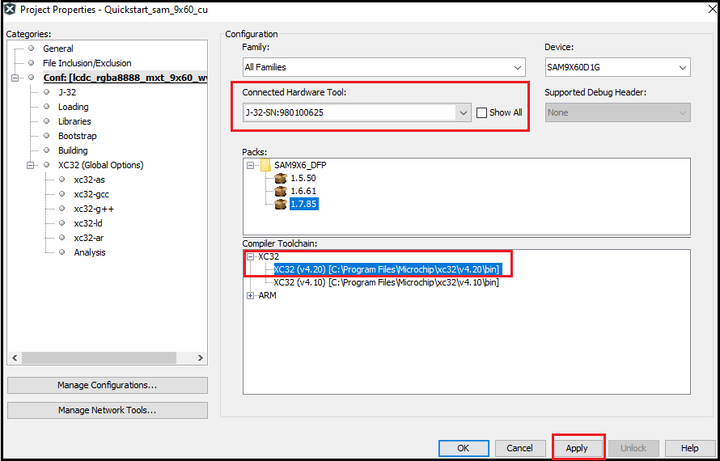
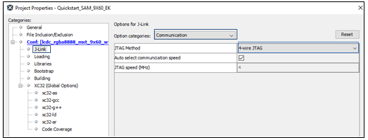
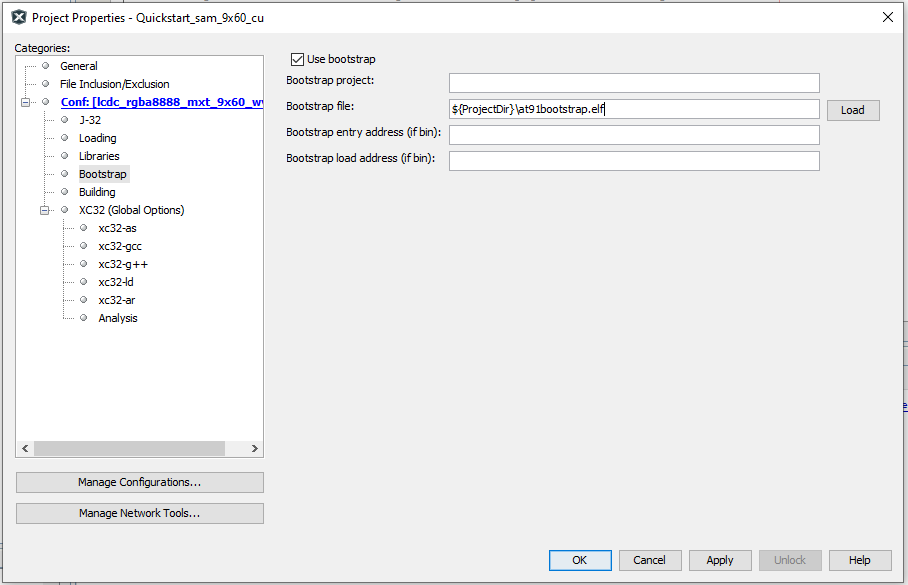
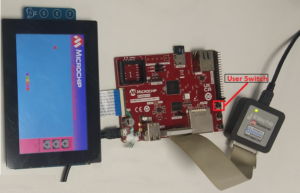
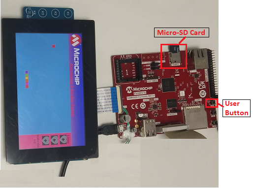

# Snake Game Application on SAM9X60 Curiosity Development Board + High-Performance WVGA LCD Display Module with maXTouch Technology using Microchip Graphics Composer.
<h2 align="center"> <a href="https://github.com/Microchip-MPLAB-Harmony/reference_apps/releases/latest/download/sam9x60_cu_snake_game.zip" > Download </a> </h2>

----

## Description:
> This demonstration represents the classic snake game wherein the player maneuvers the snake and tries to eat the mice (food), which eventually grows the length of the snake. The player needs to protect the snake from hitting the boundary.  
> The application uses the Legato Graphics library to implement the user interface. The template of each screen is made using the Microchip Graphics Composer, while the snake is created using rectangle widgets used inside a double chained list. 
> Player can change the direction of the snake by swiping left, right, up, and down on the maXTouch® display.

## Key Highlights of [SAM9X60 Curiosity Development Board](https://www.microchip.com/en-us/development-tool/EV40E67A):

* LCD Interface.
* External Non-Volatile Memories like NAND, SD, and MicroSD card interfaces.
* Additional sensors can be interfaced using "click boards" through an on-board [mikroBUS connector](https://www.mikroe.com/click).
* Two mechanical programmable buttons.
* One User Input Switch and one RGB LED.
* UART, USB and CAN Interfaces.
* Raspberry pi connectors.

## Modules/Technology Used:
- Peripheral Modules
    - Maxtouch Controller Interface 
    - LCDC display driver
    - Flexcom (TWI/I2C)
    - TC0    

## Hardware Used:
- [SAM9X60 Curiosity development board](https://www.microchip.com/en-us/development-tool/EV40E67A)
- [High-Performance WVGA LCD Display Module with maXTouch ® Technology]( https://www.microchip.com/developmenttools/ProductDetails/AC320005-5#additional-summary )
- Micro SD Card

## Software/Tools Used:
- [MPLAB® X IDE](https://microchipdeveloper.com/mplabx:installation)
- [MPLAB® XC32 Compiler](https://microchipdeveloper.com/install:xc32)
- [MPLAB® Code Configurator (MCC)](https://microchipdeveloper.com/install:mcc)

 This project has been verified to work with the following versions of software tools:  

Refer [Project Manifest](./firmware/src/config/default/harmony-manifest-success.yml) present in harmony-manifest-success.yml under the project folder *firmware/src/config/default* to know the **MPLAB® X IDE**, **MCC**, **libraries** version. 

## Setup:
- Connect the ribbon cable from the display to the J13 connector of the SAM9X60 Curiosity Development Board.
- Power up the board by connecting the powered USB cable to the USB port J1 on the SAM9X60 curiosity development board.
- Connect external J32 debugger at J12.     
 

## Programming/Debugging Application Project on MPLAB® X IDE:
- Open the project (sam9x60_curiosity_dev_board/sam9x60_cu_snake_game/firmware/sam9x60_cu.X) in MPLAB® X IDE. 
- Now right click on the project and click `Properties`. For `Connected Hardware Tool` -> select connected external hardware debugger, for `Compiler Toolchain` -> select XC32 and click Apply.   
   
- From J-Link , `Option categories` choose `Communication` and for `JTAG Method`, select `4-wire JTAG`.   
   
- Select Bootstrap for Categories and select the `Use Bootstrap` checkbox. For `bootstrap file`, select the at91bootstrap elf file from [here](./firmware/sam9x60_cu.X/)- Click on Apply and OK.   
   
- Clean and build the project. You should see a message on the output console that the project was successfully built.
- Debug the code by clicking on the "Debug" button in MPLAB® X IDE tool bar.  
- Run the application by clicking "run" button in MPLAB® X IDE tool bar. 
- A splash screen should appear followed by the Menu screen.
- Select the level from the menu screen by touching the level button on the display.
- Swipe left, right, up or down on the display to change the snake direction in order to reach the food.
- By pressing the User Switch user can go back to the Menu.   

## Running the pre-built harmony application from SD Card:
The pre-built application bin file can be programmed by following the below steps:

### Steps to program the bin file on SD card
- Take a micro-SD Card formatted with FAT32 file system.  
- Copy the boot.bin and harmony.bin files from this [location](./hex) to the micro-SD card using your PC.
- Insert the SD card to J3 on the SAM9X60 Curiosity development board.

### Steps to run the bin file from SD card 
- Perform a reset by pressing RESET button on the SAM9X60 Curiosity Development Board
- After the board powers up, a splash screen should appear followed by the Menu screen.
- Select the level from the menu screen by touching the level button on the display.
- Swipe left, right, up or down on the display to change the snake direction in order to reach the food.
- By pressing the User Switch user can go back to the Menu.

## Comments:
- This application demo builds and works out of box by following the instructions above in "Running the Demo" section- If you need to enhance/customize this application demo, you need to use the MPLAB® Harmony v3 Software framework- Refer links below to setup and build your applications using MPLAB® Harmony.
    - [How to Setup MPLAB® Harmony v3 Software Development Framework](https://ww1.microchip.com/downloads/en/DeviceDoc/How_to_Setup_MPLAB_%20Harmony_v3_Software_Development_Framework_DS90003232C.pdf)
    - [How to Build an Application by Adding a New PLIB, Driver, or Middleware to an Existing MPLAB® Harmony v3 Project](https://microchipdeveloper.com/32mpu:sam9x60-ek-h3-csp-app)    
	- [Getting Started with MPLAB® Harmony v3 Using MPLAB® Code Configurator](https://www.youtube.com/watch?v=KdhltTWaDp0)
    - [MPLAB® Code Configurator Content Manager for MPLAB® Harmony v3 Projects](https://www.youtube.com/watch?v=PRewTzrI3iE)
	- [Microchip Graphics Composer](https://github.com/mchpgfx/legato.docs/wiki/UserGuide-LegatoComposer)
	- [Click Here for more graphics demos](https://github.com/Microchip-MPLAB-Harmony/gfx_apps_sam_9x60)  

## Revision:
- v1.6.0 - Released demo application