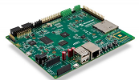

# SAM9X60 Evaluation kit
<h4 align="left">  </h4>

This folder contains the MPLAB® Harmony 3 reference applications developed on [SAM9X60 Evaluation Kit](https://www.microchip.com/en-us/development-tool/dt100126).

|SI No| Demo Name | Download Link |
| --- | --- | -- |
| 1 | [QSPI XIP ](./sam9x60_ek_blink_led_qspi_xip/readme.md) | [Click Here](https://github.com/Microchip-MPLAB-Harmony/reference_apps/releases/latest/download/sam9x60_ek_blink_led_qspi_xip.zip) |

### More Application Demos

For more application demos on **SAM9X60 Evaluation Kit** and other Development Boards/Kits having the same part number **(SAM9X60)** <a href="https://mplab-discover.microchip.com/v1/itemtype/com.microchip.ide.project?s0=SAM9X60" target="_blank"> CLICK HERE </a>
