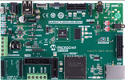

# SAM9X75 Early Access Evaluation Board
<h4 align="left">  </h4>

This folder contains the MPLAB® Harmony 3 reference applications developed on [SAM9X75 Early Access Evaluation Board](https://www.microchip.com/en-us/development-tool/EA14J50A).

|SI No| Demo Name | Download Link |
| --- | --- | -- |
| 1 | [USB-HOST application Getting Started ](./sam9x75_ea_usb_host_getting_started/readme.md) | [Click Here](https://github.com/Microchip-MPLAB-Harmony/reference_apps/releases/latest/download/sam9x75_ea_usb_host_getting_started.zip) |

### More Application Demos

For more application demos on **SAM9X75 Early Access Evaluation Board** and other Development Boards/Kits having the same part number **(SAM9X75)** <a href="https://mplab-discover.microchip.com/v1/itemtype/com.microchip.ide.project?s0=SAM9X75" target="_blank"> CLICK HERE </a>
