# USB Host Getting Started Application on SAM9X75 Early Access Evaluation Board
<h2 align="center"> <a href="https://github.com/Microchip-MPLAB-Harmony/reference_apps/releases/latest/download/sam9x75_ea_usb_host_getting_started.zip" > Download </a> </h2>

-----
## Description

>   This application demonstrates the ability of the MPLAB Harmony USB Host HID Client Driver to enumerate and operate a HID keyboard device. This application creates a USB Host application that uses the USB Host Layer, HID Client driver and HID Keyboard Usage driver to enumerate a USB keyboard and understand keyboard press release events. The keyboard events are displayed using a terminal emulator on a personal computer.
A green LED will turn ON when keyboard is connected and will turn OFF when the keyboard is disconnected.

## Key Highlights of [SAM9X75 Early Access Evaluation Board](https://www.microchip.com/en-us/development-tool/EA14J50A):

* MIPI and LVDS LCD Interfaces.
* External Non-Volatile Memories like NAND, and SD card interfaces.
* Additional sensors can be interfaced using "[click boards](https://github.com/Microchip-MPLAB-Harmony/reference_apps/tree/master/apps/sam_e51_cnano/same51n_mikroe_click)" through an on-board mikroBUS connector.
* Two mechanical programmable buttons.
* One User Input Switch and one RGB LED.
* UART, USB and CAN Interfaces.
* Raspberry pi connectors.
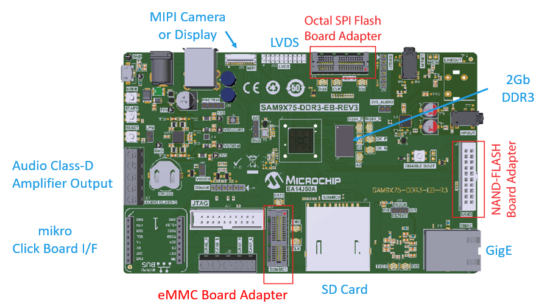

## Modules/Technology Used:

- Peripheral Modules
    - USB
    - TC0
    - DBGU  
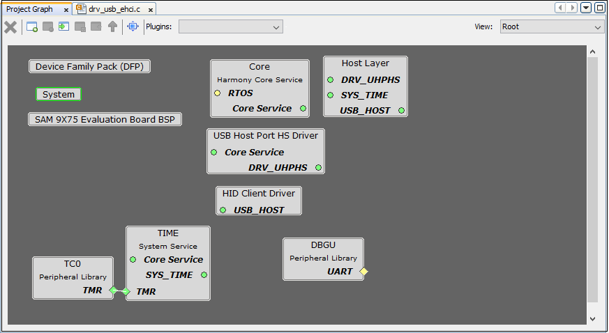

## Hardware Used:  

- [SAM9X75 Early Access Evaluation Board](https://www.microchip.com/en-us/development-tool/EA14J50A).
- A commercially available USB Keyboard.
- SD Card.

## Jumper Settings:
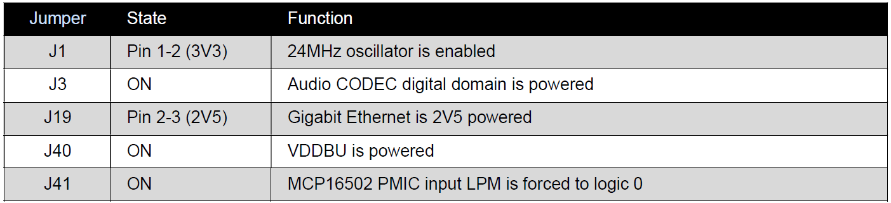

## Software/Tools Used:
- [MPLAB® X IDE](https://microchipdeveloper.com/mplabx:installation).
- [MPLAB® XC32 Compiler](https://microchipdeveloper.com/install:xc32).
- [MPLAB® Code Configurator (MCC)](https://microchipdeveloper.com/install:mcc).

 This project has been verified to work with the following versions of software tools:

Refer [Project Manifest](./firmware/src/config/default/harmony-manifest-success.yml) present in harmony-manifest-success.yml under the project folder *firmware/src/config/default* to know the **MPLAB® X IDE**, **MCC** Plugin, **libraries**  version
Note: USB label should be v3.11.0 or higher.

## Hardware Setup : 
- Power up the board by connecting 5V/2A power adapter to the SAM9X75 Early Access Evaluation Board.
- Press the start(nSTART switch) button on the board.
- Connect the USB Keyboard to the J29-B connector of the SAM9X75 Early Access Evaluation Board.
- Connect the UART port (J34) on board to the computer using a USB to 5V Serial UART Cable(to enable debug com port).
- Connect external JTAG debugger to J37.     
 
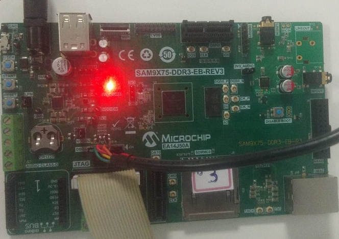

## Developing a USB Host demo application

  
 Details

     

- Launch MPLAB® X IDE- From the main menu, click on File, then New Project. Under `Projects` choose `32-bit MCC  Harmony Project`, click Next- For `Framework Path` choose the location on your PC where you want to download the Harmony 3 framework- Click Next.   
  
   

- Enter `Location` , `Folder` and `Name of the project`. Click Next.   
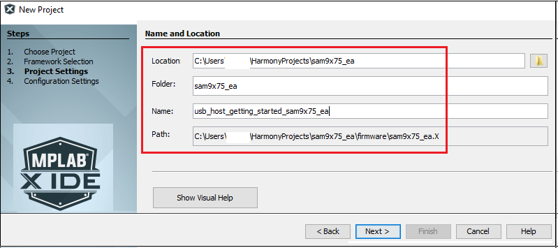   

- In the `Configuration Settings` window, for `Name`  enter `default`, for `Device Family` select `SAM`, for `Target Device` select `SAM9X75`. Click Finish.     
This creates an empty project and set this project as `main project`. If there are other projects open in the project explorer window, set this project as main project by right clicking on the project, choose 'Set as Main Project'.   
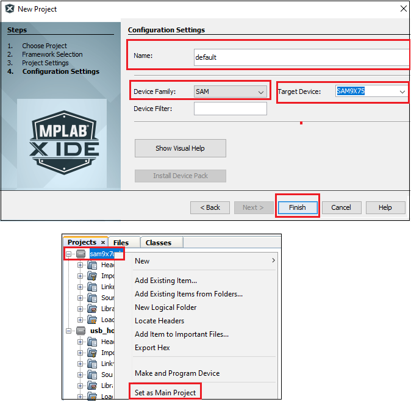   

- After the project is created, MCC will be automatically launched. (To launch MCC manually, from main menu, click on `Tools` -> `Embedded` -> `MPLAB® Code Configurator` or click MCC button in the MPLAB® X IDE tool bar.) It will launch Content manger Wizard. Then select MPLAB® Harmony.   
   

- In addition to the required packages(csp, dev_packs), download the optional packages usb, bsp, core and then click Finish. Content download will take some time. Please wait till all the contents are downloaded.   
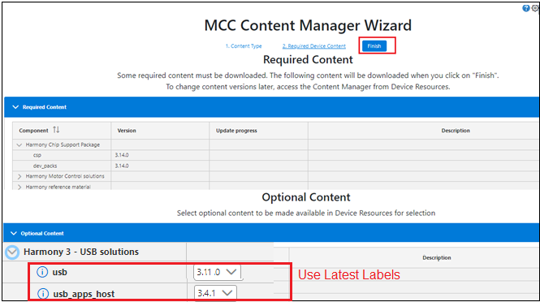   

- Now a project graph will be displayed. From `Device Resource` add `Board Support Packages`  for `SAM9X75 Evaluation Board BSP` to `Project Graph`.   
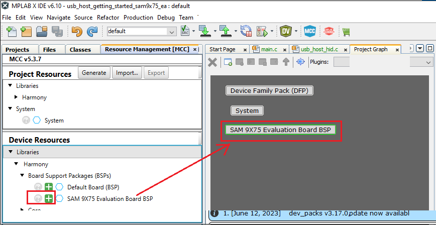   

- From `Device Resource`, `Libraries` -> `Host Stack` , add `HID Client Driver` to the `Project Graph`. You will be prompted to allow auto-connection and auto-activation  of several components- Click on Yes for all of them except “FreeRTOS".   
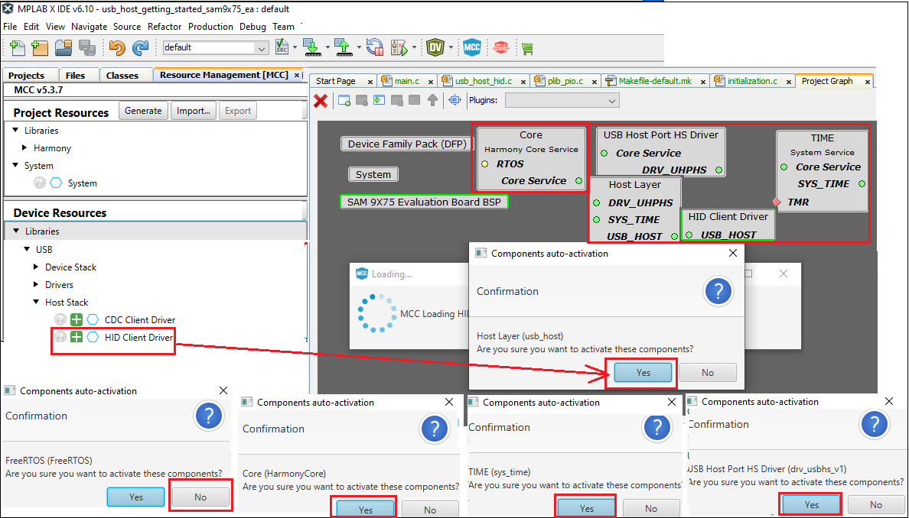   

- Choosing the `HID Client Driver` template automatically populates the rest of the project components. This can be seen in the way the project graph is set up and connected.   
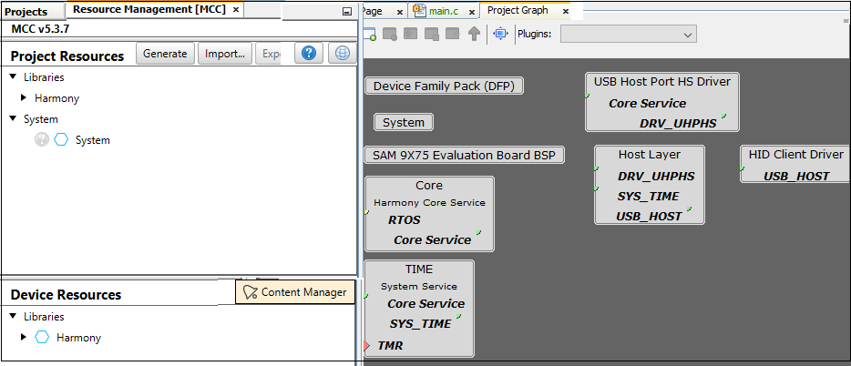   

- From `Device Resource`, `Peripherals` -> add `DBGU` to the `Project Graph`. This helps to print the debug messages (console serial communication messages) via comm port.   
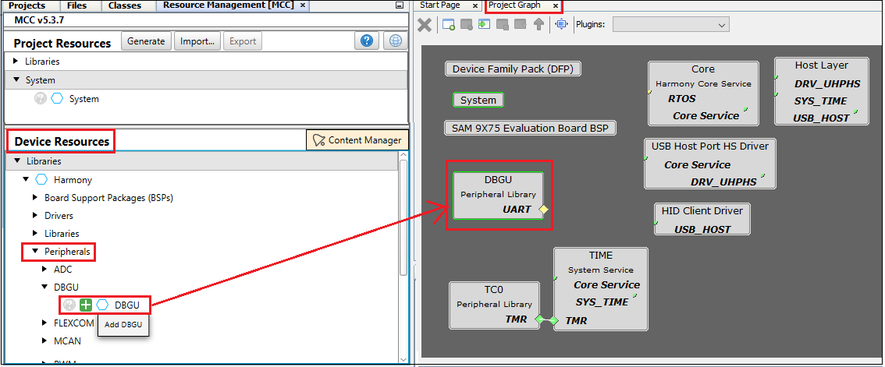   

- In the project graph, right click on `TMR in Time` and then add satisfiers `TC0`.     
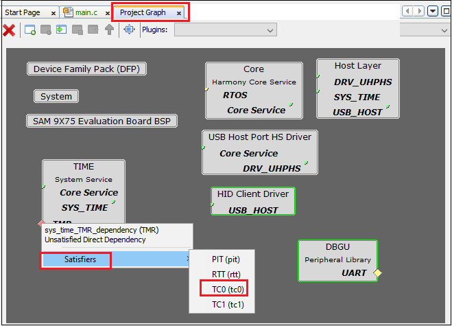   

- From the project graph window, click the `HID Client Driver` and in the `Configuration Options` choose `Use Keyboard Driver`  
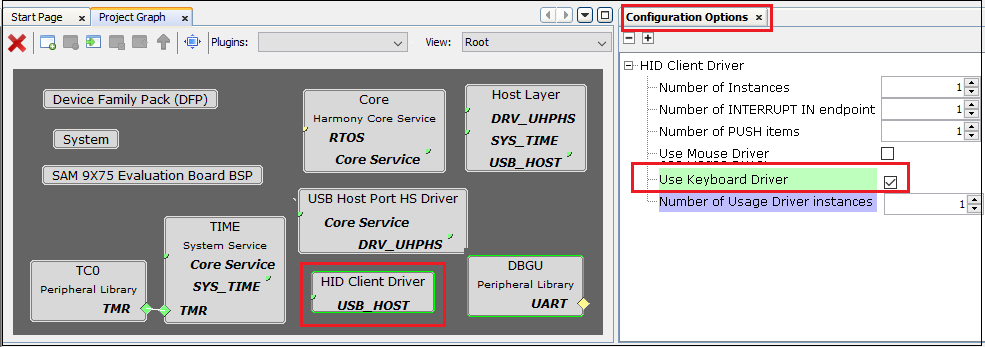   

- From the project graph window, click the `USB Host Port HS Driver` and in the `Configuration Options` enter `Port Selection` as `0x02`(SAM9X75 Early Access Evaluation Board has two host std Type A receptacle's, user can choose the one they want to enable(0x01 or 0x02))  
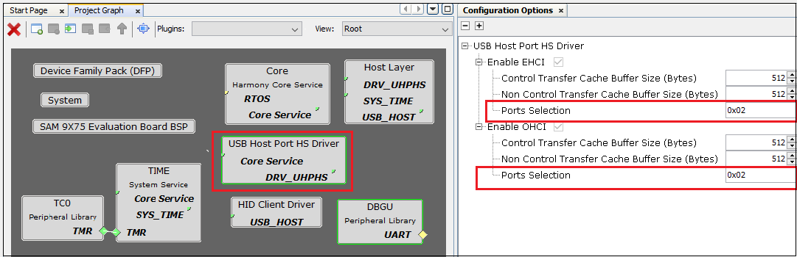   

- Refer section 29.5 of the SAM9X75 data sheet which says "The USB device and host ports requires both the 48 MHz signal and the peripheral clock".  
  Main clock= 24MHz, UPLL Clock= 24MHz*40/2 =480MHz Here UPLL Multiplier= 39 , USB Clock= 480MHz/10 = 48MHz Here USB Divider= 9.  
  Based on this calculations, configure the USB and peripherals clock signals as mentioned in the next step.

- From the project graph window, click the `system` and in the `Configuration Options` , do the clock settings as shown below:  
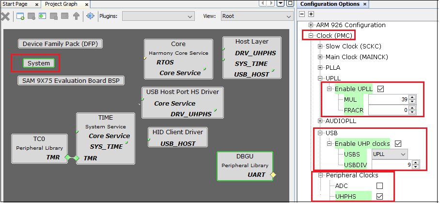   

- Ensure  all the pins are configured as below:   
PA26 and PA27 are for serial debugging. PC19, PC20, PC21 are for LEDs red, blue, and green respectively. PC27 and PC29 are VBUS Enable of USB.
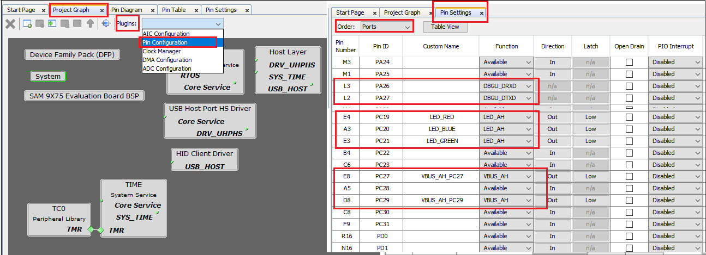   

- Now Save all. Then click generate code. This will generate code for all the Device Resource that have been added in the project graph.   
   

- Up to this point in the project creation process, you used MPLAB Code Configurator(MCC) to configure and generate code to initialize the device (SAM9X75) and initialize USB host driver.  
  Refer [initialization.c](./firmware/src/config/default/initialization.c) to find all the device resource added in the project graph got initialized.  All that is left is for the user to write the application code in the app.c file.
  Documentation for each of the peripheral libraries or diver libraries can be accessed as follows:
  1.	Peripheral libraries APIs can be accessed as a HTML file (*.html) from the Harmony 3 Framework path. (\<framework_path\>\csp\docs\index.html)
  2.    BSP libraries APIs can be found in bsp.h
  3.    USB host driver APIs can be accessed as a HTML file (*.html) from the Harmony 3 Framework path. (\<framework_path\>\usb\docs\index.html)

- APIs used for this application are as follows:
  * bool DBGU_Write( void* buffer, const size_t size );
  * bool DBGU_WriteIsBusy( void );
  * bool USB_HOST_HID_KEYBOARD_EventHandlerSet(USB_HOST_HID_KEYBOARD_EVENT_HANDLER appKeyboardEventHandler);
  * bool USB_HOST_BusEnable(USB_HOST_BUS bus);
  * bool USB_HOST_BusIsEnabled(USB_HOST_BUS bus);
  * LED_GREEN_On();

- [Sample code can be found here](./firmware/src/app.c) and [Its header file can be found here.](./firmware/src/app.h)

- Now right click on the project and click `Properties`. For `Connected Hardware Tool` -> select connected hardware debugger used, for `Compiler Toolchain` -> select XC32 and click Apply.   
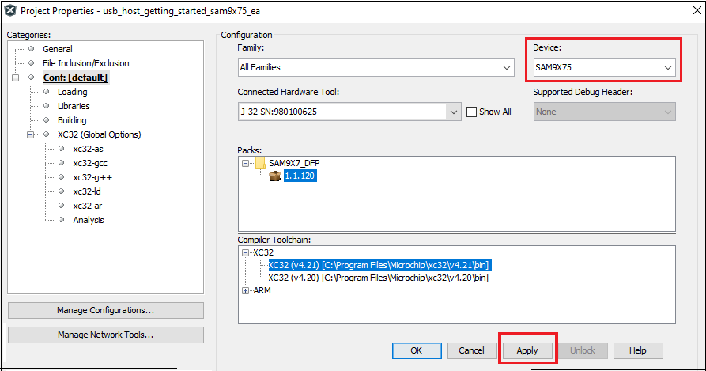   

- From J-32/J-Link, `Option categories` choose `Communication` and for `JTAG Method`, select `4-wire JTAG`.   
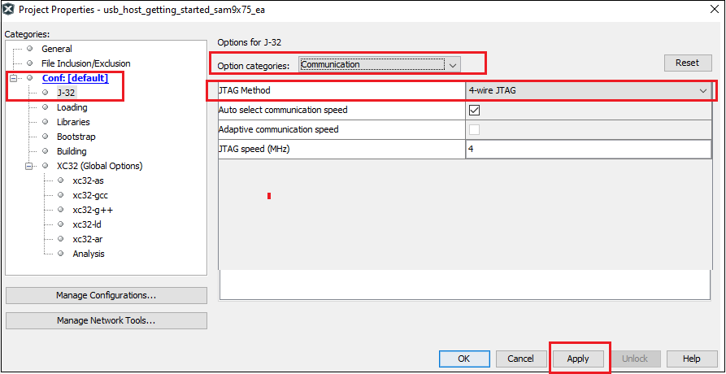   

- Select Bootstrap for Categories and select the `Use Bootstrap` checkbox. For `bootstrap file` -> select the at91bootstrap elf file from [here](./firmware/sam9x75_ea.X)- Click on Apply and OK.   
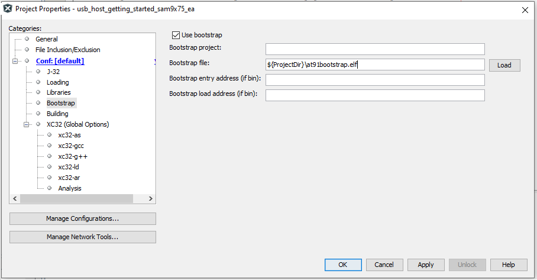   

- By default, MPLAB X only produces ELF and Hex format output files.
    To generate application output in binary format, a post build step needs to be added to the project properties.
	To do this project properties, building, click the check box `Execute this line after build`, then enter the below command.  

	***${MP_CC_DIR}/xc32-objcopy -O binary ${DISTDIR}/${PROJECTNAME}.${IMAGE_TYPE}.elf ${DISTDIR}/harmony.bin***  

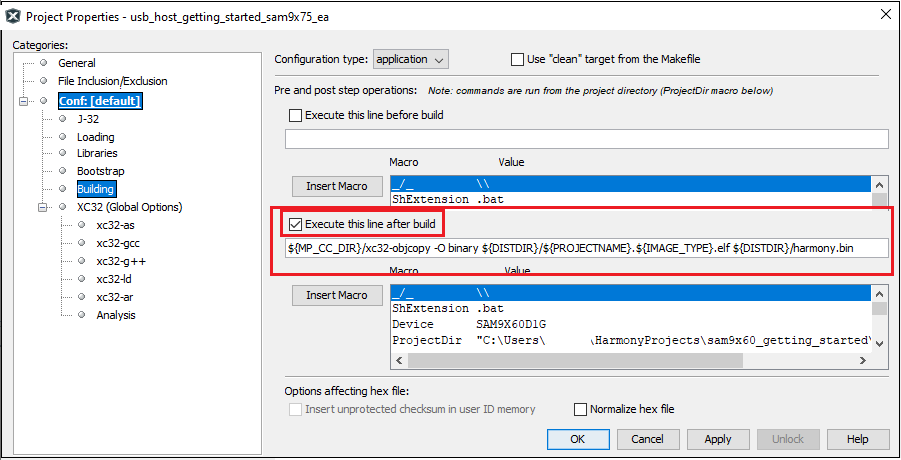  

- Clean and build the project. You should see a message on the output console that the project was successfully built. This completes the development of the usb host getting started application.   

- The harmony.bin binaries will be avialbale at ./firmware/sam9x75_ea.X/dist/default/production.

 

## Debugging Application Project on MPLAB® X IDE:
- Open the project (sam9x75_ea_usb_host_getting_started/firmware/sam9x75_ea.X) in MPLAB® X IDE.  
- In the project properties, ensure `SAM9X75` is selected as the 'Device' and for `Connected Hardware Tool`, select connected hardware debugger with the board to program/debug the application.    
- Build the code and debug the code by clicking on the "Debug" button in MPLAB® X IDE tool bar.   
- Run the application by clicking the “run" button in MPLAB® X IDE tool bar.
- Ensure Console Serial communications between the Host PC and the SAM9X75 EA Evaluation Board take place through UART debug port J34. 
A terminal emulation program running on the Host PC communicates with the SAM9X75 Early Access Evaluation DBGU UART port.
Ensure the terminal emulation program(Eg: PUTTY) is configured to the COM port and settings are:
  * Speed: 115200
  * Data: 8
  * Parity: None
  * Stop Bits: 1 

- Once the USB host operation is enabled, you will get the debug message on the serial console as "Connect Keyboard".
  Once Keyboard is connected, green LED will turn ON and you will get the messages as shown below. 
 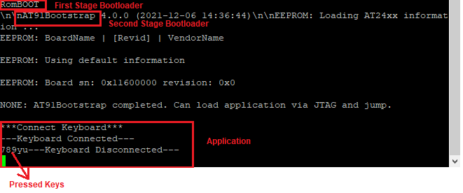   
  Once the Keyboard is disconnected, green LED will turn OFF.

## Running the pre-built harmony application from SD Card:
The pre-built application bin file can be programmed by following the below steps.

### Steps to program the bin file on SD card
- Take a SD Card formatted with FAT32 file system.  
- Copy the boot.bin and harmony.bin files from this [location](./hex) to the SD card using your PC.  
- Insert the SD card to J8 on the SAM9X75 Early Access Evaluation Board.  

### Steps to run the bin file from SD card 
- Press the reset button.
- Once the USB host operation is enabled, you will get the debug message on the serial console as "Connect Keyboard".
  Once keyboard is connected, green LED will turn ON and you will get the messages as shown below. 
     
  Once the keyboard is disconnected, green LED will turn OFF.

## Comments:
- This application demo builds and works out of box by following the instructions above in "Running the Demo" section- If you need to enhance/customize this application demo, you need to use the MPLAB® Harmony v3 Software framework- Refer links below to setup and build your applications using MPLAB® Harmony.
    - [How to Setup MPLAB® Harmony v3 Software Development Framework](https://ww1.microchip.com/downloads/en/DeviceDoc/How_to_Setup_MPLAB_%20Harmony_v3_Software_Development_Framework_DS90003232C.pdf)
    - [Click Here to learn more about USB](https://microchipdeveloper.com/usb:what-is-usb)	
    -  **MPLAB® Harmony v3 is also configurable through MPLAB® Code Configurator (MCC)- Refer to the below links for specific instructions to use MPLAB® Harmony v3 with MCC.**
    - [Getting Started with MPLAB® Harmony v3 Using MPLAB® Code Configurator](https://www.youtube.com/watch?v=KdhltTWaDp0)
    - [MPLAB® Code Configurator Content Manager for MPLAB® Harmony v3 Projects](https://www.youtube.com/watch?v=PRewTzrI3iE)
	- [Click Here for more Harmony V3 applications](https://github.com/search?q=org%3AMicrochip-MPLAB-Harmony+sam_9x7)
	- [Click Here for more Harmony V3 USB applications](https://github.com/search?q=org%3AMicrochip-MPLAB-Harmony+usb_apps)

## Revision:
- v1.6.0 - Released demo application
