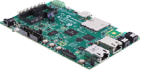

# SAMA7G54 Evaluation kit
<h4 align="left">  </h4>

This folder contains the MPLAB® Harmony 3 reference applications developed on [SAMA7G54 Evaluation Kit](https://www.microchip.com/en-us/development-tool/EV21H18A).

|SI No| Demo Name | Download Link |
| --- | --- | -- |
| 1 | [QSPI XIP ](./sama7g54_ek_blink_led_qspi_xip/readme.md) | [Click Here](https://github.com/Microchip-MPLAB-Harmony/reference_apps/releases/latest/download/sama7g54_ek_blink_led_qspi_xip.zip) |
| 2 | [Ethernet Web Server ](./sama7g54_ek_ethernet_web_server_getting_started/readme.md) | [Click Here](https://github.com/Microchip-MPLAB-Harmony/reference_apps/releases/latest/download/sama7g54_ek_ethernet_web_server_getting_started.zip) |

### More Application Demos

For more application demos on **SAMA7G54 Evaluation Kit** and other Development Boards/Kits having the same part number **(SAMA7)** <a href="https://mplab-discover.microchip.com/v1/itemtype/com.microchip.ide.project?s0=SAMA7" target="_blank"> CLICK HERE </a>
