# Blink LED Application getting executed from QSPI flash on SAMA7G54 Evaluation kit
<h2 align="center"> <a href="https://github.com/Microchip-MPLAB-Harmony/reference_apps/releases/latest/download/sama7g54_ek_blink_led_qspi_xip.zip" > Download </a> </h2>

-----
## Description

>   This application demonstrates how to run and debug an application executed from QSPI flash on SAMA7G54 Evaluation Kit. Blue LED turns ON when user input key(sw1) is pressed.

## Key Highlights of [SAMA7G54 Evaluation kit](https://www.microchip.com/en-us/development-tool/dt100126):
* 2-lane MIPI-CSI2 (D-PHY) 
* 12-bit RGB camera
* Dual Ethernet (Gigabit and 10/100)
* Audio sub-system
* 2 SSC and 2 I2SMCC
* 2x 4-channel PDMs (up to 8 microphones)
* 6 CAN-FD
* 3 High-Speed USB ports
* 12 FLEXCOMs (USART, SPI, TWI)
* 1Gb Octal SPI Flash
* 2 EEPROMs w/ EUI-48TM MAC ID
* 1 SD card slot
* 2 Ethernet ports (Gigabit and 10/100)
* Pad for ATWILC3000 Wi-Fi/BT module (unpopulated)
* 40-pin Raspberry Pi expansion header
* 2 mikroBUS connectors

## Modules/Technology Used:

- Peripheral Modules
    - BSP	 

## Hardware Used:  

- [SAMA7G54 Evaluation kit](https://www.microchip.com/en-us/development-tool/EV21H18A).
- SD Card.

## Software/Tools Used:
- [MPLAB® X IDE](https://microchipdeveloper.com/mplabx:installation).
- [MPLAB® XC32 Compiler](https://microchipdeveloper.com/install:xc32).
- [MPLAB® Code Configurator (MCC)](https://microchipdeveloper.com/install:mcc).

 This project has been verified to work with the following versions of software tools:

Refer [Project Manifest](./firmware/src/config/default/harmony-manifest-success.yml) present in harmony-manifest-success.yml under the project folder *firmware/src/config/default* to know the **MPLAB® X IDE**, **MCC** Plugin, **libraries**  version.

## Hardware Setup : 
- Power up the board by connecting 5V/2A power adapter to J1 or connect the USB Micro-B port(J29) to the Host PC using a micro-USB cable.
- Connect the USB Micro-B port (J24- J-Link-CDC) on board to the computer using a micro-USB cable (to print debug messages on the serial console).
- Default jumper settings should be as follows:  
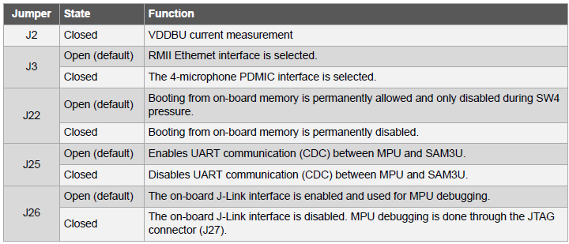
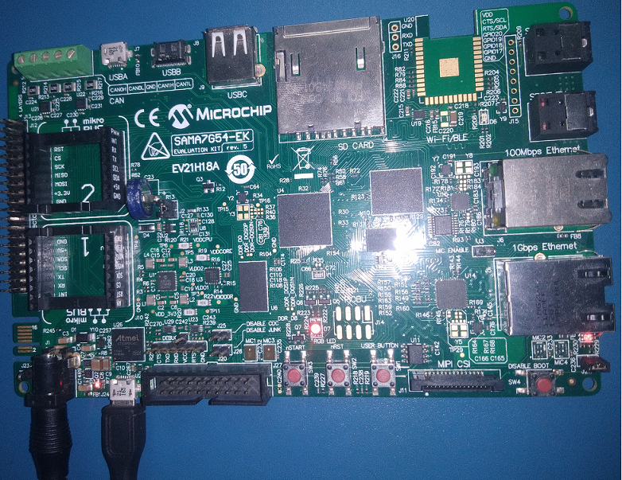
- Press the start button(nSTART switch) on the board.

## Developing an application executed from QSPI flash memory:

  
 Details

     

- Launch MPLAB® X IDE- From the main menu, click on File, then New Project. Under `Projects` choose `32-bit MCC  Harmony Project`, click Next- For `Framework Path` choose the location on your PC where you want to download the Harmony 3 framework- Click Next.   
Note: ***If you have already downloaded the Harmony 3 framework, enter the location of the harmony framework.***  
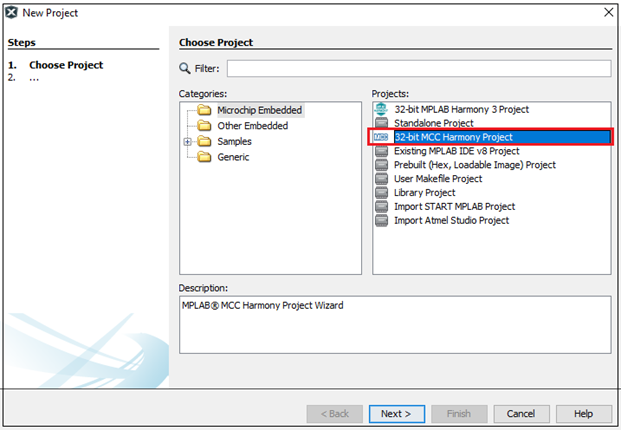  
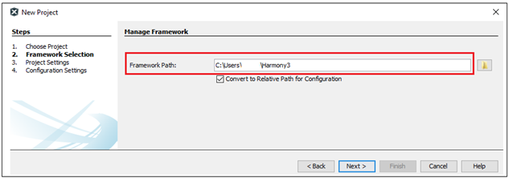   

- Enter `Location` , `Folder` and `Name of the project`. Click Next.   
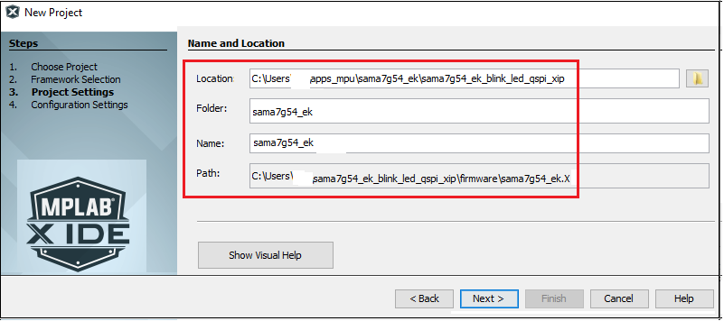   

- In the `Configuration Settings` window, for `Name`  enter `default`, for `Device Family` select `SAM`, for `Target Device` select `SAMA7G54`. Click Finish.     
This creates an empty project and set this project as `main project`. If there are other projects open in the project explorer window, set this project as main project by right clicking on the project, choose 'Set as Main Project'.   
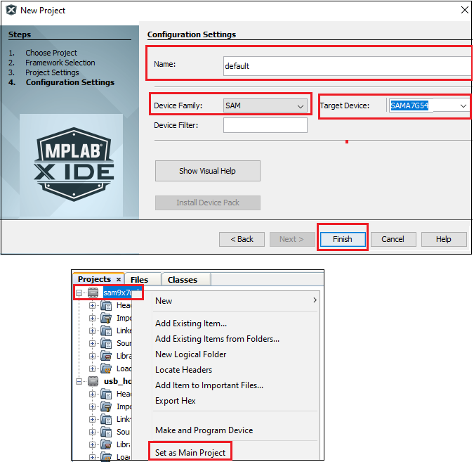   

- After the project is created, MCC will be automatically launched. (To launch MCC manually, from main menu, click on `Tools` -> `Embedded` -> `MPLAB® Code Configurator` or click MCC button in the MPLAB® X IDE tool bar). It will launch Content manger Wizard. Then select MPLAB® Harmony.   
   

- In addition to the required packages, download the optional packages bsp, csp, core, dev_packs  and then click Finish. Content download will take some time. Please wait till all the contents are downloaded.   
   

- Now a project graph will be displayed. From `Device Resource` add `Board Support Packages`  for `SAMA7G5 Evaluation kit BSP ` to `Project Graph`.   
   

- Ensure  all the pins are configured as below:   
PA13, PB8, PD20 are for LEDs green, red and blue respectively. PA12 is configured for user button.  
Configure the pins PB9-PB21 for QSPI as mentioned in the below image.
   

- Now Save all. Then click generate code. This will generate code for all the Device Resource that have been added in the project graph.   
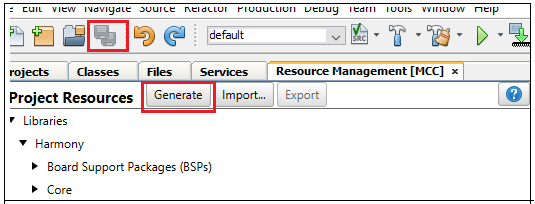   

- Up to this point in the project creation process, you used MPLAB Code Configurator(MCC) to configure and generate code to initialize the device (SAMA7G54) .  
  Refer [initialization.c](./firmware/src/config/default/initialization.c) to find all the device resource added in the project graph got initialized.  All that is left is for the user to write the application code in the main.c file.
  Documentation for each of the peripheral libraries or bsp libraries can be accessed as follows:
  1.	Peripheral libraries APIs can be accessed as a HTML file (*.html) from the Harmony 3 Framework path. (\<framework_path\>\csp\docs\index.html)
  2.    BSP libraries APIs can be found in bsp.h

- APIs used for this application are as follows:
  * LED_BLUE_On();
  * LED_BLUE_Off);
  * USER_BUTTON_Get();

- [Sample code can be found here.](./firmware/src/main.c)

- Now right click on the project and click `Properties`. For `Connected Hardware Tool` -> select connected hardware debugger used, for `Compiler Toolchain` -> select XC32 and click Apply.   
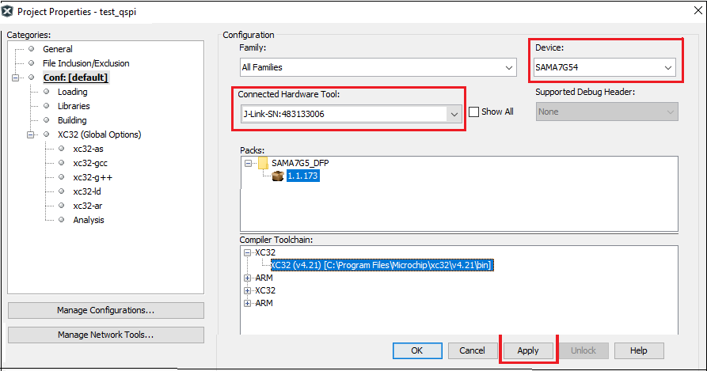   

- From J-32/J-Link, `Option categories` choose `Communication` and for `JTAG Method`, select `4-wire JTAG`.   
   

- Select Bootstrap for Categories and select the `Use Bootstrap` checkbox. For `bootstrap file` -> select the at91bootstrap elf file from [here](./firmware/sama7g54_ek.X)- Click on Apply and OK.   
   

- By default, MPLAB X only produces ELF and Hex format output files.
    To generate application output in binary format, a post build step needs to be added to the project properties.
	To do this, go to project properties, building, click the check box `Execute this line after build`, then enter the below command.  

	***${MP_CC_DIR}/xc32-objcopy -O binary ${DISTDIR}/${PROJECTNAME}.${IMAGE_TYPE}.elf ${DISTDIR}/harmony.bin***  

  

 

## Linker file modifications to execute an application from QSPI flash(offset 0x40000)

In this example we have demonstrated an application getting executed from QSPI flash offset 0x40000.  
Note : **To change the QSPI offset from where application will get executed, at91bootstrap kconfig must be configured and built.**  

The following linker file(ddr.ld) modifications are required to enable application getting executed from QSPI:
* Define only two memory regions:
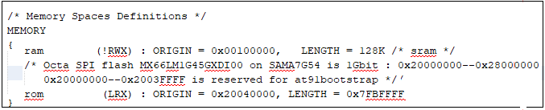  

* Assign text section to rom(qspi) and data section to relocate section(so, it will be copied from qspi to sram during runtime).
    ***Note : bss and relocate sections should be NOLOAD sections  
               bss and relocate sections should be load from rom(qspi) and run from ram(sram)***
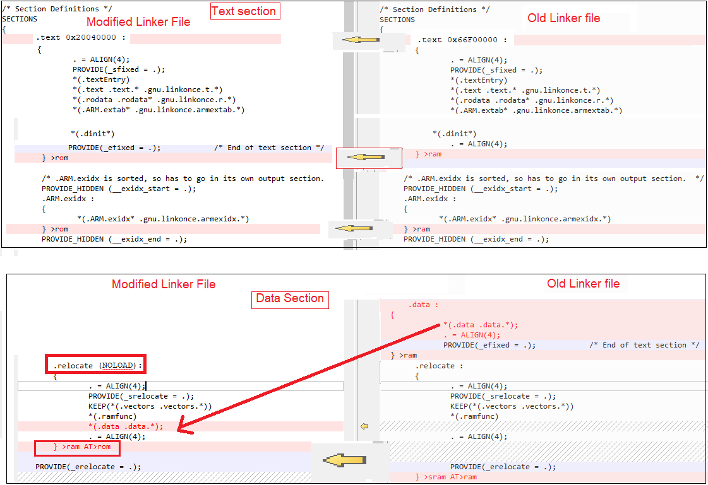  

* Remove cache aligned sections and assign  _ramcode_lma and  _ramdata_lma to ram as shown below.
  

* [Sample linker file can be found here.](./firmware/src/config/default/ddr.ld)

* Its a good practice to remove unused input section while building output binary. To do this, go to project properties , xc32-ld config , check Remove Unused Sections as shown below.
  

*Now clean and build the project. You should see a message on the output console that the project was successfully built. This completes the development of the application.   
The harmony.bin file can be found in your \<project_directory\>/dist/default/production/harmony.bin.

## SAM-BA Installation and Setup:
* Install SAM-BA tool on your windows host PC.
  * To Download the latest version of SAM-BA tool for Windows [click this link](https://www.microchip.com/en-us/development-tool/SAM-BA-In-system-Programmer).
  * Download the ZIP file and unzip it into a working directory of your choice.
  * Add the SAM-BA directory path to the environment variables.
    * To do this from your PC --> Open the Start Search, type in “env”.
    * Choose “Edit the system environment variables” --> Click "Environment Variables" --> "System Variables" --> add SAM-BA directory path to path variables.
      
  * Once the SAM-BA Host program has been installed, the execution of the application is from the Windows command prompt.
* Setup to flash using SAM-BA:
  * Open Disable boot Jumper(J22) on SAMA7G54 Evaluation Kit.
  * Ensure there is no SD memory card inserted and there is no application on any of the external NVMs.
  * Press start button.
  * Push and hold the "BOOT_DIS" button.(This disables booting from the onboard memories - NAND and NOR(QSPI) flash Memory)
  * Reset the board by pressing and then releasing the reset "nRST" button.
  * Release the "BOOT_DIS" button.
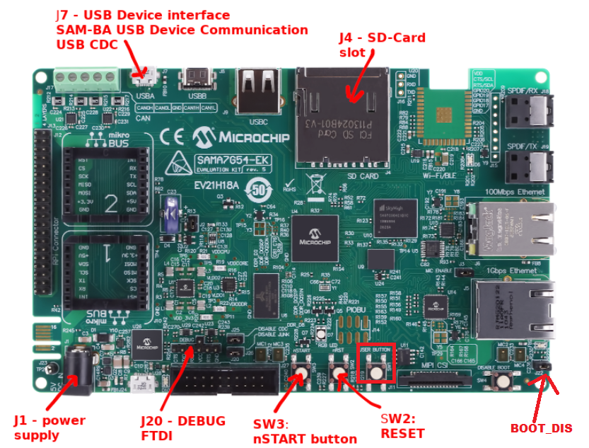   
 
## Configure first stage bootloader to boot from QSPI flash:
Use the below SAM-BA commands to configure first stage bootloader to boot from  QSPI.
To learn about the boot process and first stage boot configuration, refer section 19-Boot Strategies of the SAMA7G5 series data sheet.  
Note: ***It is mandatory to enable boot configuration packet to boot from QSPI for SAMA7G5 series.***
* sam-ba -p j-link -b sama7g5-ek -a bootconfig -c writecfg:bscr:EMULATION_ENABLED // Enable Emulation
* sam-ba -p j-link -b sama7g5-ek -a bootconfig -c readcfg:bscr // Read bscr and verify emulation is enabled
* sam-ba -p j-link -b sama7g5-ek -a bootconfig -c resetemul  // Emulation SRAM Reset
* sam-ba -p j-link -b sama7g5-ek -a bootconfig -c writecfg:bcp-emul:DBGU,QSPI0_IOSET1  // Enable debug, QSPI0 as external NVM
* sam-ba -p j-link -b sama7g5-ek -a bootconfig -c readcfg:bcp-emul // Read bcp_emul and verify whether QSPI is set as external NVM
   
Now reset the board by pressing reset button.  

Note: ***Boot configuration using Emulation SRAM has to be set every power cycle.***  
      ***User can also write boot configuration packet(BCP) to OTPC(One Time Programmable Memory Controller). Refer SAM-BA installation directory on how to write BCP to OTPC***

## Debugging Application Project on MPLAB® X IDE:
- Open the project (sama7g54_ek_blink_led_qspi_xip/firmware/sama7g54_ek.X) in MPLAB® X IDE.  
- In the project properties, ensure `SAMA7G54` is selected as the 'Device' and for `Connected Hardware Tool`, select connected J-Link debugger with the board to program/debug the application.
- Build the code. The harmony.bin file can be found in your \<project_directory\>/dist/default/production/harmony.bin.
- ***Before debugging ensure that harmony.bin file in your project directory is flashed in the QSPI offset.***
- Refer the section “SAM-BA Installation and Setup" for initial device setup and tool installation procedure.
* Use the below sam-ba commands to erase QSPI flash and program the application.
   * sam-ba -p j-link -b sama7g5-ek -a qspiflash -c erase //To erase entire QSPI flash
   * sam-ba -p j-link -b sama7g5-ek -a qspiflash -c erase:0x40000:0x20000 //Erase only 0x20000 bytes of data from the QSPI offset 0x40000
   * sam-ba -p j-link -b sama7g5-ek -a qspiflash -c write:harmony.bin:0x40000  //Program the application in the QSPI offset 0x40000  
Note : ***Don't flash boot.bin to QSPI memory to debug the application on MPLAB® X IDE.***  
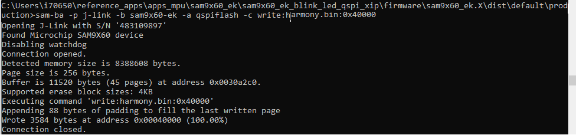  
- Debug the code by clicking on the "Debug" button in MPLAB® X IDE tool bar and observe that the application is getting executed from QSPI flash memory.  
- Run the application by clicking the “run" button in MPLAB® X IDE tool bar.
A terminal emulation program running on the Host PC communicates with the SAMA7G54 Evaluation kit J-Link CDC.
Ensure the terminal emulation program(Eg: PUTTY) is configured to the COM port and settings are:
  * Speed: 115200
  * Data: 8
  * Parity: None
  * Stop Bits: 1 
- Now, you will get the debug message on the serial console.
  Now press the user button(sw1) and observe LED getting turned ON. 
 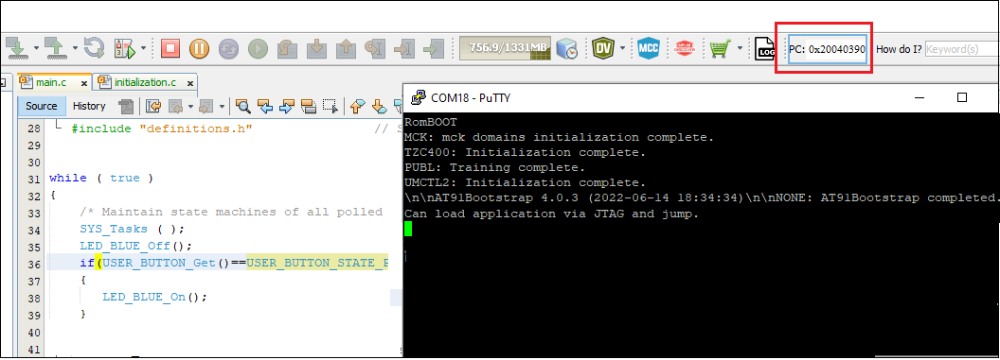   

## Running the pre-built harmony application from QSPI Flash:
The boot.bin and harmony.bin files can be found from this [location](./hex)
The pre-built application bin file and boot bin file can be programmed to QSPI flash using SAM-BA .
Refer the  above section: “Flash the Application Project using SAM-BA” for initial device setup and tool installation procedure.

### SAM-BA commands to program the boot and application file to QSPI flash:
   * sam-ba -p j-link -b sama7g5-ek -a qspiflash -c erase //To erase entire QSPI flash
   * sam-ba -p j-link -b sama7g5-ek -a qspiflash -c writeboot:boot.bin //To program bootstrap bin file
   * sam-ba -p j-link -b sama7g5-ek -a qspiflash -c write:harmony.bin:0x40000  //Program the application in the QSPI offset 0x40000
     
Note : ***Flash both boot.bin and harmony.bin to QSPI memory to execute the application from QSPI upon reset .***  
   
### Steps to execute the harmony.bin file from QSPI flash:
- Press the reset button.
-  Now, you will get the debug message on the serial console.
   Now press the user button(sw1) and observe LED getting turned ON. 
 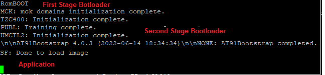   

## Comments:
- This application demo builds and works out of box by following the instructions above in "Running the Demo" section- If you need to enhance/customize this application demo, you need to use the MPLAB® Harmony v3 Software framework- Refer links below to setup and build your applications using MPLAB® Harmony.
    - [How to Setup MPLAB® Harmony v3 Software Development Framework](https://ww1.microchip.com/downloads/en/DeviceDoc/How_to_Setup_MPLAB_%20Harmony_v3_Software_Development_Framework_DS90003232C.pdf)
    -  **MPLAB® Harmony v3 is also configurable through MPLAB® Code Configurator (MCC)- Refer to the below links for specific instructions to use MPLAB® Harmony v3 with MCC.**
    - [Getting Started with MPLAB® Harmony v3 Using MPLAB® Code Configurator](https://www.youtube.com/watch?v=KdhltTWaDp0)
    - [MPLAB® Code Configurator Content Manager for MPLAB® Harmony v3 Projects](https://www.youtube.com/watch?v=PRewTzrI3iE)
	- [Click Here for more Harmony V3 applications](https://github.com/search?q=org%3AMicrochip-MPLAB-Harmony+sam_9x6)

## Revision:
- v1.6.0 - Released demo application
