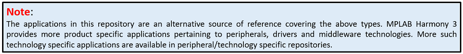

---
title: Harmony 3 Reference Applications Package
nav_order: 1
---
# MPLAB® Harmony 3 Reference Applications

MPLAB® Harmony 3 is an extension of the MPLAB® ecosystem for creating
embedded firmware solutions for Microchip 32-bit SAM and PIC® microcontroller
and microprocessor devices.  Refer to the following links for more information.

- [Microchip 32-bit MCUs](https://www.microchip.com/design-centers/32-bit)
- [Microchip 32-bit MPUs](https://www.microchip.com/design-centers/32-bit-mpus)
- [Microchip MPLAB X IDE](https://www.microchip.com/mplab/mplab-x-ide)
- [Microchip MPLAB® Harmony](https://www.microchip.com/mplab/mplab-harmony)
- [Microchip MPLAB® Harmony Pages](https://microchip-mplab-harmony.github.io/)

This repository contains the MPLAB® Harmony 3 Reference Application Package. 

Reference applications are standalone applications which demonstrates specific 
features or capabilities of Microchip 32-bit SAM and PIC MCUs. These applications 
are developed on Microchip 32-bit SAM and PIC development boards/kits. 

In addition to having the MCU, the 32-bit SAM and PIC MCU development boards/kits 
also provide support to exercise the features of MCU through additional hardware 
like displays, communication buses, transceivers, sensors, external memories, etc.
The additional hardware features are available on the MCU development boards/kits 
or is available as plugin through interface headers like mikroBUS Click or Xplained Pro extensions.

Following are the typical application types in this repository
- Large feature-rich applications involving integration of several technologies like Audio, USB, TCP/IP, Wireless, Security, Low Power, RTOS, etc
- Applications demonstrating certain capabilities of the Microchip 32-bit SAM and PIC MCUs. For example: Low Power application on SAM L21 Xplained Pro Evaluation Kit demonstrating idle and standby modes
- Applications demonstrating capabilities of Microchip 32-bit SAM and PIC MCUs development boards/kits (Curiosity, Nano, etc.) which allows extending hardware capability through mikroBUS Click or Xplained Pro extensions
- Getting started applications pertaining to the Microchip's MCU products. These getting started applications demosntrates usage of MPLAB Harmony 3 framework by excercising commonly used peripheral features

The above application types serve as a reference source to evaluate solutions on 32-bit SAM and PIC MCUs by developing applications using MPLAB Harmony 3 software framework on Microchip 32-bit SAM and PIC development boards/kits.  

**Repository and demo application support:**
- The following table lists the fundamental and few technology specific repositories in MPLAB Harmony 3 Software Framework

| Repository	| # Demo Application |
| ---                                                                               | ---|            
| [csp](https://github.com/Microchip-MPLAB-Harmony/csp/tree/master/apps)			| Simple applications that directly control the SAM and PIC peripherals |
| [core](https://github.com/Microchip-MPLAB-Harmony/core/tree/master/apps)          | Applications that use the drivers and system services that have advanced capabilities and a higher level of abstraction that gives better hardware independence |
| [usb](https://github.com/Microchip-MPLAB-Harmony/usb/tree/master/apps)            | Applications that demonstrate the capabilities of the MPLAB Harmony USB stack |
| [net](https://github.com/Microchip-MPLAB-Harmony/net/tree/master/apps)            | Applications that demonstrate the capabilities of the MPLAB Harmony TCP/IP stack. These applications use well-known protocols like TCP, UDP, HTTP, SMTP, etc |
| [gfx](https://github.com/Microchip-MPLAB-Harmony/gfx/tree/master/apps)			| Quick start applications that demonstrates MPLAB Harmony Aria/Legato Graphics Libraries |
| [gfx_apps](https://github.com/Microchip-MPLAB-Harmony/gfx_apps/tree/master/apps)	| Non quick start applications that demonstrates MPLAB Harmony Aria/Legato Graphics Libraries |
| [audio](https://github.com/Microchip-MPLAB-Harmony/audio/tree/master/apps)		| Applications that demonstrates capabilities of the MPLAB Harmony audio offerings, drivers for hardware codecs that can be connected to development boards, audio decoders, etc |

### Note: 
The above is not an exhaustive list of all MPLAB Harmony 3 packages and corresponding application offerings. Refer the MPLAB Harmony 3 GitHub [Launch page](https://github.com/Microchip-MPLAB-Harmony) to view the complete list of MPLAB Harmony 3 packages. In each of these packages refer the underlying “apps” folder for the applications offering.

Refer to the following links for release notes and reference application information.

- [Release Notes](./release_notes.md)
- [MPLAB® Harmony License](./mplab_harmony_license.md)
- [MPLAB® Harmony 3 Reference Apps Wiki](https://github.com/Microchip-MPLAB-Harmony/reference_apps/wiki)
- [MPLAB® Harmony 3 Reference Applications Index](./apps/readme.md)

# Contents Summary

| Folder     | Description                                               |
| ---        | ---                                                       |
| apps       | Example reference applications      |
| docs       | Reference applications help documentation                      |

____

____

